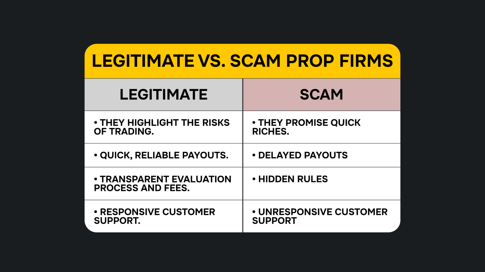
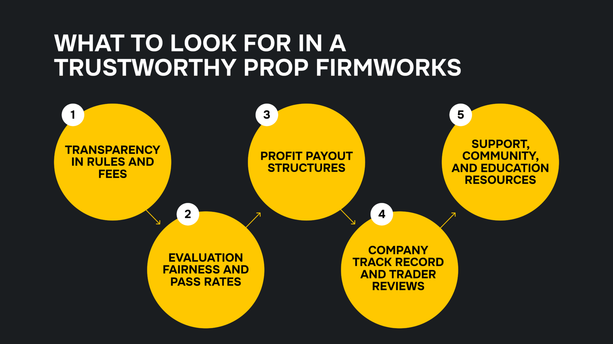

## Что такое проп-фирма и как она работает?

Проп-фирма похожа на спортивную команду, которая стремится отобрать лучших игроков — в данном случае трейдеров. Затем она предоставляет им капитал для реализации их торговых стратегий. Любая полученная прибыль делится между трейдером и фирмой, причём основную долю обычно получает трейдер.

Существует популярная цитата: «Талант есть везде, но возможности — нет». Проп-фирма устраняет этот разрыв между талантом и возможностью, помогая способным трейдерам получить доступ к капиталу для реализации своих стратегий.

Так же как скауты оценивают перспективных игроков, проп-фирмы оценивают трейдеров перед тем, как выделить им капитал. На этапе оценки трейдеры должны пройти демо-челлендж, чтобы продемонстрировать свои навыки. Капитал получают только те, кто прошёл испытание и стал «фандед»-трейдером под крылом профессиональной проп-фирмы.

## Подлежат ли проп-фирмы регулированию?

Проп-фирмы являются официально зарегистрированными компаниями, но не подлежат строгому регулированию, как другие торговые фирмы, поскольку они работают со своими собственными средствами. Трейдеры управляют портфелем фирмы, финансируемым её капиталом, и это право предоставляется лишь небольшой части трейдеров, получивших статус "live" (торгующих на реальном счёте). В большинстве случаев розничное проп-трейдинг-партнёрство предполагает использование демо-счётов с виртуальным капиталом, а не настоящими деньгами.

<svg width="602" height="567" viewBox="0 0 602 567" fill="none" xmlns="http://www.w3.org/2000/svg"><path d="M507.435 265.841L300.586 469.72L301.222 566.465L601.846 265.841L336.005 0V370.19L400.602 310.562V161.492L507.435 265.841Z" fill="#FCD535"></path><path d="M94.4666 265.841L300.473 469.72L301.109 566.465L0.0557861 265.841L265.897 0V370.19L201.3 310.562V161.492L94.4666 265.841Z" fill="#FCD535"></path></svg>

Начните торговать с Hash Hedge уже сегодня

<a class="banner-button" href="https://app.hashhedge.com/en/register/">Начать челлендж</a>

## Легальные и мошеннические проп-фирмы: как отличить?

В любой индустрии есть недобросовестные участники, и сфера проп-фирм не исключение. Видя растущую популярность проп-трейдинга в 2020-х, некоторые сомнительные компании начали вводить трейдеров в заблуждение, заставляя платить за участие в оценках, не предоставляя реальной возможности получения капитала.

Вот несколько тревожных сигналов, указывающих на мошенническую проп-фирму:

- Их сайт обещает быструю прибыль, вместо того чтобы честно говорить о рисках, связанных с трейдингом.
- Выплаты постоянно задерживаются или вовсе не производятся.
- Скрытые правила, сбивающие трейдеров с толку.
- Неотзывчивая служба поддержки.
- Фирма игнорирует негативные отзывы и не пытается помочь пользователям решить проблемы.

Проводите тщательную проверку, прежде чем выбирать проп-фирму. Если вы замечаете один или несколько из указанных выше тревожных признаков, это сигнал — стоит поискать альтернативу, чтобы не потерять деньги впустую.

## Тёмная сторона проп-трейдинга

Индустрия проп-трейдинга не лишена критики и проблем. К ним относятся:

### Вводящие в заблуждение модели оценки

Некоторые проп-фирмы создают такие условия челленджей, пройти которые практически невозможно. Их цель — не профинансировать трейдеров, а заработать на комиссиях за участие. Такие компании зарабатывают на том, что трейдеры раз за разом пытаются пройти челлендж, пока не сдаются.

Чтобы не попасться на удочку, тщательно изучайте фирму перед регистрацией. Читайте отзывы на финансовых сайтах и форумах. Если много людей жалуются на несправедливую оценку — лучше держаться подальше.

### Нечестные правила, мелкий шрифт и произвольное закрытие аккаунтов

Некоторые проп-фирмы имеют неясные или скрытые правила, из-за которых могут отказать в выплате. Вы можете торговать прибыльно и соблюдать условия платформы, но внезапно потерять аккаунт. Такие несправедливые действия приводят к убыткам и разочарованию в трейдинге в целом.

Избежать этого можно, внимательно читая пользовательское соглашение и проверяя прозрачность правил. Если правила не ясны с самого начала — скорее всего, и процесс работы с капиталом не будет честным.

## Основные преимущества надёжных проп-фирм

Работа с легитимной проп-фирмой даёт множество преимуществ и позволяет избежать вышеперечисленных рисков. Вам не придётся переживать о скрытых комиссиях, неясных правилах или невыплаченных заработках.

### Доступ к капиталу без личного риска

Как талантливый трейдер, вы можете торговать, практически не подвергая личные средства риску. Фирма предоставляет капитал для реализации ваших стратегий, а вы не рискуете своими сбережениями — компания берёт этот риск на себя в обмен на долю от прибыли.

### Структурированный риск-менеджмент

Проп-фирмы — это не только источник капитала, но и наставники, как спортивные скауты. Они предоставляют чёткие правила риск-менеджмента, такие как лимиты по просадке и минимальное количество торговых дней, чтобы минимизировать убытки.

## Что искать в надёжной проп-фирме?

Мы уже обсудили преимущества работы с легитимными проп-фирмами. Как распознать такие фирмы? Используйте следующий чек-лист при выборе проп-фирмы:

### Прозрачность в правилах и комиссиях

Надёжные проп-фирмы публикуют свои правила, параметры оценки, комиссии и условия распределения прибыли. Это критически важная информация для трейдера, и честные компании всегда делают её открытой.

Вы не хотите оказаться в ситуации с непоследовательными или скрытыми правилами. Вы вступаете в финансовое соглашение с фирмой, поэтому все детали должны быть известны заранее. Если что-то неясно — обратитесь в службу поддержки за разъяснениями.

### Структура выплат прибыли

Надёжные проп-фирмы предоставляют подтверждения выплат, чтобы подтвердить свою репутацию. Они публикуют точные проценты по выплатам и соблюдают оговорённые сроки. Например, трейдеры Hash Hedge получают 80% прибыли, полученной по своим стратегиям.

### Репутация компании и отзывы трейдеров

Мнение третьих лиц — один из лучших способов оценить надёжность проп-фирмы. Легитимные фирмы имеют хороший послужной список и положительные отзывы других трейдеров. Поэтому компании часто размещают положительные отзывы на своих сайтах — ничто не убеждает лучше, чем реальный успех других трейдеров.

Помимо отзывов на официальном сайте, проверьте независимые источники. Многие блоги специализируются на обзорах проп-фирм и помогают трейдерам принимать осознанные решения. Читайте такие статьи, чтобы выявить плюсы и минусы интересующей вас компании.

Также загляните на трейдерские форумы, чтобы услышать мнения реальных пользователей. Важно понимать: идеальных репутаций не существует, но положительных отзывов должно быть больше, чем отрицательных. Избыточно негативные оценки — тревожный сигнал.

### Поддержка, сообщество и образовательные ресурсы

Мы уже упоминали: проп-фирмы — это не только капитал. Они также предлагают профессиональную поддержку, чтобы помочь вам улучшить стратегии и увеличить прибыль. Кроме того, вы получаете доступ к закрытому сообществу трейдеров, где можно делиться опытом и учиться у лучших.

Hash Hedge — ваш идеальный партнёр в мире проп-трейдинга. Мы предлагаем аккаунты с финансированием от $5,000 до $100,000, поддержку более 200 криптоактивов и кредитное плечо до 5x.

В отличие от других, Hash Hedge разрешает торговлю на новостях, что даёт вам преимущество при работе с рыночными событиями. У нас есть расширенная система поддержки, и вы сохраняете 80% от полученной прибыли. Присоединяйтесь, пройдите оценку и начните зарабатывать больше!
