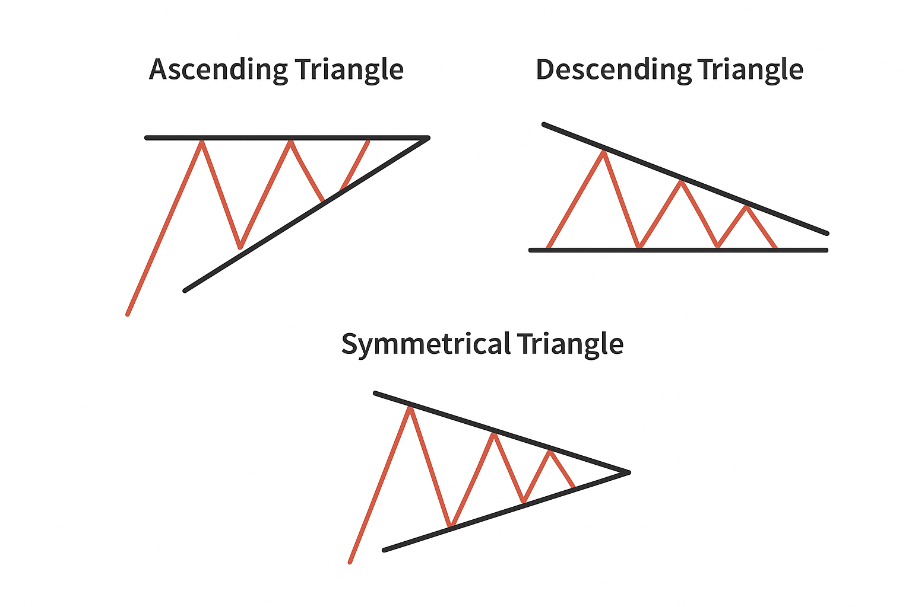

## What Is an Ascending Triangle?

Each time the price pulls back, it doesn't fall as far as before. Buyers step in earlier, forming a rising line of support. At the same time, sellers defend a key resistance level, keeping the upper boundary flat.

This creates a visual pressure point. The market is coiling, and sooner or later, the energy must be released. A decisive breakout above resistance is what traders wait for, because it suggests that buyers have finally absorbed the selling pressure. The ascending triangle is one of the most recognisable chart formations in technical analysis. In this article, let's explore how to identify the ascending triangle and apply it in trading.

## How to Trade the Ascending Triangle

The most common approach is to wait for a clean breakout above resistance. Conservative traders often look for two or three candles to close above the upper line before entering a position, while aggressive traders may jump in as soon as the breakout candle forms.

Volume plays a key role here. A breakout with strong trading volume suggests conviction and lowers the risk of a fakeout. Many traders also use moving averages or momentum indicators as extra confirmation before taking the trade.

## Example of an Ascending Triangle in Action

Picture Ethereum consolidating just below a well-established resistance line. Each pullback attracts aggressive buyers, leaving behind a trail of higher lows. This steady pressure builds a coiled spring: liquidity pools stack up above resistance, while stop orders accumulate below. When the breakout finally comes, it's rarely subtle. Volume spikes, shorts scramble to cover, and momentum traders pile in. The result is often a sharp, sustained move that reflects weeks of underlying accumulation.

This is why seasoned traders pay close attention to ascending triangles. They're a visual map of order flow, market psychology, and positioning.

## Benefits and Drawbacks of the Pattern

One of the biggest strengths of the ascending triangle is its versatility. It works across different markets — crypto, stocks, forex, and on multiple timeframes. Traders appreciate its clarity: two simple trendlines tell the story of pressure building under resistance.

But like any chart pattern, it's not foolproof. False breakouts are common, especially in volatile markets. A triangle can also mislead if it forms in a weak trend or on low volume. That's why we recommend combining it with confirmation signals rather than relying on the formation alone.

| Benefits | Drawbacks |
| --- | --- |
| Works across markets (crypto, stocks, forex) | Frequent false breakouts |
| Clear structure — easy to spot | Can fail in weak or low-volume trends |
| Fits multiple timeframes | Requires confirmation signals |
| Captures the market psychology of accumulation | It may be misleading if the context is ignored |

<svg width="602" height="567" viewBox="0 0 602 567" fill="none" xmlns="http://www.w3.org/2000/svg"><path d="M507.435 265.841L300.586 469.72L301.222 566.465L601.846 265.841L336.005 0V370.19L400.602 310.562V161.492L507.435 265.841Z" fill="#FCD535"></path><path d="M94.4666 265.841L300.473 469.72L301.109 566.465L0.0557861 265.841L265.897 0V370.19L201.3 310.562V161.492L94.4666 265.841Z" fill="#FCD535"></path></svg>

Start trading with Hash Hedge today

<a class="banner-button" href="https://app.hashhedge.com/en/register/">Start Challenge</a>

## Ascending, Descending, and Symmetrical Triangles: Key Differences

Triangle patterns can be grouped into three main types: ascending, descending, and symmetrical, each reflecting different market pressures.

- **Ascending triangle.** Usually signals bullish momentum, as buyers gradually gain control.
- **Descending triangle.** Tends to indicate bearish sentiment, with sellers dominating.
- **Symmetrical triangle.** Neutral, suggesting that either a breakout or a breakdown is possible depending on which side gains strength.

Traders identify these patterns by connecting key highs and lows with trendlines. In an ascending triangle, the upper trendline remains flat, linking roughly equal highs, while the lower trendline rises along higher lows. A descending triangle features a flat lower trendline connecting similar lows, with a descending upper trendline marking lower highs.

| Pattern | Trendline Structure | Usual Bias | Market Psychology |
| --- | --- | --- | --- |
| Ascending | Flat top, rising bottom | Bullish | Buyers press against resistance with higher lows |
| Descending | Flat bottom, falling top | Bearish | Sellers push lower highs against support |
| Symmetrical | Converging top & bottom | Neutral | Tug-of-war |

## Tips for Maximizing Success with Ascending Triangles

To make the most of ascending triangles, start by identifying the pattern early. The sooner you recognize the higher lows forming along the support line, the better you can plan your entry. Pair the pattern with volume analysis and other indicators like RSI or MACD to confirm momentum before committing.

Jumping in too early can result in losses if the breakout fails. Conversely, waiting too long may mean missing the optimal entry point. Observing how the price behaves near the resistance and checking whether the market respects the trendlines can give clues about the breakout's strength.

## Ascending Triangle Strategy

When an ascending triangle appears within an uptrend, it often signals that the bullish momentum could continue. Traders strengthen this setup by using a short-term moving average (for example, the 9-period EMA) as a dynamic guide. If the EMA aligns with the rising support line, the pattern gains additional credibility.

### Entry Points

Most traders look for a decisive breakout above the horizontal resistance line. A strong bullish candle breaking through resistance is a preferred trigger, though even a clean move above the upper boundary can serve as an entry. Some also place buy orders near the breakout level, anticipating a retest of resistance that turns into new support. Ensuring that the price remains above the EMA adds further confidence.

### Stop-Loss Placement

A common approach is to set the stop just under the latest swing low inside the triangle. More cautious traders may go further and place it below a deeper swing low, depending on how much risk they are willing to take. This way, the trade allows for market noise while limiting losses if the pattern fails.

## Common Mistakes to Avoid

- **Ignoring volume.** Treating weak breakouts as valid signals, which often leads to fakeouts.
- **Chasing late entries.** Entering after the breakout has already run, skewing the risk-reward.
- **Stops set too tight.** Getting shaken out by normal volatility instead of true reversals.

## Conclusion

The ascending triangle is the psychology of buyers pressing against resistance until momentum breaks through. Mastering this pattern can sharpen your edge, but only if you pair it with discipline and the right tools.

Hash Hedge puts those tools in your hands. Analyze 160+ crypto pairs in real time, spot liquidity shifts before they unfold, and trade with zero hidden fees. Join 4,500+ traders already gaining their edge with Hash Hedge.
