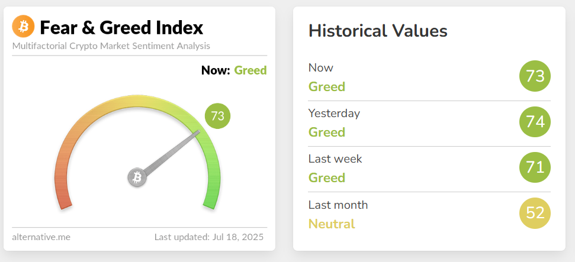
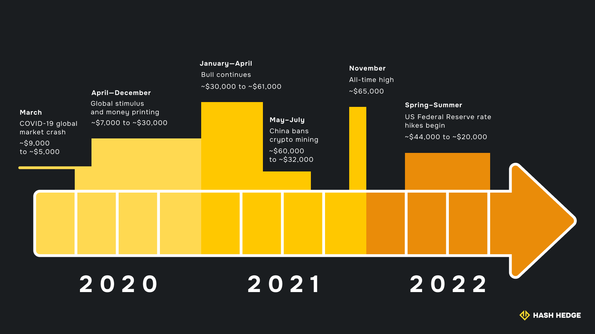

## Что такое 4-летний цикл биткоина?

4-летний цикл биткоина — это повторяющийся паттерн на рынке криптовалют. За последние десять лет цена биткоина обычно двигалась волнами, каждая из которых длилась около четырёх лет. Каждый цикл обычно включает длительный период низкой активности, резкий рост, драматический пик и глубокую коррекцию, после чего паттерн начинается снова.

Этот цикл является одной из самых узнаваемых особенностей рыночной истории биткоина. Он продолжает влиять на то, как трейдеры и инвесторы подходят к этому активу.

## Основные фазы цикла: накопление, бычий рынок, эйфория, медвежий рынок

Цикл проходит через четыре ключевые фазы.

### Накопление

Накопление начинается после значительного падения цены и является самым спокойным временем цикла. Цены остаются на месте или медленно восстанавливаются в течение нескольких месяцев, а освещение в СМИ почти исчезает. В это время опытные инвесторы часто начинают покупать и удерживать монеты, пользуясь низкими ценами и ограниченной конкуренцией.

### Бычий рынок

Когда цены начинают расти, а новости постепенно становятся позитивными, наступает фаза бычьего рынка. Всё больше людей входит на рынок, и спрос быстрее толкает цены вверх. Торговая активность увеличивается.

### Эйфория

Цикл достигает пика на стадии эйфории. Цены растут рекордными темпами. Новые покупатели спешат на рынок, а громкие истории о прибыли заполняют заголовки. Волнение достигает максимума, но эта стадия недолговечна.

### Медвежий рынок

В конце концов наступает реальность, и начинается медвежья фаза. Цены быстро падают, негативные новости возвращаются, а уверенность исчезает. Многие, кто вошёл в рынок слишком поздно, несут убытки и предпочитают выйти. Активность падает. Эта фаза сбрасывает рынок и подготавливает его к следующему этапу накопления.

## Халвинг биткоина: почему он запускает цикл

Когда Биткоин был создан, его разработали так, чтобы новые монеты становились всё труднее добывать с течением времени. В коде было прописано чёткое правило: каждые 210 000 блоков, что примерно раз в четыре года, награда за майнинг новых блоков уменьшается вдвое. Этот процесс, называемый халвингом, встроен в систему с самого начала, и каждый может заранее узнать, когда он произойдёт.

В настоящее время за каждый блок Биткоина установлена фиксированная награда в размере 3,125 BTC, и добывается он в среднем каждые 10 минут. Это «10-минутное время блока» — ключевая особенность Биткоина. Тот, кто первым решит криптографическую задачу блока, получает награду прямо в свой кошелёк. Если слишком много майнеров присоединяется, и блоки начинают находиться быстрее, чем каждые 10 минут, сеть автоматически повышает сложность, чтобы замедлить процесс. Если майнеров становится меньше, и блоки добываются дольше 10 минут, сложность снижается. Этот динамический механизм позволяет поддерживать стабильное время блока и, соответственно, стабильный выпуск новых монет.

Без этой регулировки блоки добывались бы всё быстрее по мере прихода новых майнеров, что привело бы к гораздо большему выпуску биткоинов. Общий лимит предложения был бы достигнут намного раньше, халвинг происходил бы чаще, и 4-летнего цикла в его нынешней форме могло бы вовсе не существовать. Регулярный график халвингов и механизм регулировки сложности вместе обеспечивают предсказуемый и контролируемый выпуск монет, формируя основу самого цикла.

Идея заключалась в том, чтобы замедлить создание новых биткоинов и удерживать общее предложение ограниченным. При меньшем количестве новых монет на рынке Биткоин должен был становиться более ценным со временем и отличаться от обычных денег, которые можно печатать без ограничений.

И это действительно сработало. Настроение всего крипторынка меняется вокруг халвинга. Это резкое сокращение предложения делает новые монеты более дефицитными буквально за одну ночь. Исторически спрос на биткоин после халвингов оставался прежним или даже рос. Когда предложение сокращается, а спрос сохраняется, цены обычно растут. Эти изменения цен — главная причина того, почему халвинг считается основным триггером 4-летнего цикла, по которому известен биткоин.

<svg width="602" height="567" viewBox="0 0 602 567" fill="none" xmlns="http://www.w3.org/2000/svg"><path d="M507.435 265.841L300.586 469.72L301.222 566.465L601.846 265.841L336.005 0V370.19L400.602 310.562V161.492L507.435 265.841Z" fill="#FCD535"></path><path d="M94.4666 265.841L300.473 469.72L301.109 566.465L0.0557861 265.841L265.897 0V370.19L201.3 310.562V161.492L94.4666 265.841Z" fill="#FCD535"></path></svg>

Начните торговать с Hash Hedge уже сегодня

<a class="banner-button" href="https://app.hashhedge.com/en/register/">Начать челлендж</a>

## Исторические циклы и ценовые модели биткоина

Оглядываясь назад, в каждом цикле можно увидеть одну и ту же последовательность роста и коррекции.

Цикл 2012–2016 начался, когда Биткоин всё ещё в основном игнорировался традиционными финансами. Первый халвинг в ноябре 2012 года сократил награду за майнинг до 25 BTC, и давление предложения начало расти. Цена поднялась примерно с $12 до более чем $1 000 в 2014 году, а затем рухнула ниже $200. Многие ранние инвесторы капитулировали; такие биржи, как Mt. Gox, обанкротились, и доверие к экосистеме было поставлено под сомнение. Этот период заставил рынок повзрослеть.

После второго халвинга в июле 2016 года пришла новая волна участников. Бычий рынок 2017 года сопровождался наплывом розничных инвестиций и бумом ICO, что подтолкнуло цену биткоина почти к $20 000. Этот паттерн совпал с четырёхлетним циклом Биткоина, который наблюдался уже дважды. Последовавший медвежий рынок длился больше года, а цена упала до ~$3 200. В этот период многие проекты исчезли, но те, кто остался, создали инфраструктуру, которая обеспечила основу для следующего цикла.

Цикл 2020–2024 стал переломным. Халвинг в мае 2020 года сократил награду за блок до 6,25 BTC. В этот раз главным драйвером стал институциональный интерес. Цена достигла новых максимумов, поднявшись почти до $63 000 в ноябре 2021 года. После пика ужесточение глобальной ликвидности и макроэкономические потрясения опустили рынок до $16 000 к концу 2022 года.

У каждого цикла есть свои катализаторы, но общая структура повторяется. Такие сигналы, как рекордный интерес в поисковых системах, ончейн-индикаторы капитуляции и массовые оттоки с крупных бирж, стабильно отмечают ключевые поворотные точки. Несмотря на то, что масштабы и игроки меняются, рынок всё равно реагирует на влияние халвинга на баланс спроса и предложения.

## На какой стадии мы сейчас?

Летом 2025 года мы находимся в бычьем ралли текущего четырёхлетнего цикла, начавшегося после четвёртого халвинга в апреле 2024 года, когда награда была снижена до 3,125 BTC.

14 июля 2025 года Биткоин достиг нового исторического максимума в $122 000, затем откатился на $7 000 и закрепился в районе $115 000 в последующие дни. Большинство экспертов сходятся во мнении, что Биткоин, скорее всего, увидит ещё несколько новых максимумов с незначительными откатами впереди.

## Психология людей и рыночные настроения в цикле

4-летний цикл крипторынка движим не только кодом. Эмоции играют огромную роль на каждом этапе, и отслеживать их в реальном времени помогают инструменты вроде Crypto Fear & Greed Index (Индекс страха и жадности в крипте). Этот индекс измеряет общее настроение, используя данные о ценовых трендах, торговых объёмах, активности в соцсетях, поисковых запросах в Google и волатильности Биткоина.

Значения варьируются от 0 (экстремальный страх) до 100 (экстремальная жадность). Низкие числа означают тревогу и пессимизм инвесторов; высокие — возбуждение и рост аппетита к риску. В середине 2025 года индекс находится на уровне 70.

Этот индекс наглядно показывает, как меняются эмоции на каждом этапе биткоин-цикла:

| Фаза цикла | Диапазон индекса | Типичное настроение | Пример |
| --- | --- | --- | --- |
| Накопление | <30 | Страх, равнодушие | Конец 2022 года. Индекс около 20, Биткоин у минимальных значений цикла |
| Бык | 50–70 | Растущий оптимизм, уверенность | Начало 2024 года. Индекс поднимается в зону «Жадности» |
| Эйфория | >80 | Жадность, FOMO (страх упустить выгоду) | Ноябрь 2021 года. Индекс в верхних 80-х, когда Биткоин достиг исторического максимума |
| Медвежья фаза | <30 | Паника, сожаление, пессимизм | Крах 2022 года. Индекс возвращается к уровню «Экстремального страха» |

Эмоциональные колебания вроде этих помогают объяснить, почему циклы Биткоина не двигаются по прямым и плавным линиям.

## Институциональный спрос и его влияние на 4-летний цикл

Институциональный спрос теперь тоже является ключевой силой на рынке Биткоина. С 2020 года публичные компании и фонды инвестировали миллиарды, а только спотовые ETF на Биткоин (публично торгуемые фонды, напрямую владеющие BTC) привлекли более $50 млрд в 2025 году. Крупные игроки, такие как IBIT от BlackRock, теперь держат сопоставимые объёмы с ведущими золотыми ETF.

Этот сдвиг принёс и положительные стороны: рынок стал более зрелым. Институты удерживают крупные позиции дольше и добавляют стабильности во время спадов.

Однако появились и новые риски. Когда крупные фонды покупают или продают много Биткоина, цена может измениться очень быстро. Это называется «амплификация» — когда даже небольшой заголовок приводит к резкому скачку цены.

Раньше большее влияние имели индивидуальные трейдеры. Теперь же крупные игроки и инвестиционные фонды чаще задают темп. Из-за этого предсказать реакцию рынка на важные новости стало сложнее: цена может резко прыгнуть вверх или вниз за один день, если крупные инвесторы совершают сделки.

## Укоротится ли цикл или прервётся в будущем?

Институциональная активность не прекратила четырёхлетний цикл и, скорее всего, никогда не прекратит, но изменила его темп. Халвинг всё ещё формирует основу четырёхлетнего цикла, задавая базовый ритм рынка. Однако внешние факторы, такие как процентные ставки, регулирование и глобальные события, сглаживают цикл, делая ценовые колебания менее драматичными.

К 2025 году уже добыто около 94,7% всего Биткоина, поэтому каждое новое сокращение оказывает всё меньшее влияние на доступное предложение. Ранние халвинги в 2012 или 2016 годах значительно сильнее сокращали эмиссию, чем сегодняшние. Например, исследование Outlier Ventures в 2024 году утверждало, что начиная с 2020-го прямое влияние халвинга на цену (не на цикл в целом) становится менее значимым по сравнению с другими факторами.

Теперь цена Биткоина сильнее реагирует на внешние факторы, особенно на глобальную экономическую политику, финансовые потрясения и политические события. Например, когда Федеральная резервная система США повышает процентные ставки, доходность гособлигаций растёт. Это отвлекает капитал от акций и криптовалют, включая Биткоин, так как крупные инвесторы ищут более безопасные и доходные активы.

## Макротренды и глобальные события, влияющие на циклы Биткоина

Итак, Биткоин больше не движется изолированно. Крупные экономические тенденции и мировые события теперь формируют его циклы наряду с халвингом и настроениями инвесторов.

Вот некоторые из основных факторов, которые могут влиять на Биткоин:

- Изменения процентных ставок центральных банков (например, политика ФРС США).
- Глобальная инфляция и девальвация валют.
- Тенденции фондового рынка и общий аппетит к риску.
- Регуляторные новости и законодательные изменения, касающиеся криптовалют.
- Крупные геополитические события (войны, санкции, политические кризисы).
- Одобрение или отклонение ETF на Биткоин.
- Потоки институционального капитала и ребалансировка фондов.
- Экономические потрясения или финансовые кризисы.

## Принятие Биткоина: как цикл стимулирует долгосрочный рост

Каждый четырёхлетний цикл приносит новый рост и распространение.

Бычьи рынки часто привлекают миллионы новых покупателей. Например, в розничный бум 2017 года Coinbase и другие биржи зафиксировали рекордное количество новых регистраций. Аналогично, бычий рынок 2021 года привёл множество новых инвесторов по всему миру (что подтверждается ростом числа криптокошельков и освещением в мейнстрим-СМИ).

Принятие выходит за рамки розничных инвесторов. В цикле 2020–2021 годов крупные компании, такие как Tesla и Square, добавили Биткоин в свои балансы. Платёжные гиганты PayPal и Visa запустили криптосервисы для своих клиентов.

Даже в медвежьих фазах процесс принятия продолжается за кулисами. Каждый цикл оставляет рынок больше и зрелее, чем раньше. Объёмы торгов на биржах растут, количество активных кошельков увеличивается, а интеграция с традиционными финансами углубляется.

## Мнения экспертов и прогнозы цен на будущее

Прогнозы относительно будущей цены Биткоина остаются разными, но большинство аналитиков согласны, что четырёхлетний цикл продолжает оказывать влияние на рынок. Недавние ценовые движения после халвинга 2024 года заставили многих экспертов скорректировать свои прогнозы.

Rosenberg Research прогнозирует, что импульс может подтолкнуть цену к $143 000 в этом цикле. Это, по сути, довольно скромный прогноз. Некоторые эксперты упоминают цифры до $250 000 к концу 2025 года, в то время как другие более пессимистичны и называют уровни около $70 000.

Средний прогноз, между тем, находится в районе $145 000.

## Что такое Bitcoin Cycle Master и как он помогает инвесторам?

Хотя ценовые прогнозы сильно различаются, понимание того, на какой стадии цикла находится Биткоин, может быть не менее важным. Здесь на помощь приходят инструменты вроде Bitcoin Cycle Master, которые помогают инвесторам увидеть более широкую картину, выходящую за рамки краткосрочных прогнозов.

Bitcoin Cycle Master — это иллюстративный индикатор, который показывает, на какой фазе находится рынок Биткоина: накопление, бычья фаза, эйфория или медвежья фаза. Он объединяет ончейн-данные (например, активность кошельков и потоки на биржах) с ценовыми трендами и объёмами торгов, чтобы обозначить текущую стадию цикла на графике.

Анализируя эти данные вместе, Cycle Master генерирует актуальную «метку фазы» и часто отображает её визуально на графике или панели мониторинга.

Хотя это не «официальный» инструмент и не гарантия успеха, Bitcoin Cycle Master помогает инвесторам лучше выбирать время для решений, давая более чёткое понимание текущего этапа рынка. Например, на рынке в состоянии эйфории сигнал может стать предостережением, намекая, что пора снижать риски или фиксировать прибыль.

Cycle Master не предсказывает точные ценовые уровни, но помогает пользователям избегать классических ошибок, предоставляя более полное представление о том, где находится Биткоин в своём долгосрочном цикле.

## Инвестиционные стратегии для каждой фазы цикла

Каждая фаза цикла требует разного инвестиционного подхода.

| Фаза цикла | Инвесторские настроения | Рекомендуемые стратегии |
| --- | --- | --- |
| Накопление | Пессимизм, отсутствие интереса | Низкий горизонт ожиданий. Постепенно наращивать позиции, использовать стратегию усреднения (DCA), делать упор на исследования и долгосрочный взгляд. |
| Бычья фаза | Растущий оптимизм, уверенность | Следовать за трендом, устанавливать цели по прибыли, избегать погони за резкими скачками, следить за перегревом. |
| Эйфория | Крайнее возбуждение, FOMO (страх упустить) | Снижать риски, фиксировать прибыль, ребалансировать портфель, избегать эмоциональных покупок. |
| Медвежья фаза | Страх, капитуляция, сожаление | Сохраняйте спокойствие, избегайте панических продаж, ищите признаки дна, пересмотрите стратегию и планируйте следующие шаги. |

## Заключение

4-летний цикл Биткоина продолжает определять то, как инвесторы, институты и рынок в целом относятся к этому активу. Хотя каждый цикл приносит уникальные условия и новых участников, тот же ритм накопления, бычьих рынков, эйфории и коррекций повторяется уже больше десяти лет. Сохранятся ли эти паттерны по мере взросления рынка — покажет время. А пока понимание цикла остаётся ключом к работе с возможностями и рисками Биткоина.
