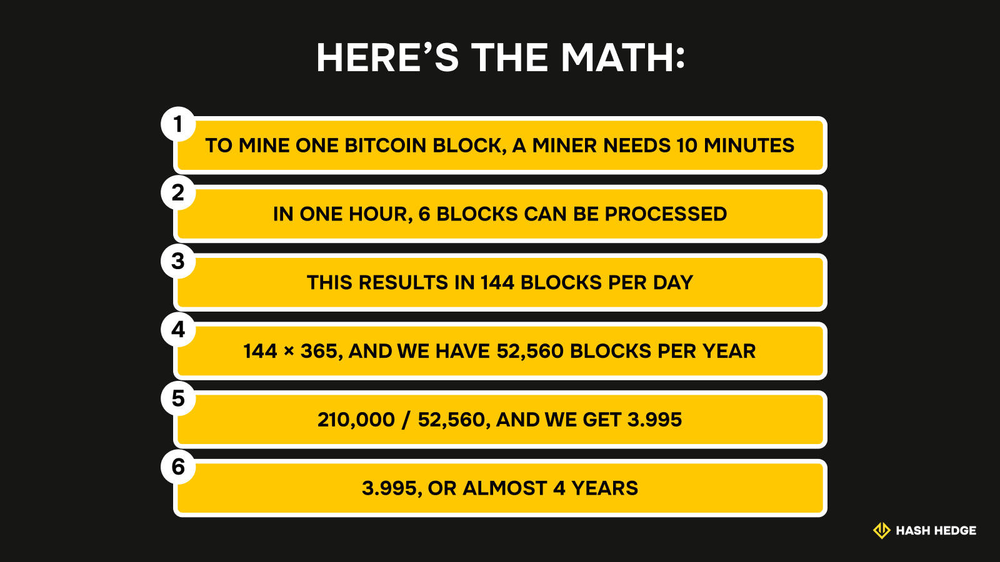
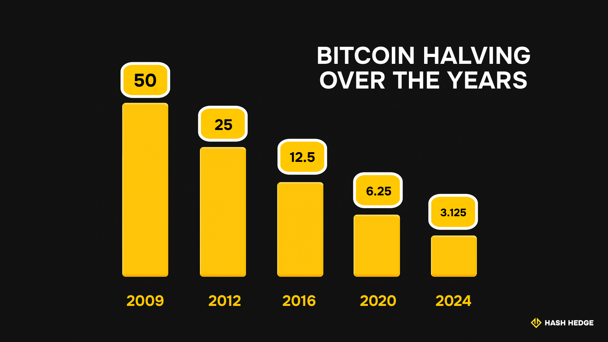

## The Big Picture: Understanding Bitcoin Halving

Let's set the record straight before we begin: Bitcoin is not generated on its own or printed out like fiat money. Instead, it's mined through a process called "Proof-of-Work," or simply PoW. During this process, individuals or entities, also known as "miners," solve complex cryptographic puzzles and later get rewarded with newly mined Bitcoin.

On average, it takes 10 minutes to solve, or mine, a Bitcoin block. Any chance to speed up the process? Not really. Bitcoin alternates its difficulty, becoming easier or harder to solve depending on the statistics of the past two weeks.

This is what happens next: as miners mine their digital gold, adding new blocks to the blockchain, weeks turn into months, and months turn into years. Then, the total number of generated bitcoin blocks reaches 210,000, and… Bitcoin halves, while its price spikes.

What's the reason for such a Bitcoin halving? Such measures are justified by the need to control the rate at which new bitcoins are created. You see, in contrast to the US dollar, bitcoin has a hard limit. If the price remains the same, inflation will happen. To make bitcoin more scarce over time, the halving was introduced. It continues until the total supply reaches the fixed cap of 21 million bitcoins.

### Why Bitcoin's Supply Is Limited to 21 Million

Was this number chosen at random? Could it be extended over time, to, for instance, 30 or 40 million coins?

Nope, no way. This maximum supply of 21 million coins was introduced by Bitcoin's creator to simulate scarcity and to ensure that new coins become harder to obtain over time. There will never be 23 or 35 million bitcoins. The result of the Bitcoin split is the following:

Every four years, the mining reward is reduced and fewer new bitcoins enter the market.

### How Halving Controls Bitcoin Inflation

By making supply predictable and finite, Bitcoin protects itself from inflation similar to that which occurs with fiat money when central banks print more banknotes. This propels the demand to increase and the number of available coins to decline. In the past, after each halving, we could observe a significant rise in the value of Bitcoin.

This process not only slows down the total supply growth but also introduces a form of deflationary pressure that is rarely seen in traditional currencies. The consistent reduction of the number of new coins helps keep inflation in check.

In the big picture, halving is a core reason why many see Bitcoin as a store of value in a world of inflationary money.

<svg width="602" height="567" viewBox="0 0 602 567" fill="none" xmlns="http://www.w3.org/2000/svg"><path d="M507.435 265.841L300.586 469.72L301.222 566.465L601.846 265.841L336.005 0V370.19L400.602 310.562V161.492L507.435 265.841Z" fill="#FCD535"></path><path d="M94.4666 265.841L300.473 469.72L301.109 566.465L0.0557861 265.841L265.897 0V370.19L201.3 310.562V161.492L94.4666 265.841Z" fill="#FCD535"></path></svg>

Start trading with Hash Hedge today

<a class="banner-button" href="https://app.hashhedge.com/en/register/">Start Challenge</a>

## The Mechanics of Bitcoin Halving: Miners, Blocks, and More

Before we dive into the details, let's get things straight. The Bitcoin halving definition is as follows:

Bitcoin halving is a built-in event that cuts the reward miners earn for adding new blocks to the blockchain by 50% every 210,000 blocks. On average, it happens about every four years. Halving protects Bitcoin from inflation without outside interference.

That means if miners were earning 6.25 bitcoins per block, suddenly they're only getting 3.125. Wrapping it up, we can say that halving is an automatic, self-regulated mechanism that keeps Bitcoin finite. And yes, this process repeats over and over, right up until all 21 million bitcoins are finally mined.

### The Role of Miners and Network Security

Now let's talk about miners, the people behind the scenes. These are the individuals, or more often, giant data centers, that operate powerful hardware to keep the Bitcoin network up and running. They check transactions, add new blocks, and make sure nobody's disrupting the system. For doing this, they get rewarded with new bitcoins.

As mining rewards decrease, some miners may choose to stop participating if they consider it no longer profitable. This may result in mild changes in the network's hashrate and overall security. Depending on how many miners remain, halvings can sometimes encourage greater centralization within the network.

### The 210,000 Block Cycle

Why aren't the exact dates for each halving established? Why do we add "roughly" or "on average" when talking about the halving times?

The answer is simple: Because the exact date can shift based on network activity. Since each block is mined, on average, every ten minutes, it usually takes around four years to reach the next halving milestone. However, fluctuations in mining speed can cause the actual calendar date to vary slightly each cycle.

Here's the math:

- To mine one bitcoin block, a miner needs 10 minutes. That means that in an hour, it can process 6 blocks, which results in 144 blocks per day.
- Multiply it by 365, and that leaves us with 52,560 blocks per year.
- Divide 210,000 by 52,560, and we get a number 3.995, or almost 4 years.

## A Timeline of All Bitcoin Halvings

| November 2012 (Block 210,000) | July 2016 (Block 420,000) | May 2020 (Block 630,000) | April 2024 (Block 840,000) | 2028 (Block 1,050,000) |
| --- | --- | --- | --- | --- |
| The first halving event reduced the block reward from 50 BTC to 25 BTC. | The second halving dropped the reward to 12.5 BTC per block. With fewer new bitcoins hitting the market, the idea of digital scarcity started to catch on. | When the third halving arrived, miner rewards dropped to 6.25 BTC per block. Bitcoin became a significant asset for investors worldwide. | The most recent halving reduced the reward to 3.125 BTC per block. It's still early to say what the full impact will be, but Bitcoin's "limited supply" story is stronger than ever. | Another halving is approaching. At that point, the block reward will decrease to just 1.5625 BTC. |

### The First Halving (2012)

The first crypto halving took place in November 2012. It reduced the initial mining payout from 50 BTC to 25 BTC per block. At that time, Bitcoin was still largely unknown outside the early crypto community, and prices were below $15. The halving created instant scarcity, attracting attention and sparking Bitcoin's first major bull run as both miners and investors recognized the value of a limited supply.

### The Second Halving (2016)

The second BTC split occurred in July 2016, dropping the block reward from 25 BTC to 12.5 BTC. This event happened during the growing awareness of Bitcoin in mainstream finance. The halving further limited new supply and contributed to market growth. This event further established Bitcoin's status as a sought-after digital asset.

### The Third Halving (2020)

The third cryptocurrency halving occurred in May 2020, lowering block rewards from 12.5 BTC to 6.25 BTC. Bitcoin was swarming in the news, companies were talking, social media was buzzing, and everyday investors jumped in as the price spiraled. It also marked a turning point, with notable institutional participation and increased interest from mainstream investors across the broader crypto market.

### The Fourth Halving (2024)

The mining before the fourth Bitcoin halving was taking place from May 2020 until April 2024, when Bitcoin's block reward was split in two, from 6.25 BTC to 3.125 BTC. Many traders and analysts expected this event to reinforce Bitcoin's scarcity and possibly spark new price momentum. However, the actual market impact depends on broader economic trends, institutional adoption, and ongoing demand. Experts continue to analyze data to see how this halving will shape the future of Bitcoin.

## How Bitcoin Halving Affects the Market

Bitcoin halving events have historically led to rapid price fluctuations and, over time, strong upward price trends. As mentioned, the reduced rate at which new coins enter the market creates more scarcity and propels competitiveness among traders and investors.

Miners form another group of those who are affected by the halving. Smaller miners face the brutal reality that there's no longer a place for them. They're substituted by larger, more resourceful mining operations that can withstand lower rewards thanks to economies of scale, efficient hardware, and low-cost electricity. This shift can lead to greater centralization within the network, as fewer, bigger players control a larger share of mining power.

Halvings also mean miners depend more heavily on transaction fees for their earnings. If the fees rise to compensate for the lower block reward, the cost of transacting on the Bitcoin network could also increase, potentially affecting both individual users and institutional investors.

## What Happens After the Final Halving?

When the final halving takes place, which is going to happen in the year 2140, no new coins will enter circulation. By then, miners will earn their income entirely from the fees users pay for processing and confirming transactions.

Whether miners remain incentivized in the long run will depend on if transaction fees alone are enough to support the network.

## Investment Strategies Around Bitcoin Halving

So, despite high volatility and risks, regular investors can still benefit from the Bitcoin halving cycle. Some buy before halving, hoping to benefit from any price surge as new supply shrinks. Others wait and see how the market reacts, buying after volatility settles. Many long-term holders simply hold through multiple halvings, betting on Bitcoin's long-term scarcity. All these are viable options, but please remember that none of them is a 100% guarantee of a money win. We strongly encourage you to always research carefully and manage your risk.

### Should You Buy Before or After a Halving?

Buying before a halving means betting on a supply shock and possible price rally, but it can backfire if the market doesn't move as expected or corrects sharply.

Waiting to buy after the halving lets you observe actual market behavior, but you might miss an early price rally. In past cycles, prices often rose months after the halving, but this is never guaranteed. Weigh the risks and rewards carefully for your own situation.

### Short-Term vs. Long-Term Outlook

Short-term trading often means dealing with high volatility, rapid price swings, and unpredictable reactions. If you're an active trader who's not intimidated by the risk, then take your chance.

However, long-term investors have a greater possibility of earning more if they show enough patience over the years. This is due to repeated supply cuts that tend to drive value growth over time. Each strategy requires different risk tolerance and discipline—choose what fits your goals and experience.

## Final Thoughts: Why Bitcoin Halving Matters

Understanding bitcoin halving is essential for anyone involved in the cryptocurrency industry. Every halving automatically slows the creation of new bitcoins, making the asset scarcer and reinforcing its status as "digital gold." Bitcoin halving explained simply: it's the mechanism that shapes supply, impacts market cycles, and creates both opportunities and challenges for traders, miners, and investors. It's a fundamental event in the crypto world.
