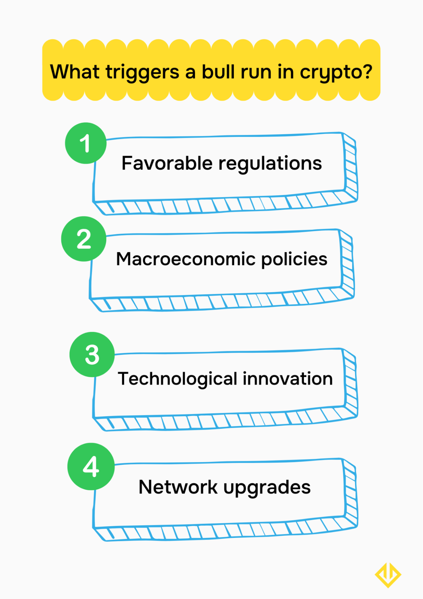
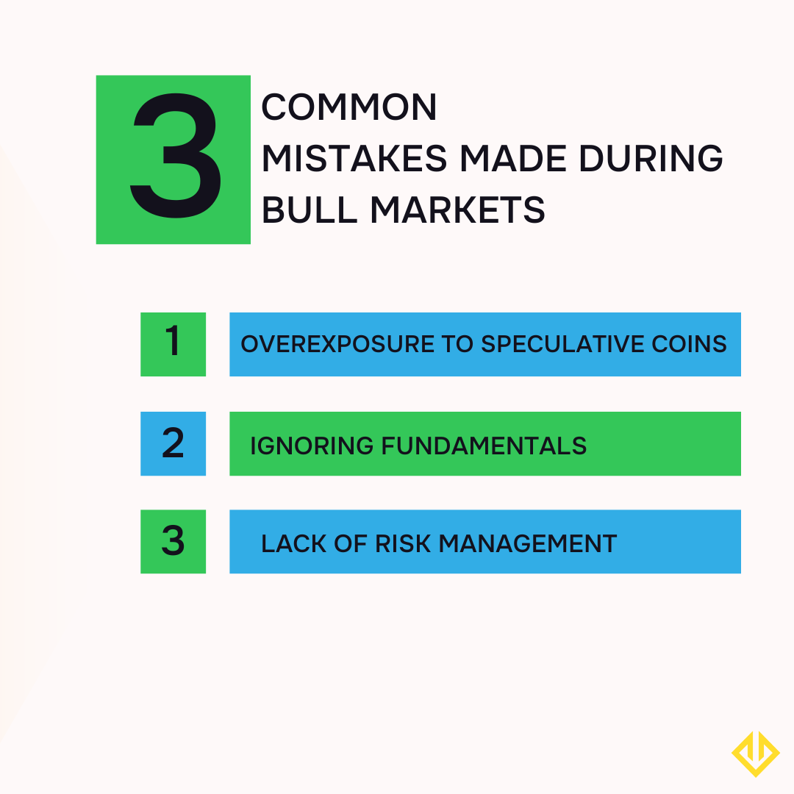

## Что такое bull run в криптовалюте?

Bull run — это продолжительный период роста цен на криптовалютные активы. Это оптимистичная фаза с высокими ожиданиями, которая побуждает инвесторов покупать различные цифровые активы. Некоторые активы, такие как Bitcoin, показывают лучшие результаты во время бычьего рынка, однако большинство основных монет также переживает значительный рост.

## Как работает bull run в крипте?

Криптовалютный бычий цикл подпитывается несколькими факторами: оптимизмом инвесторов, благоприятным регулированием и технологическими достижениями. Общие экономические условия и инфляция тоже могут способствовать bull run, так как в условиях неопределённости инвесторы ищут защиту в цифровых валютах.

Например, в июне правительство США приняло законопроект о создании регуляторной базы для стейблкоинов — цифровых монет, привязанных к доллару США. Такое благоприятное регулирование повысило интерес институциональных инвесторов к криптовалютам, что подтолкнуло Bitcoin и другие цифровые активы к новым рекордным максимумам.

Факторы, влияющие на bull run в крипте, взаимно усиливают друг друга. Благоприятное регулирование стимулирует рост принятия, что ведёт к повышению настроений инвесторов и выпуску новых продуктов блокчейн-компаниями. Всё это может поддерживать бычий рынок на протяжении длительного времени.

## Этапы bull run

Криптовалютный bull run обычно следует определённому шаблону: первым растёт Bitcoin, затем подключаются другие крупные монеты, такие как Ethereum, а после начинается альткоин-сезон. Рассмотрим фазы подробнее:

### Фаза 1: Bitcoin ведёт ралли

Bitcoin — самая популярная криптовалюта и основной инструмент для институциональных инвесторов. Поэтому именно BTC становится первым активом, в который устремляются трейдеры во время бычьего цикла.

В нашем примере с благоприятным регулированием в США, интерес к криптовалютам подогрел рост Bitcoin до нового исторического максимума в 123 000 долларов. Благодаря широкой адаптации и высокой ликвидности, Bitcoin остаётся самым надёжным цифровым активом как для розничных, так и для институциональных инвесторов. Именно он всегда запускает bull run, за которым уже следуют другие токены.

### Фаза 2: Ethereum и крупные альткоины

После Bitcoin рост обычно переходит к Ethereum (вторая по капитализации криптовалюта) и крупным альткоинам: Ripple, Binance Coin, Solana, Tron.

Эти монеты имеют большие рыночные капитализации, поэтому становятся естественным выбором для инвесторов, желающих расширить свои портфели. Рост Bitcoin стимулирует дополнительный приток средств в эти альткоины, так как инвесторы ищут диверсификацию.

### Фаза 3: Сезон альткоинов и спекулятивное безумие

После роста Bitcoin и крупных альткоинов обычно наступает очередь мелких альткоинов — от умеренно популярных (например, Algorand, Arbitrum) до малоизвестных (Tensor, Aurora).

Альткоины с небольшой капитализацией торгуются не так активно, как их более крупные аналоги. Тем не менее во время bull run многие трейдеры устремляются именно к ним, чтобы диверсифицировать свои ставки и потенциально получить высокую прибыль.

Выражение «поднимающийся прилив поднимает все лодки» отлично описывает крипторынок. Во время bull run цены множества монет на разных блокчейнах растут, открывая инвесторам широкие возможности для заработка.

<svg width="602" height="567" viewBox="0 0 602 567" fill="none" xmlns="http://www.w3.org/2000/svg"><path d="M507.435 265.841L300.586 469.72L301.222 566.465L601.846 265.841L336.005 0V370.19L400.602 310.562V161.492L507.435 265.841Z" fill="#FCD535"></path><path d="M94.4666 265.841L300.473 469.72L301.109 566.465L0.0557861 265.841L265.897 0V370.19L201.3 310.562V161.492L94.4666 265.841Z" fill="#FCD535"></path></svg>

Начни торговать с Hash Hedge уже сегодня

<a class="banner-button" href="https://app.hashhedge.com/en/register/">Начать челлендж</a>

## Ключевые индикаторы bull run

- **Рост торговых объёмов.** Объём торгов — один из главных индикаторов надвигающегося bull run. Когда вы наблюдаете рост торговых объёмов у Bitcoin и других популярных активов, это сигнал увеличивающегося интереса со стороны розничных и институциональных инвесторов. Это оказывает положительное влияние на весь крипторынок.
- **Рост инвесторских настроений.** Увеличение оптимизма среди инвесторов также указывает на начало бычьего цикла. Когда всё больше трейдеров и инвесторов проявляют уверенность в росте цен, это подогревает спрос и ускоряет формирование bull run.
- **Ончейн-данные.** Позитивные метрики, фиксируемые в блокчейне, такие как рост количества создаваемых кошельков и увеличение депозитов, являются признаками благоприятных перспектив для всего криптовалютного рынка.
- **Новые проекты.** Если компании, особенно не связанные напрямую с блокчейном, начинают выпускать новые продукты на основе блокчейн-технологий, это стимулирует рост криптоадопции, что естественным образом ведёт к повышению цен.

## Исторические криптовалютные bull run: чему они могут нас научить?

Фраза «Те, кто не учится на истории, обречены повторять её ошибки» как никогда актуальна для криптовалютной индустрии. Прошлые bull run дают подсказку, когда может наступить следующий цикл роста и как извлечь из него выгоду.

### Bull run 2017–2018: стремительный рост Ethereum

Bull run 2017–2018 годов был обусловлен технологическими прорывами и растущей популярностью криптовалют. Это был период бума ICO (Initial Coin Offering), когда множество проектов привлекали средства для решения реальных проблем.

В этот период Ethereum стал основной платформой для запуска новых криптовалютных проектов, и его нативный токен резко вырос в цене. Ethereum поднялся с $10 в начале 2017 года до $1 400 в январе 2018-го. Растущий спрос на блокчейн-технологии подогрел этот bull run, и многие трейдеры, заметившие тренд вовремя, смогли хорошо заработать.

### Bull run 2020–2021: экономическая политика во время пандемии

2020 год вошёл в историю как год пандемии COVID-19, которая перевернула мировую экономику и вынудила правительства принимать экстренные экономические меры, чтобы смягчить её последствия.

Опасаясь надвигающейся инфляции, многие трейдеры устремились в криптовалюты как в «тихую гавань». В марте 2020 года Биткоин обвалился до $3 700, но к декабрю уже достиг $29 000. В марте 2021-го Биткоин поднялся до $69 000, своего исторического максимума на тот момент.

Многие инвесторы, вложившиеся в Биткоин и другие токены, получили значительные прибыли, внимательно отслеживая экономические тренды и диверсифицируя активы как защиту от инфляции.

## Что запускает bull run в крипте?

Как уже упоминалось, bull run вызывается сочетанием разных факторов. Основные из них:

- **Благоприятное регулирование.** Государственные законы, легализующие цифровые активы, стимулируют приток институциональных инвестиций. Крупные вложения таких игроков привлекают и розничных трейдеров, раскручивая bull run.
- **Макроэкономическая политика.** Экономические меры (например, печатание денег) могут подтолкнуть инвесторов покупать криптовалюты как защиту от инфляции. Массовый спрос ускоряет рост рынка.
- **Технологические инновации.** Выход новых приложений в сфере DeFi приводит к вовлечению в крипторынок всё большего числа пользователей, а их активность разгоняет цены.
- **Обновления сетей.** Апгрейды блокчейн-сетей (ускорение транзакций, снижение комиссий и т.п.) повышают интерес к ним и стимулируют рост рынка.

## Сколько обычно длится bull run?

Криптовалютные bull run обычно длятся около 1 года, как показано на примерах 2017–2018 и 2020–2021 годов. Однако они могут быть короче — 3–4 месяца, либо дольше — до 2 лет.

Продолжительность bull run зависит от факторов, которые его вызывают. Bull run, вызванные макроэкономической политикой, как правило, держатся дольше, чем те, что основаны на хайпе, так как ажиотаж быстрее сходит на нет. Bull run часто сменяются bear market, во время которых цены могут падать непредсказуемо.

Продолжительность bull run непредсказуема, поэтому важно уметь замечать признаки скорого снижения цен. Среди них: снижение торговых объёмов, негативные новости и неблагоприятное регулирование. Когда появляются такие сигналы, стоит начать продавать криптовалютные активы, чтобы защитить себя от наступающего медвежьего рынка.

## Распространённые ошибки во время bull market

Bull run — захватывающее время, и от переизбытка эмоций легко совершить ошибки. Вот чего следует избегать:

### Чрезмерное вложение в спекулятивные монеты

Некоторые малоизвестные токены с малой капитализацией резко растут во время bull run. Может возникнуть желание вложить туда слишком много средств, но это рискованно: такие монеты могут упасть так же резко, как и выросли, и обнулить капитал.

Покупать такие монеты можно, но только как часть диверсифицированного портфеля, включающего также крупные криптовалюты, например Bitcoin.

### Игнорирование фундаментальных факторов

Хайп не всегда означает устойчивость. Популярность монеты не гарантирует, что её рост основан на реальном использовании или технологическом развитии. Перед покупкой изучай фундаментал: объём торгов, уровень применения, партнёрства, команду и регуляторную базу.

### Отсутствие риск-менеджмента

Даже на растущем рынке важно придерживаться правил управления рисками: использовать стоп-лоссы, диверсифицировать портфель, регулярно фиксировать прибыль, чтобы снизить риск будущих потерь.

В Hash Hedge трейдеры проп-компании используют встроенные инструменты риск-менеджмента, которые помогают минимизировать убытки и максимизировать прибыль. Здесь можно торговать криптовалютой и оставлять себе 80% заработка.

## Bull run vs. Bear market: ключевые различия

Медвежий рынок — противоположность бычьего. В этот период инвесторы настроены негативно, и цены на криптовалюты падают. Как правило, во время bear market растёт ликвидность стейблкоинов, поскольку всё больше трейдеров переходят в стабильные активы, чтобы сохранить стоимость своих токенов.

Позитивный момент в том, что bear market обычно длятся короче, чем bull run. Цены могут стабилизироваться или начать расти в более короткие сроки.

## Прогнозы: Когда начнётся следующий bull run?

Предсказать следующий bull run непросто, но анализ закономерностей может дать полезные подсказки. Последние события указывают на всё более благоприятный рынок для криптоактивов.

В январе 2024 года американские регуляторы одобрили первые 11 биржевых фондов (ETF) на основе Bitcoin, и с тех пор появилось ещё больше подобных инструментов. В 2025 году к власти пришла новая администрация, которая относится к криптоиндустрии значительно благосклоннее предыдущей — в июне был принят исторический закон, нормализующий и регулирующий стейблкоины.

Институциональные инвесторы массово вложились в Bitcoin ETF, что привело к рекордному росту цены Bitcoin — более $120 000. Если вспомнить этапы bull run, то сначала растёт Bitcoin, затем крупные альткоины, а затем малые.

С Bitcoin на рекордных уровнях, вполне вероятно, что и другие крупные и малые альткоины последуют за ним. Так что если вы задаётесь вопросом, когда начнётся следующий крипто bull run, ответ прост: он уже близко.

Проп-трейдеры используют предстоящий bull run, чтобы зарабатывать. Hash Hedge финансирует проп-трейдеров для реализации их торговых стратегий, и трейдеры оставляют себе 80% прибыли. Присоединяйтесь к Hash Hedge уже сегодня и пройдите челлендж, чтобы начать свой путь в проп-трейдинге.
