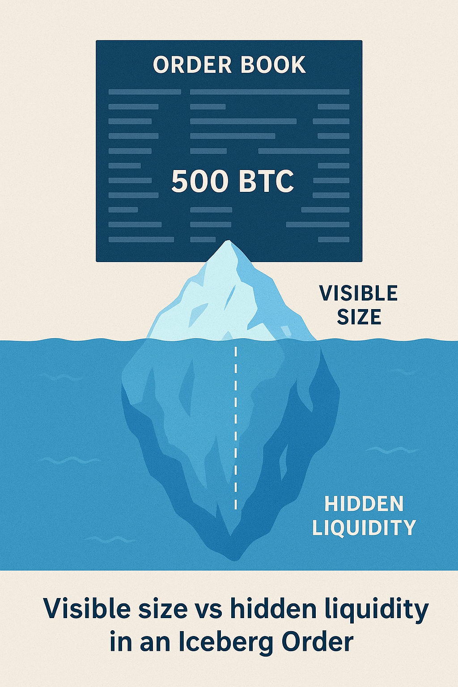

## What Is an Iceberg Order?

An iceberg order is a type of hidden order used by large players who want to execute trades without drawing too much attention. Instead of showing the full size, the exchange only displays a small portion of the order. Once that visible part is filled, another slice of the order automatically appears, and the process repeats until the full size is executed.

For example, imagine an institution wants to buy 1,000 BTC. If they post the full order at once, other traders will notice, so the price may skyrocket before the order is filled. Instead, they use an iceberg strategy: perhaps only 50 BTC appear in the order book at any time, while the rest remains hidden. For ordinary traders, it just looks like a normal order, but in reality, there's a much bigger position building up quietly.

This method is common not only in crypto but also in stocks, futures, and forex, wherever large trades need careful execution. That's why you'll often see the term iceberg order in trading across financial literature.

## How Iceberg Orders Work in Crypto

The mechanics are simple. Exchanges or trading platforms break down a large parent order into multiple child orders. Each child order is placed on the order book at predefined sizes, and as soon as one is executed, the next one pops up. The market participants only see these small bites, never the full picture.

There are two key elements to how iceberg orders work:

1. Displayed Quantity (the tip): the visible part of the order sitting on the order book.
2. Hidden Quantity (the bulk): the undisclosed remainder that gets revealed step by step.

For traders, the challenge is that iceberg orders create an illusion of normal liquidity. The order book may look balanced, but in reality, supply or demand could be much deeper. That's why advanced traders study order book analysis and volume patterns to detect iceberg orders.

In crypto markets, which are often more volatile and less liquid compared to traditional assets, iceberg orders have an even greater impact. They allow whales and institutions to manage execution without causing sharp spikes.

## Why Traders Use Iceberg Orders

The short answer: stealth and control. Let's break down this method:

- A single huge order can cause panic or FOMO. By breaking it down, traders prevent sudden spikes or crashes.
- Gradually feeding liquidity helps secure a more stable average entry or exit price.
- Other market participants are unable to immediately react to the true size of the position.

| Feature | Usual Order | Iceberg Order |
| --- | --- | --- |
| Visibility | Full size shown in the order book | Only display size visible, rest hidden |
| Market Impact | High (large trades move price) | Reduced |
| Use Case | Retail & small trades | Institutions, hedge funds, advanced traders |
| Risk | Slippage & front-running | Partial fills, detection by algorithms |
| Best Market Conditions | Any | Highly liquid markets |

Institutions, hedge funds, and prop trading firms use iceberg orders daily for precisely these reasons. But it's not only for giants. Some advanced retail traders use them too, especially on platforms that support algorithmic order types.

<svg width="602" height="567" viewBox="0 0 602 567" fill="none" xmlns="http://www.w3.org/2000/svg"><path d="M507.435 265.841L300.586 469.72L301.222 566.465L601.846 265.841L336.005 0V370.19L400.602 310.562V161.492L507.435 265.841Z" fill="#FCD535"></path><path d="M94.4666 265.841L300.473 469.72L301.109 566.465L0.0557861 265.841L265.897 0V370.19L201.3 310.562V161.492L94.4666 265.841Z" fill="#FCD535"></path></svg>

Start trading with Hash Hedge today

<a class="banner-button" href="https://app.hashhedge.com/en/register/">Start Challenge</a>

## The Risks and Drawbacks

Iceberg orders come with some problems. Here are:

- If liquidity dries up, parts of the order might remain unexecuted.
- Skilled traders can spot iceberg patterns and trade against them.
- Setting up iceberg orders often requires advanced trading platforms and tools.

## How to Spot Iceberg Orders

Detecting an iceberg order feels a bit like detective work. No platform will announce, "Hey, here's a hidden order!" But certain signs give them away:

- Reappearing liquidity. A bid or ask at the same price keeps showing up after being filled.
- Unusual volume clusters. Executions far exceed what's displayed on the order book.
- Time & sales tape. Large prints keep hitting the tape, but the visible order book doesn't reflect that size.

## Trading Strategies Around Iceberg Orders

Once you know icebergs exist, how do you use that knowledge?

- Ride the wave. If you detect a persistent buy-side iceberg, you might anticipate upward momentum as hidden demand gets absorbed.
- Fade the pressure. Spot a large sell iceberg? Some traders take the other side, betting the hidden supply will cap the price.
- Liquidity mapping. Combining iceberg detection with liquidity zones helps refine entries and exits.

Of course, these strategies carry risk: they simply hint at hidden activity beneath the surface.

## Ready to Spot Hidden Liquidity?

Iceberg orders show how much of the market stays beneath the surface unseen. Mastering this mechanic helps traders avoid false signals, anticipate price shifts, and trade with greater precision.

Hash Hedge helps you turn that insight into action. With the right tools, 160+ crypto pairs, and zero hidden commissions, you will learn how to analyze, detect, and trade around hidden liquidity. Join 4,500+ traders already using Hash Hedge to refine their edge today.
