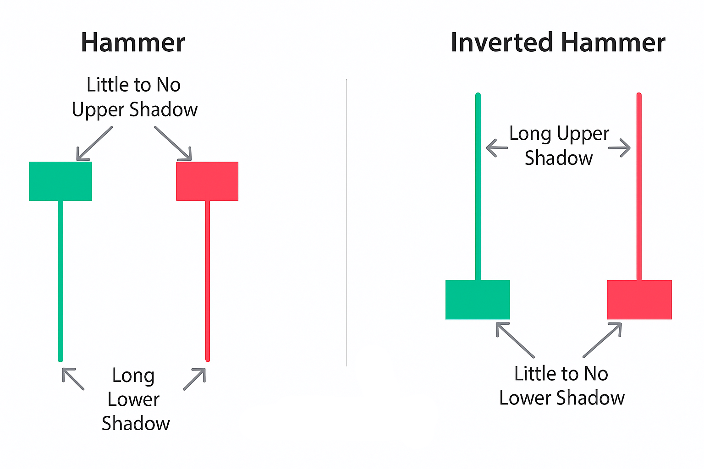

## Что такое обратный молот?

По сути, обратный молот — это односвечный паттерн, который появляется в конце нисходящего тренда. Представьте: рынок падает, продавцы чувствуют себя уверенно, и вдруг появляется эта странная свеча: короткое тело внизу с длинной верхней тенью, уходящей высоко вверх.

## Ключевые характеристики обратного молота

- Малое реальное тело, обычно в нижней части свечи.
- Длинная верхняя тень, минимум в два раза длиннее тела.
- Почти отсутствует нижняя тень, что означает, что продавцы не смогли сильно опустить цену.
- Появляется после снижения — ищите предшествующий нисходящий тренд.

## Визуальные признаки и ключевые сигналы

Думайте об обратном молоте как о «ложном рывке». Покупатели заходят, демонстрируют силу, но к закрытию отступают. На графике это выглядит так, словно рынок пытался подняться, но его снова потянули вниз. Эта попытка важна — она показывает, что покупательский интерес жив, пусть пока и слабый.

На что стоит обратить внимание на графике:

- Расположение: важно, где появляется свеча. В середине восходящего тренда это может быть совсем другой паттерн (например, «Падающая звезда»). Обратный молот всегда появляется на дне нисходящего тренда.
- Пропорции тени: если верхняя тень меньше чем в два раза тела, сигнал теряет силу.
- Цвет тела не имеет большого значения. Главное — длинная верхняя тень, показывающая слабость продавцов.
- Подтверждение объёмом: если свеча формируется на повышенном объёме, сигнал становится сильнее.

## Психология рынка и паттерна

Каждая свеча — это эмоция рынка, и обратный молот не исключение. Чтобы читать его, нужно понимать участников:

- Продавцы контролируют рынок: цена падает, настроение медвежье, трейдеры ждут продолжения снижения.
- Покупатели сопротивляются: во время сессии они поднимают цену значительно выше открытия. На мгновение кажется, что может произойти разворот.
- Продавцы возвращаются: к закрытию они частично возвращают контроль, опуская свечу вниз. Прогресс не исчезает полностью, а длинная тень служит свидетельством попытки покупателей остановить падение.

<svg width="602" height="567" viewBox="0 0 602 567" fill="none" xmlns="http://www.w3.org/2000/svg"><path d="M507.435 265.841L300.586 469.72L301.222 566.465L601.846 265.841L336.005 0V370.19L400.602 310.562V161.492L507.435 265.841Z" fill="#FCD535"></path><path d="M94.4666 265.841L300.473 469.72L301.109 566.465L0.0557861 265.841L265.897 0V370.19L201.3 310.562V161.492L94.4666 265.841Z" fill="#FCD535"></path></svg>

Начни торговать с Hash Hedge уже сегодня

<a class="banner-button" href="https://app.hashhedge.com/en/register/">Начать челлендж</a>

## Обратный молот vs Падающая звезда

На первый взгляд они похожи: короткое тело и длинная верхняя тень. Но контекст меняет смысл. Обратный молот появляется после падения и намекает на возможное дно. Падающая звезда формируется после роста и предупреждает о возможной вершине.

## Обратный молот vs Молот

Молот — брат-близнец обратного молота. Принцип тела тот же, но тень длинная снизу. Оба показывают отторжение низких цен, но молот более прямой: покупатели полностью перекрыли продавцов. Обратный молот более тонкий: он демонстрирует попытку покупателей поднять цену, но не обязательно успешную.

## Как трейдеры распознают и подтверждают паттерн

Обратный молот легко заметить, но большинство трейдеров делают дополнительные проверки, чтобы отделить настоящий сигнал от ложного:

1. **Шаг 1: Убедитесь, что свеча появляется после падения.** Для паттерна важен контекст. Сначала проверяют, что рынок находится в явном нисходящем тренде с последовательными низшими максимумами и минимумами. Тогда одиночная перевёрнутая свеча имеет смысл. Свеча всегда состоит из: малого тела внизу, верхней тени минимум в два раза длиннее тела, минимальной или отсутствующей нижней тени.

2. **Шаг 2: Проверьте таймфрейм.** Обратные молоты встречаются на любом таймфрейме — от минутного до недельного. Но не все одинаково значимы. Обычно больше доверия уделяют дневным или 4-часовым графикам; ультракороткие таймфреймы часто рассматриваются как рыночный шум.

3. **Шаг 3: Используйте инструменты для подтверждения.**

   - Объём: рост покупок сразу после формирования свечи усиливает сигнал.
   - RSI, Стохастик или MACD: выход из зоны перепроданности добавляет уверенности.

4. **Шаг 4: Дождитесь подтверждения рынка.** Подтверждение происходит, когда бычья свеча закрывается выше тела обратного молота. Либо же в случае появления гэп-апа на открытии следующей сессии с новым давлением покупателей.

## Частые ошибки

Основные ошибки при использовании паттерна:

- Торговать без подтверждения: одиночный обратный молот без подтверждения — просто шум. Новички часто торопятся и видят продолжение падения.
- Игнорировать тренд: если свеча формируется в боковом движении или на вершине роста, это не обратный молот.
- Не рассчитывайте слишком сильно на форму свечи: контекст важнее цвета тела или длины тени.

## Практические советы

Но как торговать в итоге? Какую стратегию использовать? Попробуем разобраться ниже:

- Совмещайте с уровнями поддержки/сопротивления: обратный молот рядом с сильным уровнем значимее и сильнее, чем на пустом графике.
- Выбирайте таймфрейм разумно: 4H и дневные графики фильтруют ложные сигналы лучше.
- Смотрите на общую картину: паттерн должен совпадать с общим настроением рынка, новостями и фундаменталом.
- Думайте о вероятностях, а не о гарантиях: даже при идеальных условиях это всего лишь шансы, часть стратегии, а не вся стратегия.

## Заключение

Сам по себе обратный молот мало что значит. Но в сочетании с контекстом, объёмом, ключевыми уровнями цены и подтверждением он становится одним из самых точных инструментов в арсенале трейдера.

Hash Hedge помогает заметить его в реальном времени. С мощными инструментами, доступом к 160+ криптопарам и без скрытых комиссий вы можете анализировать и торговать вокруг скрытой ликвидности. Более 4 500 трейдеров уже используют Hash Hedge, чтобы улучшить свои результаты и торговать умнее.
