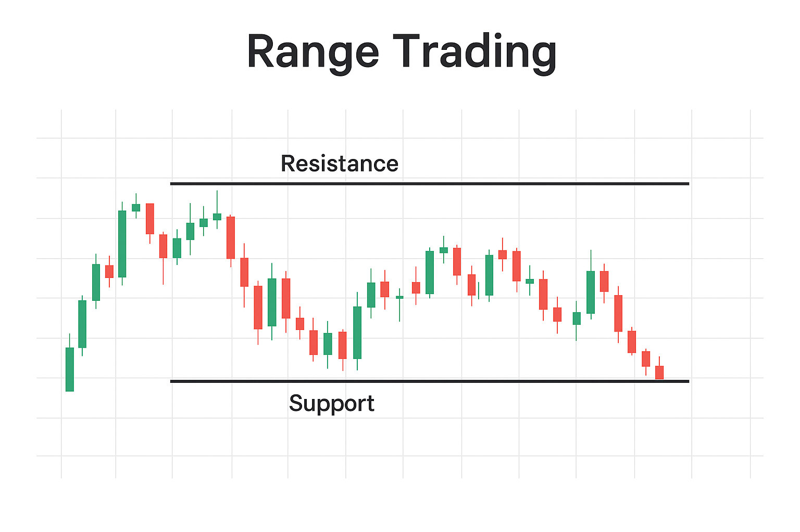
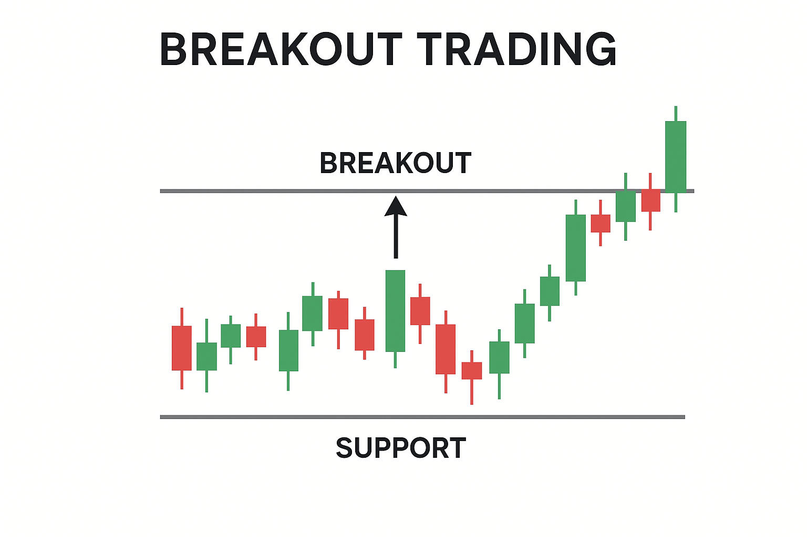
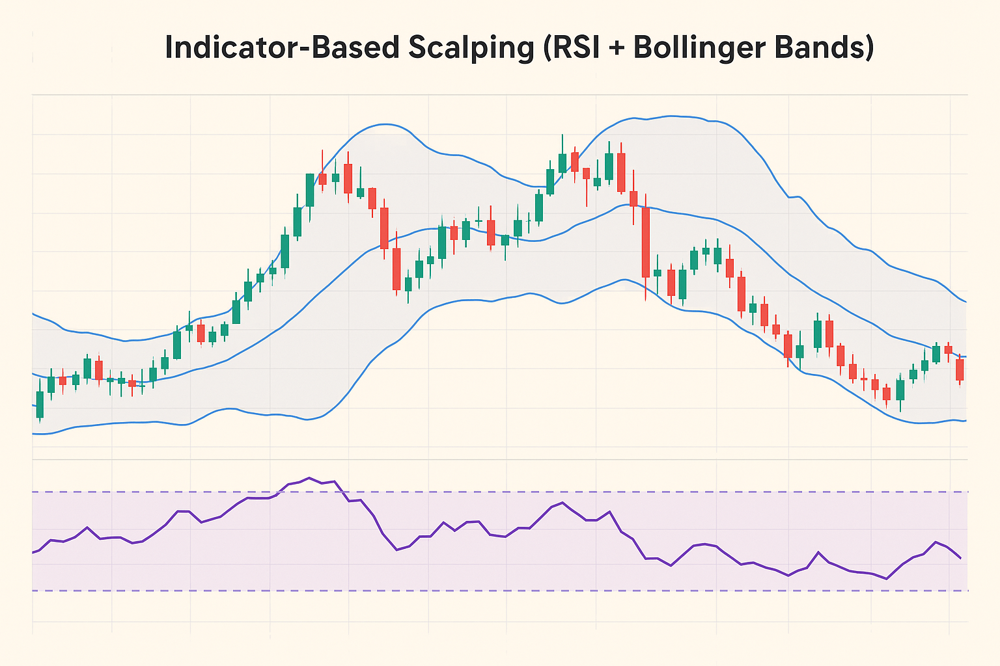

## What Is Scalping in Crypto? How to scalp crypto?

In simple terms, scalping in cryptocurrency refers to entering and exiting trades quickly to capitalize on small price fluctuations. A trader might buy any crypto like Bitcoin and Ethereum, when the price dips slightly, only to close the trade seconds later after a tiny rebound. Instead of aiming for large returns per position, scalpers rely on high frequency. Ten trades with 0.5% profit each can add up faster than a single swing trade that takes hours to form.

The appeal of crypto scalping lies in the crypto market's volatility. Digital assets rarely stand still — every candle can spike, retrace, or break out. For disciplined traders, this constant motion means a continuous flow of potential entries and exits.

## The Pros and Cons of Scalp Trading Cryptocurrency

Scalping has clear strengths. The frequent opportunities mean scalpers can trade multiple times a day without waiting for long setups. Because positions are closed quickly, exposure to sudden news or overnight risks is limited. And, unlike long-term investing, results come almost instantly.

But there's another side. Scalping requires laser focus, emotional discipline, and strict risk management. A few bad trades with high leverage can wipe out weeks of gains. It's also time-intensive: traders need to stay glued to the screen, making split-second decisions.

<svg width="602" height="567" viewBox="0 0 602 567" fill="none" xmlns="http://www.w3.org/2000/svg"><path d="M507.435 265.841L300.586 469.72L301.222 566.465L601.846 265.841L336.005 0V370.19L400.602 310.562V161.492L507.435 265.841Z" fill="#FCD535"></path><path d="M94.4666 265.841L300.473 469.72L301.109 566.465L0.0557861 265.841L265.897 0V370.19L201.3 310.562V161.492L94.4666 265.841Z" fill="#FCD535"></path></svg>

Start trading with Hash Hedge today

<a class="banner-button" href="https://app.hashhedge.com/en/register/">Start Challenge</a>

## 5 Cryptocurrency Scalping Strategies

Crypto scalping techniques involve selecting the optimal approach for the market's micro-movements. Here are five popular strategies, each with its own strengths and risks.

### Range Trading

When the market gets stuck in a tight range, scalpers turn it into a reaction-based game. The strategy is simple: buy near support and sell near resistance. On 1-5 minute charts, these zones appear constantly, especially during low-activity hours.

To improve accuracy, many traders use candlestick patterns like hammers or pin bars at range boundaries. Others place limit orders in advance to catch sharp bounces. Once a level breaks, the range stops working.

### Breakout Trading

The market can linger at the same level for hours, then explode within seconds. This is where breakout scalping comes in. The strategy focuses on identifying key levels: equal highs, lows, or trendlines. Entries happen either at the breakout or on a retest (the safer option, but with a risk of missing the initial impulse).

A scalper's main enemy is false breakouts. Experienced traders wait for confirmation via volume or a strong-bodied candle. Stops are placed just beyond the last extreme, and take-profits near the next support or resistance level.

### Trading Chart Patterns

Classic technical patterns still work on low timeframes. Triangles, flags, and wedges, so they can all trigger fast impulse moves.

Scalpers usually take two approaches: enter on the pattern breakout or wait for a retest. The first is aggressive and risky; the second is more conservative but generates fewer signals. For example, a falling wedge on a one-minute chart often precedes a sharp upward impulse. Take-profits can be set equal to the pattern's "base," and stops just beyond the nearest extreme.

### Indicator-Based Scalping (RSI + Bollinger Bands)

Indicators help organize the chaos of minute charts. One popular combo is RSI and Bollinger Bands.

RSI shows overbought and oversold zones, while Bollinger Bands signal volatility expansion or contraction.

- If RSI > 70 and price touches the upper Bollinger Band, traders look for a short entry.
- If RSI < 30 and price hits the lower band, it signals a long.
- Exits can be made at the Bollinger midline or when RSI returns to neutral levels.

### Scalping with Moving Averages

One of the most popular scalping strategies is trading with fast-moving averages, such as the EMA 9 and EMA 21. When the fast EMA crosses above the slow EMA, it signals potential upward momentum and a buying opportunity; when it crosses below, it indicates a sell signal. On one-minute charts, these crossovers occur frequently, which makes the method highly suitable for scalping.

The main advantage of this strategy lies in its simplicity and versatility, allowing traders to apply it across different markets, including crypto, forex, and stocks. However, moving average scalping can generate many false signals in sideways or choppy markets. To increase accuracy, traders often combine it with filters like trading volume, the RSI indicator, or key support and resistance levels.

## Risk Management in Scalping and Psychology

No scalping strategy works without proper risk management. Setting clear stop-loss levels, keeping position sizes consistent, and avoiding emotional trades are non-negotiable. The temptation to chase every move can be fatal — patience and structure separate professionals from gamblers.

The psychological toll is just as real. Scalpers must stay calm in the face of constant price swings and accept that losses are part of the game.

## Ready to Put Your Strategy to Work?

Scalping requires discipline, speed, and a clear plan — but when paired with the right platform, it can become a consistent and scalable trading approach.

Instead of risking your own savings with leverage, you can access up to $100,000 capital and trade across 160+ crypto pairs without hidden fees. More than 4,500 traders already use Hash Hedge to refine their scalping strategies, manage risk more effectively, and take advantage of liquidity-driven opportunities.
