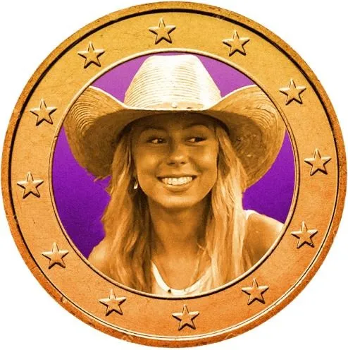
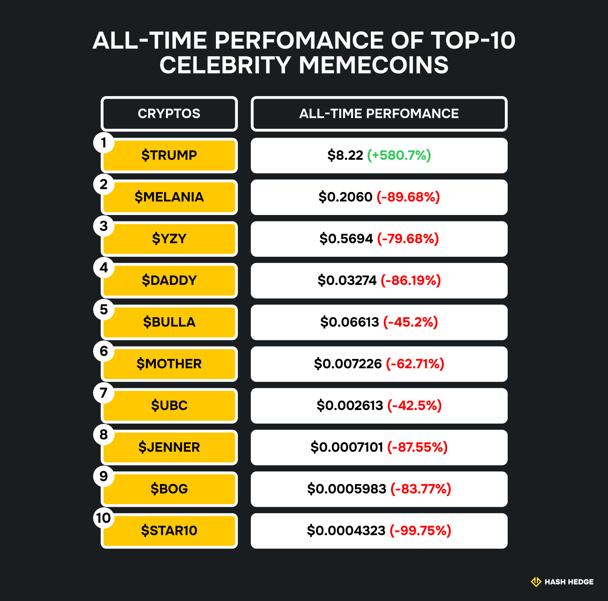
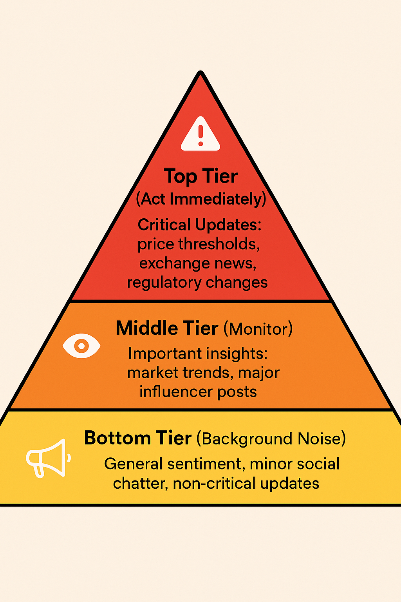
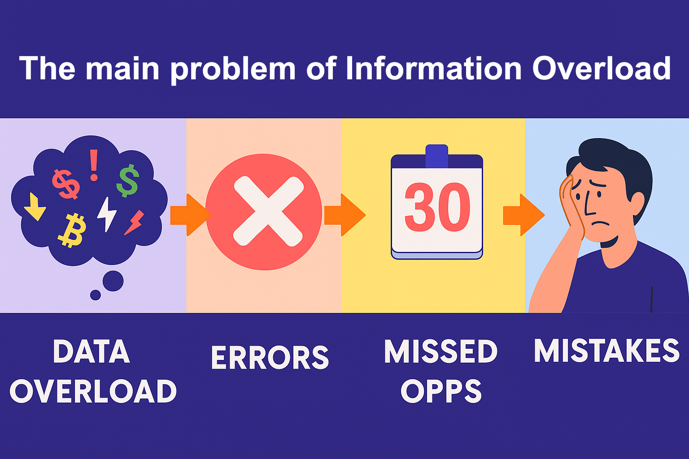

## What Is Information Overload in Crypto?

Information overload happens when the flood of data outpaces your brain's ability to process it. In crypto, this comes in many forms:

- Non-stop news cycles from socials.
- Alerts from multiple price trackers and mobile apps.
- Market analyses, opinions, and "hot tips" from influencers.
- Charts with dozens of indicators screaming for attention.

Of course, sideways channels exist too, where the market just ranges instead of trending, but they deserve their own rant (and we'll get to that).

## How Information Overload Impacts Your Trades

Not a fan fact: Approximately 50% of new traders rely on social media for advice, and nearly half regret that choice. Young or inexperienced traders often let social media steer decisions, leading to mistakes.

The consequences are real. You might:

- Jump into trades too early or too late.
- Chase minor price movements, losing sight of your strategy.
- Freeze in "analysis paralysis," watching opportunities slip by.

Psychologically, overload fuels fear & greed. When bombarded with signals, your emotions take over, so you panic when prices drop or FOMO (fear of missing out) when things spike. Even small distractions, such as a notification ping, can cause you to exit too early or enter impulsively.

When hype takes over, even experienced traders can get wrecked. A perfect example was the $HAWK memecoin launched by Haliey Welch — better known as "Hawk Tuah Girl."

The token exploded to nearly half a billion dollars in marketcap within hours of its release, fueled by influencer buzz and FOMO. But just three hours later, it collapsed by more than 90% as a handful of large wallets dumped their holdings, leaving latecomers holding the bag. That's what information overload looks like in real time: you see a trending tweet, the crowd piles in, and suddenly your carefully thought-out long-term plan gets tossed aside for a knee-jerk reaction.

## Why Humans Are Vulnerable

Here's the deal: our brains evolved for much simpler decision-making. Millennia of survival instincts didn't prepare us for hundreds of flashing charts, 24/7 global news, and instant social media sentiment. In trading, your ancient "fight or flight" circuitry kicks in every time the price dips or spikes, making overload even more dangerous.

In fact, studies show that traders exposed to high market volatility experience up to a 68% increase in cortisol (the stress hormone), and over 80% admit to abandoning their strategy after just a few bad trades.

<svg width="602" height="567" viewBox="0 0 602 567" fill="none" xmlns="http://www.w3.org/2000/svg"><path d="M507.435 265.841L300.586 469.72L301.222 566.465L601.846 265.841L336.005 0V370.19L400.602 310.562V161.492L507.435 265.841Z" fill="#FCD535"></path><path d="M94.4666 265.841L300.473 469.72L301.109 566.465L0.0557861 265.841L265.897 0V370.19L201.3 310.562V161.492L94.4666 265.841Z" fill="#FCD535"></path></svg>

Start trading with Hash Hedge today

<a class="banner-button" href="https://app.hashhedge.com/en/register/">Start Challenge</a>

## Strategies to Combat Information Overload

So, what can you do to regain control? You don't need to read every tweet or watch every candle. Start simple:

- Limit information sources: pick trusted channels and stick to them. Quality > quantity.
- Set smart alerts: only get notified when a key level is hit or a meaningful market event occurs.
- Focus on key indicators: decide which charts and tools actually inform your strategy, and ignore the rest.

Tools like Hash Hedge or TradingView help consolidate data without overwhelming you. You can filter alerts, track the most relevant coins, and even monitor long-term trends without constant scrolling.

Here's a practical tip: create an information hierarchy. Separate critical updates (price thresholds, exchange news, regulatory changes) from secondary noise (general sentiment, minor social chatter). Only act on the top-tier signals.

## Balancing Data With Your Strategy

Treat information like seasoning — a little goes a long way. Even the best data is useless if it clouds your judgment. Build a routine: check markets at set times, review your strategy, and stick to it. Discipline beats FOMO every time.

Also, consider keeping a trading journal. Note why you enter or exit a trade, which signals influenced you, and what mistakes happened due to overload. Over time, this reveals patterns in your behavior — and that's pure gold for improving results.

## The Role of Emotional Control

The issue is emotional training. When you're overloaded, every price fluctuation feels like life or death. Learning to pause, breathe, and ignore irrelevant data is the difference between consistent profits and chaos.

Traders often underestimate this. Emotional discipline is more than a buzzword; it's a market survival skill. Think of it as a muscle: the more you practice focusing and filtering, the stronger your trading decisions become.

## Key Takeaways

Information overload actively destroys trades. The solution? Filter ruthlessly, focus on key signals, maintain your routine, and trust your plan. Next time you open your crypto dashboard, pause and ask: Do I really need all this info?

By managing the flow of information, you turn chaos into clarity. Suddenly, the market feels less like a frantic race and more like a well-lit path for smart trades.
