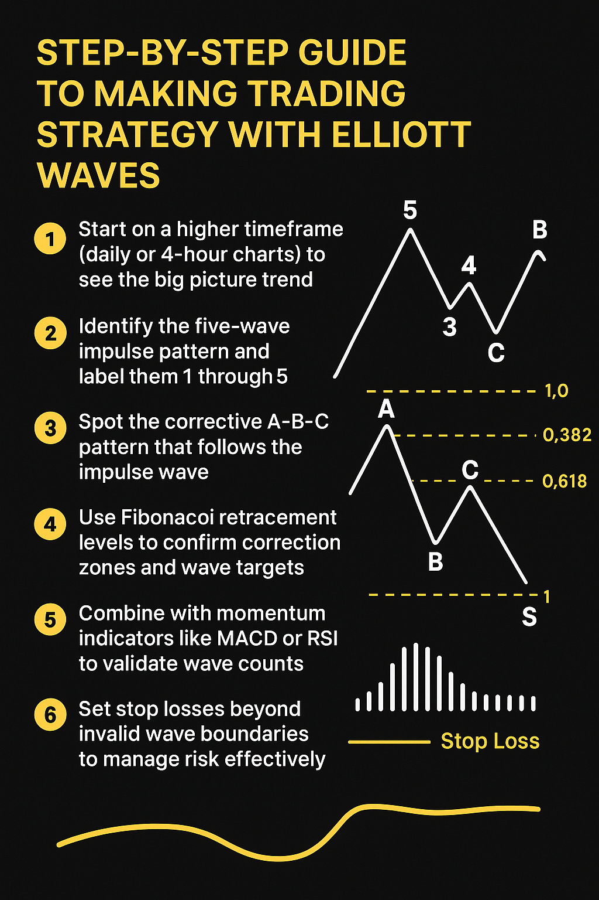

## Что такое волны Эллиотта?

Понимание психологии рынка — это фундамент успешной торговли криптовалютами. Одним из работающих инструментов, на который опираются многие трейдеры, являются паттерны волн Эллиотта.

Это метод, который помогает прогнозировать движение цен, определяя повторяющиеся волновые структуры. В этой статье мы разберём волны Эллиотта в контексте Web3 рынков.

А если вам интересно, как проходит день обычного трейдера и сколько он может заработать за сутки, загляните в [нашу статью](https://www.hashhedge.com/blog/funded-trading-accounts/ru).

## Long Story Short

Теория волн Эллиотта, разработанная Ральфом Нельсоном Эллиоттом в 1930-х годах, — это метод технического анализа, основанный на идее, что рынки движутся в повторяющихся циклах, вызванных коллективной психологией инвесторов. Эти циклы проявляются в виде волн, то есть особых ценовых моделей, которые повторяются с течением времени и на разных масштабах графика.

В криптотрейдинге умение распознавать такие волны помогает заранее предугадывать рост, коррекции и развороты тренда, что даёт стратегическое преимущество.

## Основы: импульсные и коррекционные волны

Волновые паттерны Эллиотта состоят из двух основных типов волн:

- **Импульсные волны** — последовательность из пяти волн, движущихся в направлении основного тренда.
- **Коррекционные волны** — трёхволновая последовательность, направленная против основного тренда, отражающая откат или фазу консолидации.

Эти волны образуют фрактальные структуры, при этом меньшие волны находятся внутри более крупных. Благодаря этому теория Эллиотта универсальна и применима на любых таймфреймах.

## Почему анализ волн Эллиотта эффективен в криптотрейдинге

Рынки криптовалют крайне волатильны, работают 24/7 и подвержены резким колебаниям цен. Волновой анализ помогает трейдерам:

- Определять начало и конец крупных трендов.
- Точнее выбирать точки входа и выхода на основе подсчёта волн.
- Усиливать сигналы, комбинируя волновой анализ с RSI, объёмами и другими индикаторами.

Например, обнаружив третью волну (обычно это сильнейшая импульсная волна), можно зафиксировать значительную прибыль в фазе бычьего рынка.

## Как создать торговую стратегию на основе волн Эллиотта?

1. Начните с анализа старших таймфреймов (дневной или 4-часовой график), чтобы увидеть общую картину.
2. Определите импульсную модель из пяти волн и пронумеруйте их от 1 до 5.
3. Найдите коррекцию A-B-C, которая следует за импульсом.
4. Используйте уровни Фибоначчи для подтверждения зон коррекции и целей по волнам.
5. Добавьте индикаторы импульса, такие как MACD или RSI, для подтверждения подсчёта.
6. Ставьте стоп-лоссы за пределами уровней, чтобы эффективно управлять рисками.

## Частые ошибки новичков при работе с волнами Эллиотта

Многие новички в криптотрейдинге начинают изучать волны Эллиотта, считая, что это быстрый способ точно предсказать цену. На деле подсчёт волн является на 50% наукой, а на 50% удачей. Спешка без подтверждающих сигналов часто приводит к убыткам.

Одна из распространённых ошибок при выборе торговой стратегии — «подгонка» графика под своё мнение. Например, если вы уверены, что Bitcoin вот-вот вырастет, вы можете назвать случайные колебания «третьей волной», игнорируя базовые правила Эллиотта. Это создаёт ложное чувство уверенности и толкает в опасные сделки. Чтобы этого избежать, проверяйте сигналы другими индикаторами.

Ещё одна ошибка — игнорирование таймфреймов. Волны Эллиотта фрактальны, то есть повторяются на разных масштабах. Если смотреть только на 15-минутный график, можно пропустить глобальный тренд, видимый на 4-часовом или дневном. Это часто приводит к входу в сделку прямо перед разворотом. Опытные трейдеры всегда «отдаляют» график, чтобы подтвердить свои расчёты.

И наконец, многие начинающие трейдеры полагаются только на волны Эллиотта, не используя объёмы или другие индикаторы. Хотя теория может указывать на потенциальные точки разворота, комбинирование с RSI, MACD или уровнями Фибоначчи делает анализ значительно точнее.

При этом большинство трейдеров совершают дорогую ошибку — сосредотачиваются только на стратегии, забывая о защите капитала. Подробнее об этом мы рассказали в [статье о безопасности](https://www.hashhedge.com/blog/funded-trading-accounts/ru).

## Преимущества и ограничения анализа волн Эллиотта

### Преимущества:

- Даёт структурированную систему для понимания сложных движений рынка.
- Применим на любых таймфреймах и активах.
- Помогает предугадывать крупные развороты рынка.

### Ограничения:

- Требует практики и опыта для точного подсчёта волн.
- Нет 100% точности.
- Высокая непредсказуемость крипты иногда искажает паттерны.

## Как использовать волны Эллиотта

- **Научитесь видеть паттерны.** Тренируйтесь определять классические формации из пяти импульсных и трёх коррекционных волн. Анализируйте график на разных таймфреймах — старшие для тренда, младшие для точного входа.
- **Понимайте, на каком этапе цикла вы находитесь.** Если импульс из пяти волн подходит к концу, вероятнее всего начнётся трёхволновая коррекция. Успешное позиционирование зависит от понимания места в рыночном цикле.
- **Знайте поведение и правила волн.** Например, волна 2 никогда не откатывается более чем на 100% от волны 1, а волна 4 не должна пересекать ценовую область волны 1. Эти правила помогают определять точки входа, стоп-лоссы и цели.
- **Используйте уровни Фибоначчи.** Ключевые значения (0.382, 0.50, 0.618) помогают находить зоны разворота. Волна 2 часто откатывается на процент от волны 1, а волна 3 обычно удлиняется минимум до 161,8% от волны 1.

## Примеры

- **Пятиволновой импульс + зигзагообразная коррекция.** Классическая модель — сильное движение из пяти волн в направлении тренда, затем резкая трёхволновая (A-B-C) зигзагообразная коррекция. Сигнализирует о продолжении тренда после отката.
- **Пятиволновой импульс + плоская коррекция.** Пять волн роста, за которыми следует боковая коррекция A-B-C, где A и B примерно равны по длине, а C немного выходит за уровень A. Часто встречается перед сильным движением, особенно в четвёртой волне.
- **Двойной зигзаг.** Две последовательные зигзагообразные коррекции, соединённые небольшим встречным движением. Такой паттерн указывает на затяжную коррекцию перед возобновлением тренда и часто «вытряхивает» нетерпеливых трейдеров.

## Стоит ли использовать волны Эллиотта?

Для трейдеров, которые хотят глубже понимать психологию рынка и механику движения цены, теория волн Эллиотта — ценный инструмент. Хотя это не «волшебная палочка», сочетание волнового анализа с управлением рисками и другими методами технического анализа может заметно повысить эффективность торговли.
