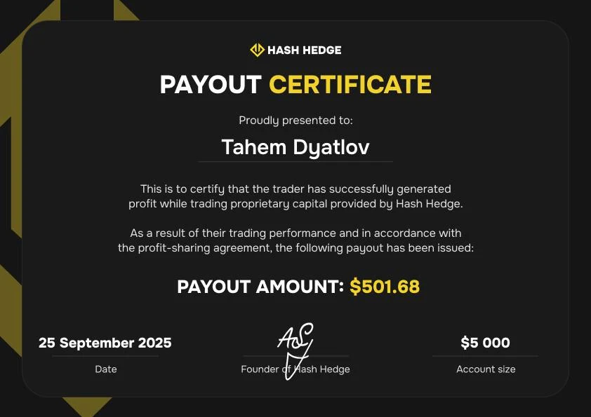
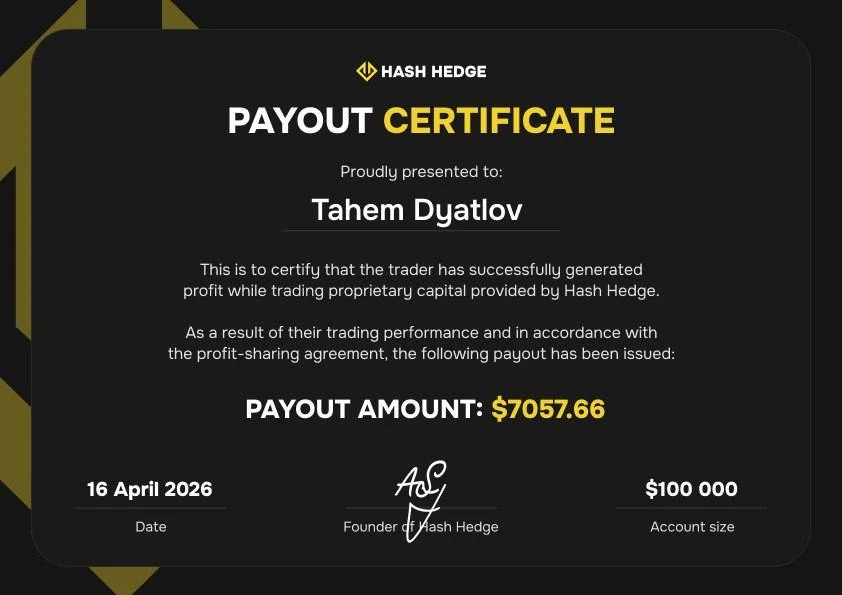

## First Experience in Crypto: Losing $1,000 to a Scam

Timofey's first encounter with crypto wasn't trading — it was a scam.

A stranger contacted him on Telegram and offered what seemed like an easy way to make money: buy a specific cryptocurrency and send it to a wallet address. At the time, Timofey didn't even know what P2P was, how to register on an exchange, or how to buy crypto.

He tested the scheme with $20. Then the scammer told him that to "scale up," he would need around $1,000. Since he didn't have enough money, Timofey borrowed the rest from a friend.

The money disappeared.

Instead of walking away, he made himself a promise:

> "I swore to myself that if I had lost money in crypto, I would earn it back through crypto."

He began studying the market on his own, watching interviews and podcasts with traders. After school, he would go home, watch trading content, and then head to work to repay the money he owed.

## Copy Trading and Liquidating Other People's Funds

Timofey's first trading accounts were small — usually around $100. One day, traders in a community noticed his results and invited him to open his strategy for copy trading.

Normally this required at least $300, but he was allowed to join with less. He believed that large investors would connect to his strategy and trading would become a stable source of income.

It didn't happen. Instead, he increased his [risk](https://hashhedge.com/blog/patience-in-trading-risk-management-discipline) — and eventually liquidated the funds that had been copying him. Everyone disconnected.

That experience became another lesson: good analysis can never compensate for excessive risk.

## Less Than $1 Left on His Card

After a series of losses, Timofey ran out of money completely.

One night, he and his girlfriend were coming home from a concert. Early in the morning they stopped at McDonald's, and when he checked his bank card, there was less than one dollar left.

> "I literally didn't have enough money to buy her lunch. That's when I realized something had to change."

At the same time, Timofey was watching Bitcoin form what he believed was a local bottom around $60,000. His analysis showed a rare, high-conviction setup.

He applied for a credit card. Half of the credit limit went to the exchange. The other half remained untouched so he could continue making minimum monthly payments if the trade failed.

He describes the decision as desperate. During university exams, he didn't have time to find another job. The only thing he could rely on was his trading strategy.

## Trading on a Credit Card: Two Weeks Near Liquidation

Timofey put every dollar from the credit card into a single Bitcoin long position using cross margin. He held the trade for almost two weeks.

At first everything went according to plan. Then headlines about a U.S. attack on Iran hit the market. Bitcoin dropped sharply. His liquidation price came within less than 1%.

Despite the pressure, Timofey stayed in the trade because his original market thesis hadn't changed.

> "According to my strategy, I had to keep holding the long. I held it, and eventually closed the trade for about $2,500."

Trading borrowed money was terrifying. If he lost, he would have to find another job and slowly repay the debt.

> "I simply didn't have another option."

Around that time, Timofey attended an offline interview with a trader who had earned $5,000 through prop trading. That was when he first seriously considered moving away from trading his own capital.

After closing the Bitcoin trade, he used part of the profit to buy his first [Hash Hedge](https://www.hashhedge.com?utm_source=blog&utm_medium=blog&utm_campaign=article) Challenge. The rest stayed in his personal trading account.

## First Hash Hedge Challenges

Timofey started with a $5,000 Challenge. He passed both evaluation stages, received a funded account, and earned his first payout of $501.68.

After withdrawing the money, he bought himself some new clothes. Success boosted his confidence, but also tempted him to change what had already been working.

Instead of waiting for setups on the 15-minute chart, he switched to the 1-minute timeframe to trade more often.

> "Why trade the 15-minute chart when you can trade the 1-minute chart? It sounded logical."

It wasn't. A series of losing trades followed:

— $5K account — failed on the Funded stage

— $10K account — failed on Stage 1

— $5K account — failed on Stage 1

— $5K account — failed on the Funded stage

— $5K account — failed on Stage 2

Looking back, Timofey believes there were two reasons: he didn't fully understand the platform's rules, and his psychology changed after the first payout. He didn't realize that unrealized losses count toward the daily loss limit, and after early success he started increasing position sizes and looking for faster entries.

> "I hadn't fully read the rules. I didn't realize unrealized losses counted toward the daily loss limit. I should have tested the platform first."

Eventually he returned to what had already worked: higher-timeframe analysis and fixed risk per trade.

> "The hourly chart. Fixed risk per trade. That's all I need."

## The $100,000 Challenge

Previously, even $5K and $10K accounts made Timofey nervous. Watching large floating losses caused stress, and during one Challenge he exceeded the maximum overall drawdown.

Over time he became much more comfortable managing larger accounts. By the time he started the $100,000 Challenge, his mindset had completely changed.

> "I thought I'd be terrified and fail. But I wasn't. I passed it and received my payout."

Most of the Challenge was traded from the short side. After completing both evaluation stages, he continued trading on the [funded account](https://hashhedge.com/blog/how-to-pass-crypto-prop-firm-challenge), buying pullbacks while gradually increasing position size. At one point, his open position reached $500,000 with 5x leverage.

> "I wasn't even 19 yet, and I had a half-million-dollar position open. That felt incredible."

He locked in profits and received a payout of $7,057.66.

Together with his earlier payout, Timofey has now withdrawn approximately $7,558 from [Hash Hedge](https://www.hashhedge.com?utm_source=blog&utm_medium=blog&utm_campaign=article). He says earning that amount at his previous job would have taken nearly an entire year. In prop trading, it took about two weeks.

<svg width="602" height="567" viewBox="0 0 602 567" fill="none" xmlns="http://www.w3.org/2000/svg"><path d="M507.435 265.841L300.586 469.72L301.222 566.465L601.846 265.841L336.005 0V370.19L400.602 310.562V161.492L507.435 265.841Z" fill="#FCD535"></path><path d="M94.4666 265.841L300.473 469.72L301.109 566.465L0.0557861 265.841L265.897 0V370.19L201.3 310.562V161.492L94.4666 265.841Z" fill="#FCD535"></path></svg>

Keep up to 90% of your profits on a funded account of up to $150,000

<a class="banner-button" href="https://www.hashhedge.com?utm_source=blog&utm_medium=blog&utm_campaign=article">Start Your Challenge</a>

## How Timofey Finds Trades

Timofey's main rule is simple: trade with the trend. He first analyzes the higher timeframe to determine the market structure. Then he moves to lower [timeframes](https://hashhedge.com/blog/multiple-timeframes) to find an entry.

His Elliott Wave approach is based on:

— Five-wave impulses

— Three-wave corrections

— Fractal market structure across all timeframes

> "Everything is fractal. The patterns you see on the hourly chart are the same ones you'll find on the weekly chart."

He also uses:

- MFI divergences
- Fibonacci levels
- Volume
- Coinglass liquidation heatmaps
- Local highs and lows

Still, he says the chart itself remains his primary source of information. He rarely day trades. If the market structure remains valid, he may hold a position for a week or longer.

## Risk Management Matters More Than Wave Analysis

When asked what made him profitable, Timofey doesn't hesitate.

> "You can use any strategy in the world. Without [risk management](https://hashhedge.com/blog/patience-in-trading-risk-management-discipline), none of them will work."

His example is simple. You risk 0.5% on a trade you're unsure about and it wins. Then you find what looks like a "perfect" setup, increase risk to 2–3%, and lose. Even with a positive win rate, your account can still end up down.

Today, Timofey usually risks around 0.5% per trade. He experimented with 2% risk, but found it much harder to stay emotionally disciplined.

He doesn't force himself to trade every day.

> "I only trade when I see a setup."

His favorite patterns include flat corrections, ending diagonals, and entries after completed impulse waves. If the setup isn't there, he simply waits.

## Advice for Beginner Traders

When asked what he'd tell someone considering repeating his credit-card trade, Timofey admits the situation was extreme. At the same time, he believes mistakes are valuable teachers.

> "Maybe they'll fail. Maybe nothing will work. But life will teach them something."

His real advice is much simpler: be prepared for a long learning process.

> "Risk management, psychology, strategy — it all takes years to learn."

He also stresses that his story should never be viewed as an endorsement of trading borrowed money. His position came within less than 1% of [liquidation](https://hashhedge.com/blog/hidden-cost-of-leverage-crypto-trading). If the market had moved slightly further against him, he would have been left with debt instead of profits.

## Key Takeaways

1. **A credit card is not a trading strategy**

   Timofey himself describes it as a desperate decision. The trade could easily have ended with liquidation and debt.

2. **Understanding prop firm rules is just as important as having a strategy**

   Several of Timofey's early Challenge failures happened simply because he didn't understand how unrealized losses affected the daily loss limit.

3. **Confidence should never determine your risk**

   Strong conviction doesn't guarantee profits. Fixed position sizing matters more.

4. **Fewer trades don't mean smaller profits**

   Today Timofey trades only the clearest setups and often holds positions for days or even weeks.

5. **Success is when discipline matters most**

   After his first payout, he abandoned the strategy that had worked. Only after returning to his original plan, and strict risk management, did he achieve consistent results.
