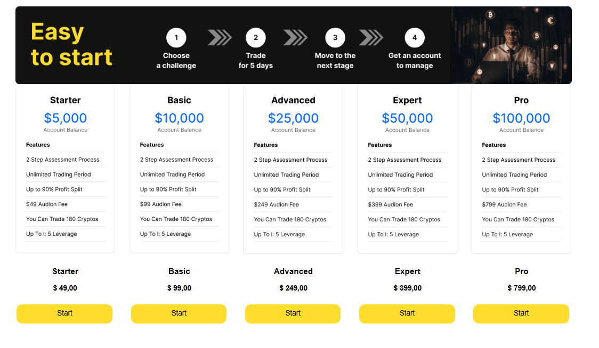

## What Is a Funded Trading Account?

As mentioned, a funded trading account is a setup where a prop firm gives you access to its capital after you demonstrate your skills through a challenge. You only pay a fee to enter, which, in the case of Hash Hedge, starts at as little as $49 and goes up to $799. The first step is the challenge itself—we'll discuss it in detail in the dedicated section below—then, you have the verification process to pass, and finally, your account gets funded.

Here are the pros that go along with it:

- **Profit sharing.** Keep a generous split (often 80%) of all your gains, so your upside grows with your performance.
- **24/7 market access.** Trade dozens of crypto assets around the clock and capture opportunities that traditional markets miss.
- **Scaling.** As you prove that you know how to trade successfully, some companies increase your trading capital, allowing you to expand your account progressively over time.
- **Professional infrastructure.** You're not limited by general assets. Instead, you typically gain access to over 100 Tier-1 assets, analytics tools, and a trustworthy platform.

## Types of Funded Accounts

Funded trading accounts exist across several markets, including stocks, forex, futures, and crypto:

- **Stock accounts** typically follow strict trading hours and regulations.
- **Forex accounts** are popular due to their high liquidity and leverage.
- **Futures-funded accounts** offer access to commodities and indices but often require precise risk management.
- **Crypto-funded accounts** stand out for their 24/7 market access, higher volatility, and fast-moving trends. Meme-coins, altcoins, or newly listed tokens are also available there.

In case of the latter type, you're most likely to come across two funding models:

| Challenge-Based Accounts | Subscription-Based Accounts |
| --- | --- |
| You pay a one-time fee and need to pass an exam, usually by achieving a profit target under strict risk rules. Successful completion grants you access to trading capital. | Instead of one exam, you pay a monthly fee and trade with capital right away. However, you must remain consistent to maintain your access. |

<svg width="602" height="567" viewBox="0 0 602 567" fill="none" xmlns="http://www.w3.org/2000/svg"><path d="M507.435 265.841L300.586 469.72L301.222 566.465L601.846 265.841L336.005 0V370.19L400.602 310.562V161.492L507.435 265.841Z" fill="#FCD535"></path><path d="M94.4666 265.841L300.473 469.72L301.109 566.465L0.0557861 265.841L265.897 0V370.19L201.3 310.562V161.492L94.4666 265.841Z" fill="#FCD535"></path></svg>

Start trading with Hash Hedge today

<a class="banner-button" href="https://app.hashhedge.com/en/register/">Start Challenge</a>

## How to Get a Funded Crypto Account: Step by Step

Getting a funded account in crypto trading normally involves three main steps. First and foremost, you choose a reliable prop firm that offers crypto funding. The market is overflowing with companies promising clear rules, extensive asset choices, and fair conditions, but be careful and always double-check the details.

Next comes the evaluation challenge. You'll be given a few days to demonstrate how skilled you are at trading and whether you can be trusted with the firm's capital. Then there's the verification stage, where your results are manually reviewed and compared against the company's requirements. If you pass, your account will get funded—congratulations, you're now trading real capital and eligible to share profits with the firm.

### Step 1: Choose the Right Prop Firm

The most important factor to consider when looking for funded trading platforms is their track record and reputation. Don't rely solely on reviews presented on the firm's website. Instead, check external sources, analyze the company's operating history, and examine its social presence.

Next, check how the funding process works:

- Are there one, two, or three challenge phases?
- What are the profit targets, time limits, and drawdown rules?

That also applies to fees. You should know exactly what you're paying for, whether it's a one-time challenge fee or additional costs, such as platform access or retake fees if you don't pass.

Choose a firm whose conditions match your trading strategy. If you're a swing trader or like holding positions over the weekend, confirm that the rules allow it. Also, verify which strategies are permitted, as some firms ban news trading, scalping, or the use of bots.

Finally, scrutinize the payout model:

- What's the profit split?
- How and when are payouts issued?

### Step 2: Pass the Evaluation Challenge

This is the part where you demonstrate your consistency. Most funded trading platforms will require you to pass an evaluation challenge before granting you access to capital.

At Hash Hedge, the evaluation is broken into three stages:

1. Challenge
2. Verification
3. Funding

Let's say you choose the Starter package: you'll get a $5,000 virtual account to begin. To pass, you'll need to:

- Hit the target profit (usually 8–10% of your account)
- Stay within the daily loss limit
- Avoid exceeding the max drawdown
- Trade for the required minimum number of days
- Complete everything within the time limit (typically 5 days)

Pass both the challenge and verification, and your trading history will be reviewed. If everything checks out, welcome to the funded stage.

Here's what the Starter package's three stages look like at Hash Hedge:

| | Stage 1: Challenge | Stage 2: Verification | Stage 3: Funding |
| --- | --- | --- | --- |
| Target profit | 8% | 6% | ∞ |
| Max loss per day | 5% | 5% | 5% |
| Max drawdown | 10% | 8% | 8% |
| Min. trading days | 5 | 5 | ∞ |
| Trading period | ∞ | ∞ | ∞ |
| Max leverage | 1:5 | 1:5 | 1:5 |

Hash Hedge's packages range from a $5,000 Starter account up to a $100,000 Pro account, all offering a 2-step assessment process, an unlimited trading period, up to a 90% profit split, and access to trade 180 cryptocurrencies:

| Package | Account Balance | Fee |
| --- | --- | --- |
| Starter | $5,000 | $49 |
| Basic | $10,000 | $99 |
| Advanced | $25,000 | $249 |
| Expert | $50,000 | $399 |
| Pro | $100,000 | $799 |

### Step 3: Trade the Funded Account

Once you pass the evaluation, you're given access to a fully funded trading account. This means you're now trading with real capital, and the pressure shifts from proving yourself to protecting the funds.

At Hash Hedge, you can start with $5,000 or aim for up to $100,000 in funded capital. Trade real markets, keep up to 80% of the profits, and grow as a professional trader.

## Pros and Cons of Funded Crypto Accounts

With someone else's money on hand, the prospect of earning quickly is appealing, especially in a fast-moving market like crypto. But as with any investment strategy, funded crypto accounts come with certain benefits and drawbacks that every trader should be aware of before the outset.

Unlike traditional assets, this market should be monitored around the clock, as it can easily shift direction in seconds and leave traders uncertain about their future moves. Funded accounts work best for those who can balance high-potential setups with steady, rule-based discipline in a volatile environment.

### Advantages

- **Access to significant capital.** Trade with 10 to 100 times more buying power without risking personal savings.
- **Limited personal risk.** Your downside is capped—only the challenge fee is at stake.
- **Professional platforms.** Benefit from low-latency execution, deep liquidity feeds, and advanced charting tools.
- **Generous profit splits.** Keep 80% of your profits if you trade with Hash Hedge, aligning rewards directly with performance.
- **Dedicated support & clear rules.** Receive guidance, transparent risk limits, and no hidden fees.

Verdict: For skilled traders with a proven system, it's a faster path to scaling results and earning payouts.

### Disadvantages & Risks

- **Strict risk rules.** Max drawdowns, time limits, and consistency targets can feel restrictive.
- **High volatility.** Crypto's rapid price swings, especially during news events or periods of low liquidity, can trigger risk limits in seconds.
- **Potential for sudden loss.** One sharp market move can violate rules and result in immediate disqualification.
- **Demanding discipline.** The chances of success hinge not only on skill but also on unwavering emotional control and adherence to strict guidelines.
- **Psychological pressure.** The need to pass evaluations and maintain funding may lead to emotional trading and rushed decisions.

## How to Pass a Crypto-Funded Account Challenge

Passing a crypto evaluation is the key step toward becoming a funded trader. For success, you need to show consistency in a market known for volatility. Begin with a reliable strategy tailored to the fast-paced nature of crypto and its 24/7 schedule. Stick to a clear risk management plan and avoid revenge trading after losses. Use tools that help you stay focused and avoid overtrading.

Remember, the challenge is about demonstrating your ability to handle real capital with professionalism and control.

### Build a Solid Trading Plan

A solid plan means a thought-through strategy and discipline. At first, beginners tend to experience emotional spirals—your goal is to protect yourself from undue excitement. Keep your head cool and set off with a simple rule-based system: no more than 3 trades per day, and walk away after 2 wins or 2 losses.

Your strategy should be built around technical trade analysis and good knowledge of indicators—focus on liquidity areas, order block structures, and market momentum. Once you've found a model that works, wait for your setup and take the trade only when all your conditions align.

### Manage Risk in High-Volatility Markets

Cryptocurrency markets can move rapidly and unpredictably. That's why it's an unconditional necessity to plan your budget as part of risk management. Here are some rules to remember:

- Never use more than 1% of your account per trade, and always set a stop-loss.
- Monitor your daily drawdown to make sure you stay within platform limits. Adjust by giving trades more room and cutting impulsive setups altogether.
- Avoid trading during major news events unless it's part of your plan, and downsize your positions when volatility spikes.
- Use demo accounts to sharpen your system, test your risk rules, and track your consistency before going live.

### Trade Selectively and Avoid Overtrading

Overtrading is one of the fastest ways to fail a funded challenge. Trying to catch every move in the market often leads to poor setups and unnecessary losses. Here's how to stay in control:

- **Prioritize high-quality setups.** Only take trades when your technical and risk criteria fully align. Look for strong confluence, such as momentum shifts, liquidity zones, or clear breakout structures.
- **Set a limit.** Cap your trades per day or week to reduce noise and avoid burnout.
- **Use a checklist.** Before clicking "Buy" or "Sell," confirm that the setup fits your plan and offers a solid risk-reward ratio.
- **Quality > quantity.** A single good trade can outperform five rushed ones.

### Adapt to 24/7 Market Dynamics

With crypto markets, price action can shift dramatically at any hour, day or night, and you have to monitor even the slightest changes in real time. To succeed with a day-funded trading account, plan your schedule based on when your strategy performs best, not just when you're free.

However, because crypto markets are highly volatile and many traders at the beginning of their journey lose money, we strongly advise you against quitting your job to trade. Start small, build your strategy, and only when you begin seeing consistent results, consider significant changes in your life.

Don't let FOMO trick you into late-night decisions—trading can be your passion, but never an obsession. Setting clear boundaries for trading, taking regular breaks, and using alerts or automation when needed will help you gradually hone your skills while preventing burnout and financial losses.

## Essential Tools and Tips for Crypto Funded Traders

A gut feeling and Twitter posts are far from being a legitimate trading strategy. In fact, they're often the reason why millions of traders get discouraged by the market and quit. Understanding what to do, how to build a systematic approach to your day trading routine, as well as surviving volatility comes after painful lessons.

On the upside, crypto prop companies let you avoid massive financial losses since you rely on their capital, not your own. But if you're completely new to the niche and unaware of the essential for success techniques, you'll likely fall short of passing the challenge.

The good news is that the improvement is 100% possible. Tools like alerts, screeners, and position trackers help you stay aligned with your plan. Combining them with a trustworthy platform will make you feel more confident about your decisions.

### Advanced Terminals & Analytics

TradingView is a must-have platform for all traders. There, you can analyze candlestick structure, monitor volume shifts, and fine-tune your trade timing. Custom layouts let you map the market visually and stay two steps ahead.

Some of the most useful tools include:

- **Horizontal volume profile.** Reveals invisible support/resistance zones. Perfect for spotting rejection levels others miss.
- **Daily volume.** Watch daily volume to confirm breakout strength—if it climbs near resistance, a move may be coming.
- **Custom alerts.** Set alerts 2–3% before key levels to give yourself time to prepare.
- **Checklist on the chart.** A 20-item pre-trade filter: trend direction, pullback depth, price behavior. If the boxes aren't ticked, the trade doesn't fly.

Instead of reacting to every candle, build a routine where TradingView notifies you in advance, allowing you to assess conditions with a clear head and act with confidence.

### Keeping a Trading Journal

Another equally important tool to make a habit of is a trading journal. With it, you'll start spotting patterns, track mistakes, and gradually refine your approach. Start with listing entries, exits, trade reasoning, and outcomes.

The most successful traders report that their journal serves as a checklist for them. One insider created a 20-point custom filter right on their chart, asking questions like:

- Am I trading with or against the trend?
- Is the price approaching the level gradually or in a vertical spike?
- Is the entry near a known support/resistance zone or a volume profile wall?
- Do I see signs of accumulation or distribution near the key level?
- Does the candlestick structure show indecision or confirmation?

These checkpoints block impulsive trades and reduce FOMO. Review your journal weekly to improve your system and grow as a funded trader.

### Keeping Up with Market News

In crypto markets, prices can fluctuate by 10% or more within minutes simply due to headlines. Monitoring the news and setting alerts for key assets will help you stay in control in a volatile 24/7 market.

Reliable sources to check daily:

- **CoinDesk.** Industry-standard for breaking news, regulation updates, and institutional moves.
- **The Block.** In-depth research and news on market structure and crypto policy.
- **Decrypt.** Accessible and fast coverage of listings, launches, and controversies.
- **CryptoPanic.** A real-time crypto news aggregator with sentiment filters.
- **CoinMarketCap.** Good for tracking upcoming events, hard forks, token unlocks, and significant launches.

### Trading Bots & Automation

The last tool that can make an actual difference is bots. They come in handy for automating your strategy, handling repetitive tasks, and helping avoid emotional decisions. And after all, trading around the clock without sleep won't get you far.

Here are some major types of bots you need to know about:

- **Rule-based bots** (like 3Commas or WunderTrading) that execute trades based on indicators like RSI or moving averages.
- **Grid bots** (available on platforms like Pionex) that buy low and sell high within a set range.
- **Copy-trading bots** (like Shrimpy or Zignaly) that mirror experienced traders' moves.
- **Smart order routing bots** are primarily used by advanced traders to avoid slippage and spread large orders across markets.

However, please remember that some funded trading platforms restrict bot use to ensure that traders are actively managing their accounts. Always check the prop firm's rules before connecting any bots to your funded account to avoid disqualification.
