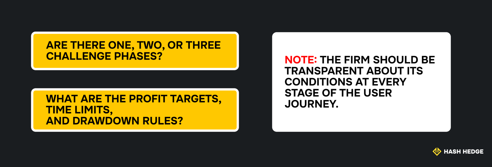
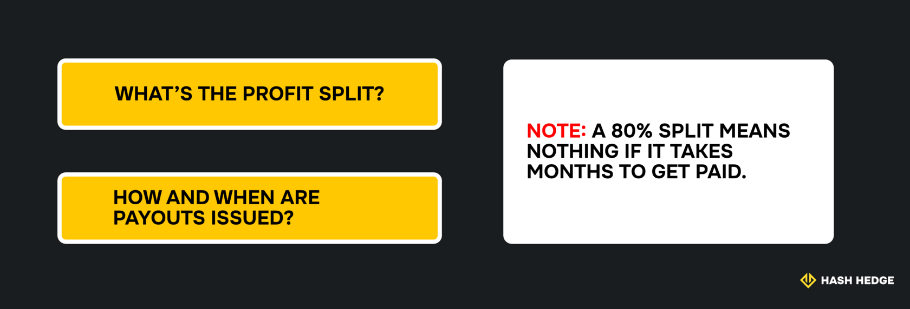
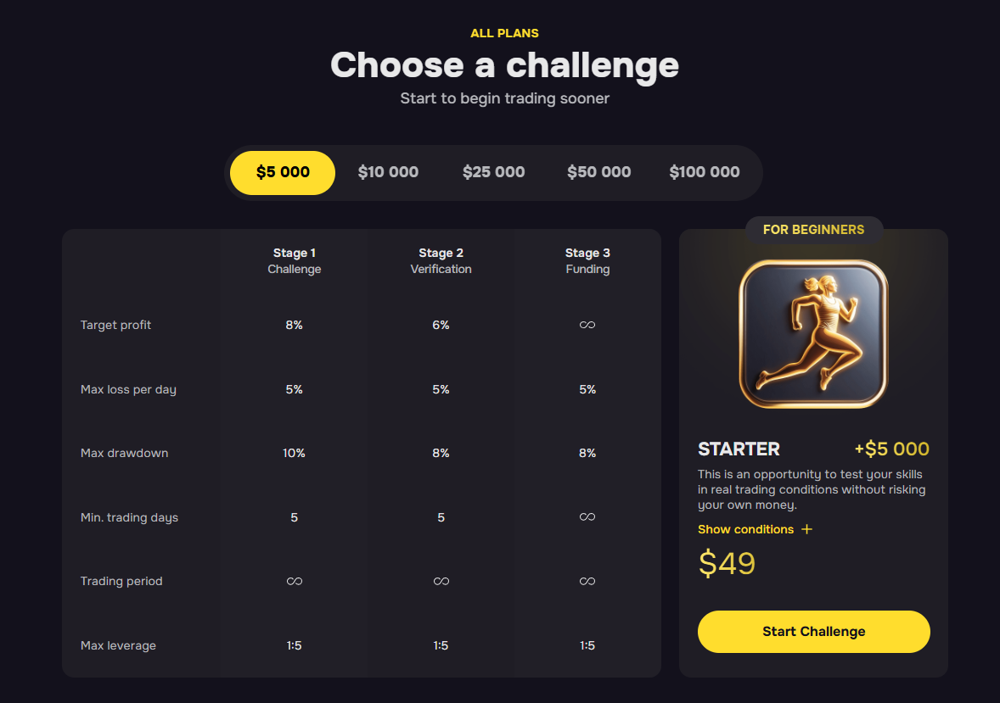

## Что такое финансируемый торговый счёт?

Как уже упоминалось, финансируемый торговый счёт — это формат, при котором проп-компания предоставляет вам доступ к своему капиталу после того, как вы продемонстрируете свои навыки, пройдя челлендж. Вы оплачиваете только вступительный взнос, который, в случае с Hash Hedge, начинается всего с $49 и доходит до $799. Первый шаг — это сам челлендж (мы подробно рассмотрим его в отдельном разделе ниже), затем необходимо пройти процесс верификации, и, наконец, ваш счёт получает финансирование.

Вот основные преимущества:

- **Распределение прибыли.** Вы сохраняете щедрую долю (часто до 80%) от всего заработанного, поэтому ваш доход растёт вместе с результатами торговли.
- **Доступ к рынку 24/7.** Торгуйте десятками криптоактивов круглосуточно и ловите возможности, которых нет на традиционных рынках.
- **Масштабирование.** По мере того как вы подтверждаете свои навыки успешной торговли, некоторые компании увеличивают ваш торговый капитал, позволяя постепенно расширять счёт.
- **Профессиональная инфраструктура.** Вы не ограничены базовыми активами. Обычно предоставляется доступ к более чем 100 активам первого уровня, аналитическим инструментам и надёжной платформе.

См. также: [Легальны ли проп-компании? Как распознать мошенников, прежде чем они распознают вас](https://www.hashhedge.com/blog/are-prop-firms-legit/ru).

## Виды финансируемых счетов

Финансируемые торговые счета существуют в разных рынках: акции, форекс, фьючерсы и криптовалюты:

- **Акции** — обычно подчиняются строгим торговым часам и регуляциям.
- **Форекс** — популярен благодаря высокой ликвидности и кредитному плечу.
- **Фьючерсы** — дают доступ к товарам и индексам, но требуют очень точного риск-менеджмента.
- **Крипто-счета** — выделяются круглосуточным доступом к рынку, высокой волатильностью и стремительными трендами. Также доступны мемкоины, альткоины и только что листингованные токены.

В случае с последним типом, вы, скорее всего, столкнётесь с двумя моделями финансирования:

| Счета на основе челленджа | Счета на основе подписки |
| --- | --- |
| Вы оплачиваете единовременный взнос и должны пройти проверку, обычно достигнув целевого уровня прибыли в рамках строгих правил риск-менеджмента. Успешное прохождение открывает доступ к торговому капиталу. | Вместо одного экзамена вы платите ежемесячную подписку и сразу получаете доступ к капиталу. Однако для сохранения этого доступа вам необходимо показывать стабильные результаты. |

## Как получить финансируемый крипто-счёт: пошагово

Обычно получение финансируемого счёта в криптотрейдинге включает три основных этапа. Сначала — выбор надёжной проп-компании, которая предлагает финансирование в крипте. Рынок переполнен компаниями, обещающими прозрачные правила, широкий выбор активов и честные условия, но будьте внимательны и всегда перепроверяйте детали.

Затем — испытание-челлендж. Вам будет дано несколько дней, чтобы показать свои навыки торговли и доказать, что вам можно доверить капитал компании. После этого — этап верификации, где ваши результаты проверяются вручную и сравниваются с требованиями компании. Если вы проходите, ваш счёт получает финансирование — поздравляем, теперь вы торгуете реальным капиталом и имеете право на распределение прибыли с компанией.

### Шаг 1: Выберите правильную проп-компанию

Самый важный фактор при выборе платформы для финансируемой торговли — это её репутация и история работы. Не полагайтесь только на отзывы на сайте компании. Проверьте внешние источники, проанализируйте опыт её работы и активность в соцсетях.

Далее ознакомьтесь с тем, как работает процесс финансирования:

Это также касается комиссий. Вы должны точно знать, за что платите — разовый взнос за челлендж или дополнительные расходы, такие как плата за доступ к платформе или пересдачу в случае провала.

Выбирайте компанию, чьи условия соответствуют вашей торговой стратегии. Если вы свинг-трейдер или предпочитаете держать позиции на выходных, убедитесь, что правила это разрешают. Также проверьте, какие стратегии допустимы — некоторые фирмы запрещают торговлю на новостях, скальпинг или использование ботов.

Наконец, внимательно изучите модель выплат:

### Шаг 2: Пройдите испытание-челлендж

На этом этапе вы должны продемонстрировать свою стабильность. Большинство платформ для финансируемой торговли требуют прохождения челленджа перед тем, как предоставить доступ к капиталу.

Испытания-челленджи отличаются по размеру капитала и входному взносу.

В Hash Hedge процесс оценки делится на три этапа:

1. Challenge (челлендж)
2. Verification (верификация)
3. Funding (финансирование)

Допустим, вы выбираете пакет Starter: вам предоставляется виртуальный счёт на $5,000 для начала. Чтобы пройти, необходимо:

- достичь целевого уровня прибыли (обычно 8–10% от счёта)
- соблюдать дневной лимит убытков
- не превысить максимальную просадку
- отторговать требуемое минимальное количество дней
- выполнить все условия в установленные сроки (обычно 5 дней)

Обязательно перепроверьте детали каждого пакета на официальном сайте.

Если вы пройдёте и челлендж, и верификацию, ваша торговая история будет рассмотрена. Если всё в порядке — добро пожаловать на финансируемый этап.

### Шаг 3: Торгуйте на финансируемом счёте

После успешного прохождения оценки вы получаете доступ к полностью финансируемому торговому счёту. Это значит, что теперь вы торгуете реальным капиталом, и давление смещается с задачи «доказать свои навыки» на задачу «сохранить и приумножить средства».

### Теперь, когда вы знаете, как получить финансируемый торговый счёт, почему бы не попробовать самому?

В Hash Hedge вы можете начать с $5,000 или стремиться к финансированию до $100,000. Торгуйте на реальном рынке, сохраняйте до 80% прибыли и развивайтесь как профессиональный трейдер. Выберите челлендж, который подходит вашему стилю, и протестируйте свои навыки.

## Плюсы и минусы финансируемых криптосчетов

Когда под рукой чужой капитал, перспектива быстро заработать выглядит привлекательно, особенно в таком динамичном рынке, как крипто. Но, как и у любой инвестиционной стратегии, у финансируемых криптосчетов есть свои преимущества и недостатки, о которых каждый трейдер должен знать заранее.

В отличие от традиционных активов, крипторынок требует круглосуточного наблюдения — направление может измениться за секунды, оставив трейдера в неопределённости. Финансируемые счета лучше всего подходят тем, кто умеет сочетать высокодоходные сетапы с устойчивой, основанной на правилах дисциплиной в условиях волатильности.

### Преимущества

- **Доступ к значительному капиталу.** Торгуйте с покупательной способностью в 10–100 раз больше, не рискуя личными сбережениями.
- **Ограниченный личный риск.** Ваши потери ограничены — на кону только плата за челлендж.
- **Профессиональные платформы.** Получите выгоду от низкой задержки исполнения, глубоких потоков ликвидности и продвинутых инструментов для графиков.
- **Щедрое распределение прибыли.** Сохраняйте 80% от прибыли при торговле с Hash Hedge, напрямую увязывая вознаграждение с результатами.
- **Поддержка и прозрачные правила.** Получайте помощь, понятные лимиты рисков и отсутствие скрытых комиссий.

Вывод: для опытных трейдеров с проверенной системой это более быстрый путь к масштабированию результатов и получению выплат.

### Недостатки и риски

- **Жёсткие правила управления рисками.** Максимальные просадки, временные лимиты и требования по стабильности могут показаться ограничивающими.
- **Высокая волатильность.** Резкие ценовые колебания на крипторынке, особенно во время новостей или при низкой ликвидности, могут за секунды активировать лимиты риска.
- **Возможность внезапных потерь.** Одно резкое движение рынка может нарушить правила и привести к немедленной дисквалификации.
- **Высокие требования к дисциплине.** Шансы на успех зависят не только от навыков, но и от железного эмоционального контроля и строгого соблюдения правил.
- **Психологическое давление.** Необходимость проходить проверки и сохранять финансирование может привести к эмоциональной торговле и поспешным решениям.

## Как пройти челлендж на финансируемый криптосчёт

Прохождение крипто-оценки — ключевой шаг на пути к статусу фондированного трейдера. Для успеха нужно показать стабильность на рынке, известном своей волатильностью. Начните с надёжной стратегии, адаптированной под быстрый темп крипторынка и его круглосуточный график. Придерживайтесь чёткого плана риск-менеджмента и избегайте реванш-трейдинга после убытков. Используйте инструменты, которые помогают сохранять концентрацию и не допускать овертрейдинга.

Помните, челлендж — это проверка вашей способности обращаться с реальным капиталом профессионально и с контролем.

### Постройте чёткий торговый план

Надёжный план подразумевает продуманную стратегию и дисциплину. В начале пути новички часто подвержены эмоциональным всплескам — ваша цель защитить себя от лишнего возбуждения. Сохраняйте спокойствие и начинайте с простой системы правил: не более 3 сделок в день, завершайте торговлю после 2 выигрышей или 2 проигрышей.

Стратегия должна строиться на техническом анализе и грамотном использовании индикаторов — концентрируйтесь на зонах ликвидности, ордер-блоках и рыночном импульсе. Как только найдёте работающую модель — ждите сетапа и входите в сделку только тогда, когда все ваши условия совпадают.

### Управляйте рисками на высоковолатильных рынках

Криптовалютные рынки могут двигаться быстро и непредсказуемо. Именно поэтому планирование бюджета как часть риск-менеджмента — безусловная необходимость. Вот несколько правил, которые стоит помнить:

- Никогда не рискуйте более чем 1% от счёта на сделку и всегда устанавливайте стоп-лосс.
- Контролируйте дневную просадку, чтобы оставаться в пределах лимитов платформы. Корректируйте подход, давая сделкам больше пространства и полностью исключая импульсивные входы.
- Избегайте торговли во время крупных новостей, если это не часть стратегии, и уменьшайте позиции при скачках волатильности.
- Используйте демо-счета, чтобы отточить систему, протестировать риск-правила и проверить стабильность перед выходом в реальную торговлю.

### Торгуйте выборочно и избегайте овертрейдинга

Овертрейдинг — один из самых быстрых способов провалить финансируемый челлендж. Попытки поймать каждое движение рынка обычно приводят к плохим сетапам и ненужным убыткам. Вот как оставаться под контролем:

- **Ставьте в приоритет качественные сетапы.** Входите только тогда, когда технические сигналы и риск-критерии полностью совпадают. Ищите сильное совпадение факторов: смена импульса, зоны ликвидности, чёткие пробойные структуры.
- **Ограничивайте количество сделок.** Установите лимит на день или неделю, чтобы убрать рыночный шум и избежать эмоционального выгорания.
- **Используйте чек-лист.** Перед нажатием «Купить» или «Продать» убедитесь, что сетап соответствует плану и даёт хороший риск/прибыль.
- **Качество > количество.** Одна хорошая сделка может превзойти пять поспешных.

### Адаптируйтесь к динамике рынка 24/7

С крипторынками ценовое движение может резко измениться в любой момент — днём или ночью, и вы должны отслеживать даже малейшие колебания в реальном времени. Чтобы успешно работать с финансируемым торговым счётом, планируйте своё расписание, исходя из того, когда ваша стратегия показывает лучшие результаты, а не просто когда у вас есть свободное время.

Однако, учитывая высокую волатильность крипторынков и то, что многие начинающие трейдеры теряют деньги, мы настоятельно не советуем бросать работу ради трейдинга. Начинайте с малого, оттачивайте стратегию, и только когда начнёте получать стабильные результаты — думайте о серьёзных изменениях в своей жизни.

Не позволяйте FOMO подталкивать вас к ночным необдуманным решениям — трейдинг может быть вашим увлечением, но никогда не должен становиться одержимостью. Установите чёткие границы для торговли, делайте регулярные паузы, используйте уведомления или автоматизацию там, где это необходимо — это поможет постепенно развить навыки и избежать выгорания и финансовых потерь.

## Важные инструменты и советы для трейдеров с финансируемыми счетами

«Чуйка» и посты в Twitter — далеко не торговая стратегия. Более того, именно из-за этого миллионы трейдеров разочаровываются в рынке и уходят. Понимание того, что делать, как выстраивать системный подход к трейдингу, а также умение переживать волатильность приходит только после болезненных уроков.

С положительной стороны, крипто-проп-компании позволяют избежать крупных финансовых потерь, так как вы торгуете их капиталом, а не своим собственным. Но если вы совсем новичок в этой нише и не знаете необходимых для успеха техник, скорее всего, у вас не получится пройти челлендж.

Хорошая новость в том, что улучшение на 100% возможно. Такие инструменты, как сигналы, скринеры и трекеры позиций, помогают вам оставаться в рамках плана. В сочетании с надёжной платформой они придадут вам больше уверенности в ваших решениях.

### Продвинутые терминалы и аналитика

TradingView — обязательная платформа для всех трейдеров. Здесь вы можете анализировать структуру свечей, отслеживать изменения объёмов и точно настраивать момент входа в сделку. Пользовательские макеты позволяют визуально отображать рынок и быть на два шага впереди.

Некоторые из наиболее полезных инструментов:

- **Горизонтальный профиль объёма.** Показывает невидимые зоны поддержки/сопротивления. Идеален для выявления уровней отскока, которые многие пропускают.
- **Дневной объём.** Следите за дневным объёмом, чтобы подтвердить силу пробоя — если объём растёт у сопротивления, движение может начаться.
- **Пользовательские сигналы.** Установите оповещения за 2–3% до ключевых уровней, чтобы иметь время подготовиться.
- **Чек-лист на графике.** 20-пунктовый фильтр перед сделкой: направление тренда, глубина отката, поведение цены. Если пункты не отмечены — сделка не совершается.

Вместо того чтобы реагировать на каждую свечу, выстраивайте рутину, при которой TradingView заранее уведомляет вас, а вы спокойно оцениваете условия и принимаете решения с холодной головой.

### Ведение торгового журнала

Не менее важный инструмент, который стоит превратить в привычку, — это торговый журнал. С его помощью вы начнёте замечать закономерности, отслеживать ошибки и постепенно улучшать свой подход. Начните с записи входов, выходов, причин сделки и её результата.

Самые успешные трейдеры отмечают, что их журнал служит для них чек-листом. Один трейдер даже создал собственный 20-пунктовый фильтр прямо на графике, задавая себе вопросы, например:

- Я торгую по тренду или против него?
- Цена приближается к уровню постепенно или резким вертикальным рывком?
- Вход осуществляется рядом с известной зоной поддержки/сопротивления или стенкой по профилю объёма?
- Вижу ли я признаки аккумуляции или дистрибуции возле ключевого уровня?
- Показывает ли структура свечей неопределённость или подтверждение?

Эти контрольные точки блокируют импульсивные сделки и уменьшают FOMO. Просматривайте свой журнал еженедельно, чтобы улучшать систему и расти как трейдер с фондированным счётом.

### Отслеживание новостей рынка

На крипторынках цены могут колебаться на 10% и более всего за несколько минут только из-за заголовков. Мониторинг новостей и установка оповещений по ключевым активам помогут вам держать ситуацию под контролем в волатильном 24/7 рынке.

Надёжные источники для ежедневной проверки:

- **CoinDesk.** Стандарт индустрии для срочных новостей, обновлений регулирования и институциональной активности.
- **The Block.** Глубокие исследования и новости о структуре рынка и криптополитике.
- **Decrypt.** Доступное и быстрое освещение листингов, запусков и спорных ситуаций.
- **CryptoPanic.** Агрегатор крипто-новостей в реальном времени с фильтрами по настроению.
- **CoinMarketCap.** Подходит для отслеживания предстоящих событий, хардфорков, разблокировок токенов и значимых запусков.

### Торговые боты и автоматизация

Последний инструмент, который действительно может изменить ситуацию — это боты. Они удобны для автоматизации вашей стратегии, выполнения повторяющихся задач и помогают избежать эмоциональных решений. В конце концов, круглосуточная торговля без сна далеко вас не продвинет.

Вот основные типы ботов, о которых стоит знать:

- **Боты на основе правил** (например, 3Commas или WunderTrading), которые совершают сделки на основе индикаторов, таких как RSI или скользящие средние.
- **Грид-боты** (доступные на платформах, таких как Pionex), которые покупают на низком уровне и продают на высоком в заданном диапазоне.
- **Боты для копи-трейдинга** (например, Shrimpy или Zignaly), которые повторяют сделки опытных трейдеров.
- **Боты для интеллектуальной маршрутизации ордеров** в основном используются продвинутыми трейдерами, чтобы избежать проскальзывания и распределять крупные ордера по разным рынкам.

Однако, пожалуйста, помните: некоторые проп-трейдинговые платформы ограничивают использование ботов, чтобы убедиться, что трейдеры активно управляют своими счетами. Всегда проверяйте правила проп-компании перед подключением любых ботов к вашему фондированному аккаунту, чтобы избежать дисквалификации.

См. также: [Что такое хэшрейт? Ваш гид по мощности крипто-майнинга](https://www.hashhedge.com/blog/hashrate/ru).
