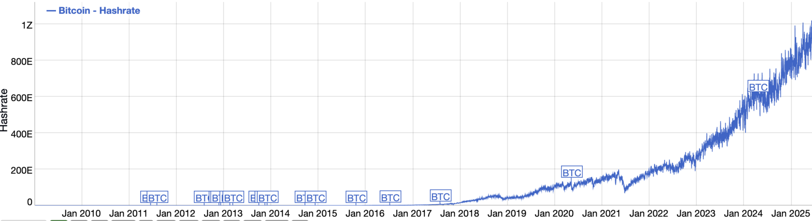

## Понимание хешрейта: основы

Криптовалюты добываются (майнятся) с помощью специализированных графических процессоров (GPU), обладающих высокой вычислительной мощностью. Эти GPU выполняют хеш-операции, то есть решают сложные математические задачи, необходимые для добавления нового блока в блокчейн (например, Bitcoin).

Простыми словами, хешрейт — это то, сколько таких задач может решить майнинговый GPU. Он измеряется в хешах в секунду (H/s). Из-за огромного объёма вычислений, задействованных в блокчейн-операциях, хешрейт измеряется в крупных единицах, вплоть до 1 квинтиллиона хешей в секунду (EH/s) — и да, эта цифра верна.

### Почему важен хешрейт для майнинга Bitcoin и других криптовалют

Хешрейт напрямую влияет на работу блокчейна и прибыльность майнинга токенов в этой сети. Высокий хешрейт означает, что для принудительного захвата контроля над блокчейном потребуется больше вычислительной мощности. Таким образом, чем больше мощности требуется, тем безопаснее блокчейн от атак.

Например, у блокчейна Bitcoin очень высокий хешрейт. Он настолько высок, что одно лицо или группа не могут собрать достаточное количество вычислительных мощностей, чтобы захватить сеть Bitcoin.

Высокий хешрейт повышает конкурентоспособность майнинга в сети блокчейна. Он предоставляет майнерам возможность наращивать вычислительную мощность в сети и зарабатывать больше токенов. При большом количестве майнеров в сети ни одна из сторон не может доминировать — вместо этого майнеры постоянно оптимизируют своё оборудование, чтобы получать награды.

На индивидуальном уровне высокий хешрейт увеличивает шансы получить награду за майнинг. Если ваш GPU обладает высоким хешрейтом, он будет тратить меньше времени на решение сложных задач, которые приносят вознаграждение за блок. Хешрейт является ключевым фактором при выборе оборудования для майнинга.

## Измерение хешрейта: объяснение TH/s, GH/s, EH/s

Вычислительная сложность криптографических хеш-расчётов может быть огромной в зависимости от блокчейна и количества токенов, которые нужно добыть. Это требует использования крупных единиц измерения хешрейта — аналогично тому, как данные (байты) измеряются в килобайтах, мегабайтах, гигабайтах, терабайтах и петабайтах.

Ниже приведены стандартные единицы измерения хешрейта, используемые в индустрии блокчейна:

| Количество хешей в секунду | Название | Обозначение |
| --- | --- | --- |
| 1 хеш в секунду | Хеш/секунда | H/s |
| 1 000 хешей в секунду | КилоХеш/секунда | KH/s |
| 1 миллион хешей в секунду | МегаХеш/секунда | MH/s |
| 1 миллиард хешей в секунду | ГигаХеш/секунда | GH/s |
| 1 триллион хешей в секунду | ТераХеш/секунда | TH/s |
| 1 квадриллион хешей в секунду | ПетаХеш/секунда | PH/s |
| 1 квинтиллион хешей в секунду | ЭксаХеш/секунда | EH/s |

Хороший показатель хешрейта зависит от конкретной криптовалюты, которую майнят. Например, для эффективного майнинга Bitcoin требуются GPU с мощностью от 100 до 250 TH/s. Для блокчейна Ethereum до перехода на протокол proof-of-stake стандартом считался показатель от 60 до 100 MH/s — теперь майнинг токенов Ethereum больше невозможен.

На уровне сети хороший хешрейт также зависит от архитектуры блокчейна и количества майнеров. Не существует точного значения, но его должно быть достаточно для защиты сети от атак 51%, когда группы майнеров, контролирующие более 50% вычислительной мощности сети, пытаются захватить над ней контроль.

На момент написания статьи хешрейт сети Bitcoin составляет более 600 EH/s (600 квинтиллионов хешей в секунду), что делает её очень безопасной. Со временем этот показатель растёт, поскольку к сети подключается всё больше майнеров, добавляющих вычислительные мощности.

## Как хешрейт влияет на прибыльность майнинга

Хешрейт напрямую влияет на прибыльность майнинга. Мощность вашего GPU определяет, сколько вычислительных задач он может решить за определённое время. Чем больше задач решает GPU, тем больше вознаграждений вы можете получить за ограниченный период.

На уровне сети чем выше хешрейт, тем выше конкуренция за майнинг токенов. По мере того как к сети присоединяется больше майнеров, у существующих участников остаётся меньше возможностей для получения наград. Прибыльность снижается, если только вы не модернизируете своё оборудование, чтобы превзойти хешрейт других майнеров, что ведёт к увеличению первоначальных затрат.

Высокий индивидуальный хешрейт увеличивает ваш потенциальный доход. Однако прибыльность также зависит от других факторов, включая стоимость электроэнергии, рыночную цену добываемого токена и затраты на покупку или аренду майнинговых GPU. Вместо инвестиций в постоянно растущие по мощности видеокарты многие трейдеры выбирают альтернативные модели торговли, такие как те, что предлагает Hash Hedge.

## Что определяет ваш хешрейт?

Хешрейт вашего GPU зависит от его внутренних компонентов. Некоторые графические процессоры имеют больше ядер и пропускную способность памяти, что увеличивает их хешрейт по сравнению с другими. Более новые модели GPU обычно отличаются более эффективной конструкцией, что обеспечивает им хешрейт при менее громоздких компонентах.

Майнинговые алгоритмы также влияют на хешрейт — программное обеспечение так же важно, как и аппаратное.

Кажущиеся незначительными факторы, такие как нагрев и охлаждение, могут повлиять на производительность вашего GPU и, следовательно, на его хешрейт. Например, высокие температуры вызывают тепловое троттлинг, временно снижая хешрейт. Правильное охлаждение помогает поддерживать максимально возможный хешрейт.

Если вы заметили резкое падение хешрейта, причиной может быть тепловое троттлинг. Это можно исправить с помощью внешних систем охлаждения, улучшения естественной вентиляции и нанесения термопасты для отвода тепла от чипа GPU. Также можно настроить параметры памяти GPU и снизить тактовые частоты для устранения временных падений хешрейта.

## Эволюция сетевого хешрейта

Хешрейт со временем значительно вырос. В то время, когда криптовалюта была всего лишь хобби, а блокчейн Bitcoin находился в зачаточном состоянии (в 2010 году), его хешрейт составлял всего 7 миллионов хешей в секунду. Для сравнения, сейчас этот показатель превышает 600 квинтиллионов хешей в секунду.

На самых ранних этапах для майнинга значительного количества Биткоинов хватало обычного процессора (CPU). Однако по мере роста популярности криптовалют и увеличения числа майнеров процесс добычи стал значительно сложнее.

В начале 2010-х годов началось использование специализированных графических процессоров (GPU) с более высоким хешрейтом, и с тех пор их распространение только растёт. Современные GPU стали более совершенными, чем когда-либо, и майнеры вовлечены в гонку за повышение хешрейта.

Хешрейт Bitcoin столь высок, потому что это самая популярная криптовалюта в мире, а другие известные цифровые токены также обладают высокими показателями хешрейта. Постоянно растущая сложность майнинга Биткоинов (и других токенов) вынуждает майнеров искать более эффективное и мощное оборудование при минимальных затратах. Гонка сетевых хешрейтов, судя по всему, далека от завершения.

## Хешрейт и безопасность сети

Хешрейт сети блокчейна напрямую связан с её безопасностью. Для любого блокчейна хешрейт представляет собой общую вычислительную мощность всех майнеров в сети. Чем выше эта совокупная мощность, тем ниже вероятность захвата сети злоумышленниками.

В случае гипотетической атаки 51%, при которой группа, контролирующая более 50% вычислительной мощности сети, пытается захватить её, злоумышленники могут цензурировать транзакции других пользователей и отменять свои собственные. Чем выше хешрейт сети, тем сложнее осуществить такой захват.

Теоретически любая сеть может стать жертвой атаки 51%. Однако в случае с Bitcoin злоумышленникам потребовались бы гигаватты электроэнергии и огромные вычислительные мощности, что делает такую атаку практически нереализуемой. Для сравнения: несколько гигаватт электроэнергии достаточно для обеспечения страны с населением 3–5 миллионов человек.

Высокий хешрейт гарантирует стабильное создание новых блоков и предотвращает доминирование отдельных майнеров в процессе. Это обеспечивает более справедливые условия для майнеров и трейдеров в целом.

Готовы выйти за рамки майнинга и перейти к активной торговле криптовалютой? Hash Hedge помогает трейдерам получить доступ к капиталу и торговать 200+ монетами — без необходимости покупки оборудования.
