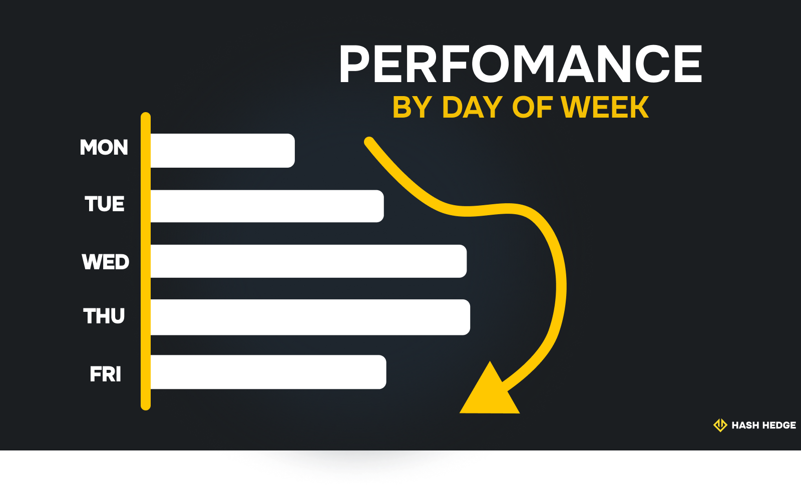
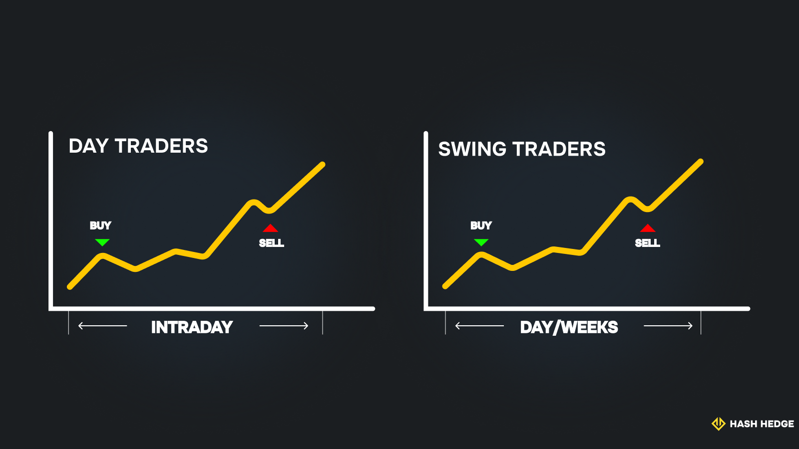

## Чем занимаются дейтрейдеры и как они зарабатывают деньги?

Если вы читаете это руководство, велика вероятность, что вы уже начали свой путь в трейдинге — возможно, с акций и облигаций или с криптовалют. Вы, вероятно, уделяете этому несколько часов в день, постепенно прокладывая дорогу к успеху.

Дейтрейдеры же проводят большую часть своего времени за торговлей — для них это полноценная работа. Почему так? Дело в том, что в отличие от долгосрочных инвесторов, дейтрейдеры сосредоточены на краткосрочных ценовых движениях различных финансовых активов. Они открывают и закрывают позиции внутри дня — часто в течение часов или даже минут. Количество сделок может достигать сотни в день! Именно поэтому им нужно всё время и внимание, чтобы добиться успеха.

### Что делает дейтрейдер?

Ответ на вопрос «Сколько зарабатывают трейдеры?» не так прост. Существует слишком много факторов.

Как уже упоминалось, деятельность дейтрейдера — это не только нажатие кнопок «Купить» и «Продать». Их день начинается со сканирования выбранного рынка, анализа технических графиков, чтения новостей и обновлений. Их стиль торговли непредсказуем: решения принимаются на основе моментума и пробоев уровней.

Важное предупреждение: такой тип торговли крайне стрессовый!

Помимо самой торговли, оставшаяся часть дня у дейтрейдеров обычно занята анализом результатов, корректировкой стратегии и записями в торговый журнал, чтобы отслеживать прогресс. Иными словами, дейтрейдинг — это комбинация технических навыков, скорости и психологической выносливости, которую приходится повторять каждый день.

### Откуда берётся доход в дейтрейдинге?

Хотя мы уже выяснили, что трейдеры зарабатывают на краткосрочных колебаниях цен, структура их дохода куда более сложная. Прибыль редко приходит от одной большой сделки. Обычно она накапливается постепенно — через десятки или даже сотни сделок в день.

Многие трейдеры ориентируются на небольшие процентные прибыли, которые складываются в значительные суммы со временем. Например, грамотно управляемая сделка на $1,000 с доходностью 2% приносит всего $20. Но если повторять это регулярно, результат становится ощутимым.

Профессионалы рекомендуют начинать с малого и рисковать лишь небольшой частью капитала — часто не более 1% на сделку. Если у вас есть $10,000, то практиковаться стоит с $100, сохраняя остальную сумму в защите.

## Сколько зарабатывают дейтрейдеры?

Самое привлекательное в дейтрейдинге то, что формально нет жёстких ограничений на доход. Всё зависит от навыков, стартового капитала, платформы и, конечно, удачи. Однако важно понимать: космическая прибыль — редкость. Люди, которые зарабатывают миллионы в день, как правило, имеют многолетний опыт, огромный капитал и работают в благоприятных рыночных условиях.

По отраслевым данным, ежемесячная доходность 1–4% уже считается хорошим результатом.

### Средний доход и зарплата дейтрейдера по опыту

Оценки доходов сильно разнятся.

- ZipRecruiter указывает средний годовой доход около $94,000.
- Zippia — примерно $116,000.
- Glassdoor даёт ещё выше — $178,000.

Но важно понимать, чего не видно за этими цифрами. Академические исследования (например, Брэда Барбера и Терренса Одина) показывают, что лишь очень маленькая часть дейтрейдеров стабильно зарабатывает прибыль. Большинство либо уступают рынку, либо вообще теряют деньги.

Например, исследование 2020 года среди 20,000 бразильских трейдеров показало, что только 1% зарабатывали выше минимальной зарплаты, а большинство со временем не улучшали результаты.

Поэтому шестизначные доходы действительно существуют, но, как правило, у очень опытных трейдеров с доступом к специализированным инструментам и капиталу. Большинство новичков начинают с убытков, а к стабильной прибыли приходят лишь после долгого обучения.

### Разбивка доходов: ежедневно, ежемесячно и ежегодно

Итак, сколько же зарабатывают дейтрейдеры в месяц? Всё зависит от множества переменных: размера капитала, уровня риска, процента выигрышных сделок и рыночных условий. Исследования показывают, что более 90% дейтрейдеров теряют деньги, но те, кто выходит в плюс, обычно наращивают прибыль постепенно. Примерные оценки выглядят так:

| Уровень опыта | Ежедневный доход | Ежемесячный доход | Годовой доход |
| --- | --- | --- | --- |
| Новичок | $20–$100 | $400–$2,000 | до $24,000 |
| Средний уровень | $100–$500 | $2,000–$10,000 | до $120,000 |
| Эксперт | $500+ | $10,000+ | $150,000+ |

Эти цифры не гарантированы — это лишь примерные диапазоны, встречающиеся в профилях реальных трейдеров и отчётах проп-фирм.

### Реалистичные ожидания прибыли

Забудьте о мечте превратить $100 в миллион за одну ночь. В реальности большинство успешных трейдеров ориентируются на рост 1–4% в месяц, что соответствует 12–50% в год. По сравнению с традиционными инвестициями это впечатляюще. Но это не лёгкий способ приумножить доход.

Есть ещё один важный фактор — платформенные комиссии, налоги, проскальзывания и просадки. Из-за этого ваша цель «4% в месяц» превращается в тест на выносливость. Именно поэтому большинство экспертов подчёркивают: сначала сохраняй капитал, потом приумножай.

Фандинговые программы вроде Hash Hedge предоставляют трейдерам доступ к капиталу до $100,000 с удержанием 80% прибыли и более чем 200 криптоактивами. Но даже с такими возможностями истина остаётся прежней: без структуры, дисциплины и терпения не будет стабильной прибыли.

### Примеры сценариев дохода

Новичок может начать с капитала $1,000 и совершать 1–2 сделки в день с микро-лотами. На этом этапе цель — не прибыль, а развитие навыков. Ежемесячный доход может составить $100–$200, при условии стабильного прогресса и минимальных убытков.

Частичный трейдер (part-time) работает с депозитом $5,000. При уверенности и проверенной системе он может зарабатывать $20–$50 в день, или примерно $500–$1,000 в месяц, если сохраняет дисциплину и соблюдает правила риска.

Профессионалы на фулл-тайм могут значительно масштабировать доход. Например, трейдер замечает, что акция растёт после сильного отчёта. Он покупает 500 акций по $50, планируя быстро продать по $51. Когда цена доходит до $50.75, он фиксирует прибыль $375 до того, как импульс угасает. Повторяя это несколько раз в неделю, можно выйти на стабильный доход.

## От чего зависит доход дейтрейдера?

Технически, у дейтрейдеров нет фиксированной зарплаты. Их доход полностью зависит от результатов, а именно от того, насколько стабильно они могут генерировать прибыль и избегать крупных убытков. Поэтому термин «зарплата» в дейтрейдинге всегда условный и переменный.

Несколько ключевых факторов влияют на то, сколько может зарабатывать дейтрейдер: размер капитала, склонность к риску, торговая система, эмоциональная дисциплина, технологии и даже часы, в которые трейдер торгует. Оптимизация этих переменных часто отличает стабильных трейдеров от тех, кто застрял в цикле взлётов и падений. Давайте рассмотрим эти факторы.

### Капитал, кредитное плечо и риск

Стартовый капитал задаёт потолок для размера сделок и процент успеха. По правилам Pattern Day Trader (PDT) в США, трейдеру нужно минимум $25,000 на маржинальном счёте, чтобы торговать акциями без ограничений. В других странах требования мягче. Но помните: чем больше капитал, тем выше гибкость, и вы можете правильно рассчитывать размер позиции, не подвергая себя чрезмерному риску.

Кредитное плечо усиливает как прибыль, так и убытки — это «обоюдоострый меч». Если использовать его с точностью и строгим контролем рисков (стоп-лоссы, дневной лимит убытков), оно увеличивает доходность. Но без дисциплины плечо лишь ускоряет слив депозита. Профессионалы обычно рискуют не более 1% капитала на сделку и принимают убытки как часть процесса.

### Стратегия и рыночные условия

Стратегия — это основа вашего дохода. Торговля по импульсу, скальпинг, входы на пробоях — всё это работает, если подкреплено заранее прописанными правилами входа/выхода, лимитами риска и частотой сделок. Многие успешные трейдеры полагаются на технические индикаторы, анализ объёмов и свечные модели для точных входов.

Но даже лучшая стратегия зависит от состояния рынка. Важны ликвидность и волатильность. Торговля ликвидными активами вроде BTC, ETH, AAPL помогает избегать проскальзываний и обеспечивает лучшее исполнение.

Следите за новостями, квартальными отчётами компаний и открытиями мировых рынков — они часто создают резкие, но краткосрочные возможности.

### Торговые часы и психология

Росс Камерон, дейтрейдер, превративший счёт $583 в $10 млн (подтверждённых и проверенных), утверждает, что наиболее прибыльное время — с 8:00 до 10:00 утра по восточному времени (ET). Это связано с открытием рынка и высокой волатильностью. Но вместе с этим растут и риски. Если у вас хватает знаний и опыта для таких быстрых торговых сессий — пробуйте.

Ещё одно «золотое время», так называемый power hour, — между 15:00 и 16:00 EST.

Дни недели:

- Среда и четверг — наиболее предсказуемые, так как рынок к этому моменту стабилизируется.
- Понедельник — лучше начинать осторожно и «прощупывать почву» после выходных.
- Пятница — Росс советует фиксировать прибыль и избегать лишних рисков.

Психология важна не меньше, чем тайминг. Многие трейдеры терпят неудачу, потому что позволяют страху, жадности или разочарованию управлять своими решениями. Реванш-трейдинг или сделки «от скуки» — это психологические ловушки. Успешные трейдеры — те, кто умеет управлять эмоциями и знает, когда остановиться на день.

### Профессионалы против розничных трейдеров

Ответ на вопрос «Сколько зарабатывают успешные трейдеры?» зависит от типа их занятости. Институциональные трейдеры могут зарабатывать шестизначные или даже семизначные суммы в год благодаря крупным позициям, продвинутым инструментам и внутренним исследованиям.

Розничные трейдеры, напротив, полагаются на собственный капитал или финансирование от проп-фирм. Кто-то не зарабатывает вообще, кто-то получает несколько тысяч долларов в месяц, а небольшая группа с проверенными системами выходит на доход уровня полной занятости.

## Виды дейтрейдеров и их заработок

Не все дейтрейдеры работают одинаково. Одни торгуют самостоятельно на свои сбережения или капитал проп-компании. Другие работают профессионально в хедж-фондах или институтах.

Самые распространённые категории трейдеров по потенциальному доходу: трейдеры на событиях (event-driven) следят за новостями и событиями, алготрейдеры используют алгоритмы, скальперы делают сотни сделок в день, ловя микро-движения. Также есть свинг-трейдеры, трейдеры по настроениям рынка, контртрендовые трейдеры и моментум-трейдеры. У каждой группы свои методы, требования к навыкам и потенциал доходности.

### Фул-тайм против парт-тайм

Фул-тайм трейдеры относятся к торговле как к карьере: они не пропускают дни, следят за несколькими рынками и посвящают часы исследованиям и исполнению сделок. Если у них есть стабильность, средние и профи могут зарабатывать от $2,000 до $10,000 в месяц. Парт-тайм трейдеры обычно стремятся к дополнительному доходу, совмещая торговлю с работой или личным графиком.

### Акции vs Крипта vs Фьючерсы

Сколько зарабатывают трейдеры на акциях, во многом зависит от волатильности и объёмов. Акции предлагают структуру и регулирование, но ограничены торговыми часами. Криптовалюты работают 24/7, отличаются большей волатильностью и дают высокий краткосрочный потенциал, но при этом риск также выше. Фьючерсы привлекают тех, кто ищет плечо и доступ к индексам или товарам. Каждый класс активов имеет свои риски и потенциал дохода.

## Дейтрейдинг vs. другие карьеры в трейдинге

Дейтрейдинг требует полной концентрации и высокой толерантности к риску. Прибыль может прийти быстро, но так же быстро могут прийти и убытки. Более долгосрочные карьеры в трейдинге, такие как свинг-трейдинг, управление портфелем или институциональные роли, имеют другую динамику. Эти пути требуют большего терпения, исследований и более широкого анализа рынка. Они не обещают быстрой прибыли, но доход там обычно более стабильный и привязан к результатам за недели или кварталы, а не за часы.

В конечном итоге «лучший» путь зависит от ваших целей, времени и личных качеств.

### Свинг- и долгосрочные трейдеры

Свинг-трейдеры держат позиции от нескольких дней до недель, чтобы поймать среднесрочные движения рынка. Долгосрочные трейдеры могут держать позиции месяцами или годами, полагаясь на технический анализ и глобальные тренды, а не на краткосрочные колебания цен. Их доход, как правило, более стабильный, но требует больше времени, чтобы его реализовать.

### Сколько зарабатывают другие трейдеры?

За пределами ритейл- и проп-трейдинга, полноценные роли в финансах приносят более высокий доход, часто с бонусами за результативность.

- Инвестиционные трейдеры в банках обычно зарабатывают $80,000–$150,000 в год, с существенными бонусами по итогам года, зависящими от результатов их команды.
- Аналитики и портфельные менеджеры в хедж-фондах обычно начинают с $120,000–$200,000, а старшие специалисты зарабатывают значительно больше — в зависимости от объёма активов под управлением и способности генерировать альфу.
- Проп-трейдеры в фирменных структурах могут зарабатывать от $0 (если торгуют в убыток) до шести или даже семи цифр, в зависимости от модели фирмы, кредитного плеча и структуры выплат.
- Алгоритмические и количественные трейдеры также высоко востребованы, часто получая более высокие зарплаты из-за необходимости владеть техническими и математическими навыками.

## Как увеличить доход в дейтрейдинге

Дейтрейдинг — это игра в долгую, где решают последовательность и стабильный рост. Рыночные условия всегда будут влиять, но гораздо важнее — ваши привычки и техника. Если вы хотите увеличить доход как трейдер, сфокусируйтесь на том, что контролируете: точки входа и выхода, уровень риска, психологию и используемые инструменты.

### Управление риском/прибылью

Один из самых эффективных способов увеличить доход в дейтрейдинге — применять строгие правила риск/ревард. Всё начинается с установки стоп-лоссов. Они служат аварийным тормозом, ограничивая эмоциональные решения, когда сделка идёт против вас. В сочетании с правильным размером позиции — не рискуйте более чем 1–2% капитала в одной сделке.

Держитесь только тех сделок, где соотношение риск/прибыль составляет не меньше 1:2 или 1:3. Даже при винрейте 40–50% такая модель эффективно контролирует убытки и позволяет прибыльным сделкам расти. Со временем такая структура превращает средние сетапы в стабильный профит.

### Оптимизация объёмов и сетапов

Высокие объёмы означают лучшие точки входа и более быстрые выходы — это ключ к исполнению сделок по нужной цене. Опытные трейдеры, такие как Росс Кэмерон, рекомендуют фокусироваться на активах с дневным объёмом торгов не менее 25 миллионов акций. Такой объём обеспечивает сетапам гибкость и надёжность для быстрой реакции. Но сам по себе объём недостаточен — также нужны сделки с высокой вероятностью успеха, которые соответствуют вашей стратегии и толерантности к риску.

### Инструменты, наставничество и образование

Одна из самых эффективных привычек — ведение трейдинг-журнала. Записывайте каждую сделку — входы, выходы, причины, результат и даже эмоции. Это помогает выявлять закономерности и устранять ошибки.

Кроме того, отслеживайте винрейт, среднее соотношение риск/прибыль и просадки — это даст вам ясное понимание, что работает, а что нет. Но всё это не имеет смысла, если вы используете устаревшие платформы. Профессиональное ПО с низкой задержкой исполнения и расширенными графиками — необходимость, особенно когда секунды могут стоить тысячи долларов.

Самообучение важно, но наставничество может значительно ускорить прогресс. Обучение у опытных трейдеров через фонды, онлайн-сообщества или образовательные платформы экономит месяцы и даже годы.

Hash Hedge предоставляет доступ к более чем 200 Tier-1 криптоактивам, масштабирование аккаунтов на основе результатов и встроенные аналитические инструменты. Наши программы финансирования созданы для серьёзных трейдеров, готовых расти.

Зарегистрируйтесь на Challenge и торгуйте с капиталом до $100,000.
