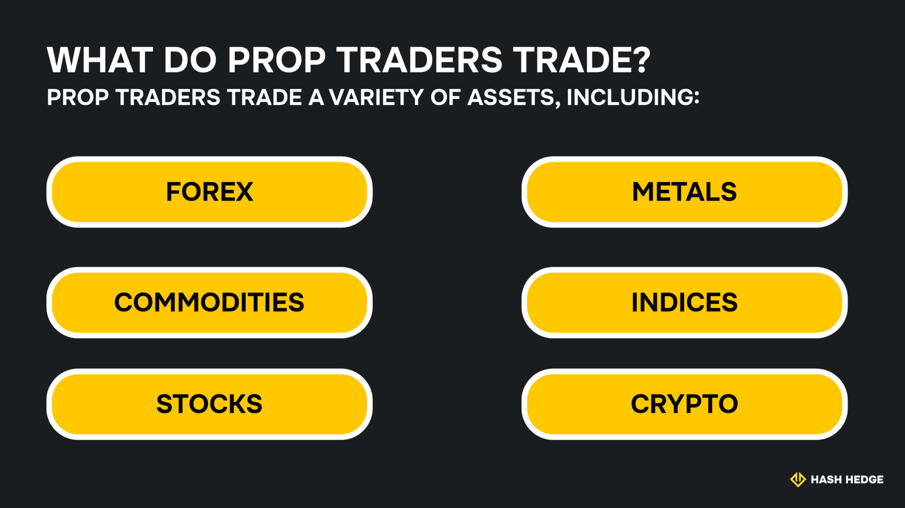

## What is proprietary trading?

Prop trading involves trading with another firm's capital and sharing the profits. Traders work with an external prop trading firm that provides capital and access to advanced trading tools. If their trading strategies make profits, the profit is split between the traders and the prop firm.

Profit-sharing arrangements depend on specific agreements between traders and prop firms, but traders usually keep the majority. Prop trading unlocks access to capital and tools that traders struggle to get on their own. It lets traders harness their skills and earn profits without risking excessive personal capital.

## Prop trading vs. Trading with own capital

Prop trading gives traders access to substantial capital. Hence, they can potentially make higher profits compared to trading with personal funds. Traders also benefit from access to technical analysis tools that help them formulate more effective strategies.

A drawback is that prop trading platforms usually have strict risk management rules, which some traders may be uncomfortable with. Some traders also aren't comfortable with splitting profits with another firm.

Trading with personal capital puts financial risks solely on the trader. If traders win, they retain all the profits. However, if they lose, they personally bear the losses. Choosing between proprietary and personal trading is a balance between risk and profitability.

<svg width="602" height="567" viewBox="0 0 602 567" fill="none" xmlns="http://www.w3.org/2000/svg"><path d="M507.435 265.841L300.586 469.72L301.222 566.465L601.846 265.841L336.005 0V370.19L400.602 310.562V161.492L507.435 265.841Z" fill="#FCD535"></path><path d="M94.4666 265.841L300.473 469.72L301.109 566.465L0.0557861 265.841L265.897 0V370.19L201.3 310.562V161.492L94.4666 265.841Z" fill="#FCD535"></path></svg>

Start trading with Hash Hedge today

<a class="banner-button" href="https://app.hashhedge.com/en/register/">Start Challenge</a>

## What do prop traders trade?

Prop traders trade a variety of assets, including:

### Forex

Foreign exchange (forex) presents numerous profit-making opportunities for prop traders, as currency pairs fluctuate in response to economic and geopolitical factors.

For example, the recent U.S. tariff announcements temporarily boosted the U.S. dollar but dampened the values of export-dependent currencies. Prop traders monitor economic and geopolitical trends to identify profitable forex opportunities.

### Commodities

Commodities like oil, gold, copper, and sugar have volatile prices. They can rise or fall sharply in response to global economic conditions, presenting opportunities for prop traders to profit from this volatility.

For example, recent economic headwinds have driven many investors to buy gold as a safe haven, driving its price to record highs. Some traders who spotted this trend early made sizable profits.

### Indices

Indices are collections of assets that are used as trading benchmarks, such as the S&P 500 equities index and the Dow Jones Industrial Average. They enable prop traders to gain broad market exposure with a few trades.

These indices' movements tend to follow broader market trends, enabling traders to earn profits under favorable economic conditions. Traders can also short-sell these indices and profit if their value declines.

### Stocks

Prop traders often trade the shares of publicly quoted companies. These shares have high liquidity and can be volatile, enabling traders to profit from sharp market swings.

For example, if a company releases a positive quarterly report, its share price can rise significantly and give traders short-term profits. If the company releases an unfavorable negative report, its shares can fall sharply and earn short-sellers ample profits.

### Crypto

Cryptocurrencies have high liquidity and the highest volatility among mainstream financial assets. These range from mainstream cryptocurrencies like BTC and ETH to memecoins like DOGE and SHIBA. Over $200 billion of cryptocurrencies exchange hands daily, highlighting the massive opportunities within this market.

Digital assets experience more rapid swings than other assets– double-digit percentage increases or reductions within a day aren't uncommon. Prop traders evaluate trends to predict and potentially profit from price swings in the cryptocurrency market.

## How does prop firm funding work?

Prop firms have made it easier to access trading capital and become a successful trader. Traders typically pay a one-time fee and undergo an evaluation to prove their trustworthiness with live capital.

At Hash Hedge, traders are given an initial evaluation challenge with profit targets and trading rules in place. If you meet these targets while complying with the rules, you can proceed to the verification stage, which is another demo challenge with profit targets and rules. Passing the verification stage takes you to the funding stage, where you can begin trading while adhering to the rules. You'll keep 80% of the profits in this stage, while we retain the rest, a win-win!

## Requirements to become a prop trader

Prop trading firms have specific requirements for traders, including skills and educational attainments, depending on the firm and the level of capital involved. Let's dive deeper into them below.

### Skills needed

Prop traders need strong analytical skills to evaluate market trends and identify unique opportunities. Quick decision-making based on technical analysis is a core requirement for a prop trader.

You need to be familiar with trading platforms and related tools, such as stock screeners and research platforms. If you're into quantitative trading, you'll need advanced programming knowledge.

Likewise, prop traders need mental fortitude. The markets often act unpredictably, so staying calm under pressure and managing risk without emotion are essential for successful prop trading.

### Education, courses, or licenses

Prop trading platforms usually don't have strict educational requirements like a bachelor's or master's degree. Skills matter more than degrees in prop trading, and you can qualify without a professional finance background.

## Step-by-step guide to becoming a prop trader

If you're wondering how to get into prop trading, look no further. Below is your step-by-step guide to becoming a professional prop trader:

### 1. Learn the basics of trading

As with many things, learning how to become a proprietary trader begins with the basics. Learn how to manage asset positions, place orders, and navigate your provided trading platform with confidence. Refine your risk management calculations and stay informed about market trends.

You need to develop emotional control to handle the raging, volatile world of trading. You should be able to stick to your plan despite short-term fluctuations, yet know when to quit without engaging in revenge trading.

### 2. Choose your market and strategy

After learning the basics, the next step is choosing your niche as a professional prop trader. It's advisable to focus on one market, such as forex and commodities, and build expertise over time. Starting with a single niche reduces your learning curve and increases your chances of making profits.

### 3. Pick the right prop trading firm

You should conduct extensive research to choose a prop trading platform. Seek thorough information about the platform's profit-sharing arrangements, funding programs, evaluation process, and risk management rules, ensuring they align with your requirements.

Fortunately, numerous prop trading platforms exist, and you can always find one that suits your needs.

### 4. Prepare for and take the evaluation

Prepare for the evaluation test given by your prop trading platform. Most platforms clearly state what they evaluate about potential traders, so use it as a guideline to boost your outcomes.

It's advisable to focus on consistent profits rather than one-off spectacular gains during evaluation. Ensure you comply with the trading rules, such as maximum daily loss and drawdown limits.

### 5. Get funded and start trading

If you pass the evaluation, you'll proceed to the funding stage to begin trading. Preparation and discipline are the keys when trading assets with real capital.

Have a clear strategy and adhere to it, even when the markets become tough. Take breaks if you're getting emotional and avoid chasing losses endlessly– prop firms monitor your drawdown rates.

### Scale up and stay consistent

To repeat an earlier point, focus on consistency instead of one-off gains. You wouldn't win all the time– some trades will incur losses. However, the plan is to generate sufficient profits from other trades to offset the losses.

You can increase your capital over time as you become more comfortable with risks. Yet, manage risk wisely and avoid losing money frequently. The idea is to make more winning trades than losing ones and enjoy consistent profits.

## Prop trading firm vs. Personal trading

Prop and personal trading have their respective advantages and disadvantages. There's no single better choice. Instead, it depends on your preferences, risk tolerance, and capital needs. Let's dive into these pros and cons below:

### Benefits of using a prop firm's capital

A prop firm gives you leverage and reduces your personal risk. You can access significantly more money than you have in your capacity and amplify your potential profits. You'll split profits with the prop firm but retain most of it.

Prop firms offer more than just capital. They give you access to expensive trading tools that you might not be able to afford as an individual trader. Likewise, they provide support and expert guidance to help you develop effective trading strategies.

### Risks and limitations

Prop trading firms impose limits on the strategies traders can adopt. They also specify the risk level that traders must adhere to. These rules can be restrictive, but they're expected from a prop firm risking its capital on third-party traders.

The good thing is that prop firms have varying risk and strategy limits. You can find one that aligns with your requirements, then trade seamlessly.

## How much do prop traders make?

There's no exact range that prop traders make. It depends on their skill level, experience, and access to capital. Prop traders can make anywhere from a few thousand dollars to hundreds of thousands or a few million.

However, trading isn't a get-rich-quick activity. Becoming a successful prop trader requires time, discipline, and patience. There's significant upside, but you need a well-thought-out strategy and market timing to earn big bucks.

## Legal and regulatory considerations

Prop trading firms have light regulations, given that they trade with their own capital. Yet, they adhere to standard trading laws, including Know Your Customer (KYC) verification for traders. Prop trading platforms ask for valid identification documents before you trade with them.

As mentioned, you should conduct thorough research before selecting a prop firm. Ensure that any prop firm you work with is a registered business with a good track record. Read reviews and articles to see what other prop traders say about them.

## Why do prop traders choose Hash Hedge?

Hash Hedge offers many benefits for prop traders. You can trade over 200 crypto assets on our platform, unlike many platforms that offer just a few mainstream cryptocurrencies. Our traders pay low fees and keep 80% of their profits.

24/7 support is available for Hash Hedge traders to optimize their trading strategies. Hash Hedge has worked with thousands of professional traders and paid out over $11 million in profits. Hash Hedge has a solid reputation among prop traders worldwide.

Trading accounts range from $5,000 to $100,000, depending on your experience and risk tolerance. You can register on Hash Hedge, complete the evaluation, and start trading soon if qualified.
