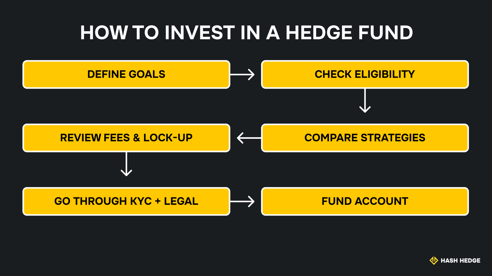
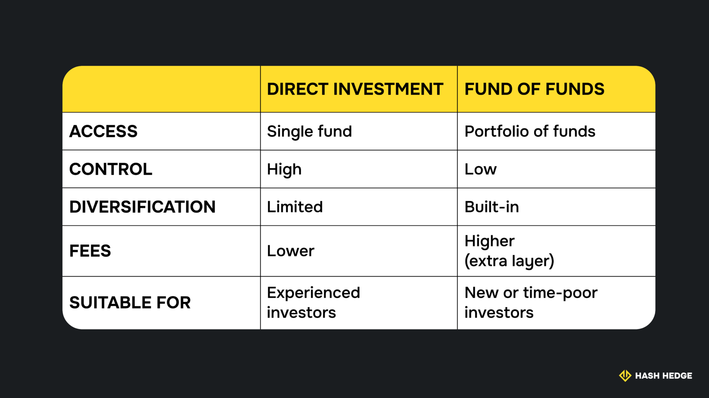

## Что такое хедж-фонд?

Хедж-фонд — это тип инвестиционного фонда, который нацелен на абсолютную доходность, то есть он создан для того, чтобы зарабатывать при любых рыночных условиях, а не только тогда, когда цены растут. В отличие от паевых инвестиционных фондов, которые ориентируются на индексы, хедж-фонды не следуют индексам или бенчмаркам. Они активно ищут возможности для роста капитала вне зависимости от того, бычий рынок, медвежий или боковой тренд.

В криптовалютной сфере хедж-фонды работают аналогично своим традиционным коллегам, но используют более широкий спектр стратегий. Одни ориентируются на краткосрочную торговлю, применяя боты, количественные модели или ручные настройки для ловли волатильности. Другие строят долгосрочные позиции, основываясь на фундаментальном анализе проектов. Многие комбинируют оба подхода.

Люди, стоящие за такими фондами, как правило, — это опытные трейдеры, кванты или управляющие фондами. У них есть системы, отработанные процессы и контроль рисков. Стоит отметить, что, хотя цель — абсолютная доходность, успех не гарантирован. Хедж-фонды могут и действительно теряют деньги, особенно если их стратегии дают сбой. Именно поэтому так важно тщательно изучить фонд, прежде чем инвестировать в него.

> Краткое замечание: Хедж-фонды часто путают с проп-трейдинговыми компаниями, но это не одно и то же. Проп-компании торгуют на собственный капитал (или делят прибыль с трейдерами), тогда как хедж-фонды управляют деньгами инвесторов. Инструменты и стратегии могут пересекаться, особенно в криптовалютах, но структура и доступ к ним очень разные.

### Ключевые особенности и отличие хедж-фондов от других инвестиционных фондов

- **Активное управление.** Крипто-хедж-фонды не следуют фиксированным портфелям или рыночным индексам. Они часто меняют позиции в зависимости от рыночных условий, моделей или краткосрочных сигналов. Это может означать ежедневное перераспределение капитала, переход в стейблкоины или полное сокращение рисков при необходимости.
- **Вознаграждение, основанное на результатах.** Большинство хедж-фондов взимают комиссию за управление плюс процент от прибыли (обычно 20%). Такая структура поощряет результативность, но делает комиссии выше, чем у пассивных продуктов. Некоторые фонды используют механизм «high-water mark», чтобы привлечь больше инвесторов и взимать только комиссию с прибыли.
- **Использование заёмного плеча.** Многие крипто-хедж-фонды используют плечо через бессрочные контракты, маржинальную торговлю или структурированные продукты для увеличения экспозиции. Это усиливает как риск, так и потенциальную доходность.
- **Меньше регулирования.** Хедж-фонды не связаны такими же требованиями по раскрытию информации или ограничениями рисков, как публичные фонды. Это не значит, что регулирования совсем нет; просто требований меньше и нет строгих лимитов на риски или концентрацию. Например, SEC не требует от хедж-фондов публично раскрывать активы или результаты, и многие хедж-фонды избегают регистрации в соответствии с Законом об инвестиционных компаниях, используя исключения. Это возможно, потому что хедж-фонды принимают только квалифицированных инвесторов (об этом далее) и проводят частные размещения. Такой подход даёт больше скорости и гибкости, особенно в крипте, но также означает меньшую прозрачность и более высокие требования для входа.

## Кто может инвестировать в хедж-фонды?

Большинство хедж-фондов, включая криптовалютные, недоступны широкой публике. Они предназначены для физических и юридических лиц, которые соответствуют определённым юридическим и финансовым критериям. Эти требования существуют потому, что хедж-фонды используют сложные стратегии и несут повышенные риски. Регуляторы хотят убедиться, что инвесторы понимают, во что они ввязываются, и могут позволить себе возможные убытки.

В целом, существует две категории инвесторов, с которыми работают хедж-фонды: аккредитованные инвесторы и квалифицированные покупатели. Некоторые фонды требуют одну категорию, некоторые — другую. Это различие имеет значение, особенно если вы рассматриваете возможность участия.

> Краткое примечание: Термины, которые мы используем здесь, соответствуют регулированию США. В других странах существуют похожие категории, но под другими названиями. В ЕС, например, таких инвесторов называют профессиональными клиентами. В других юрисдикциях названия различаются, но суть остаётся той же: хедж-фонды предназначены для людей с опытом и значительным капиталом.

### Аккредитованные и квалифицированные инвесторы

Эти два термина часто встречаются в документах фондов, и, хотя они звучат похоже, они описывают разные уровни статуса инвестора.

Аккредитованный инвестор — это человек, который соответствует базовым финансовым критериям. В США это обычно означает:

- не менее $200,000 годового дохода (или $300,000 совместно с супругом/супругой) за последние два года,
- либо чистая стоимость активов более $1 млн, исключая основное место жительства.

Для аккредитованного инвестора не требуется лицензия или профессиональный опыт; требуется капитал. Логика такова: если вы соответствуете этим финансовым показателям, считается, что вы способны понимать риски без дополнительных защит.

Квалифицированный инвестор — это уровень выше. Этот статус обычно требует наличия $5 млн или более инвестируемых активов (не просто чистой стоимости). Многие хедж-фонды предпочитают работать только с квалифицированными инвесторами, чтобы снизить нагрузку по соблюдению регуляторных требований.

Вот ключевое различие в том, как они могут действовать:

- Аккредитованные инвесторы могут вкладывать средства в частные размещения и большинство хедж-фондов.
- Квалифицированные инвесторы имеют доступ к более широкому кругу фондов, часто с меньшими регуляторными ограничениями для самого фонда.

### Типичные требования и ограничения

Даже если вы соответствуете юридическому определению аккредитованного или квалифицированного инвестора, это лишь отправная точка. Большинство хедж-фондов, включая криптофонды, предъявляют дополнительные условия для входа.

Минимальная сумма инвестиций обычно является первым барьером. Редко можно встретить фонд, который принимает менее $100,000. В криптофондах минимальные суммы часто начинаются от $250,000 и выше, особенно если фонд использует собственную инфраструктуру или управляет капиталом через несколько платформ.

Период блокировки (lockup period). Это время, в течение которого ваш капитал остаётся в фонде без возможности вывода. Некоторые фонды блокируют активы на 3–6 месяцев, другие — на год или дольше. Всё зависит от стратегии. Фондам, которые занимаются высокочастотной торговлей, частными сделками или ончейн-стейкингом, часто нужно время, чтобы закрыть позиции без убытков.

Даже после окончания периода блокировки вывод средств возможен только в установленные интервалы — например, раз в квартал — и только при условии предварительного уведомления. Это называется условиями выкупа (redemption terms).

Большинство хедж-фондов также работают с ограничением числа инвесторов, установленным законодательством США. Фонды, которые принимают аккредитованных инвесторов на основании исключений вроде Reg D 506(b) и Section 3(c)(1), обычно ограничены 100 участниками. Фонды, открытые только для квалифицированных инвесторов (по правилу 3(c)(7)), могут привлекать больше, хотя на практике многие держат число участников ниже 499, чтобы не подпасть под более жёсткие требования регулирования.

## Как инвестировать в хедж-фонд: пошаговое руководство

Инвестирование в крипто-хедж-фонд — это структурированный процесс, часто включающий юридические проверки и блокировку капитала. Это может показаться сложным, но для этой сферы это стандарт. Такой порядок отражает саму природу инвесторов хедж-фондов — людей, которые вкладывают значительные суммы капитала, зачастую на длительный срок и на строгих условиях.

Вот как это обычно работает.

### Определите цели и проверьте соответствие требованиям

Начните с чёткой цели. Крипто-хедж-фонды используют очень разные стратегии. Прежде чем обращаться к какому-либо фонду, определите, какую роль эта инвестиция должна играть в вашем портфеле.

Также убедитесь, что вы соответствуете конкретным критериям фонда по юридическому статусу и капиталу. Большая часть этого будет проверена на этапе онбординга, но лучше уточнить это заранее.

### Исследование и проверка (due diligence)

Не все хедж-фонды одинаковы, даже если они используют похожие формулировки. Это важно, потому что доходность в 50% годовых у одного фонда может быть связана с агрессивными ставками по направлению рынка в бычий тренд (которые могут обернуться крахом в медвежьем рынке), тогда как доходность в 10% у другого фонда может быть достигнута с гораздо меньшими рисками за счёт рыночно-нейтральных стратегий. Поэтому, когда у вас появится список кандидатов, уделите время сравнению их торговых подходов.

Далее посмотрите на людей, которые управляют фондом. Важен не только опыт, но и прозрачность. Хорошие управляющие ясно объясняют свой подход, дают прямые ответы и признают ограничения, когда это необходимо.

Наконец, оцените инфраструктуру. Кто хранит активы? Есть ли внешний администратор? Как часто предоставляется отчётность? Фонды, которые работают через обычные кошельки и таблицы, могут обещать высокую доходность, но и риски у них совершенно иного уровня.

### Понимание комиссий и условий

Большинство хедж-фондов используют модель «2 и 20»:

- 2% — комиссия за управление, взимается ежегодно с вложенной суммы.
- 20% — комиссия с прибыли, обычно рассчитывается с чистой прибыли сверх определённого ориентира (benchmark) или high-water mark.

Также стоит проверить срок блокировки капитала (lockup period) и график вывода средств (redemption schedule). Убедитесь, что вам комфортны предлагаемые сроки.

### Процесс подписки

Когда вы выбрали фонд, начинается процесс онбординга с оформлением документов. Обычно вы получаете:

- Соглашение о подписке (subscription agreement).
- Меморандум о частном размещении (PPM), в котором описана стратегия фонда, условия и факторы риска.
- Формы KYC/AML для подтверждения личности.

В рамках этого процесса фонд проверяет, соответствуете ли вы требованиям для инвестирования в хедж-фонд. Вам нужно будет подтвердить статус инвестора (аккредитованный или квалифицированный), предоставить удостоверение личности и финансовые документы, а также согласиться с условиями фонда. Некоторые фонды используют администраторов или онлайн-платформы для онбординга, другие управляют процессом напрямую.

После одобрения вы получите инструкции по внесению средств — через банковский перевод или криптокошелёк. С момента поступления капитала начинается срок блокировки, и вас добавляют в цикл отчётности фонда.

## Где искать хедж-фонды для инвестирования

Крипто-хедж-фонды, как правило, не рекламируются. Более того, в рамках правила 506(b), большинству это запрещено на законодательном уровне. В отличие от публичных фондов, доступных на розничных платформах, хедж-фонды чаще всего доступны через частные сети, family offices или подразделения управления капиталом, обслуживающие состоятельных клиентов. Однако существуют разные пути доступа к ним — всё зависит от того, насколько напрямую вы хотите участвовать.

### Прямые инвестиции против фондов фондов

Прямое инвестирование означает, что вы подписываетесь на хедж-фонд самостоятельно. Вы подписываете документы, вносите капитал и получаете отчётность от управляющего. Такой подход даёт вам полный доступ к стратегии фонда и обычно более низкие комиссии, но также накладывает на вас больше ответственности за due diligence, управление ликвидностью и процесс онбординга.

Фонды фондов (FoFs) объединяют капитал инвесторов и распределяют его между несколькими хедж-фондами. Вы инвестируете в фонд фондов, а он занимается выбором управляющих, диверсификацией и операционными процессами. Это добавляет уровень комиссий, но снижает порог входа и распределяет риск между стратегиями.

Дополнительный уровень комиссий (часто 0,5% + 5%) обеспечивает вам диверсификацию, меньшую операционную нагрузку и профессиональный отбор управляющих. На практике многие ранние инвесторы в крипто начинают именно с фонда фондов, а затем переходят к прямым инвестициям, когда обретают уверенность.

### Публично торгуемые инструменты и платформы

Некоторые стратегии хедж-фондов доступны через публичные инвестиционные компании или ETF, хотя в крипто это встречается реже. Несколько фирм предлагают публичные продукты, которые повторяют стратегии хедж-фондов с ежедневной ликвидностью и упрощённым доступом, обычно нацеленные на институциональных или полупрофессиональных инвесторов.

В крипто также появляются новые цифровые платформы. Они предоставляют курируемый доступ к ончейн-хедж-фондам или токенизированным долям фондов, обычно с меньшими минимальными вложениями и автоматизированным онбордингом. У них свои риски, но они могут быть интересны инвесторам, которые ищут ранний доступ без полного вовлечения.

На данный момент серьёзный капитал всё ещё проходит через частные каналы.

## Стратегии хедж-фондов, которые стоит знать

Вот основные стратегии, используемые в хедж-фондах:

| Стратегия | Как это работает | В криптовалютах |
| --- | --- | --- |
| Long/Short | Открывать длинные позиции по активам, ожидаемым к росту, и короткие по тем, что, по прогнозу, будут падать. | Лонг по мейджорам вроде ETH, шорт по высоко-бета токенам или проваливающимся альткоинам. |
| Macro | Делать ставки на крупномасштабные тренды (процентные ставки, политика, инфляция). | Ротация между активами на основе макро-сигналов (например, притоков в стейблкоины, доминации BTC). |
| Событийно-ориентированные | Торговать вокруг конкретных событий — слияний, форков, анлоков токенов. | Занятие позиций до запуска мейннета, форков, анлоков токенов и обновлений протоколов. |
| Квантовые | Использовать модели и алгоритмы для торговли на основе паттернов и сигналов. | Высокочастотные боты, модели возврата к среднему и арбитраж волатильности. |
| Арбитраж | Извлекать прибыль из разницы цен между рынками или инструментами. | Кросс-биржевой арбитраж, арбитраж на разнице фондирования или между ончейн/оффчейн. |
| Доходность и DeFi | Получать доход через лендинг, стейкинг, фарминг или предоставление ликвидности. | Предоставление ликвидности на DEX, стратегии со стейблкоинами, авто-компаунд-хранилища. |
| Венчур / Ранние стадии | Инвестировать в частные токен-раунды или акции блокчейн-стартапов. | Инвестиции в проекты до TGE, часто с вестингом и локапами. |
| ESG / Импакт | Фокусироваться на устойчивости, управлении или этическом соответствии. | Пока только формируется и встречается редко. Включает DAO с мандатами на общественные блага или «зелёную» токеномику. |

## Распространённые ошибки, которых стоит избегать

Даже опытные инвесторы часто неверно оценивают риски хедж-фондов, особенно в крипте. Вот самые частые ошибки и как их избежать.

### Гонка за доходностью

**Как проявляется.** Выбор фонда исключительно по доходности за прошлый год.

**Почему это ошибка.** Сильные показатели на бычьем рынке часто связаны с высокой экспозицией, а не с продуманной стратегией. Те же позиции могут показать слабый результат или обвалиться в другой рыночной фазе.

**Что делать вместо.** Сосредоточьтесь на том, как генерируется доходность, и уточняйте, какие риски при этом возникают.

### Игнорирование комиссий и блокировок капитала

**Как проявляется.** Недооценка комиссий за результаты, затрат на управление и ограничений на вывод средств.

**Почему это ошибка.** Высокие комиссии могут «съесть» прибыль, а длительные периоды блокировки капитала ограничивают гибкость, особенно если фонд показывает слабые результаты.

**Что делать вместо.** Внимательно изучите структуру комиссий. Поймите, когда именно и на каких условиях вы сможете вывести средства.

### Непонимание рисков стратегии

**Как проявляется.** Предположение, что «рыночно-нейтральная» стратегия означает полное отсутствие риска, или что «квантовая» стратегия = низкий риск.

**Почему это ошибка.** Многие стратегии зависят от использования плеча, предположений о ликвидности или узких торговых моделей. Рыночный стресс может разрушить эти модели.

**Что делать вместо.** Спрашивайте, какие сценарии могут привести к убыткам и как в таких случаях управляется риск.
