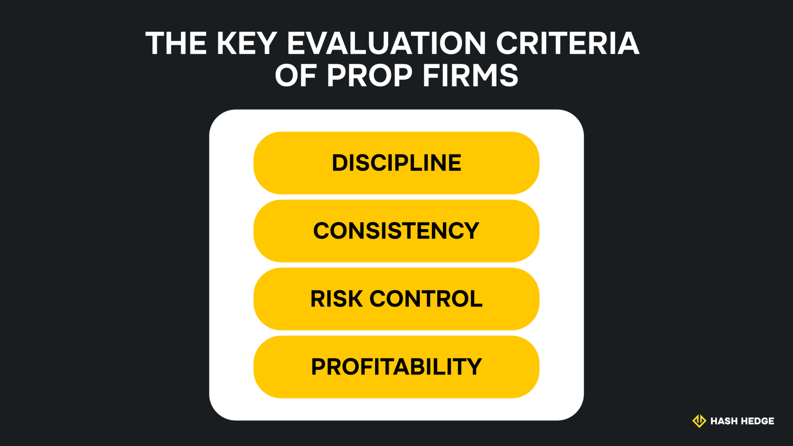
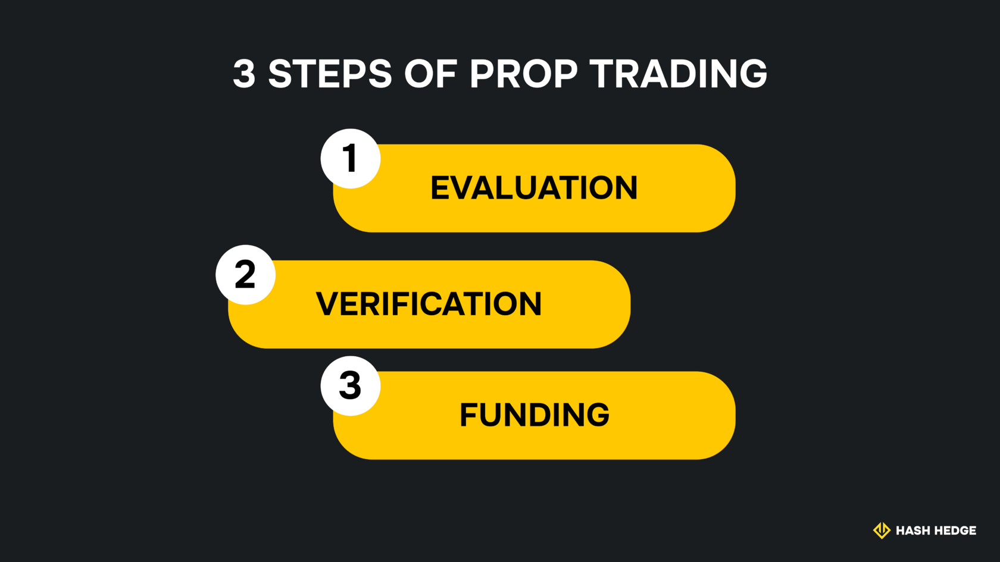

## What is crypto prop trading?

As a crypto trader, you may have developed well-thought-out trading strategies that can generate considerable profit. However, it's one thing to create a trading strategy and another to obtain the necessary capital to execute it. Capital isn't easy to come by, even for the best crypto traders, so prop firms solve this problem by providing capital in exchange for a share of the profits. Traders can qualify for this capital by passing the prop firm's challenge.

Prop firms don't only provide capital to trade crypto. They also unlock access to expert guidance and an exclusive community of ambitious crypto traders like you. Crypto prop trading involves using a prop firm's capital to trade tokens and sharing the profits with them. Profit-sharing arrangements differ by firm, but traders keep the lion's share.

### How it works

Prop firms won't give capital to just anybody, just like you wouldn't trust any random person with your investment. They have evaluation processes to identify the most disciplined and talented traders.

Evaluation involves a demo challenge (exam) where you'll be required to meet specific profit targets while complying with the firm's rules. The aim is to earn consistent profits and demonstrate that you're a disciplined trader who can obey the firm's risk management and trading rules.

After the initial evaluation, you'll proceed to another verification demo challenge with rules and profit targets. If you pass this verification, you can proceed to the funding stage and begin trading. Any profit you make is shared with the prop firm, but you'll keep most of it.

<svg width="602" height="567" viewBox="0 0 602 567" fill="none" xmlns="http://www.w3.org/2000/svg"><path d="M507.435 265.841L300.586 469.72L301.222 566.465L601.846 265.841L336.005 0V370.19L400.602 310.562V161.492L507.435 265.841Z" fill="#FCD535"></path><path d="M94.4666 265.841L300.473 469.72L301.109 566.465L0.0557861 265.841L265.897 0V370.19L201.3 310.562V161.492L94.4666 265.841Z" fill="#FCD535"></path></svg>

Start trading with Hash Hedge today

<a class="banner-button" href="https://app.hashhedge.com/en/register/">Start Challenge</a>

## Benefits of joining a crypto prop firm

If you're an experienced trader in the crypto markets, a prop firm is an effective way to amplify your profits and gain more trading knowledge. The core benefits of working with a prop firm include:

### Access to capital & tools

Prop firms provide valuable capital, which is the hardest thing for traders to obtain. Trading talent is everywhere, but opportunity and capital aren't. Prop firms bridge this gap by unlocking capital access for talented traders across the globe.

As a prop trader, you'll also gain access to research and analysis tools that are difficult to obtain on your own. These tools help you analyze the financial markets better and execute profitable trades.

### Risk management

Prop firms provide tools to help traders manage risks. These tools help you trade profitably without taking highly risky bets, unlike some trading platforms that allow unlimited risk, which often leads to significant losses.

## Requirements to get started

Joining a prop firm requires trading knowledge and discipline to comply with trading rules. Let's dive deeper into these requirements.

### Skills and knowledge needed

You need a basic understanding of trading and an in-depth knowledge of the crypto markets. You should be able to study market trends and predict cryptocurrency price movements. Programming skills are a plus, as these skills help you build computer models to analyze market trends and extract insights.

Likewise, you need discipline to handle the wild volatility of the crypto markets. You should be able to stick to a strategy even as the crypto market behaves unpredictably– responding to every market swing isn't a profitable long-term strategy.

## How to choose the right prop firm

Choosing a prop firm isn't a decision to take lightly because you're entering a financial contract with the firm. You should pay attention to several factors, including:

- **Reputation.** Look for a firm with a good reputation and positive customer reviews. If the reviews are mostly negative and lack clarification from the firm, it's a sign that something is wrong.
- **Fees.** Your prop firm should have transparent fees that are easy to understand.
- **Payout.** Seek precise information about your payout percentage and ensure it's clearly stated before signing up.
- **Transparency.** All other financial information should be transparent, including the funding amount and the rules to follow during trading.

## Setting up and starting to trade

Prop firms have standard processes for registration and evaluating traders. These processes are easy to follow if you're willing to comply with the rules and apply smart trading strategies to meet targets.

### Step one: Opening an account

Your prop trading journey begins with creating an account. You can sign up with your email address and provide relevant information. Then, you can start the evaluation process.

### Step two: Evaluation, verification, and funding

At Hash Hedge, there are three stages: evaluation, verification, and funding. You'll start with an initial evaluation with a profit target and trading rules, such as maximum drawdown and maximum daily loss. This evaluation goes on for a while.

The next stage is verification, with a lower profit target but with the rules still set in place. This stage certifies that you're a consistent profit-making trader.

After passing the verification stage, you'll proceed to the funding stage to begin trading. There's no specific profit target at this stage, as the aim is to maximize profit while complying with the trading rules. You'll retain 80% of the profits, and we'll keep 20%.

### Risk management essentials

Risk management is a key part of succeeding in crypto prop trading. Prop firms don't want traders taking excessive risks that result in big losses, so compliance with their risk management rules is necessary. These rules include:

- **Leverage.** Stick to the maximum amount you're allowed to borrow for trading. At Hash Hedge, traders can trade with up to 5x leverage.
- **Maximum loss.** Refine your trading strategy to prevent daily losses from exceeding the specified threshold.
- **Capital preservation.** Avoid high-risk trading strategies to stay within your maximum drawdown limit. Maximum drawdown is the maximum permissible loss from your portfolio's peak to its lowest point.

For example, if your portfolio begins with $1,000, rises to $1,200, and falls to $900, your drawdown is $1,200 minus $900 ($300) expressed as a percentage of $1,200, giving 25%. Always stay within your prop firm's drawdown limit.

## Basic strategy tips

Some basic crypto prop trading strategies you should be aware of include:

- **News trading.** News or event-driven strategy entails trading based on real-world events that impact cryptocurrency prices, such as regulatory announcements. Many prop firms prohibit news trading, but Hash Hedge doesn't, expanding your opportunities for making profits.
- **Fundamental analysis.** This tactic centers on examining a cryptocurrency's features to predict its price movement. These features include hash rates, trading volume, adoption rates, and partnerships with other blockchain or traditional financial companies.

## Common mistakes to avoid

As a trader, especially a relatively new one, you should watch out for common pitfalls that cause major losses, including:

### Poor risk control

Poor risk management can cause traders to lose a lot of money. Prop firms can't emphasize enough the need to comply with your firm's risk management rules.

You shouldn't use more leverage than your firm permits, as this can result in significant financial losses and account termination. You can set stop-loss orders, which automatically sell a crypto asset if it falls below a specified threshold– stop-loss orders help you stay within the maximum loss limit.

Likewise, avoid emotional decision-making during trading. When markets move unpredictably, allow yourself to calm down, then assess the situation with a clear mind. Emotional reactions lead to more losses than gains.

### Unrealistic expectations

Don't enter prop trading with sky-high expectations of making quick money. Becoming a successful trader follows a significant learning curve. You should be willing to learn the ins and outs of trading, and don't expect too much at the beginning. Prop trading can be profitable, but it's not a get-rich-quick scheme.
