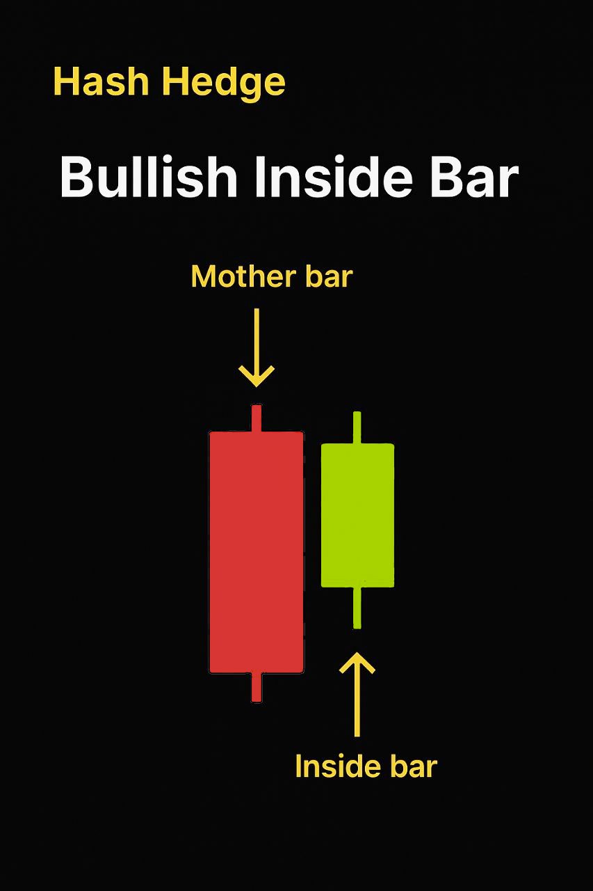
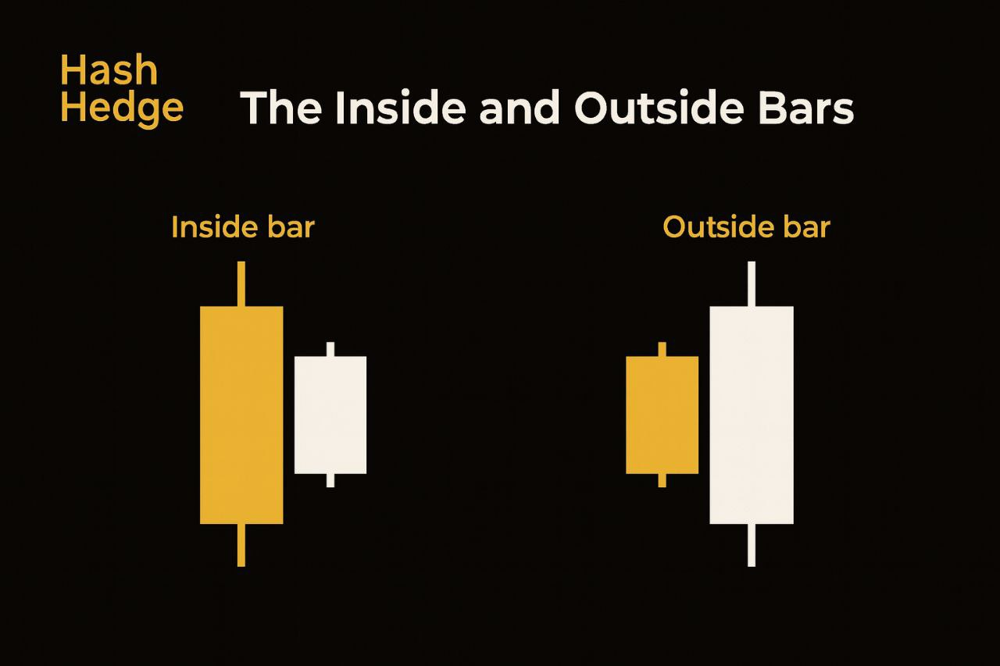

## What's an Inside Bar, Anyway?

An inside bar is a smaller candlestick that sits completely within the range (high and low) of the previous candle — called the mother bar. It's basically the market taking a breath. After a big move, traders pause, the price consolidates, and volatility tightens. That pause often sets up the next breakout, either in the same direction or as a reversal.

What it looks like in simple terms:

- The mother bar shows a strong move, so it sets the tone.
- The inside bar fits entirely inside it and signaling indecision.
- The next move breaks out — confirming who's in control: bulls or bears.

## Why Inside Bars Work

Inside bars reflect market psychology. They appear when buyers and sellers are watching each other closely, waiting for confirmation.

When price breaks above or below that mother bar, it tells you who finally took control. That's why inside bars often act as breakout patterns, especially when combined with key levels or trend direction. Some traders even call them "pause-and-go" setups — because that's exactly how they behave. You pause… then go.

## How to Identify a High-Quality Inside Bar

Not all inside bars are worth trading. Markets are full of noise, fakeouts, and random pauses. The trick is knowing which ones matter.

Here's a quick checklist:

- Trend context matters. Inside bars that form within a strong trend tend to produce more reliable breakouts. If you're trading against momentum, you're just guessing.
- Size and range. The mother bar should be relatively large, showing a decisive move. The inside bar should be small and contained. That contrast gives the pattern power.
- Location, location, location. Look for inside bars near support/resistance zones, trendlines, or after breakouts. Random mid-trend pauses are usually noise.
- Volume confirmation. During the inside bar, volume typically dips (the market's resting). Then it should spike as the breakout happens.

<svg width="602" height="567" viewBox="0 0 602 567" fill="none" xmlns="http://www.w3.org/2000/svg"><path d="M507.435 265.841L300.586 469.72L301.222 566.465L601.846 265.841L336.005 0V370.19L400.602 310.562V161.492L507.435 265.841Z" fill="#FCD535"></path><path d="M94.4666 265.841L300.473 469.72L301.109 566.465L0.0557861 265.841L265.897 0V370.19L201.3 310.562V161.492L94.4666 265.841Z" fill="#FCD535"></path></svg>

Start trading with Hash Hedge today

<a class="banner-button" href="https://app.hashhedge.com/en/register/">Start Challenge</a>

## Entry Strategies That Actually Work

So, how do you trade it? There are a few solid approaches — each with its own risk.

- **1. Breakout Entry.** The simplest and most popular way: just place a buy stop above the mother bar's high, or a sell stop below its low. Let the market come to you. This works best in trending conditions — when momentum is already in your favor.
- **2. Retest Entry.** If you hate getting trapped by fake breakouts (we all do), try waiting for a retest. When the price breaks out of the inside bar and then pulls back to the breakout level, that's your cue. You'll often get a tighter stop-loss and a cleaner risk-to-reward.
- **3. Inside Bar within a Key Level.** This is where experience and knowledge shine. Spot an inside bar on a strong support or resistance? It's a sign of coiled pressure waiting for confirmation — and once it breaks, the move can be explosive.

## Inside Bar vs. Outside Bar: Key Differences for Traders

The difference between an Inside Bar and an Outside Bar lies in how the price behaves within a single candle pattern. An Inside Bar forms when the second candle is completely contained within the range of the first — a sign of market consolidation and potential breakout pressure building up. In contrast, an Outside Bar shows the opposite dynamic: the second candle breaks both the previous high and low, signaling volatility expansion and strong momentum in either direction.

In simple terms, the Inside Bar represents pause and compression — traders watch it for breakout setups aligned with the main trend. The Outside Bar, on the other hand, suggests a battle between buyers and sellers that often ends with a decisive move or short-term reversal.

For crypto traders, both patterns offer value but in different contexts. Inside Bars shine during trending markets, where waiting for confirmation helps avoid fakeouts. Outside Bars are better suited for volatile periods — they reflect power shifts and are perfect for those who trade momentum or reversal strategies. Understanding how to read both patterns allows traders to adapt quickly and improve timing.

## Where to Set Stop-Loss and Take-Profit

Here's how most pros handle it:

- Stop-loss: just beyond the opposite side of the mother bar. It's logical — if price breaks that, your setup's invalid.
- Take-profit: aim for at least 2:1 reward-to-risk. Or, trail your stop along new swing highs/lows to catch extended runs.

Some traders prefer scaling out: taking partial profits at 1R and letting the rest ride. Remember: inside bars are short-term setups. Don't overstay your trade.

## Common Mistakes (and How to Avoid Them)

Even professional traders mess up here. Inside bars look simple — but they trap the impatient.

1. Don't trade every inside bar. Most of them are noise. Context is everything.
2. Don't force reversals. Inside bars against strong momentum are risky — better to stick with trend continuation until the chart screams reversal.
3. Don't ignore fakeouts. On lower timeframes, false breakouts happen constantly. Use higher timeframes (4H, 1D) to filter out.
4. Skipping confirmation. Volume, key levels, and trend alignment all matter more than the shape of the candle itself.

## Pro Tips for Crypto Traders

Inside bars on crypto charts behave a bit differently than on traditional markets. Volatility in crypto is higher, and price swings happen faster, which makes clean patterns much rarer. You'll often see fakeouts that trap early traders, so that's why it's smart to give your stop a little more room or wait for a clear breakout candle before entering. Patience pays off in crypto volatility.

- Volatility is higher. So you'll see more fakeouts — widen your stop slightly or wait for confirmation.
- News spikes move fast. Avoid trading inside bars right after major events (Fed updates, ETF news, token listings).
- Liquidity pockets matter. Look at volume zones and order book clusters. If an inside bar forms near a high-liquidity level, expect sharp breakouts.
- Weekend patterns are unreliable. Crypto trades 24/7 — but weekend volume often distorts price action. Be extra careful with setups formed late Friday or Saturday.

## Final Thoughts

Inside bars are simple, deceptively simple. That's their beauty. They condense the push and pull of the market into two compact candles, revealing moments when traders are quietly preparing for the next move.

You don't need to catch every inside bar — only the right ones.

And while patterns reveal opportunity, it's data that keeps you one step ahead. That's where Hash Hedge comes in. Analyze over 160+ crypto pairs in real time, track liquidity shifts before they happen, and trade without hidden fees. Turn insight into action & start trading smarter with Hash Hedge today.
