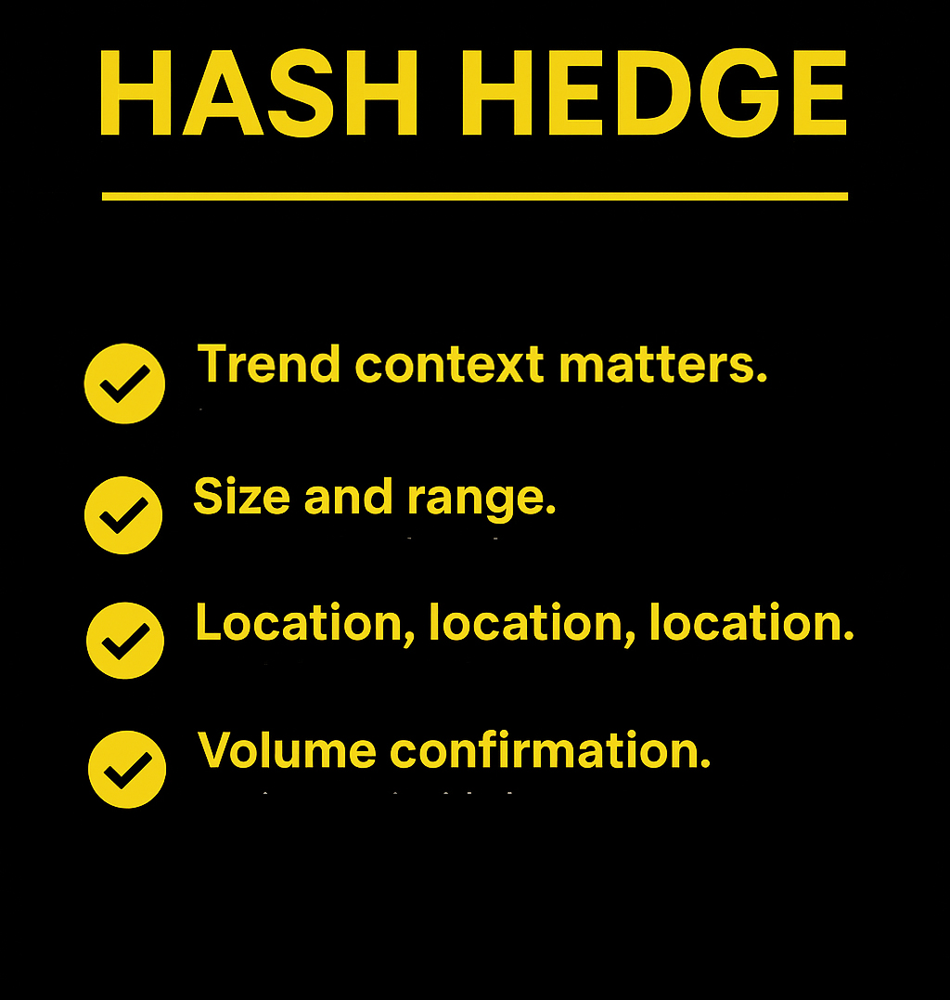

## Что такое Inside Bar?

Инсайд бар — это свеча меньшего размера, которая полностью находится в диапазоне (high и low) предыдущей свечи, называемой mother bar. Проще говоря, рынок делает паузу. После сильного движения трейдеры выжидают, цена консолидируется, а волатильность сжимается. Эта пауза часто становится прологом к следующему импульсу — в ту же или противоположную сторону.

Визуально это выглядит так:

- Материнская свеча задаёт направление и отражает мощное движение.
- Внутренняя свеча полностью помещается внутри неё — это признак нерешительности.
- Следующее движение пробивает уровень — показывая, кто взял контроль: быки или медведи.

## Почему Inside Bar работает

Inside Bar отражает психологию рынка. Паттерн появляется, когда покупатели и продавцы наблюдают друг за другом, ожидая подтверждения. Когда цена выходит за пределы материнской свечи, становится ясно, кто победил.

Поэтому Inside Bar часто становится сигналом для пробоя — особенно если он формируется у ключевых уровней или в направлении тренда.

## Как определить качественный Inside Bar

Не каждый паттерн стоит торговать — рынок полон шума и ложных движений. Поэтому важно уметь отличать рабочие сигналы от случайных.

Пользуйтесь коротким чеклистом:

- **Проверь контекст.** Inside Bar, сформированный в рамках сильного тренда, чаще даёт надёжный пробой. Торговля против импульса даёт 50 на 50 шанс успешной сделки.
- **Проверь размер и диапазон.** Материнская свеча должна быть большой. Inside Bar — маленькой и сжатой. Этот контраст придаёт модели силу.
- **Изучай таймфреймы.** Искать Inside Bar стоит рядом с зонами поддержки/сопротивления, трендовыми линиями или после пробоя. Случайные паузы посреди тренда — это просто шум.
- **Ждите подтверждения объёмом.** Во время формирования Inside Bar объём часто падает (рынок «отдыхает»), а при пробое резко растёт.

## Как торговать: рабочие стратегии входа

1. **Вход по пробою.** Самый популярный способ: поставить стоп выше хая материнской свечи или продажу ниже её лоу. Дайте рынку прийти к вам. Лучше всего это работает при наличии тренда и устойчивого импульса.
2. **Вход по ретесту.** Чтобы не попасться на ложный пробой, дождитесь возврата цены к уровню пробоя. Так можно поставить более короткий стоп и получить лучшее соотношение риск/прибыль.
3. **Inside Bar на ключевом уровне.** Если Inside Bar формируется у сильной поддержки или сопротивления — это знак накопленного давления. После подтверждения пробоя движение часто бывает весьма резким.

## Inside Bar vs Outside Bar: в чём разница

Outside Bar — противоположная модель. Если Inside Bar полностью помещается в диапазон предыдущей свечи, то Outside Bar, наоборот, пробивает и хай, и лоу — отражая расширение волатильности и усиление импульса. Главная разница:

- Inside Bar — это консолидация и ожидание, часто предвещающее пробой.
- Outside Bar — расширение движения, нередко указывающее на разворот или всплеск активности.

Для трейдеров обе модели полезны, но в разных условиях:

- Inside Bar лучше работает в трендах, помогая избежать ложных входов.
- Outside Bar эффективен в периоды повышенной волатильности, когда важно поймать смену импульса.

Понимание обеих моделей позволяет адаптироваться к разным рыночным фазам и улучшать тайминг входа.

## Где ставить стоп-лосы и тейк-профит

- **Stop-loss:** ставим за противоположной границей материнской свечи. Если цена её пробивает — сетап сломан.
- **Take-profit:** обычно минимум 2:1 по соотношению риск/прибыль, либо используйте трейлинг-стоп, чтобы зафиксировать длинное движение.

Некоторые трейдеры частично фиксируют прибыль на 1R, позволяя остатку сделки «доехать» до сильного импульса. Помни: Inside Bar — это краткосрочный сетап. Не держите позицию дольше, чем нужно.

## Частые ошибки начинающих трейдеров

Даже опытные трейдеры совершают ошибки. Инсайд бар даёт множество возможностей для такого сценария, пройдёмся по ним:

- **Не торгуй каждый Inside Bar.** Большинство — просто шум. Контекст тут решает всё.
- **Не пытайся поймать разворот.** Торговля против тренда опасна. Лучше работать в сторону импульса.
- **Не игнорируй ложные пробои.** На младших таймфреймах их много — фильтруйте с помощью 4H или 1D фреймов.
- **Не пропускай подтверждения.** Объём, уровни и направление тренда важнее формы свечи.

## Советы для криптотрейдеров

Inside Bar в крипте ведёт себя иначе, чем на традиционных рынках. Волатильность выше, движения быстрее, а чистые сетапы — редкость. Ложные пробои случаются чаще, поэтому давайте стопу чуть больше места или ждите уверенной свечи-пробоя. Вот несколько советов, которые помогут вам торговать эффективнее:

- **С криптой волатильность выше.** Будет больше ложных движений. Всегда ждите подтверждения, а затем вступайте в сделку.
- **Новости двигают рынок быстрее, чем вы думаете.** Не торгуйте на волатильном новостном рынке. Особенно после выступлений ФРС, листингов мем-токенов или ETF.
- **Обращайте внимание на ликвидность.** Inside Bar возле зон повышенного объёма часто ведёт к резкому пробою.
- **Выходные всегда торгуются иначе.** Крипта торгуется 24/7, но объёмы на выходных искажают цену. Избегайте сетапов, сформированных поздно в пятницу или субботу.

## Что в итоге?

Inside Bars просты, даже обманчиво просты. В этом их сила. Они сжимают борьбу рынка в две свечи, показывая момент перед новым движением. Поэтому не стоит ловить каждую — достаточно поймать правильную.

А чтобы замечать такие моменты вовремя, нужны данные. В этом помогает Hash Hedge. Анализируй более 160 криптопар в реальном времени, отслеживай изменения ликвидности до того, как они станут очевидны, и торгуй без скрытых комиссий.

Начни торговать умнее с Hash Hedge уже сегодня.
