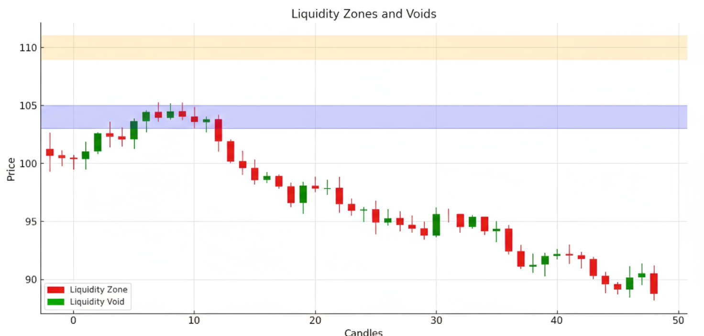

## Почему нужно отслеживать ликвидность?

Рынки движутся не просто из-за борьбы быков и медведей. Они движутся из-за ликвидности — или её отсутствия. Цена тянется к зонам с большим количеством отложенных ордеров и реагирует резко, когда этих ордеров нет.

Но если понять концепцию ликвидности, хаос внезапно станет понятнее. Вы начнёте видеть, почему определённые уровни всегда тестируются, почему цена притягивается к старым зонам и почему появляются разрывы на графике.

В Hash Hedge мы не просто торгуем — мы создаём системы, которые помогают трейдерам отсеивать лишний инфошум и стабильно зарабатывать. Хотите перестать рисковать своими средствами? Начните торговать с Hash Hedge.

## Зоны Ликвидности: Что это и для чего

Думайте о зонах ликвидности как о горячих точках на графике. Это места, где происходит много сделок: крупные кластеры ордеров на покупку и продажу. Рядом с ними обычно рынок ставит стоп-лоссы, готовые к срабатыванию. И конечно же происходит активность крупных игроков.

Чаще всего их можно увидеть рядом с:

- Предыдущими уровнями поддержки и сопротивления.
- Диапазонами консолидации, где цена лежит в боковике.
- Пиками объёма, показывающими активную торговлю на определённой цене.

Когда цена приближается к такой зоне, это похоже на подход к переполненному бару в пятницу вечером — энергия накапливается, становится шумно, и в итоге что-то ломается. Вот почему зоны часто действуют как магниты для будущих движений.

## Что такое пустоты ликвидности?

Пустоты ликвидности — это противоположные области на графике, где почти не было торговли. Цена просто пролетела через них, оставив пустое пространство. Пустоты часто выглядят как длинные импульсивные свечи без теней или резкие разрывы, вызванные новостями.

Почему это важно? Потому что рынки не любят неэффективность. Пустоты — это как незавершённые дела. Цена часто возвращается, чтобы «заполнить» этот разрыв, ища ликвидность, которой не хватило в первый раз.

## Зоны vs Пустоты: в чём разница?

Зоны ликвидности и пустоты взаимосвязаны.

Пример: BTC подскакивает на $500 за одну свечу после выхода CPI. Эта свеча оставляет огромную пустоту. Через неделю цена опускается обратно, снова проходит через пустоту ликвидности и отскакивает возле зоны ликвидности на понижение. Если следить за графиком, становится ясно, что движение не случайно. Этот отрезок времени тщательно отслеживают трейдеры, понимая, что дальше последует коррекция.

| Аспект | Зоны ликвидности | Пустоты ликвидности |
| --- | --- | --- |
| Определение | Участки цены с высокой концентрацией ордеров (поддержка/сопротивление) | Разрывы с малым/отсутствующим количеством ордеров, где цена движется очень быстро |
| Влияние на цену | Цена замедляется, консолидируется или разворачивается | Цена ускоряется, часто формируя резкие движения |
| Использование | Отслеживание уровней входа/выхода и стоп-лосс | Прогноз быстрых движений или продолжения пробоя |
| Как реагирует рынок | Покупатели и продавцы сражаются на ключевых уровнях | Отсутствие интереса до следующего кластера ликвидности |
| Фактор риска | Более безопасные, структурированные сделки | Более высокий риск, быстрые движения, сложнее поймать |

## Как трейдеры используют ликвидность на практике

Несколько распространённых подходов:

- **Кластеры стопов.** Определите, где у розничных трейдеров, вероятно, стоят стоп-лоссы. А после этого планируйте сделки вокруг этих уровней.
- **Профиль объёма.** Используйте инструменты для выявления активной торговли на определённых уровнях.
- **Наблюдение за консолидацией.** «Скучное» боковое движение часто готовит почву для резкого движения.

Особенно такой анализ любят проп-трейдеры. Пока розничные трейдеры гонятся за индикаторами, проп следят за ликвидностью, потому что она показывает следы крупных игроков.

## Человеческий фактор

Ликвидность — это психологическая концепция, отображённая на графике. Трейдеры ставят стопы там, где чувствуют себя в безопасности. Пробои происходят из-за того, что люди не могут упустить момент и поддаются влиянию рынка. Пустоты появляются, когда страх или жадность толкают всех на одну сторону одновременно.

Если акции и форекс глубоко зарегулированы, в крипте такого нет.

Ликвидность фрагментирована по биржам и гораздо более чувствительна к крупным ордерам. Поэтому Bitcoin может прыгнуть на сотни долларов за несколько минут и в целом достаточно волатилен.

## Определение зон и пустот: практические советы

- Ищите свечи с необычно длинным телом — часто это пустоты.
- Наблюдайте уровни, где цена постоянно отскакивает.
- Обращайте внимание на «круглые числа» (например, 20 000 BTC) — это естественные магниты ликвидности.

Цель не в том, чтобы предсказывать каждое движение, а в том, чтобы определять вероятности в свою пользу.

## Итог: ликвидность

Цена определяется не хаотично. Она течёт туда, где есть ликвидность, и избегает мест, где её нет. Зоны действуют как магниты; пустоты — как незавершённые участки рынка. Если вы научитесь читать и то, и другое, то сможете лучше предсказывать рынок.

Если вы хотите научиться применять ликвидность себе на пользу, попробуйте торговать с Hash Hedge. Более 4,500 трейдеров уже используют платформу для финансирования сделок. Доступ к 160+ криптопарам и никаких скрытых комиссий.

Не рискуйте своим капиталом — торгуйте вместе с Hash Hedge.
