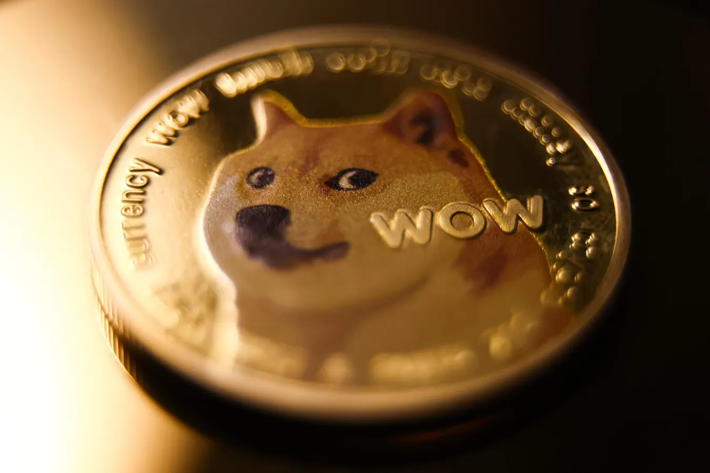
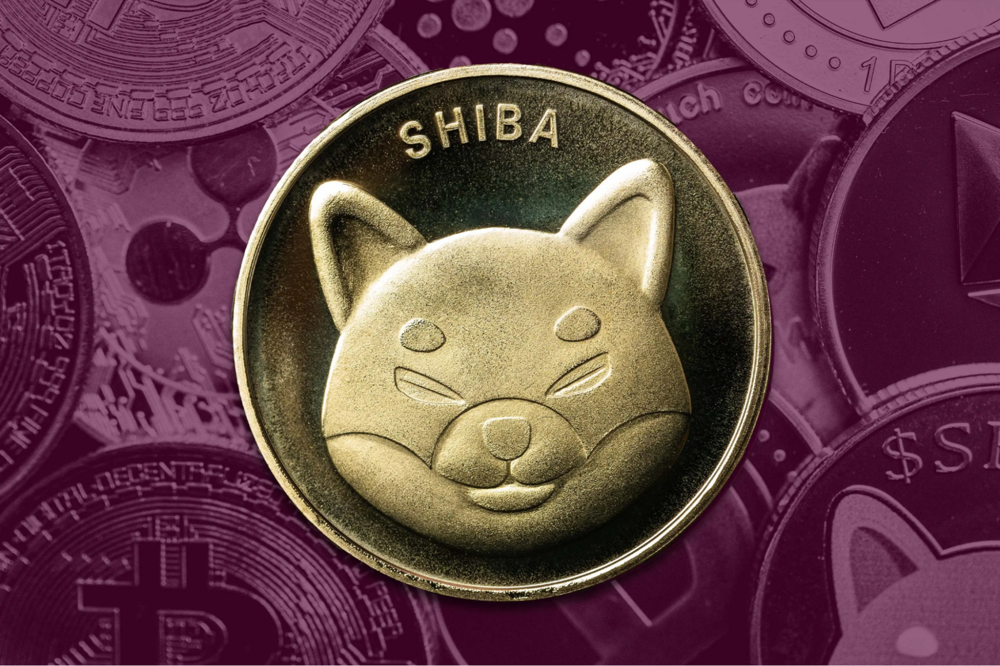

## Но что же такое мем-коины на самом деле?

По сути, это подкатегория криптовалют, вдохновлённая интернет-культурой: вирусные мемы, тренды в соцсетях и поп-культурные отсылки, которые получают виральность в интернете. В отличие от Bitcoin или Ethereum, которые строятся вокруг инноваций в блокчейн-технологиях, мем-коины привлекают внимание сообществом, юмором и ощущением принадлежности.

Они не предназначены для решения технических проблем или внедрения прорывных финансовых моделей. Вместо этого они существуют, потому что людям весело, с ними легко себя идентифицировать, и, во многих случаях, это крайне спекулятивные активы.

Перестаньте гадать с рискованными активами — торгуйте без риска для своих средств. С Hash Hedge вы торгуете, используя не свои активы, поэтому чаще зарабатываете, если показываете результат. Перестаньте рисковать своими средствами и изучайте трейдинг вместе с Hash Hedge.

## В чём суть мем-коинов? Что стоит за хайпом

Проще говоря, мем-коины — это криптовалюты, родившиеся из мемов, шуток или культуры, которые разрослись в нечто большее, чем ожидали их создатели. Их ценность не в передовых технологиях, новых консенсусных механизмах или прямой утилити. Всё дело в социальной поддержке. Если достаточно людей в интернете поддерживают монету, она может внезапно получить ценность.

Bitcoin был создан, чтобы изменить банковскую систему. Ethereum — чтобы создавать смарт-контракты и децентрализованные приложения. Мем-коины? Они созданы, чтобы заставлять людей получать фан. И всё же этот фан привлекает инвесторов, а инвесторы приносят ликвидность, и в итоге мемкоин торгуется на крупных биржах.

Несмотря на игровое происхождение, мем-коины работают на блокчейн-технологии. Они обладают теми же характеристиками, что и другие альткоины: децентрализация, прозрачность и неизменяемые записи транзакций. Технически это просто ещё одно направление криптовалют, но культурно они совершенно иные.

На протяжении лет Dogecoin оставался нишевым токеном для небольшого сообщества. До 2021 года, когда Илон Маск написал о нём в Twitter, и цена взлетела. Вдруг то, что начиналось как сатира, стало культовым и финансовым феноменом. Рыночная капитализация DOGE достигла десятков миллиардов долларов, запустив волну новых мем-проектов.

Следом появился Shiba Inu (SHIB), который активно продвигал себя как «убийца Dogecoin». В отличие от Bitcoin, который гордится ограниченной эмиссией, SHIB сделал невероятно огромный релиз — квадриллион монет. Суть была в вирусности, доступности и сообществе. Если DOGE был первопроходцем, SHIB доказал, что мем-коины могут строить целые экосистемы, а не ограничиваться фан-базой.

Затем появился PEPE, токен, вдохновлённый известным мемом Pepe the Frog. Запущенный в 2023 году, PEPE поймал волну интернет-ностальгии и быстро стал популярным в соцсетях. Его успех показал главное: мем-коины любят не за техническую ценность, а за культурный феномен и тайминг.

Итак, если вы задаётесь вопросом, почему мем-коины так популярны, ответ прост: они построены на тех же силах, что делают мемы вирусными — узнаваемость, юмор и сообщество.

## Почему люди покупают мем-коины

На первый взгляд может показаться, что у мем-коинов нет реального применения. Но ценность заключается не в прямой полезности, а в том, что они предлагают.

Для многих трейдеров мем-коины — это ощущение принадлежности. Это совместный опыт: тысячи людей объединяются вокруг одной шутки, создают мемы, делятся скриншотами и вместе надеются, что их монета «взлетит». Эта энергия создаётся сообществом и имеет очень мощный эффект. Она же подпитывает треды в Reddit, вроде r/WallStreetBets, и продвигает мем-коины.

Есть и спекулятивный аспект. Честно говоря, большинство людей не покупают DOGE или SHIB из-за веры в долгосрочные фундаментальные показатели. Они покупают, рассчитывая на прибыль от перепродажи. Спекулятивная торговля лежит в основе мем-коинов, а их волатильность делает процесс азартным. Также мем-коины часто работают как маркетинговый инструмент, привлекая внимание широкой аудитории там, где традиционная крипта редко добивается успеха.

## Безопасны ли мем-коины? Понимание рисков

За каждой историей про миллионные прибыли скрываются десятки историй о том, как трейдеры теряли всё. Мем-коины основаны на хайпе и волатильности, что делает их одними из самых рискованных активов крипторынка. Их сильная сторона — сообщество, это же и является их самой большой слабостью.

Другой риск — отсутствие фундаментальной базы. У большинства мем-коинов нет дорожной карты, утилити или команды, нацеленной на долгосрочное развитие. Они существуют, пока о них говорят, и могут исчезнуть за ночь, если интерес угаснет.

Также существует опасность мошенничества и рагпула. Низкий порог для запуска токена позволяет любому, кто знаком с базовыми навыками программирования, создать монету, разрекламировать её в соцсетях и слить ликвидность, как только трейдеры её купят. Подобное происходило неоднократно с токенами, которые пару дней были в тренде, а затем обесценились.

Волатильность — третий крупный риск. Цена мем-коинов может за день меняться на десятки процентов. Это открывает возможности для быстрой прибыли, а ещё жёстко наказывает опоздавших. Трейдеры, гоняясь за ростом, часто покупают на пике, чтобы через несколько дней видеть падение на 80–90%.

## Итог: стоит ли покупать мем-коины?

Мем-коины находятся на пересечении интернет-культуры и спекулятивной торговли. Они не созданы, чтобы заменить Bitcoin или Ethereum, и обычно лишены ценности и утилити серьёзных проектов. Но у них есть внимание, юмор и волатильность — а в крипте этого часто достаточно, чтобы двигать миллиарды долларов.

Для трейдеров, которые хотят использовать хайп с умом, Hash Hedge предоставляет мощные инструменты: анализируйте более 160 криптопар в реальном времени, отслеживайте изменения ликвидности до того, как они повлияют на рынок, и торгуйте без скрытых комиссий.
