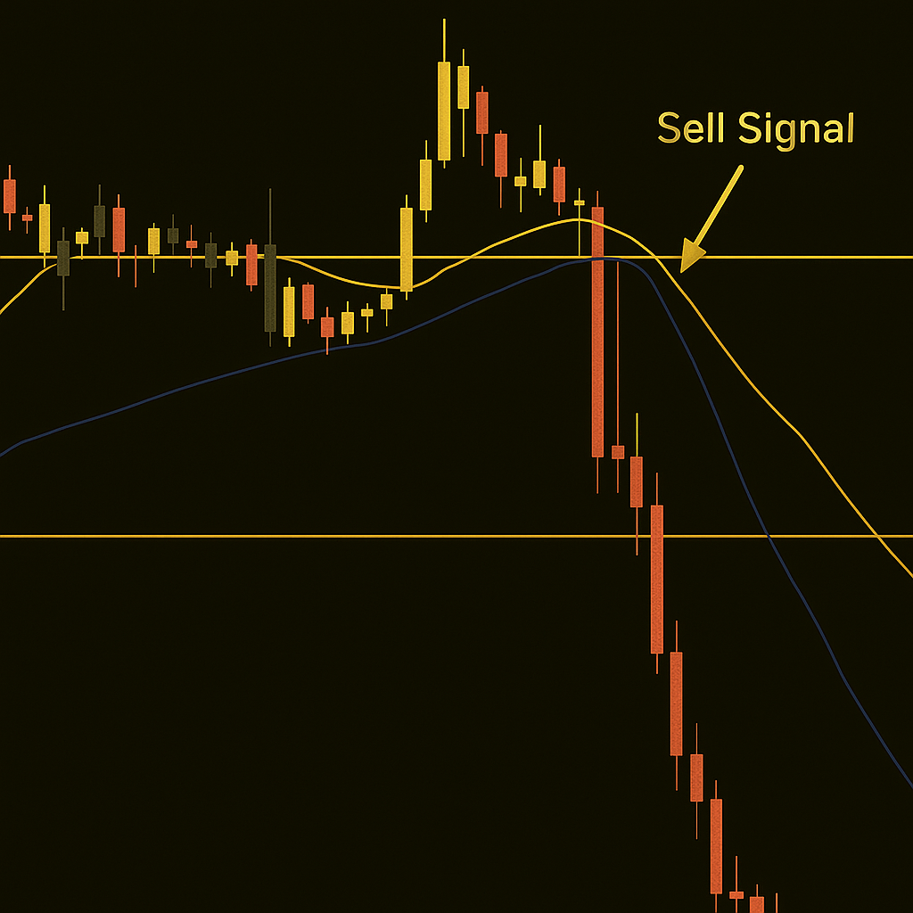

## Что делают скользящие средние

Скользящие средние — один из самых популярных инструментов теханализа, и это неудивительно: около 70% профессиональных трейдеров используют MA, чтобы фильтровать шум и определять тренды.

По сути, MA вычисляют среднюю цену за выбранный период — будь то 20, 50 или 200 свечей. Таким образом они сглаживают краткосрочную волатильность и показывают реальное направление рынка. Например, 50-дневная MA отражает среднесрочные настроения, а 200-дневная — долгосрочный тренд, за которым внимательно следят институциональные инвесторы.

Скользящие средние помогают увидеть ритм рынка. Вместо того чтобы реагировать на каждую свечу в панике, вы начинаете следить за ритмом, импульсом и направлением.

MA не предсказывают будущее. Они помогают видеть, где накапливается или ослабевает импульс, предоставляя трейдеру объективную перспективу, основанную на данных.

## Простая скользящая средняя (SMA)

Начнём с классики. Простая скользящая средняя (SMA) берёт цены закрытия за выбранный период, складывает их и делит на количество периодов. В результате получается плавная линия, которая показывает надёжную картину движения.

Трейдерам нравятся SMA за читабельность. Например, 50-дневная или 200-дневная SMA помогают определить общее направление рынка.

Если цена находится выше SMA — это сигнализирует о бычьем тренде.

Если цена пробивает SMA вниз — это часто сигнал ослабления импульса.

SMA может запаздывать, но всё равно остаётся любимым инструментом у свинг-трейдеров и долгосрочных инвесторов. Хотите проверить эти сигналы в реальных условиях без риска для собственного капитала? Hash Hedge предоставляет профессиональный терминал с 160+ активами — от BTC до PEPE и плечом до 5x на каждую сделку.

## Экспоненциальная скользящая средняя (EMA)

Проще говоря, EMA — это «ускоренный» способ отслеживать рынок. Присваивая до 90% веса последним ценовым точкам, EMA реагирует на изменения почти мгновенно. Поэтому её любят скальперы, интрадей трейдеры и алгоритмические системы, которым нужна быстрая проверка сигналов.

Статистически, короткие EMA (например, 9 или 20 периодов) часто отмечают первый этап разворота тренда: когда цена пересекает EMA сверху — импульс усиливается; когда снизу — он ослабевает. Но быстрые сигналы сопровождаются большим количеством шума: на волатильных рынках EMA могут выдавать на 30-40% больше ложных сигналов, чем SMA.

Главное тут баланс: сочетайте EMA с фильтрами вроде RSI (для импульса) или подтверждением объёмов. При правильном использовании EMA становится вашим «радаром» на рынке — чувствительным и точным при правильной работе.

## Какую скользящую среднюю выбрать — MA, SMA или EMA?

Выбор зависит не только от стратегии, но и от вашего стиля торговли. Сохраняйте эту таблицу:

| Индикатор | Для чего нужен | Для кого | Преимущества | Недостатки |
| --- | --- | --- | --- | --- |
| MA | Указывает на среднюю цену за период | Все трейдеры | Упрощает анализ и показывает тренды | Требует контекста |
| SMA | Указывает основное направление рынка, фильтруя шум | Свинг-трейдеры, долгосрочные инвесторы | Сглаживает волатильность, показывает долгосрочные тренды | Запаздывает при быстрых движениях |
| EMA | Показывает общий тренд цены, делая упор на последние движения | Дэйтрейдеры, скальперы, алгоритмические системы | Быстро реагирует на изменения, выявляет импульс раньше | В волатильных рынках может давать ложные сигналы |

Многие трейдеры усложняют себе выбор. На самом деле, все MA имеют свою цель. При этом выполняют разные задачи. Тут важна последовательность. Выберите инструмент и изучите его от А до Я, а затем переходите к следующему.

## Как трейдеры используют скользящие средние

- **Золотой и Мёртвый крест.** «Золотой крест» (50-дневная MA пересекает 200-дневную сверху): сигнал возможного долгосрочного роста. Исторически BTC показывал рост 35-50% после чистого Золотого креста. «Крест смерти» (50-дневная MA пересекает 200-дневную снизу): сигнал возможного падения. В среднем криптовалюта теряет 20–30% за 3–6 месяцев, хотя ложные сигналы случаются на боковиках.
- **Динамическая поддержка и сопротивление.** MA действуют как психологические уровни. Цена часто реагирует на 20, 50 или 200-дневные EMA. Используйте стоп-лоссы немного ниже MA, чтобы защититься от ложных пробоев.
- **Двойная стратегия.** Сочетайте быструю MA (10–20 EMA) для входов и медленную MA (50–100 EMA) для подтверждения тренда. Пересечения: быстрый пересекает медленный сверху — потенциальная покупка; снизу — потенциальная продажа. Дивергенция: быстрая MA выравнивается, а медленная продолжает рост — импульс ослабевает; подумайте о выходе из части позиций.

Высокая волатильность делает системы на основе MA полезными, особенно для стратегии с частыми входами и выходами. MA лучше всего работают вместе с объёмами, анализом структуры рынка и импульса.

## Распространённые ошибки трейдеров

- **Частая смена таймфреймов.** Постоянная корректировка настроек ломает стратегию. Выберите параметры и придерживайтесь их, чтобы собрать реальные данные.
- **Гонка за сигналами.** Пересечение MA не означает мгновенное действие. Ищите подтверждение, всегда нужны несколько причин считать тренд реальным.
- **Игнорирование контекста рынка.** MA ведёт себя по-разному в боковике и в тренде. Учитесь читать рыночный фон.
- **Сложные конструкции.** Пять MA на графике не делают стратегию надёжнее.

## Психологический фактор при работе со скользящими средними

Помимо сигналов, MA дают психологическую опору на волатильных рынках. Они превращают инфоповоды рынка в ясную визуализацию тренда, фильтруя эмоциональный шум резких свечей.

Стратегии на основе скользящих средних тренируют дисциплину и помогают бороться с FOMO. Использование двух MA (например, быстрой и медленной EMA) добавляет объективности, чётко определяя направление тренда и вашу позицию в нём.

## Итог

Скользящие средние — редкий инструмент, который сочетает техническую надёжность с эмоциональной опорой. Они учат терпению и дисциплине — качествам, которые каждый прибыльный трейдер осваивает со временем.

Независимо от того, держите ли вы позиции долгосрочно или занимаетесь скальпингом, MA могут стать надёжным помощником, поддерживая вашу стратегию.
