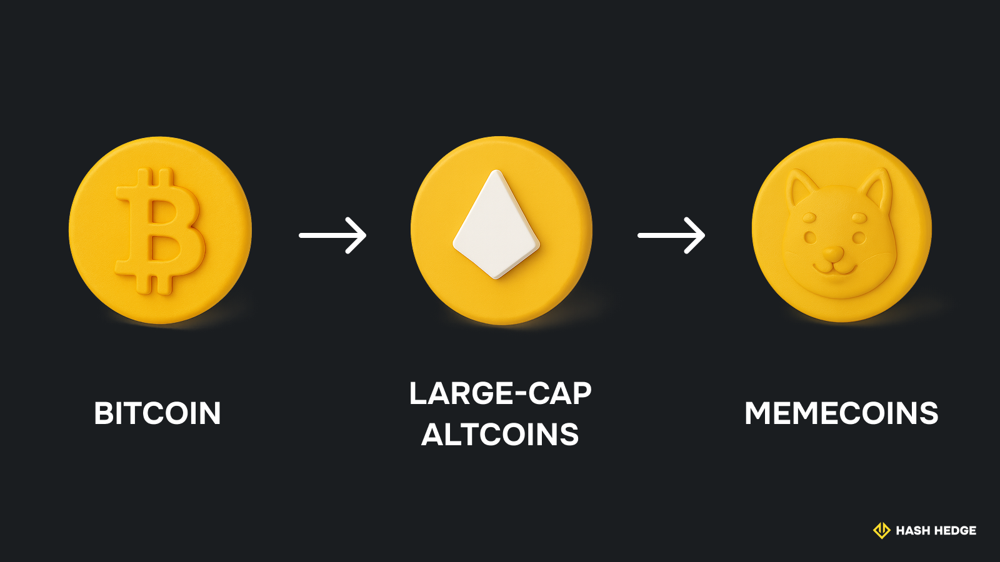
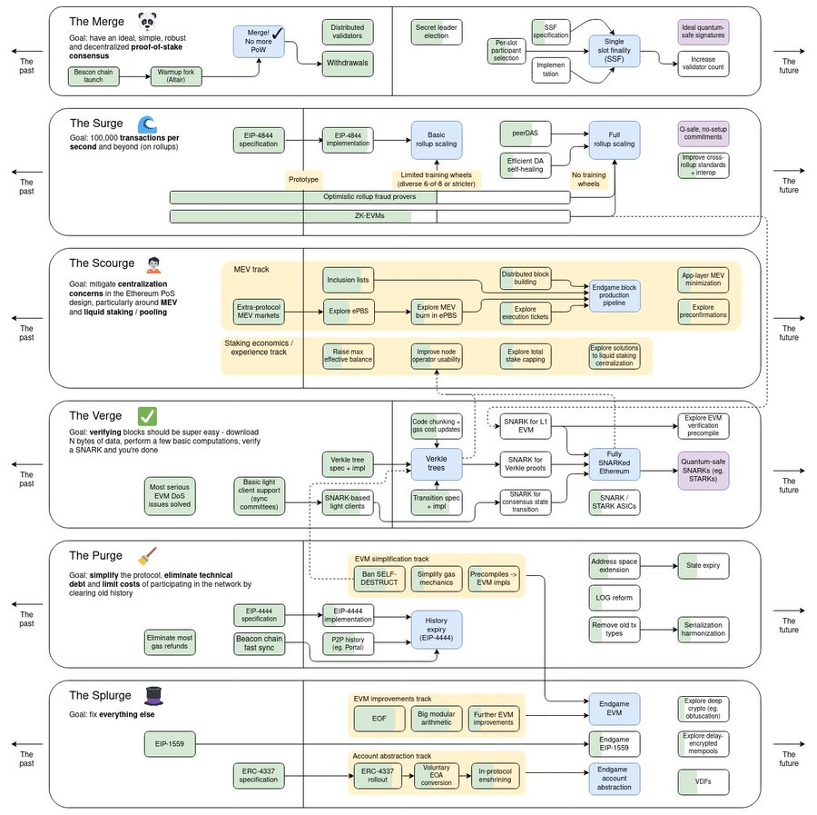
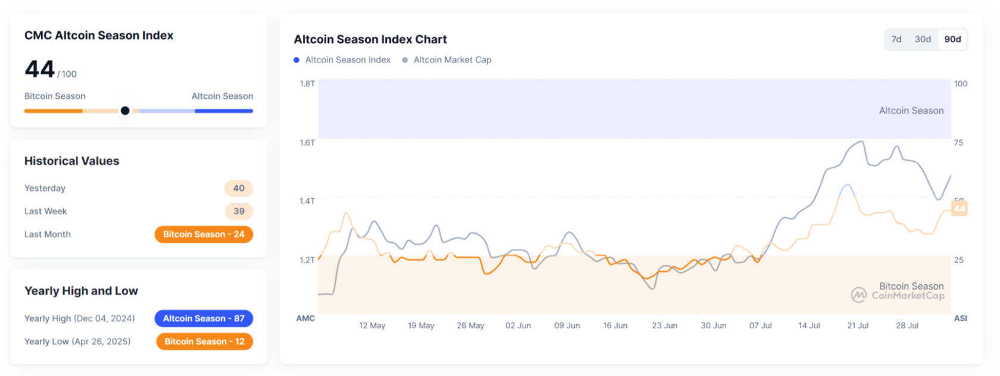

Все задаются вопросом: когда ожидается начало крипто-буллрана и как долго он продлится? Прямо сейчас рынок находится в полном разгаре. Биткойн возглавляет рост, а альткойны следуют за ним. В этой статье вы узнаете, что движет текущим циклом, чем он отличается от прошлых буллранов и чего ожидать в ближайшие месяцы.

## Когда ожидать следующий крипто-буллран? Прогнозы и ключевые даты

Давайте начнём с самого начала: как вообще происходит крипто-буллран?

Всё начинается с Биткойна.

Рост спроса (и цены) запускается циклом, который повторяется каждые четыре года. В этой статье мы лишь кратко упомянем, почему это происходит, но если хотите подробное объяснение, читайте «Биткойн и 4-летний цикл: Полное руководство».

Когда Биткойн растёт, за ним начинает двигаться весь остальной крипторынок. Крупные альткойны, такие как Ethereum (ETH), XRP и Solana, обычно растут и достигают пика следующими. Как только рост Биткойна замедляется, начинается так называемый сезон альткойнов. Внимание переключается на более мелкие монеты и даже мем-койны. После этого ажиотаж постепенно стихает, и обычно начинается медвежий рынок.

> Это лишь краткий обзор. Полное руководство по крипто-буллрану объясняет каждую стадию подробно.

Так всё происходило в последние три цикла. Но в этот раз некоторые эксперты считают, что нас ждёт нечто новое. Цикл сохранится, но его ход может измениться. Этот буллран уже начался иначе, чем предыдущие.

### Где мы находимся сейчас?

Так когда же следующий крипто-цикл? Прямо сейчас. Буллран 2025 года стартовал сразу после халвинга Биткойна в апреле 2024 года, когда количество новых монет было урезано. Ралли развивалось стремительно. Крупные инвесторы зашли на рынок рано, а экономика помогла подтолкнуть цены вверх.

Большинство экспертов считают, что мы находимся в середине буллрана. Цены уже сильно выросли, но многие говорят, что есть ещё потенциал для роста. Некоторые прогнозы предполагают, что цена Биткойна может достичь от $150,000 до $440,000.

Этот буллран может продлиться дольше предыдущих. Вот три возможных сценария:

| Сценарий | Конец месяца | Насколько дольше по сравнению с прошлым циклом |
| --- | --- | --- |
| Медвежий (Bear case) | Март 2026 | +15% |
| Базовый (Base case) | Июнь 2026 | +25% (наиболее вероятно) |
| Лунный (Moon case) | Ноябрь 2026 | +40% |

Что действительно отличается в этот раз — это структура рынка: ETF, корпоративные покупатели и более чёткие правила делают рынок стабильнее и продлевают буллран.

> В то же время некоторые эксперты считают, что этот цикл может оказаться намного короче. Они ожидают, что Биткойн достигнет пика уже в октябре, а весь рынок остынет всего через пару месяцев.

## Что движет буллраном в крипте?

Вот что разгоняет текущий цикл.

## Халвинг Биткойна: главный катализатор

Основной драйвер каждого буллрана — это халвинг Биткойна. Этот механизм заложен в код Биткойна. Когда происходит халвинг, вознаграждение майнеров за добавление нового блока сокращается вдвое.

Майнеры добавляют блоки в блокчейн, решая сложные математические задачи. Каждый раз, когда задача решена, создаётся новый блок, и майнеры получают оплату в биткойнах. Сеть устроена так, что один блок находится примерно каждые десять минут. Так как вознаграждение падает каждые 210 000 блоков, халвинг и связанный с ним рыночный цикл происходят примерно раз в четыре года. Следующий халвинг и новый буллран Биткойна ожидаются во II квартале 2028 года.

> Чтобы узнать больше о халвингах, смотри нашу полную статью «Что такое халвинг биткоина? Как он работает и почему это важно».

Это означает, что на рынок выходит меньше монет именно в тот момент, когда спрос растёт. Такой «шок предложения» всегда подталкивал цены вверх.

### Институциональный спрос и спотовые Bitcoin ETF

Одна из главных причин, почему этот буллран выглядит иначе — это появление спотовых Bitcoin ETF. Долгое время крупные инвесторы и фонды не решались покупать настоящий биткойн. Им нужны были более безопасные и регулируемые способы инвестиций.

В начале 2024 года SEC одобрила спотовые Bitcoin ETF — инвестиционные фонды, которые позволяют покупать и продавать биткойн на фондовом рынке так же просто, как обычные акции. Это всё изменило. Крупные игроки вроде BlackRock и Fidelity сразу запустили свои фонды. Внезапно огромные суммы из пенсионных фондов, семейных офисов и даже классических банков начали течь в биткойн. Спотовые ETF дали этим инвесторам привычную безопасность, прозрачность и правила.

Всего за несколько месяцев американские спотовые Bitcoin ETF установили мировые рекорды по притоку капитала. Биткойн стал намного более «мейнстримным», а уверенность в рынке выросла. Для многих это стало первой дверью в крипто и запустило новый виток FOMO.

### Обновления Ethereum и масштабирование Layer 2

Ethereum следует долгосрочной дорожной карте, цель которой — сделать сеть быстрее, дешевле и надёжнее. Когда пользователей стало слишком много, сеть начала испытывать перегрузку: комиссии выросли, а масштабируемость стала серьёзной проблемой.

Дорожная карта описывает обновления для решения этих проблем. Сейчас главный акцент — на The Surge, набор апдейтов, связанных с улучшением обработки данных.

Сначала идея заключалась в том, чтобы разделить Ethereum на множество меньших цепочек (так называемые «шарды»), чтобы распределить нагрузку. Но с появлением новых технологий, таких как сети второго уровня (Layer 2, также называемые роллапами), всё изменилось. Теперь большинство транзакций происходит именно на Layer 2, а основная сеть Ethereum отвечает за безопасность, консенсус и хранение важных данных.

В 2023–2024 годах Ethereum внедрил обновление под названием Proto-Danksharding (PDS). Оно добавило новый тип транзакций, называемый blob, который делает сохранение данных в Ethereum гораздо дешевле для сетей второго уровня. Благодаря этому использование таких сетей, как Arbitrum и Optimism, стало намного доступнее для обычных пользователей.

В ближайшие пару лет ожидается полноценное обновление Danksharding, которое позволит распределить обработку данных между множеством валидаторов, сделав Ethereum ещё быстрее и дешевле.

Производительность Ethereum критически важна для всего крипторынка. Исторически альтсезон всегда начинался тогда, когда ETH обгонял BTC. В 2025 году Ethereum становится ближе к по-настоящему масштабируемой и устойчивой платформе. Эти обновления, вместе с растущим интересом к Ethereum, вероятно, усилят следующий альтсезон и поддержат рост крипторынка во второй половине 2025 года. Некоторые эксперты прогнозируют рост ETH до $9,000.

## DeFi 2.0, AI-нарративы и RWA

> В крипте «нарративы» — это популярные истории и идеи, которые формируют восприятие различных монет и проектов. Эти тренды могут влиять на настроение инвесторов, двигать цены и выводить новые технологии в центр внимания.

Во время этого буллрана особенно выделяются несколько нарративов:

- **DeFi 2.0.** Децентрализованные финансы (DeFi) возвращаются после непростых лет. Новая волна, часто называемая DeFi 2.0, предлагает более умные и безопасные продукты, которые упрощают кредитование, заимствование и заработок на доходности.
- **Meme Launchpads.** Раньше для создания мемкоина (или любого токена) требовались технические знания в области смарт-контрактов и настройка ликвидности. С новыми платформами, такими как Pump.fun, процесс стал полностью автоматизированным. Пользователю достаточно выбрать название токена, картинку и символ. Всё остальное делается автоматически в фоне, что позволяет любому легко запустить мемкоин.
- **AI-проекты.** Новое поколение криптопроектов использует искусственный интеллект для трейдинга, управления фондами или даже создания продуктов прямо в блокчейне. Поскольку AI развивается повсюду, сочетание крипты и искусственного интеллекта привлекает огромное внимание (и капитал).
- **Токенизированные реальные активы (RWA).** Крупные институциональные игроки подключаются к процессу, размещая такие активы, как казначейские облигации США, акции или недвижимость, в блокчейне в виде токенов. Эти RWA позволяют любому торговать традиционными активами 24/7 и помогают соединить крипторынок с традиционными финансами.

Доля токенизированных реальных активов (RWA) в крипте, скорее всего, будет расти в ближайшие годы. По мере того как всё больше крупных инвесторов входит в рынок, RWA займут более значительную часть. Это означает, что всё больше денег будет переходить в активы, связанные с реальной экономикой, делая крипторынок более стабильным и привлекательным для долгосрочных инвесторов.

## Макрофакторы: инфляция, политика ФРС, глобальная ликвидность

Действия ФРС и общая монетарная политика всегда влияли на крипторынок. Эта связь стала ещё сильнее, особенно после одобрения spot-биткоин-ETF и подписания Трампом указа о создании стратегического резерва в биткоине.

Криптовалюты, как и акции, быстро реагируют на изменения политики ФРС и глобальной ликвидности. Более высокие процентные ставки обычно выводят деньги из рисковых активов, таких как крипта, в более безопасные традиционные рынки. А когда банковский сектор выглядит нестабильным, больше капитала уходит в цифровые активы.

Например, во время каждого буллрана инвесторы пристально следят за ежемесячным отчётом CPI (индекс потребительских цен). Если инфляция оказывается выше ожиданий, часто следует откат цен на крипторынке. Мягкие данные по инфляции, наоборот, толкают биткоин и альткоины вверх. В июле 2025 года биткоин упал ниже $120,000 после того, как отчёт по CPI за июнь (опубликован 15 июля) показал рост инфляции и разрушил надежды на скорое снижение ставок.

## Буллран биткоина: прогнозы цен и ключевые уровни

По состоянию на август 2025 года биткоин демонстрирует паттерн под названием "Power of 3". Этот сетап технического анализа указывает на высокую вероятность того, что биткоин может снова пробить свой исторический максимум и достичь $126,000 и выше.

"Power of 3" — это ценовой паттерн в техническом анализе. Обычно он включает три ключевых движения: фаза накопления (боковое движение), манипуляция (быстрый ложный пробой), экспансия (сильный импульс в одном направлении). Когда трейдеры замечают этот паттерн, они ожидают за ним мощного движения.

Прямо сейчас цена биткоина находится рядом с важными уровнями на графике. Эти уровни называются ключевыми — это ценовые зоны, где рынок в прошлом активно реагировал. Ключевые уровни часто выступают в роли поддержки или сопротивления.

- **Уровень поддержки.** Зона, где биткоин обычно находит «силу покупателей». Когда цена падает в этот диапазон, покупатели подключаются, останавливая падение и часто разворачивая цену вверх.
- **Уровень сопротивления.** Противоположная ситуация. Это зона, где формируется давление продавцов. Когда цена поднимается до сопротивления, многие фиксируют прибыль, что может остановить рост или даже обрушить цену.

Определение таких уровней — один из самых распространённых методов технического анализа. Это помогает трейдерам планировать входы и выходы из сделок, выставлять стоп-лоссы и строить стратегии. Во время буллрана поддержка и сопротивление становятся ещё более важными и тщательно отслеживаются как ориентиры для следующего крупного движения.

В июле–августе 2025 года биткоин тестирует важную зону около $117,000. Этот уровень уже выступал и как поддержка, и как сопротивление. Пробой выше $117,000 может открыть дорогу к следующему ралли. Кроме того, здесь сходятся главная точка контроля (POC) и 20-дневная скользящая средняя, что делает этот уровень особенно важным сейчас для трейдеров.

Взгляды на будущее биткоина расходятся, но в целом остаются позитивными. Большинство аналитиков ожидают сильный рост во второй половине 2025 года. Standard Chartered прогнозирует цену биткоина около $135,000 в III квартале и возможный рост до $200,000 к концу года, если экономика сохранит устойчивость и интерес к ETF продолжится.

Другие аналитики видят диапазон $120,000–$210,000 на 2025 год, а некоторые модели предполагают рост до $200,000 и выше в IV квартале. Fundstrat и Glassnode ожидают, что цена может удвоиться к концу 2025 года и достичь $250,000, если буллран продолжится, предложение останется ограниченным, а институциональные деньги будут поступать в рынок.

По данным опроса экспертов Finder.com, средний прогноз на конец 2025 года составляет около $161,000. При этом некоторые более осторожные прогнозы предполагают падение ниже $80,000 или даже $70,000, тогда как самые оптимистичные видят биткоин выше $200,000 или даже $250,000.

## Следующий сезон альткоинов

Сезон альткоинов — это период, когда большинство альткоинов начинают расти быстрее, чем биткоин. По мере снижения доминирования биткоина инвесторы переводят свои средства из BTC в более рискованные, но потенциально более прибыльные альткоины.

### Сигналы приближения сезона альткоинов

Altcoin Season Index помогает определить, когда для альткоинов тоже начинается бычий рынок. Он показывает, сколько из топ-50 альткоинов обогнали биткоин за последние 90 дней. Если 75% и более показывают результаты лучше биткоина — официально начинается сезон альткоинов.

По состоянию на начало августа 2025 года сезон альткоинов ещё не начался. Доминирование биткоина составляет 61%.

Другие признаки могут помочь подтвердить начало и конец сезона альткоинов:

- **BTCD (Bitcoin Dominance Rate).** Доля биткоина в общей рыночной капитализации. Когда она падает ниже 40–50%, вероятно начало сезона альткоинов. Если BTCD растёт, ралли альткоинов обычно остывает.
- **Торговые объёмы альткоинов.** Они достигают максимума в разгар сезона альткоинов, а затем начинают снижаться по мере его окончания.

| Сигнал | Начало сезона | Конец сезона |
| --- | --- | --- |
| Индекс сезона альткоинов | >75 | <75 |
| BTCD | <40–50% | >50% |
| Торговые объёмы альткоинов | Растут | Падают |

Сезоны альткоинов в прошлом часто начинались примерно через 7–8 месяцев после халвинга биткоина. В циклах 2017 и 2021 годов альткоины начинали обгонять биткоин примерно в этот период. Например, после майского халвинга биткоина в 2020 году следующий крупный сезон альткоинов стартовал в январе 2021 года, примерно через 235 дней.

## Что может пойти не так? Риски и медвежьи сценарии

Будущее на рынке трейдинга никогда нельзя предсказать со 100% точностью. Крипторынок реагирует на сотни факторов, иногда даже на такие, как последний отчёт NFP. Вот на что стоит обратить внимание в этом бычьем забеге:

- Изменения в политике ФРС или неожиданные повышения ставок.
- Резкое падение глобальной ликвидности.
- Негативные новости об ETF или ужесточение регулирования крипты.
- Взломы систем безопасности, крупные атаки или проблемы с биржами.
- Внезапные коррекции биткоина или крупных альткоинов.
- Ослабление спроса со стороны институциональных инвесторов.
- Неблагоприятные данные по инфляции или экономике.
- Геополитическая напряжённость или внезапные рыночные шоки.

Любой из этих факторов может спровоцировать откат или даже стать началом новой медвежьей фазы.

Поэтому многие розничные инвесторы придерживаются стратегии DCA — регулярной покупки фиксированного объёма криптовалюты. Это помогает сгладить взлёты и падения на волатильном рынке.

Если вы хотите проверить свои навыки и поторговать в реальных рыночных условиях, присоединяйтесь к следующему трейдинг-челленджу от Hash Hedge. Это отличный способ оставаться в форме и понять, как вы справляетесь с подъемами и спадами криптоцикла.

## Заключение

Криптовалютные бычьи циклы всегда приносят волнение и неопределённость. Текущий цикл развивается быстро, и никто не может точно предсказать, как всё сложится.

Будь то холдинг, активная торговля или просто наблюдение со стороны — помните: циклы приходят и уходят, а умные решения остаются.
