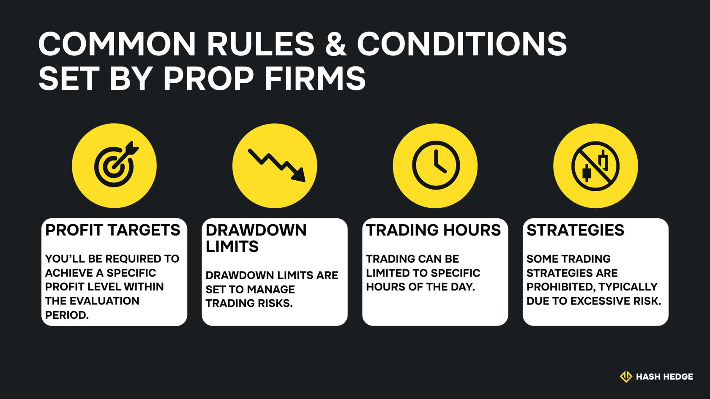

## What is a prop firm challenge?

A prop firm challenge is an evaluation process that prop firms use to find the best traders. This challenge involves trading with a demo account to hit specific profit targets while adhering to risk management rules.

During evaluation, prop firms seek traders who can make consistent profits while complying with their rules. They want traders who trade with a well-thought-out strategy, and you should be ready to deliver.

Meeting profit targets and complying with rules proves that you're disciplined enough to handle real capital from the prop firm's coffers. No one wants to give money to a random trader after all. The point of a prop firm trading challenge is to demonstrate your strategic skills as a trader.

## How prop firm challenges work

Prop firm challenges comprise two phases: the initial evaluation and verification.

The initial evaluation is a demo challenge where you trade with virtual capital. For example, on Hash Hedge you can trade the most popular crypto assets during the valuation stage.

After the initial evaluation, prop firms still want to verify that you're a skilled trader, not just one who luckily passed the initial evaluation. You'll move to the verification phase, which still involves virtual trading, but with higher profit targets and stricter risk management rules.

If you pass both the initial evaluation and verification, you've proven your skills as a worthy funded trader. Then, you'll move to the funding stage to begin trading. Any trading profits in this stage will be shared between you and the prop firm, but you'll keep the lion's share.

## Common rules and conditions

Prop firms set rules and conditions that you need to follow during your trading evaluation. These rules aren't overly complex, so don't be bothered about them. They include:

- **Profit targets.** You'll be required to achieve a minimum profit during the evaluation period. Don't be scared if you don't meet this profit level within a week or two. Evaluations last 30 to 60 days, so there's sufficient time to adjust your trading strategies to meet targets.
- **Drawdown limits.** To manage risk, prop firms set a drawdown limit, which is the maximum drop from your asset peak to its lowest point. Ok, let's make it simpler. If your portfolio begins with $5,000, rises to $7,000, and later falls to $4,200, the drawdown is $7,000-$4,200 ($2,800) expressed as a percentage of the peak ($7,000), equaling 40%. Prop firms set drawdown limits to prevent traders from using the most risky strategies that can result in big losses.
- **Trading hours.** Trading can be limited to specific hours of the day.
- **Strategies.** Prop firms can disallow specific trading strategies because of high risk. The point of the demo challenge is to demonstrate your discipline, so don't run afoul of the firm's rules even if you think doing so might earn more profits.

<svg width="602" height="567" viewBox="0 0 602 567" fill="none" xmlns="http://www.w3.org/2000/svg"><path d="M507.435 265.841L300.586 469.72L301.222 566.465L601.846 265.841L336.005 0V370.19L400.602 310.562V161.492L507.435 265.841Z" fill="#FCD535"></path><path d="M94.4666 265.841L300.473 469.72L301.109 566.465L0.0557861 265.841L265.897 0V370.19L201.3 310.562V161.492L94.4666 265.841Z" fill="#FCD535"></path></svg>

Start trading with Hash Hedge today

<a class="banner-button" href="https://app.hashhedge.com/en/register/">Start Challenge</a>

## Evaluation criteria explained

Prop firms consider several key criteria during the evaluation stage. You should focus on demonstrating these traits, not just making profits. They include:

- **Discipline.** Prop firms want traders who can stick to their rules even when inconvenient. The market is unpredictable, so you should be disciplined enough to avoid responding to every price swing. Each challenge phase takes an average of 5 to 7 days, making discipline necessary to scale through the phases.
- **Consistency.** Focus on making consistent profits over one-off profitable bets. All your strategies won't work, but it's ideal to have more winning than losing ones. Prop firms prefer consistent traders who consistently perform well in the long term, rather than one-off traders whose long-term performance is less reliable.
- **Risk control.** Prop firms seek traders with strong risk management skills, not those who use highly risky strategies that result in more losses than profits.
- **Profitability.** Overall, prop firms want you to meet their profit targets. That's how they make money.

## Prop challenge costs and account options

Prop firms charge money to complete their evaluation and access capital. After all, people generally don't give money for free. The evaluation fee is also a way to filter out casual traders and focus on the experienced ones who are more likely to pass their prop firm challenges.

Expect to pay an evaluation fee, depending on the amount of money in your intended trading account. For example, Hash Hedge offers a wide selection of accounts, ranging from budget options with a $5,000 account balance to more expensive ones depending on the chosen capital. Current prices and the available capital for purchase can always be found on the company's official website. This amount grants access to a trading challenge, and upon successfully completing it, you move on to the funding stage.

## Free vs. paid prop firm challenges

Some prop firms offer free challenges, but with limitations. These free challenges don't offer access to as much capital as the paid ones. They're also intensely competitive, wherein passing them doesn't guarantee getting a funded account.

In contrast, paid prop firm challenges give you access to sizable trading capital. Alongside capital, you can also gain access to expert guidance and software tools that help you refine your trading strategies. Prop firms aren't just capital allocators. They partner with skilled traders to help them maximize their abilities.

## Pre-challenge preparation

A prop firm evaluation might seem scary, but don't fret. It can be difficult, but it's not an impossible task if you prepare both mentally, strategically, and technically.

Preparation starts with mental discipline. You should be able to persevere even when your trading strategy isn't going well. Remember that prop firms look for disciplined traders, not those who tweak their strategy each time something goes wrong.

Likewise, learn the ins and outs of trading before embarking on your demo challenge. Study your prop firm's risk management rules and ensure you stick to them. Failure to adhere to the rules usually leads to account termination.

## How to pass a prop firm challenge: Proven strategies

Strategy and discipline are what determine if you pass a prop firm challenge. You need a refined trading strategy that'll enable you to meet profit targets, and you need discipline to stick to that strategy and manage risk effectively. Likewise, you need to set goals, monitor your performance, and adjust your strategy when necessary, not incessantly.

### Risk management techniques

Prioritize risk control during your demo trading challenge. It might seem enticing to take excessive risks to hit profit targets, but that won't work most of the time.

Prop firms monitor traders' risks and terminate accounts deemed too risky, so you shouldn't fall into this problem. We've repeatedly emphasized the importance of studying your firm's risk management rules and complying with them.

- Pay attention to your risk per trade, which is the maximum percentage of your allocated capital that you're willing to bet on a single trade. It's advisable not to risk more than 1-5%, but verify your prop firm's specific limit. Some firms limit risk per trade to as low as 2%.
- Ensure you don't surpass your prop firm's maximum drawdown limit.
- Don't exceed the maximum daily risk, which is the maximum trading loss that can be incurred in a single trading day. Accounts that exceed this risk fail the trading challenge.

### Setting goals and tracking performance

Setting clear goals helps you perform better during the evaluation stage. These goals should align with your prop firm's requirements.

To make goal-setting more effective, keep a trading journal highlighting all the goals you need to achieve within the challenge period. For example, set profit targets for each week in line with your prop firm's requirements. The idea is to hone your strategy to meet these goals and adjust it when you don't get the desired results.

Keeping a trading journal helps you stay focused on your goals and hold yourself accountable for meeting them. It's like having an invisible partner that constantly nudges you to achieve your aims.

## How to choose the right prop firm

Entering a financial contract with a prop firm isn't a decision to take lightly. Thorough research helps you make the right decision and maximizes the chances of earning profits for both yourself and the prop firm. Follow the checklist below when researching prop firms:

- **Payouts.** Seek precise information about your payout percentage.
- **Rules.** Verify all the firm's trading rules and whether you're comfortable with them.
- **Community.** Prop firms aren't just capital providers. They provide a community of like-minded traders you can learn so much from. Think of it as going to a college full of intelligent traders.
- **Fees.** The best prop firms have transparent fees that are easy to understand at a glance.

## Tools & resources that can help you pass

As a trader, it's good to acknowledge that you don't know it all and seek assistance from external resources. These include:

- Online financial courses that provide in-depth information about trading.
- Websites that let you simulate your trading strategies.
- Platforms that analyze your trading performance in detail.
- Question-and-answer forums where you can learn from the best traders and also answer questions.
- Trading blogs that discuss the latest news and strategies.

## What happens after you pass?

Passing your prop trading challenge takes you to the funding stage. In this stage, your prop firm allocates capital to you and provides new rules to be followed to maintain your funding status. You should adhere to these rules and note any new information that your prop firm provides.

With Hash Hedge, after passing the initial evaluation stage and verification, you move on to funding. With accounts ranging from $5,000 to $150,000, you can trade the most popular crypto assets with leverage up to 5x. You keep 80% of the profits, rightfully earning the majority of the income, while Hash Hedge takes only 20%.
