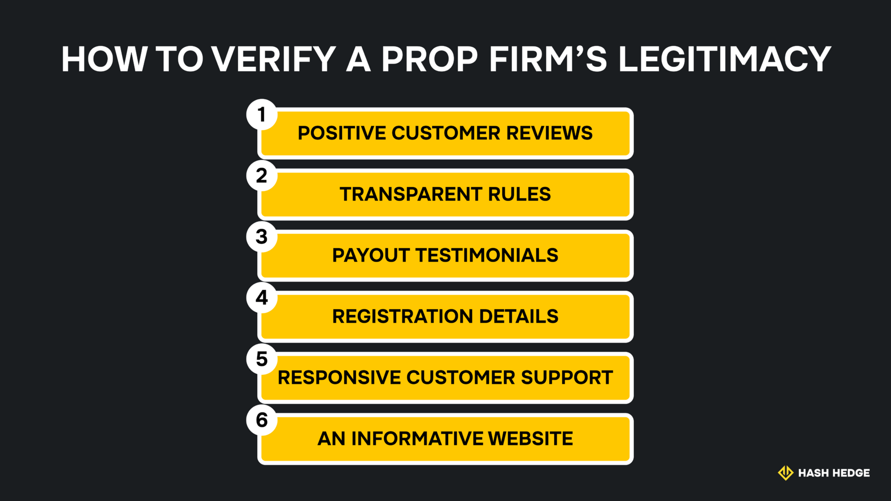

## Является ли проп-трейдинг легальным в Индии?

Проп-трейдинг является законным в Индии, если он соответствует существующим нормативным рамкам. Нет закона, прямо запрещающего проп-трейдинг, однако компании должны соблюдать действующие правила, включая прозрачность комиссий и раскрытие рисков. Платформы проп-трейдинга также обязаны иметь внутреннюю систему управления рисками и вести корректные торговые записи.

### Нормативные рамки, влияющие на проп-трейдинг в Индии

Торговля в Индии регулируется двумя институтами: Советом по ценным бумагам и биржам Индии (SEBI) и Резервным банком Индии (RBI). Эти организации устанавливают правила для проп-трейдинга.

Нормативные рамки SEBI охватывают требования к регистрации и правила управления рисками. Они обязывают проп-компании оценивать трейдеров и внедрять механизмы управления рисками, такие как ордера стоп-лосс и лимит кредитного плеча.

Резервный банк Индии (RBI) контролирует более широкую финансовую систему страны и время от времени может выпускать специальные нормативы, например, касающиеся валютных операций и управления рисками.

### Законные бизнес-модели для проп-компаний в Индии

Проп-компании ведут деятельность в Индии на законных основаниях, если они соблюдают следующие условия:

- Зарегистрированы локально или за рубежом с четкими реквизитами.
- Имеют прозрачные комиссии за участие в челленджах.
- Обеспечивают соблюдение правил по борьбе с отмыванием денег.
- У них должны быть чётко прописанные и задокументированные условия обслуживания.
- Компания торгует собственным капиталом.

### Правила и соответствие в сфере валютных операций (FEMA и LRS)

Вы можете участвовать во внешнеэкономических валютных операциях как проп-трейдер, например, при оплате вступительных взносов за челленджи или при получении выплат. Резервный банк Индии (RBI) устанавливает строгие правила валютного регулирования: Схему либерализованных переводов (LRS) и Закон об управлении иностранной валютой (FEMA).

Согласно LRS, гражданам Индии разрешено переводить до 250 000 долларов США ежегодно для различных целей, включая оплату услуг. Оплата челленджей проп-компаниям относится к категории оплаты услуг, поэтому для трейдеров существует законный канал взаимодействия с проп-компаниями.

FEMA регулирует общие требования к банкам, участвующим во внешнеэкономических валютных операциях, включая документацию и налогообложение. Поэтому ваш банк, как индийскому проп-трейдеру, может запросить определённые документы при операциях с проп-компанией. Это зависит от суммы и характера транзакции.

### Налогообложение доходов от проп-трейдинга в Индии

Доход, полученный от проп-трейдинга, считается налогооблагаемым в Индии, и трейдеры обязаны соблюдать местные налоговые требования.

Как индийский проп-трейдер, вы должны учитывать свои выплаты как доход от прироста капитала и уплачивать налоги в зависимости от суммы. Поэтому важно вести корректный учёт выплат, своевременно подавать налоговые декларации и соблюдать требования к аудиту.

## Понимание проп-трейдинга для индийских трейдеров

Проп-трейдинг в Индии активно развивается благодаря растущей экономике и развитию рынков капитала, что побуждает многих трейдеров использовать возможности. В 2024 году Индия стала крупнейшим в мире рынком опционов по объёму торгов.

В индийском контексте проп-трейдинг ничем не отличается от других стран. Он предполагает, что квалифицированные трейдеры получают капитал от проп-компании для совершения сделок. Любая прибыль делится между трейдером и компанией, при этом трейдер оставляет себе большую часть. Чтобы стать проп-трейдером, необходимо пройти челлендж, который подтверждает ваши торговые навыки и способность соблюдать правила компании.

### Что такое проп-трейдинг и как он работает?

Многие трейдеры имеют продуманные торговые стратегии, но им не хватает достаточного капитала для их эффективной реализации. Даже если капитал есть, не всегда есть желание нести риски в одиночку. Проп-трейдинг решает эту проблему, предоставляя квалифицированным трейдерам доступ к капиталу проп-компаний.

Чтобы стать проп-трейдером, нужно пройти этапы оценки вашей проп-компании. Первый этап — это демо-челлендж с целевым уровнем прибыли и строгими правилами, включая максимальное кредитное плечо и максимальный дневной убыток. Вам необходимо достичь целевой прибыли, соблюдая правила. На Hash Hedge челлендж сосредоточен на торговле криптовалютами.

После первоначального демо-челленджа второй этап представляет собой ещё один торговый челлендж, но с более низкой целью прибыли и определёнными правилами торговли. Здесь также необходимо достичь установленной прибыли, строго соблюдая правила.

После успешного прохождения второго челленджа вы переходите на стадию финансирования, где начинаете торговать уже с предоставленным капиталом. Правила всё ещё действуют, но здесь нет конкретной цели по прибыли. Вы можете зарабатывать столько, сколько сможете, соблюдая установленные ограничения. Любая прибыль делится между вами и проп-компанией. В Hash Hedge трейдеры сохраняют 80% прибыли, которую они генерируют.

### Распространённые заблуждения о проп-трейдинге в Индии

Поскольку проп-трейдинг относительно новый для Индии, многие всё ещё придерживаются распространённых заблуждений. Давайте рассмотрим их и объясним, почему они неверны.

- **«Это незаконно».** Закона, запрещающего проп-трейдинг для индийских трейдеров, не существует. Он является законным при условии, что проп-компания соблюдает действующие правила SEBI и RBI.
- **«Оплата челленджей нарушает правила валютного регулирования».** В рамках Схемы либерализованных переводов (LRS), введённой в 2004 году, оплата челленджей считается платежами международным поставщикам услуг и является законной.
- **«Проп-трейдеры не могут легально получать прибыль».** Индийские проп-трейдеры могут легально получать выплаты, если они соблюдают правила валютной отчётности и требования по борьбе с отмыванием денег.

## Как выбрать проп-компанию индийскому трейдеру

Проп-трейдинг — это легитимная бизнес-модель, но, как и в любой другой сфере, здесь встречаются недобросовестные компании. Поэтому нужно тщательно исследовать проп-фирму перед тем, как с ней работать, чтобы не попасться на недобросовестные организации, которые зарабатывают только на сборе оплаты за челленджи, а не на финансировании трейдеров и их торговых стратегиях.

### Ключевые критерии: легальность, способы оплаты и поддержка

Надёжные проп-компании зарегистрированы как юридические лица и имеют сайты с точной информацией об их деятельности. Они прозрачно сообщают о процессе и правилах, которые трейдер должен соблюдать, чтобы получить капитал.

Проп-компании могут позволять оплачивать челленджи в разных валютах, включая доллары США или их эквивалент в криптовалюте. Лучшие фирмы имеют отзывчивую службу поддержки, которая отвечает на вопросы трейдеров о проп-трейдинге.

### Как проверить легальность проп-компании

Если вы нашли перспективную проп-компанию, её легальность можно проверить, изучив отзывы предыдущих клиентов. Услышать мнение трейдеров напрямую помогает объективно оценить плюсы и минусы фирмы.

Наряду с отзывами, вы можете проверить подтверждения выплат проп-компании, которые обычно публикуются на её сайте. Также стоит изучить её политику возврата средств за челленджи и регистрацию, так как у легальных проп-компаний есть чёткие правила и официальные регистрационные данные.

Вот краткий чек-лист:

1. Положительные отзывы клиентов.
2. Прозрачные правила.
3. Подтверждения выплат.
4. Регистрационные данные.
5. Отзывчивая служба поддержки.
6. Информативный сайт.

## Пошаговое руководство по началу проп-трейдинга в Индии

Начать проп-трейдинг не так уж сложно, если следовать рекомендованным шагам. Основные этапы начала проп-трейдинга в Индии:

### Шаг первый: Понимание процесса оценки

Ваш путь в проп-трейдинге начинается с челленджа (экзамена), предоставляемого вашей проп-компанией. Процесс может различаться, но в целом он заключается в демонстрации ваших торговых стратегий и соблюдении строгих торговых правил.

Изучите процесс челленджа у выбранной проп-компании и убедитесь, что вы всё понимаете, прежде чем начинать. Проверьте ограничения, включая максимальное кредитное плечо, уровень просадки и дневной лимит убытков. Эти лимиты существуют, чтобы предотвратить чрезмерные риски с капиталом проп-компании, поэтому их соблюдение крайне важно.

### Шаг второй: Пополнение счёта и советы по соблюдению правил

Перед началом челленджа, от вас может потребоваться оплатить вступительный взнос (challenge fee) вашей проп-компании. Оплата может производиться в местной или иностранной валюте, а также в криптовалюте — в зависимости от условий конкретной проп-компании.

Криптовалюты, дебетовые и кредитные карты, банковские переводы, P2P-приложения и платёжные процессоры — это распространённые способы оплаты вступительных взносов. Такие платежи классифицируются как оплата международным поставщикам услуг, что делает их законными в рамках Индийского закона о валютном регулировании (FEMA).

После оплаты вступительного взноса вы можете начать применять свои торговые стратегии для достижения целевой прибыли. Помните, что соблюдение правил вашей проп-компании является ключевым требованием — нарушение обычно приводит к закрытию счёта. Внимательно отслеживайте результаты и корректируйте стратегии, чтобы всегда оставаться в установленных лимитах.

### Шаг третий: Успешная торговля на профинансированном счёте

После прохождения экзамена вы получаете финансирование и можете начинать торговать. Ваша задача — максимизировать прибыль, строго соблюдая правила торговли. Вот несколько советов по управлению рисками:

- Используйте стоп-лоссы, которые закрывают сделку, если её стоимость падает ниже установленного уровня. Это минимизирует убытки и помогает оставаться в пределах дневных и максимальных лимитов просадки.
- Разработайте чёткий торговый план, основанный на фундаментальных факторах, например торговле активами в ответ на новости. Ваша стратегия должна быть системной, а не случайной.
- Управляйте эмоциями во время торговли. Нужно проявлять дисциплину и следовать плану даже тогда, когда рынок ведёт себя непредсказуемо в краткосрочной перспективе. Паническая реакция на каждое движение рынка часто приводит к убыткам, которых можно избежать.

### Путь к реальной торговле: от демо до профинансированных счетов

Ваш путь в проп-трейдинге начинается с демо-челленджа, где вы доказываете свои навыки и дисциплину. Этот этап нужен проп-компаниям для оценки трейдеров и отбора лучших кандидатов для инвестирования.

После начального демо-челленджа вас ждёт ещё один этап проверки долгосрочных навыков и дисциплины. Его успешное прохождение подтверждает, что вы — надёжный трейдер, которому можно доверить реальный капитал. После этого вы начинаете торговать на профинансированном счёте и масштабировать свою стратегию для максимизации прибыли.

## Платежи, вывод средств и валютные аспекты

Оплата вступительных взносов, получение выплат и обмен валюты — это ключевые моменты, которые необходимо учитывать проп-трейдерам.

### Как оплатить вступительный взнос (evaluation fees) из Индии

Большинство проп-компаний предлагают простые способы оплаты вступительных взносов для трейдеров из Индии. Например, вы можете оплатить с помощью различных криптовалют, таких как USDT или BTC. После подтверждения платежа вы сможете приступить к торговому челленджу.

### Получение выплат на банковские счета в Индии

Банковский перевод (wire transfer) самый распространённый и удобный способ получения прибыли от проп-компании. Вы предоставляете свои банковские реквизиты, и компания переводит деньги в индийских рупиях или в иностранной валюте. Некоторые проп-компании также поддерживают вывод средств через криптокошельки.

Как индийский проп-трейдер, вы также можете открыть счёт в иностранной валюте, чтобы получать выплаты в долларах, евро или другой валюте. При этом применяются действующие правила, включая обязательное декларирование полученной прибыли в налоговой декларации.

### Правила FEMA и LRS простыми словами

Закон о валютном регулировании (FEMA) и Схема либерализованных переводов (LRS) — это основные законы, регулирующие валютные операции для индийских граждан. Эти законы ограничивают сумму и цели, по которым индийские граждане могут совершать транзакции в иностранной валюте.

Когда вы оплачиваете вступительные взносы проп-компании или получаете выплаты, необходимо соблюдать вышеуказанные законы. К счастью, сделать это несложно при работе с легальной проп-компанией. Транзакции в рамках проп-трейдинга являются законными по этим законам при условии, что они должным образом задекларированы.

Hash Hedge — одна из лучших проп-компаний, с которыми вы можете работать. Она позволяет торговать более чем 200 криптоактивами и получать прибыль от многочисленных колебаний на рынке криптовалют. Успешные трейдеры сохраняют 80% своей прибыли и могут выводить заработанные средства на любой цифровой кошелёк. Выберите Hash Hedge, чтобы начать свой путь в проп-трейдинге уже сегодня.
