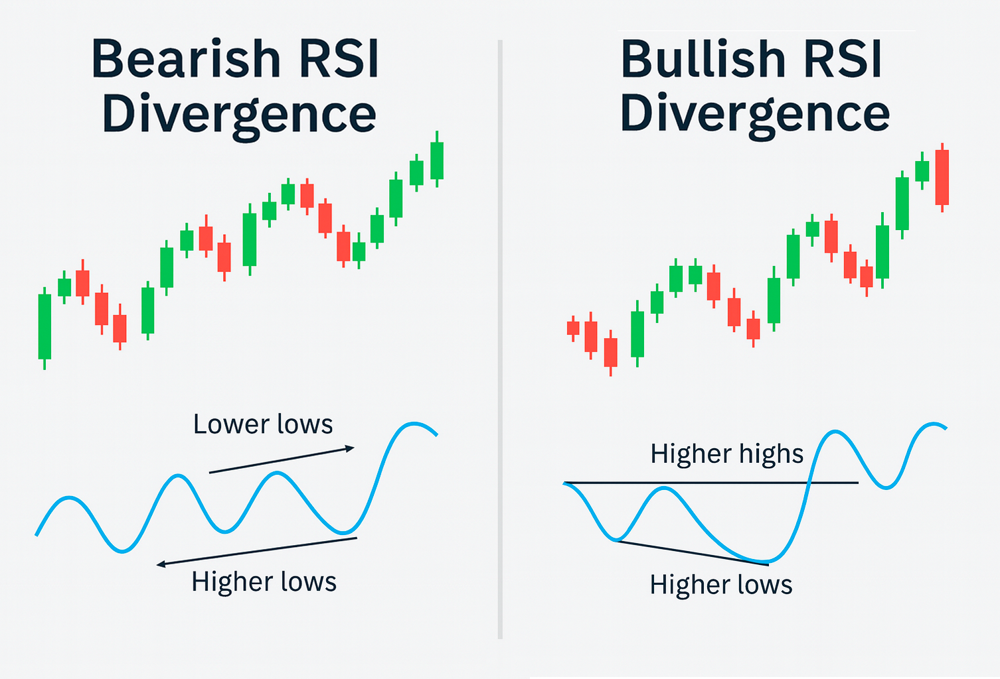

## Что такое RSI

Индекс относительной силы (RSI) — это простой осциллятор импульса, который показывает, кто доминирует в последних свечах: покупатели или продавцы. Обычно его считают по 14 периодам, а итоговое значение лежит между 0 и 100. Высокий RSI означает давление покупателей, низкий — что рынок под контролем продавцов.

Чтобы разобраться, не нужно запоминать сложные формулы. RSI показывает состояние текущего рынка и этого достаточно. Обычно большинство инструментов сами считают RSI, а твоя задача — интерпретировать значения. Чаще всего трейдеры смотрят на зоны выше 70 (перекупленность) и ниже 30 (перепроданность), но при дивергенции все куда глубже: они показывают, когда цена и импульс больше не совпадают, и именно в этих местах тренды чаще всего начинают разворачиваться.

## Что такое дивергенция?

Пойдем дальше. Дивергенция возникает, когда цена и RSI идут в разные стороны. В норме они должны двигаться синхронно. Когда связь рвётся — это знак скрытой нестабильности. Бычья дивергенция появляется, когда цена формирует более низкий минимум, а RSI — более высокий. Продавцы всё ещё давят вниз, но импульс ослабевает.

А вот медвежья дивергенция наоборот: цена пробивает новый максимум, а RSI не подтверждает, показывая, что покупательский импульс выдыхается. Обе ситуации намекают: текущему движению становится все тяжелее продолжаться.

Главная ценность дивергенций — они показывают слабость раньше, чем она становится очевидной. Дивергенции позволяют увидеть эти сдвиги заранее — не идеально, но достаточно стабильно, чтобы быть полезными.

## Типы RSI-дивергенций (4 ключевых)

### 1. Обычная бычья дивергенция

Появляется в нисходящих трендах: цена делает новый низ, RSI — более высокий низ. График может выглядеть медвежьим, но импульс начинает улучшаться. Новички удивляются: цена падает — почему это бычий сигнал?

Потому что тренды слабеют до того, как разворачиваются, а RSI реагирует быстрее цены. Обычные бычьи дивергенции часто появляются на панических лоях, когда страх максимален. Это не гарантированный вход в дно, но один из самых чистых ранних сигналов, что маркет теряет энергию.

### 2. Обычная медвежья дивергенция

Цена показывает более высокий максимум, RSI — более низкий. Это противоположность здоровому тренду: покупатели подталкивают график вверх, но импульс иссякает. Часто появляется возле сопротивлений, локальных пиков или после параболических рывков.

Внешне рынок выглядит бычьим, но в действительности движения уже редки и слабеют. Трейдеры используют это, чтобы фиксировать прибыль, подтягивать стопы или готовиться к шортам. Уже не гарантия, но мощное предупреждение.

### 3. Скрытая бычья дивергенция

Возникает в ап-трендах во время откатов: цена делает более высокий минимум, RSI — более низкий. Это сигнал того, что коррекция — всего лишь коррекция, а не разворот.

Импульс временно падает сильнее цены и является часто признаком накопления. Трендовые трейдеры любят этот сетап: он помогает найти новый вход после отката.

### 4. Скрытая медвежья дивергенция

Появляется в даун-трендах: цена делает более низкий максимум, RSI — более высокий. Импульс подскакивает сильнее, чем цена, что обычно говорит о перезагрузке перед продолжением снижения.

В крипте этот паттерн особенно полезен: небольшие локальные пампы часто вводят новичков в заблуждение. Скрытая медвежья дивергенция помогает держаться основного тренда.

Хотите торговать умнее? Hash Hedge предлагает профессиональный терминал с 170+ криптопарами (от BTC до PEPE) и 5x плечом — всё, чтобы зарабатывать даже на боковике.

## Как находить RSI-дивергенции

Добавь RSI (14) на график. Затем отметь значимые максимумы и минимумы на цене и индикаторе. Если один говорит "выше", а другой — "ниже" (или наоборот), значит есть дивергенция.

Чтобы упростить, проведи трендовые линии через два максимума или минимума в каждом окне. Если наклон линий противоположный — расхождение подтверждено. Многие ставят алерты на RSI — это экономит время.

Лучше всего искать дивергенции в значимых местах: зоны поддержки/сопротивления, ключевые уровни, длительные тренды. Таким образом сигнал будет стабильнее.

## Когда RSI-дивергенции работают лучше всего

Самые надёжные дивергенции — на высоких таймфреймах: дневной, недельный. Там тренды чище, а импульсные сдвиги заметнее. На низких фреймах сигналы часто бывают ложными.

Также дивергенции лучше работают после длительных трендов: рынок не движется бесконечно в одну сторону. Импульс ослабевает раньше, чем начинает разворот. Но в параболических движениях ложные сигналы могут держаться долго.

## Ошибки новичков

Самый большая ошибка — считать, что дивергенция означает мгновенный разворот. Рынок может продолжать двигаться против импульса дольше, чем многие ожидают, особенно в крипте. Дивергенции показывают изменения вероятностей.

Другая ошибка — видеть дивергенции там, где их нет. Новички часто неправильно отмечают максимумы и минимумы или смотрят на тени вместо закрытий. Использование только закрытий делает анализ гораздо стабильнее.

И наконец, многие трейдеры игнорируют общий тренд. Если Bitcoin сильно растёт, а ты пытаешься зашортить альткоин только из-за медвежьей дивергенции, твои шансы резко падают. Всегда учитывай состояние рынка.

## Что в итоге?

RSI-дивергенции показывают моменты, когда импульс и цена рассинхронизируются — а это один из самых ценных сигналов для трейдера. Освоив обычные и скрытые дивергенции, комбинируя их с другими паттернами и думая в вероятностях, ты получаешь реальное преимущество.

С практикой эти сигналы становятся почти автоматическими и помогают принимать более точные и спокойные торговые решения.
