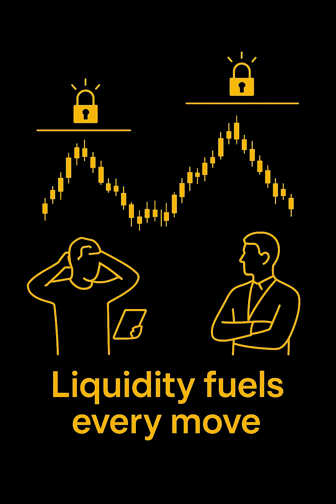
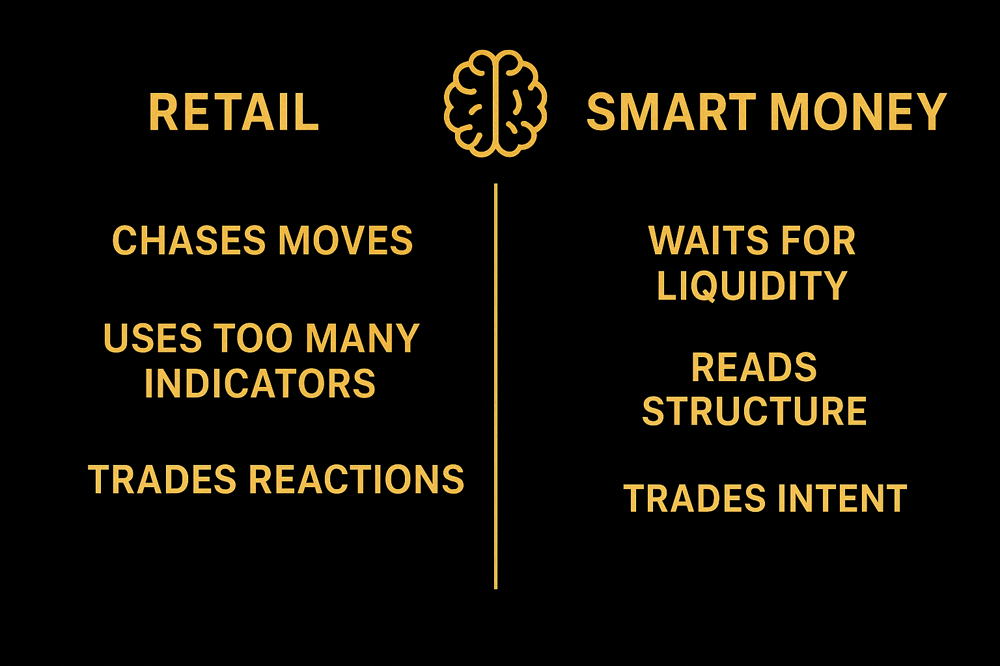

## Поговорим о ликвидности

Институционалы не угадывают, куда пойдёт цена. Они ищут ликвидность — скопления ордеров выше максимумов и ниже минимумов. Каждый рыночный импульс требует ликвидности, чтобы крупные участники могли открыть или закрыть свои позиции. Таким образом розничные трейдеры невольно её обеспечивают.

Когда вы покупаете на пробое, кто-то должен продать вам этот актив. Когда вы паникуете и продаёте на дне, кто-то покупает ваш выход. И часто этот "кто-то" — институциональный игрок. Это не цинизм — это просто механизм рынка. Крупные капиталы не могут двигать миллионы без встречных ордеров, и потому им нужны толпы ритейл игроков. Они охотятся за пулами ликвидности, выбивают стопы, играют на эмоциях — и ведут цену туда, куда изначально планировали.

*Вот правда о рынке.*

## Что такое менеджмент ликвидности?

Менеджмент ликвидности — это невидимое направление, которое задают крупные игроки для каждого движения цены. Это механизм за внезапными свечами, ложными пробоями и "несправедливыми" разворотами, которые ликвидируют тысячи позиций за секунды.

Институты создают движение, заставляя других реагировать. Каждый рост и обвал создается для извлечения ликвидности. Ритейл трейдеры часто думают, что должны обыграть рынок. На деле они питают его своей ликвидностью. Каждый выбитый стоп уже является успехом для тех, кому это нужно. Каждая эмоциональная покупка помогает манипулировать ценой, и этого и добиваются крупные игроки. Smart Money это понимают: суть игры не в угадывании направления, а в позиционировании вокруг ликвидности.

Хочешь перестать кормить крупных игроков? Hash Hedge даёт тебе капитал и инструменты, чтобы торговать на их уровне: профессиональный терминал, более 160 криптопар, и до $100 000 капитала для твоей стратегии.

## Как институциональные трейдеры работают с графиками

Одним из важнейших приемов институциональных инвесторов являются блоки ордеров, зоны, где, вероятно, открывались крупные позиции. Обычно это последняя бычья или медвежья свеча перед мощным импульсом. Можно сказать, что это паттерн, встречающийся на разворотах цены и он может быть как бычьим, так и медвежьим.

Сильное движение обычно не начинается случайно. Тут главное — контекст: где была собрана ликвидность и изменилась ли структура рынка после этого.

## Как мыслят институциональные трейдеры

Институционалы одержимы одной целью — заработать. Они ждут, пока рынок придёт к ним — к зонам интереса, где можно действовать эффективно.

Они не бегут за свечами и не поддаются FOMO. Они позволяют толпе войти в плохие сделки, создавая нужную ликвидность, и только потом входят сами — против большинства и с четкой стратегией действий.

## На что действительно смотрят институциональные трейдеры

Большинство институционалов обращают внимание на:

- Зоны ликвидности.
- Сдвиги структуры рынка (пробои ключевых максимумов/минимумов, подтверждающие намерение).
- Время и объём — чтобы понять, когда и где появляется ликвидность.

Все. Нет никаких тайных алгоритмов. Только структура, терпение и мышление в вероятностях.

## Как мыслить как институциональный инвестор?

Большинство трейдеров сосредоточено на входах. Институционалы — на контексте. Сначала понаблюдай, где находится ликвидность, а уже потом думай о направлении.

Спроси себя:

- Кто сейчас в ловушке?
- Чьи стопы вот-вот выбьет рынок?
- Где крупные игроки захотят войти или выйти?

Профессионалы всегда анализируют, где лежит ликвидность, ведь именно туда и двинется цена. Розничные трейдеры часто принимают такие движения за манипуляции, но на самом деле это и есть управление ликвидностью: рынок идёт туда, где проще всего собрать ордера. Таким образом выбивая стопы и провоцируя эмоции.

Любопытно, как это работает на практике? Читайте нашу новую статью о рыночных манипуляциях.

## Распространённые мифы о институциональных трейдерах

Разберём несколько моментов:

- Институциональные трейдеры не всегда правы. Они тоже теряют, просто реже из-за риск-менеджмента.
- Их стратегии не предполагают полноценную манипуляцию рынком.
- И не являются чем-то новым — эти принципы существовали задолго до того, как стали модными в соцсетях.

Говоря честно, большая часть рынка просто не понимает, как работают банки и хедж-фонды, и чаще всего не пытается понять логику их действий, а поэтому не может оценить их влияние на рынок.

## Как использовать эти знания

Сделайте упор на такие вещи:

- Отмечайте ключевые максимумы и минимумы ликвидности.
- Следите за тем, где рынок собрал ликвидность и планирует разворот.
- Отслеживайте блоки ордеров и структуру графика.
- Ведите журнал — отмечая закономерности по времени и объёму.

Со временем рынок перестаёт казаться хаотичным. Таким образом можно лучше понять институционалов и смотреть на рынок под другим углом.

## Итог

Хороший торговый план помогает стать на шаг ближе к хедж-фондам. Таким образом выстроить систему анализа и грамотно управлять рисками, когда рынок ведёт себя непредсказуемо. Главное — не усложняй. Отслеживай структуру рынка, смотри, где сосредоточена ликвидность, и жди подтверждения перед входом.

Сила профессионального трейдинга — в дисциплине.
