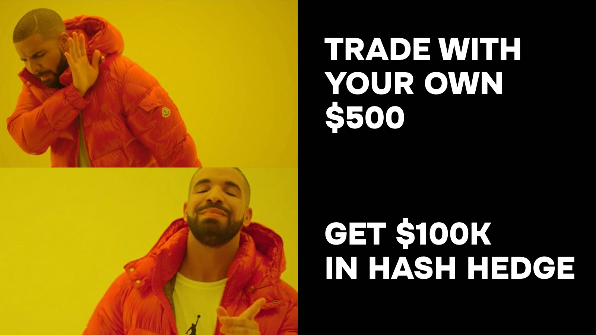

## 35 Years Old, Malaysia, and 15 Years of "Trying to Become a Trader"

Farit was born in the small town of Bugulma in Tatarstan. He now lives in Malaysia and launches fintech businesses around the world for work. Trading has been part of his life for a long time, but always as a hobby.

He first encountered charts as a student 15 years ago, when forex companies were just appearing in the CIS.

> "Back then it wasn't trading at all. It was just a desire to buy-sell based on the chart. There was no talk of strategy or risk management."

Then — a long pause. Work, studies, career. And COVID.

## COVID and the Return to Trading

Sitting at home during the pandemic, Farit started thinking about alternative income sources. About a safety cushion to ride out any storm. That's how he came back to trading — but this time seriously.

He describes the last 4–5 years not as a trading period. But as a period of learning.

> "Over that stretch I lost about $15,000. But the whole time I treated those expenses as tuition for my education."

$15,000 is not collateral or loans. It's his own income that went into the market. But the main problem wasn't the money. It was that Farit knew exactly why he was losing it.

## Why a Small Account Breaks Any System

Here's what he figured out about himself over those years:

> "My big problem was that I didn't have enough capital to actually manage my risks, manage my capital. So most of the trading I did was essentially gambling."

Always the same pattern. Small size, big leverage. It worked once. Worked twice. Worked three times. And on the fourth — you're sitting with nothing.

This isn't just Farit's story. It's a systemic problem of small accounts. When capital is too small, any working strategy breaks — because the trader has no way to earn with reasonable risk. 1% of $500 = $5. Nobody trades for that. And the acceleration kicks in: leverage, inflated risks, "winning it back."

The Barber and Odean (2000) study of 66,000 retail accounts showed: active traders with small accounts underperform the market by an average of 6.5% per year precisely because of elevated risks taken in an attempt to "pump up" the deposit. This is exactly what Farit had been fighting for 15 years.

> "I can't just save up a large sum right away. Carefully growing a deposit from $100 — honestly didn't interest me. I have a main job, I couldn't dedicate enough time to it. And trading is still a profession."

## Why Farit Chose Hash Hedge

Farit came to prop trading logically. Two options: borrowed capital or a prop firm.

He rejected borrowed capital immediately and categorically:

> "I'm against all credit money. I'm firmly convinced that trading is only possible with your own surplus funds. Only then can you keep your emotional state at the level you need, to avoid making a series of stupid mistakes."

That left prop firms. But they used to exist only on Forex — and by that point, Farit was already working in crypto.

Why crypto:

- Accessibility. Register on an exchange — and you're trading in 5 minutes.
- Innovation. Crypto is the future, you want to be part of that trend.
- Extended opportunities. Beyond trading — staking, liquid staking, airdrops. The same capital can be used in different scenarios.

Farit learned about Hash Hedge from a podcast with one of the best-known crypto influencers in the CIS — a platform ambassador. For Farit, that was enough to put Hash Hedge on his shortlist.

> "A person for whom reputation is the number one priority. If he's confident in this, if he's an ambassador — the company already has credibility with me."

## The $5K Challenge — The Test That Failed

Despite trusting the platform, Farit started cautiously — with a $5,000 challenge.

The result — a couple of days later.

> "I realized nothing had changed for me. I could have traded that $5,000 on my own account the same way, gambling. That $5,000 on the challenge doesn't remove my gambling habit either. I need capital that's bigger, more serious, that I can actually work with properly."

This is an important point. A lot of traders think small challenges are a "safe start." In practice, it's the same trap as a small personal deposit. The psyche reacts to the numbers the same way, regardless of whose money it is. Learn more about [what a funded account is and how crypto prop trading works](https://hashhedge.com/blog/what-is-a-funded-account-crypto-prop-trading).

Farit abandoned the $5K challenge and moved straight up to bigger ones: he took two $100,000 challenges in parallel.

## Two Challenges, Two Instruments, Two Lessons

The idea was this: on one account trade only Bitcoin. On the other — only Ethereum. Compare the results.

The idea didn't work. Not because the strategy was bad, but because focus matters more than strategy.

**Blow-up #1: forgotten stop-loss on ETH**

> "On Bitcoin everything was trading fine, all going well. On Ethereum at some point I forgot to set stop-losses, and that challenge blew up on the daily drawdown. It's not that I didn't want to set them. I had a focus split between two instruments."

**Blow-up #2: the global dump on October 10, 2025**

Farit lost his second attempt during the global market crash on October 10, 2025. One day — and the account was closed. These two blow-ups are classics: losing focus between instruments and getting caught in a "black swan" without a protective stop — typical mistakes covered in detail in the guide [prop firm challenges: how to pass them and get funded](https://hashhedge.com/blog/prop-firm-challenges).

## Third Attempt: Passed

Farit passed the third challenge by sticking to one hard rule: one instrument, one focus. Only Bitcoin. Stops are set before entering a position, not after.

> "I no longer set the stop-loss after the trade is already open. I set the stop-loss in the interface before I even open the trade."

It sounds like a small detail. But these small details are exactly what separate the ones who pass from the ones who blow up.

## How Farit Trades: the Simplest Possible Strategy

No complex indicators. No exotic systems.

- Instrument: BTC
- Timeframes: working with levels and zones of interest
- Indicators: only MA 50 and MA 200
- Logic: waits for price to come into a zone of interest, looks at candle patterns, determines who's in control — sellers or buyers
- Risk per trade: 1% (working to bring it down to 0.5%)

> "I have to keep my strategy as simple as possible. I only trade what the chart shows me. I wait for price to come into zones of interest. And then I watch candle patterns to see how price reacts."

This is backed by PipFarm data (survey of 2,777 prop traders, 2025): 37.8% of traders themselves name lack of discipline as their main problem, another 37.5% — emotional trading after losses. A simple strategy plus a strict focus on a single instrument is exactly what removes both of those traps. And that's exactly what Farit achieved, but only on the third attempt.

**The numbers:**

- Entry: $2,397 (three challenges at $799 each)
- Capital under management: $100,000
- Withdrawn in 2 months: $12,665.46
- Return on investment: ×5.3
- Net profit relative to entry: +428%

Several payouts combined covered Farit's 15 years of previous losses and left +$10,000 on top. And that's on the third account, after two blow-ups.

## The Psychological Trap of a Funded Account

Farit is one of the few who honestly talks about something most people keep quiet about.

> "When you get a funded account, an extra layer of psychological pressure kicks in. On the challenge you need 8% and 6%. You can take your time, move through it in a more measured way. But when you get a funded account, the 'I want to earn more money, and as quickly as possible' mindset kicks in."

Farit is fighting this pressure right now — aiming not for super-profits but for stability with lower risk. This is what Jared Tendler works on in *The Mental Game of Trading*: greed, impatience, and the urge to force results after the first wins are not character flaws but signals about gaps in approach that need to be worked on just as systematically as strategy.

## Farit's Insight

> "Why risk your own $10,000 if for $799 you can get $100,000?"

That sentence is the core of his approach. Even if you have $100,000 of your own capital — it's mathematically more profitable to put $799 into a challenge and get $100,000 under management than to trade your own deposit at the risk of losing everything.

Your maximum risk in prop is capped in advance by the cost of the challenge. Your potential earnings are not capped.

## Farit's Tips

1. **Don't be afraid to take a big challenge.** $5,000 doesn't solve the "small account" problem. You need capital at which you stop being a gambler.

2. **Focus beats strategy.** One instrument, one account, one system. Spreading yourself thin is a direct path to a blow-up.

3. **Set your stop-loss before entering the trade.** Not after. Not "when you think about it." Before.

4. **Treat the challenge as training.** It's a preparation stage for sharpening risk management before the funded account.

5. **After the payout — not euphoria, but even more discipline.** Psychological pressure on a funded account is higher than on the challenge. You have to be ready for that.

6. **Don't look for shortcuts.** "How to pass the challenge fast" strategies don't work. Only consistency works.

## What's Next

Farit keeps trading on Hash Hedge. His goal is to reach a stable equity curve and start withdrawing profits on a regular basis. He plans to reinvest part of his payouts into less risky crypto instruments, building up personal capital. But the main trading volume is through prop.

> "My prop investment is the cost of the challenge. I paid $799 — I got access to $100,000. As soon as you've paid that back, everything after is pure upside. It's much more sensible, even if you have $100,000 of your own capital, to take $799 out of it and get access to $100K, than to trade your own money."

## Key Takeaways

Farit's story isn't about luck or a magic strategy. It's a story about a man who for 15 years knew exactly what his problem was but couldn't solve it on his own. The problem wasn't lack of knowledge or laziness. The problem was the size of his account.

A small deposit breaks the psyche — and breaks any system. Large capital removes that pressure and gives the trader back the ability to work by the rules. Hash Hedge provides that capital for $799. And the very first payouts covered 15 years of previous losses.

The next case study with Farit — when his equity curve stabilizes. For now — $12,665 withdrawn in two months, one working strategy, and large capital on which trading has finally started to bring in money.

*Story based on November 2025 data. All figures and facts confirmed by payout certificates and platform records.*
