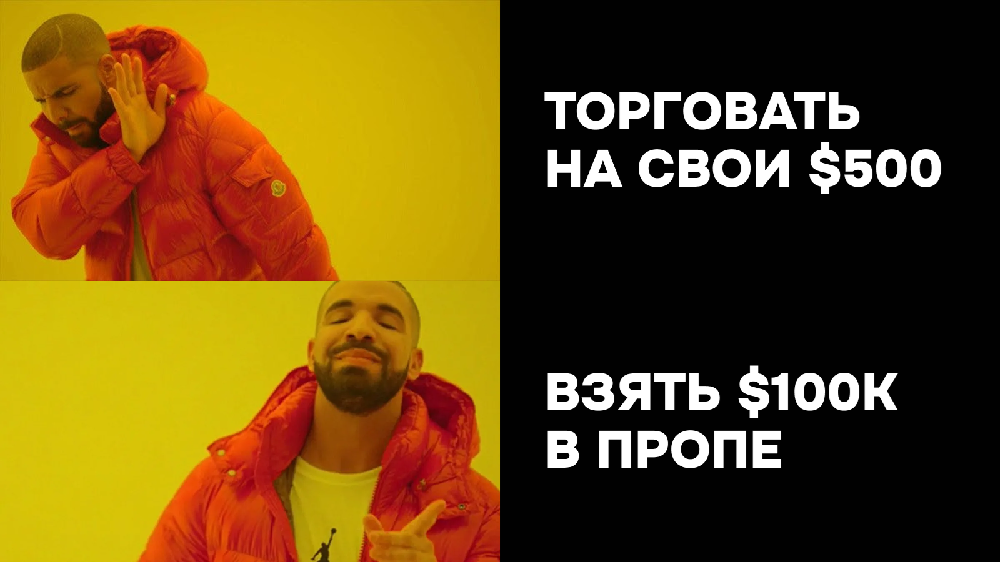

## 35 лет, Малайзия и 15 лет «попыток стать трейдером»

Фарит родился в маленьком городе Бугульма в Татарстане. Сейчас живёт в Малайзии и по работе запускает финтех-бизнесы в разных странах. Трейдинг в его жизни — давно, но как хобби.

С графиками он познакомился ещё студентом, 15 лет назад, когда в СНГ только появлялись форекс-компании.

> «На тот момент это вообще не был никакой трейдинг. Это просто было желание купить-продать по графику. Ни о какой стратегии, риск-менеджменте речи не шло»

Потом — долгая пауза. Работа, учёба, карьера. И ковид.

## Ковид и возвращение к трейдингу

Сидя дома во время пандемии, Фарит начал думать про альтернативные источники дохода. Про подушку, на которой можно пережить любой шторм. Так он вернулся к трейдингу — но уже всерьёз.

Последние 4–5 лет он описывает не как период торговли. А как период обучения.

> «Я за этот промежуток времени потерял порядка $15 000. Но я весь этот промежуток времени воспринимал эти траты как плату за обучение».

$15 000 — это не залоговые деньги и не кредиты. Это его собственный доход, который уходил в рынок. Но главная проблема была не в деньгах. А в том, что Фарит точно знал, почему он их теряет.

## Почему маленький счёт ломает любую систему

Вот что он понял про себя за эти годы:

> «У меня была большая проблема — у меня не было достаточного капитала, чтобы действительно как-то управлять своими рисками, управлять своим капиталом. Поэтому большая часть всей торговли, которая у меня была, она по сути дела являлась лудоманией»

Схема одна и та же. Небольшой объём, большое плечо. Один раз получилось. Два раза получилось. Три раза получилось. А на четвёртый — ты сидишь ни с чем.

Это не только история Фарита. Это системная проблема маленьких счетов. Когда капитал слишком мал, любая рабочая стратегия ломается — потому что у трейдера нет возможности заработать на адекватных рисках. 1% на $500 = $5. Ради этого никто не торгует. И включается разгон: плечи, завышенные риски, «отбиться».

Исследование Barber и Odean (2000) на 66 000 розничных счетах показало: активные трейдеры с маленькими счетами проигрывают рынку в среднем на 6,5% в год именно из-за повышенных рисков в попытке «разогнать» депозит. Это ровно то, с чем 15 лет боролся Фарит.

> «Сразу накопить большую сумму я не могу. Аккуратно раскачивать депозит со $100 — мне откровенно было неинтересно. У меня есть основная работа, я не мог на это уделять достаточно времени. А трейдинг — это всё-таки профессия»

## Почему Фарит выбрал Hash Hedge

К проп-трейдингу Фарит пришёл логически. Два варианта: заёмный капитал или проп-компания.

Заёмный отмёл сразу и категорически:

> «Я против всех кредитных денег. Четко уверен, что трейдинг возможен только на свои излишки. Только в таком случае ты можешь поддерживать эмоциональное состояние на должном уровне, чтобы не совершить ряд глупостей»

Остались проп-компании. Но раньше они были только на Форексе — а Фарит к этому моменту уже работал в крипте.

Почему крипта:

- Доступность. Зарегистрировался на бирже — и через 5 минут торгуешь.
- Инновационность. За криптой будущее, хочется быть в тренде.
- Расширенные возможности. Помимо трейдинга — стейкинг, ликвидный стейкинг, аирдропы. Один и тот же капитал можно использовать в разных сценариях.

Про Hash Hedge Фарит узнал из подкаста одного из известных крипто-инфлюенсеров СНГ — амбассадора платформы. Для Фарита этого было достаточно, чтобы включить Hash Hedge в свой шорт-лист.

> «Человек, для которого в первую очередь важна репутация. Если он уверен в этом, если является амбассадором — у меня уже появился кредит доверия к компании»

## $5K челлендж — тест, который провалился

Несмотря на доверие к платформе, Фарит начал осторожно — с челленджа на $5 000.

Результат — через пару дней.

> «Я понял, что для меня ничего не поменялось. Я бы мог на $5 000 и на свои торговать, лудоманить. Эти $5 000 на челлендже тоже не убирают мою лудку. Мне нужен капитал именно больше, серьёзнее, с которым я смогу адекватно работать»

Это важный момент. Многие трейдеры думают, что маленькие челленджи — это «безопасный старт». На практике — это та же ловушка, что и маленький личный депозит. Психика одинаково реагирует на цифры, независимо от того, чьи это деньги. Подробнее о том, что такое финансируемый аккаунт и как работает проп-трейдинг в крипте.

Фарит оставил челлендж на $5K и сразу перешёл на челленджи крупнее: взял два челленджа по $100 000 параллельно.

## Два челленджа, два инструмента, два урока

Идея была такая: на одном аккаунте торговать только биткоин. На другом — только эфир. Сравнить результаты.

Идея не сработала. Не потому что стратегия плохая, а потому что фокус важнее стратегии.

**Слив #1: забытый стоп-лосс на ETH**

> «По биткоину всё торгуется, всё хорошо идёт. По эфиру я в какой-то момент забыл выставить стоп-лоссы, и этот челлендж слился по дневному убытку. Не то чтобы я не хотел выставлять. У меня произошёл расфокус между двумя инструментами»

**Слив #2: глобальный дамп 10 октября 2025**

Вторую попытку Фарит потерял во время глобального обвала рынка 10 октября 2025 года. Один день — и аккаунт закрыт.

Эти два слива — классика: расфокус между инструментами и попадание в «черного лебедя» без защитного стопа — типичные ошибки, о которых подробно разобрано в гайде испытания в проп-фирмах: как их проходить и получать финансирование.

## Проход с третьей попытки

Третий челлендж Фарит прошёл, соблюдая одно жёсткое правило: один инструмент, один фокус. Только биткоин. Стопы выставляются до входа в позицию, не после.

> «Я уже не выставляю стоп-лосс, когда сделка открыта. Я выставляю стоп-лосс в интерфейсе до того, когда я эту сделку открываю»

Это кажется мелочью. Но именно такие мелочи отделяют тех, кто проходит, от тех, кто сливается.

## Как Фарит торгует: максимально простая стратегия

Никаких сложных индикаторов. Никаких экзотических систем.

- Инструмент: BTC
- Таймфреймы: работа с уровнями и зонами интереса
- Индикаторы: только MA 50 и MA 200
- Логика: ждёт прихода цены в зону интереса, смотрит на свечные паттерны, определяет, кто в приоритете — продавцы или покупатели
- Риск на сделку: 1% (работает над тем, чтобы снизить до 0,5%)

> «Я стараюсь держать свою стратегию максимально простой. Я торгую только то, что мне показывает график. Жду прихода цены в зоны интереса. И смотрю на свечные паттерны, чтобы увидеть, как цена на них реагирует»

## Цифры

- Вход: $2 397 (три челленджа по $799)
- Капитал в управлении: $100 000
- Выведено за 2 месяца: $12 665,46
- Возврат на вложенные средства: ×5,3
- Чистая прибыль относительно входа: +428%

Несколько выплат суммарно покрыли 15 лет предыдущих потерь Фарита и сделали +$10 000 сверху. И это — на третий аккаунт, после двух сливов.

## Психологическая ловушка funded-счёта

Фарит — один из немногих, кто честно говорит про вещь, о которой обычно молчат.

> «Когда ты получаешь фандинговый счёт, включается дополнительная психологическая нагрузка. На челлендже тебе надо 8% и 6%. Ты можешь себя не подгонять, более размеренно проходить. А когда у тебя появляется фандинговый счёт, включается "я хочу заработать больше денег, и как можно скорее"»

С этим давлением Фарит сейчас борется — целится не на сверхприбыли, а на стабильность с меньшим риском. Это то, над чем в «The Mental Game of Trading» работает Джаред Тендлер: жадность, нетерпение и желание форсировать результат после первых побед — это не слабости характера, а сигналы о пробелах в подходе, с которыми нужно работать так же системно, как со стратегией.

## Инсайт от Фарита

> «Зачем рисковать своими $10 000, если за $799 можно получить $100 000?»

Эта фраза — ядро его подхода. Даже если у тебя есть $100 000 собственного капитала — математически выгоднее вложить $799 в челлендж и получить $100 000 в управление, чем торговать своим депозитом с риском потерять всё.

Твой максимальный риск в пропе заранее ограничен стоимостью челленджа. Твой потенциальный заработок — не ограничен.

## Советы от Фарита

1. **Не бойся брать большой челлендж.** $5 000 не решает проблему «маленького счёта». Нужен капитал, с которым ты перестаёшь быть лудоманом.

2. **Фокус важнее стратегии.** Один инструмент, один аккаунт, одна система. Распыление — прямой путь к сливу.

3. **Выставляй стоп-лосс до входа в сделку.** Не после. Не когда «подумаешь». До.

4. **Воспринимай челлендж как тренировку.** Это подготовительный этап для того, чтобы отточить риск-менеджмент перед funded-счётом.

5. **После выплаты — не эйфория, а ещё больше дисциплины.** Психологическое давление на funded-счёте выше, чем на челлендже. К этому нужно быть готовым.

6. **Не ищи обходных путей.** Стратегии «как пройти челлендж быстро» не работают. Работает только системность.

## Куда дальше

Фарит продолжает торговать на Hash Hedge. Его цель — выйти на стабильную equity-кривую и начать планомерно выводить прибыль. Часть выплат он планирует реинвестировать в менее рискованные крипто-инструменты, формируя личный капитал. Но основной торговый оборот — через проп.

> «Мои инвестиции в проп — это стоимость челленджа. Заплатил $799 — получил доступ к $100 000. Как только окупил — остальное работаешь полностью в плюс. Гораздо целесообразнее, даже если у тебя капитал $100 000, выделить из него $799 и получить доступ к $100K, чем торговать своими»

## Ключевые выводы

История Фарита — не про удачу и не про магическую стратегию. Это история про то, как человек 15 лет знал, в чём его проблема, но не мог её решить в одиночку. Проблема была не в отсутствии знаний и не в лени. Проблема была в размере счёта.

Маленький депозит ломает психику — и ломает любую систему. Крупный капитал снимает это давление и возвращает трейдеру возможность работать по правилам. Hash Hedge даёт этот капитал за $799. И первые же выплаты перекрыли 15 лет предыдущих потерь.

Следующий кейс с Фаритом — когда его equity-кривая стабилизируется. А пока — $12 665 выведено за два месяца, одна рабочая стратегия и большой капитал, на котором трейдинг наконец начал приносить деньги.

*История основана на данных ноября 2025 года. Все цифры и факты подтверждены сертификатами выплат и данными платформы.*
