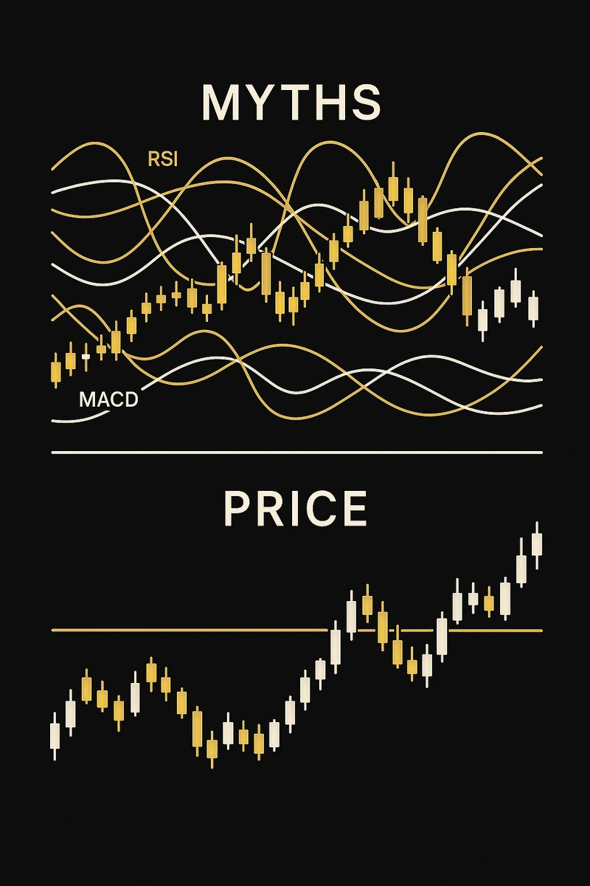

## Миф №1: Индикаторы предсказывают рынок

Это, пожалуй, самый устойчивый миф в трейдинге.

RSI, MACD, Stochastic, Bollinger Bands — классический набор, с которого для многих начинается знакомство с индикаторами в трейдинге. Им часто приписывают почти пророческие способности: если сигнал появился, рынок обязан отреагировать.

Не обязан.

Любой индикатор — это переработанная цена. Формулы, сглаживания, средние значения. По сути, они не говорят о том, что будет дальше, а лишь показывают, что уже произошло. Это полезно для понимания контекста, но принимать решения, опираясь только на такие данные, — не самая надёжная затея.

Проблема в том, что даже опытные трейдеры начинают ждать подтверждений. Цена уже начинает движение, но вход откладывается, потому что индикатор ещё не дал подтверждение. В итоге сделка открывается позже, стоп приходится ставить дальше, и соотношение риска к прибыли становится заметно хуже. Это одна из самых распространённых ошибок трейдеров.

## Миф №2: Чем больше индикаторов, тем точнее сигнал

Этот миф выглядит логично, поэтому и живёт так долго.

Большинство популярных индикаторов измеряют одно и то же: импульс, среднюю цену, перекупленность. Когда трейдер использует целый набор индикаторов, он получает иллюзию контроля. На деле все не так, и рынок часто обманывает ожидания. А индикаторы создают лишнюю уверенность.

Поэтому многие со временем начинают задаваться вопросом: как торговать без индикаторов, смещают фокус с них на price action — самой логике движения цены, а не к вторичным производным.

## Миф №3: Поддержка и сопротивление — это точные линии

Многие начинают изучать технический анализ именно с уровней и сразу совершают типичную ошибку — рисуют их как идеальные линии. Однако поддержка и сопротивление — это зоны, а не координаты.

Цена также может:

- Не дойти до уровня.
- Пробить его.
- Задержаться внутри зоны.
- Вернуться позже.

И всё это — нормальное поведение.

Когда трейдер ждёт идеального касания, он либо пропускает сделки, либо ловит ложные пробои и ссылается на манипулирование рынком, хотя чаще всего рынок просто игнорирует наши ожидания.

Хотите торговать умнее? Hash Hedge предлагает профессиональный терминал с 170+ криптопарами (от BTC до PEPE) и 5x плечом — всё, чтобы зарабатывать даже на боковике. Торгуй вместе с Hash Hedge.

## Миф №4: Паттерны работают всегда

Голова и плечи. Флаг. Треугольник. Двойное дно.

Эти формации знают все. Дело тут не в них, а в том, как их используют. Один и тот же паттерн в тренде, во флэте, перед новостями, на низкой ликвидности — это разные ситуации.

Поэтому многие трейдеры со временем смещают фокус с фигур на price action — на саму логику движения цены, а не на геометрию на графике.

## Миф №5: Технический анализ убирает эмоции

Один из самых вредных мифов вообще.

Многие приходят в трейдинг с надеждой, что графики и правила избавят от эмоций. Будет холодный расчёт, чёткие входы, спокойствие.

Реальность же совсем другая.

Технический анализ не выключает эмоции, а обнажает их. Именно здесь на первый план выходит психология трейдинга: страх, FOMO, желание отыграться, стремление доказать рынку, что ты прав.

Большинство критических ошибок трейдеров рождаются не из плохого анализа, а из эмоциональных решений.

## Что такое технический анализ на самом деле?

Если убрать мифы, картина становится проще и честнее.

Технический анализ — это не способ угадывать рынок. Это способ работать с вероятностями.

Он помогает:

- Структурировать хаос.
- Находить понятные точки риска.
- Принимать решения последовательно.

Особенно это заметно в трейдинге криптовалют, где волатильность быстро наказывает за иллюзии и самоуверенность.

## Вывод

Технический анализ не врёт. Врут ожидания, которые мы на него навешиваем.

Когда трейдер перестаёт искать идеальные сигналы и начинает понимать контекст, рынок становится менее враждебным. А дальше уже начинается настоящая работа.
