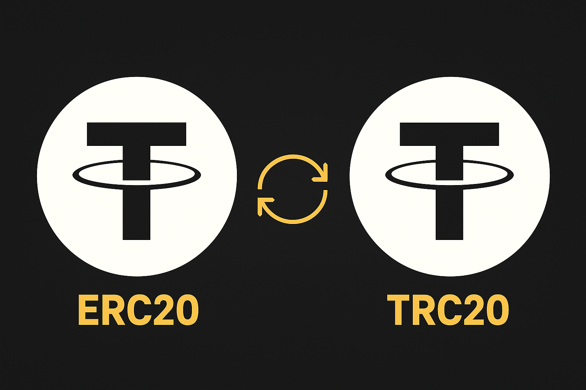
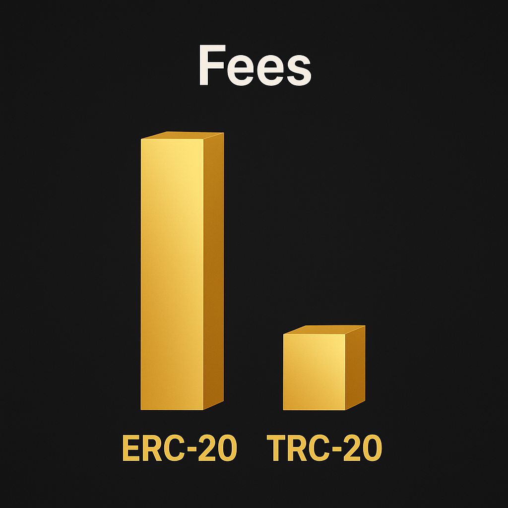

## Почему эта тема вообще важна

Так или иначе, каждый день проскальзывают новости о том, как в крипте отправляют средства не на тот кошелек и так теряют огромные суммы безвозвратно. Поэтому ещё важнее разобраться, что такое сеть и какими они бывают.

## Что такое Tether и зачем он нужен трейдеру

USDT — это стейблкоин, привязанный к доллару США. Один USDT должен примерно равняться одному доллару, и именно поэтому Tether стал базовой «расчётной единицей» для кучи трейдеров. Вместо того чтобы каждый раз ходить в фиат, проще держать часть депозита в USDT и быстро заходить в сделки.

Для крипто-трейдера Tether выполняет сразу несколько задач:

- Временная парковка прибыли в более-менее стабильном активе.
- Удобная валюта для ввода и вывода на биржи.
- Связующее звено между разными монетами и сетями.

Когда мы говорим USDT ERC-20 и TRC-20, мы всё равно имеем в виду один и тот же стейблкоин. Разница не в монете, а в том, на каком блокчейне она живёт и по какой сети вы делаете транзакцию.

## ERC-20: Tether на Ethereum

Теперь разберёмся, что стоит за надписью Tether ERC-20.

**Что такое ERC-20 простыми словами.** ERC-20 — это стандарт токенов в сети Ethereum. Если ваш USDT выпущен по этому стандарту, значит он существует на блокчейне Ethereum. Любой кошелёк или сервис, который поддерживает ERC-20 токены, в теории умеет работать и с USDT ERC-20.

Отсюда вытекает несколько важных вещей:

- Этот вариант Tether легко встраивается в DeFi-протоколы, пулы ликвидности, смарт-контракты.
- Его понимают популярные кошельки вроде Metamask или аппаратные кошельки.
- Большинство on-chain инструментов «заточены» именно под ERC-20.

**Плюсы для трейдера.** Если вы не просто торгуете спотом на CEX, а заходите в DeFi, юзаете DEX'ы, стейкинг, фарминг, вам почти наверняка нужен именно USDT на блокчейне Ethereum. Здесь он максимально совместим с экосистемой.

**Минусы: комиссии и скорость.** Но у этой красоты есть цена — это комиссия ERC-20 vs TRC-20.

На Ethereum газ может стоить заметных денег. В спокойные периоды перевод может обойтись в пару долларов, а в загруженные часы — в 10–30$ и выше. Для тех, кто двигает крупные объёмы, это терпимо. Для тех, кто гоняет небольшие суммы, уже больно.

Скорость тоже не рекордная. Обычно транзакция проходит за несколько минут, но иногда ждать приходится дольше, особенно при высокой нагрузке.

## TRC-20: Tether на Tron

Теперь посмотрим на вторую строчку в списке выводов — Tether TRC-20.

**Что такое TRC-20.** TRC-20 — это аналог стандарта токенов, но уже в сети Tron. Соответственно, USDT TRC-20 — это тот же Tether, только живущий на блокчейне Tron.

**Почему биржи и трейдеры любят TRC-20.** Причина простая: низкая цена и скорость на Tron:

- Комиссии на порядок ниже, чем на Ethereum.
- Транзакции проходят быстро, часто в пределах минуты.
- Почти все крупные CEX предлагают вывод именно по TRC-20 как самый дешёвый вариант.

Если вам нужен перевод USDT между биржами, и вы не собираетесь потом нести этот Tether в DeFi, практически всегда выгоднее выбрать TRC-20.

Поэтому в практическом трейдинге TRC-20 очень часто выигрывает по двум ключевым параметрам: время и деньги.

## ERC-20 vs TRC-20: ключевые различия

Теперь к самому вкусному: разница между ERC-20 и TRC-20 в понятном виде.

**Скорость.** ERC-20 (Ethereum) обычно несколько минут, иногда дольше при перегрузке сети. TRC-20 (Tron) как правило, быстро: подтверждение видно очень скоро после отправки. Если вы нервничаете, глядя на зависшую транзакцию, TRC-20 психике явно приятнее.

**Комиссии.** Вот где особенно ощущается, чем отличается ERC-20 от TRC-20:

- На Ethereum комиссия может быть высокой и нестабильной.
- На Tron комиссия, как правило, копеечная и предсказуемая.

Именно из-за этого многие уже на автомате выбирают TRC-20, когда видят список сетей.

**Совместимость и сценарии.** Здесь наоборот:

- USDT ERC-20 — король DeFi, NFT, смарт-контрактов, сложных ончейн-схем.
- USDT TRC-20 — рабочая лошадка для быстрых переводов, выводов и пополнений.

### Таблица сравнения: Tether ERC-20 vs TRC-20

| Критерий | Tether ERC-20 | Tether TRC-20 |
| --- | --- | --- |
| Блокчейн | Ethereum | Tron |
| Комиссии | высокие, нестабильные, зависят от газа | низкие, предсказуемые, фикс на биржах |
| Скорость транзакций | несколько минут, дольше при нагрузке | обычно менее минуты |
| Где используется | DeFi, протоколы, смарт-контракты, NFT | выводы, переводы, пополнения |
| Техническая совместимость | интеграция с DEX, пулов ликвидности, on-chain сервисами | ограничена, DeFi почти нет |
| Лучшие сценарии | ончейн-активность, сложные схемы | перевод USDT между биржами |
| Риск ошибок по цене | высокий | низкий |
| Поддержка кошельков | Metamask, Ledger, большинство Web3 | CEX кошельки, биржи |
| Популярность среди трейдеров | Нужен для протоколов | Лидер по рабочим задачам |
| Типичный комментарий | «Дороже, но нужен для DeFi» | «Быстро и дешево» |

## Типичные сценарии использования для трейдера

**Сценарий 1: переброска средств между биржами.** Нужно перекинуть депозит с одной CEX на другую. Вариантов несколько: USDT на разных блокчейнах, но большинство трейдеров выбирают Tether TRC-20, потому что:

- Комиссия минимальна.
- Скорость высокая.
- Удобнее считать издержки.

**Сценарий 2: работа с DeFi и DEX.** Если вы идёте в Uniswap, Curve, Aave и другие протоколы, вам нужен USDT ERC-20. Большинство DeFi-площадок к Tron никак не привязаны, поэтому вариант с TRC-20 тут не сработает.

**Сценарий 3: фиксация прибыли и хранение капитала.** Когда вы фиксируете прибыль и временно уходите в стейблкоины, можно использовать и ERC-20, и TRC-20. Но как только возникает задача сделать перевод USDT между биржами, вопрос что выбрать — ERC-20 или TRC-20 быстро решается в пользу Tron.

## Ошибки, на которых сгорают деньги

Самая неприятная часть истории — это человеческий фактор.

**Путаница сетей.** Одна из самых дорогих ошибок — отправить USDT ERC-20 на адрес, рассчитанный на USDT TRC-20, или наоборот. В интерфейсах бирж это часто разные вкладки, но когда делаешь всё на скорости, легко нажать не туда.

Результат:

- В лучшем случае поддержка биржи сможет что-то восстановить.
- В худшем деньги просто теряются.

**Игнорирование сети при выводе.** Бывает, человек видит «USDT, вот адрес, вот сумма» и не смотрит, какая сеть выбрана. Так появляются истории про «я вывел, а оно не пришло». Именно поэтому важно каждый раз держать в голове, что у вас USDT на разных блокчейнах.

Хотите торговать умнее? Hash Hedge предлагает профессиональный терминал с 170+ криптопарами (от BTC до PEPE) и 5x плечом — всё, чтобы зарабатывать даже на боковике. Торгуй вместе с Hash Hedge.

## Как быстро выбрать сеть

Чтобы не крутить в голове все нюансы каждый раз, можно запомнить простую мини-инструкцию.

- Хотите в DeFi, пулы, смарт-контракты — USDT ERC-20.
- Нужен быстрый перевод USDT между биржами — USDT TRC-20.
- Двигаете небольшие суммы и считаете каждую комиссию — TRC-20.
- Двигаете крупные суммы и планируете on-chain-активность — ERC-20.
- Не уверены, что поддерживает кошелёк — сначала проверяете сеть, потом отправляете.

Так вы не будете каждый раз вбивать в поиск «что выбрать ERC-20 или TRC-20», а будете смотреть на конкретную задачу: перевод, DeFi, размер суммы.

## Заключение

Итак, если коротко:

- Tether ERC-20 — это USDT на блокчейне Ethereum: удобен для DeFi, протоколов, сложных ончейн-схем, но дороже по комиссиям и не всегда быстрый.
- Tether TRC-20 — это USDT на блокчейне Tron: идеален для выводов, пополнений и быстрых переводов между биржами, за счёт низких комиссий и скорости.

Монета одна, но разница между ERC-20 и TRC-20 в том, как и где вы её используете. Для трейдера важны три вещи: не переплатить комиссии, не потерять средства из-за ошибки сети и не зависнуть с транзакцией в самый нервный момент.
