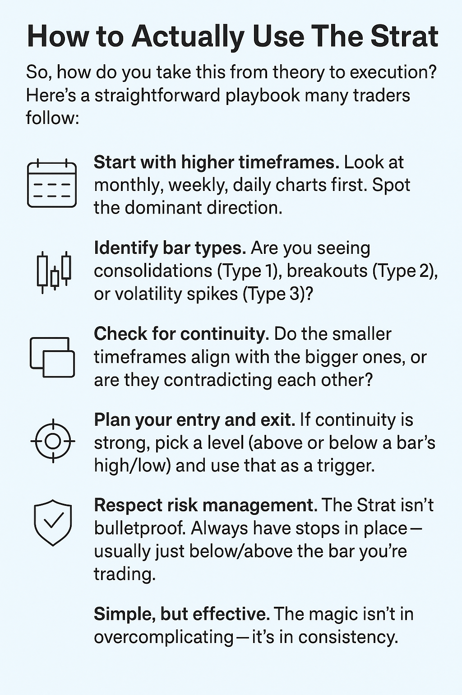

## What Is The Strat?

The STRAT (short for "strategy") is a trading methodology developed by Rob Smith. At its core, it strips down the chart to its purest form: candlestick bars. Just patterns that repeat across all markets and timeframes.

The big idea: every candlestick can be classified into one of three simple types. These types tell you if the market is stuck, breaking out, or stretching to new territory. By tracking them, traders can anticipate continuation or reversals with a lot more clarity.

## Key parts of STRAT Trading: 3 Bar Types

The entire method rests on three building blocks:

- **Type 1 (Inside Bar).** The current candle is inside the range of the previous one. That's consolidation, a pause before the next move.
- **Type 2 (Directional).** The candle breaks either above or below the prior bar's high or low. That's momentum in one direction.
- **Type 3 (Outside Bar).** The candle takes out both the high and low of the previous bar. That's volatility exploding, often catching traders off guard.

Think of these bars as words in a sentence. Alone, they say something simple. In sequence, they form a market story about where the price has been and where it might go next.

## Why The Strat Stands Out

Traders often call the Strat the "three-candle rule." At first glance, it sounds almost too simple, but that's exactly its strength. Instead of juggling ten different indicators, you focus on core price patterns. In crypto, where more than 300,000 candles form daily across just the top 20 coins, such a tool is a must-have.

What's even more interesting: a study by a well-known prop firm found that traders who stick to a structured analysis system (including The Strat) make about 27% fewer impulsive trades compared to those trading purely on gut feeling. That doesn't guarantee profits, but it does cut down the biggest enemy in crypto — chaos.

Most traders make the costly mistake of focusing only on strategy without considering account safety and risk protection.

<svg width="602" height="567" viewBox="0 0 602 567" fill="none" xmlns="http://www.w3.org/2000/svg"><path d="M507.435 265.841L300.586 469.72L301.222 566.465L601.846 265.841L336.005 0V370.19L400.602 310.562V161.492L507.435 265.841Z" fill="#FCD535"></path><path d="M94.4666 265.841L300.473 469.72L301.109 566.465L0.0557861 265.841L265.897 0V370.19L201.3 310.562V161.492L94.4666 265.841Z" fill="#FCD535"></path></svg>

Start trading with Hash Hedge today

<a class="banner-button" href="https://app.hashhedge.com/en/register/">Start Challenge</a>

## Timeframe Continuity: Seeing the Bigger Picture

Here's where most beginners mess up: they focus on a single chart and ignore the bigger context. The Strat insists you zoom out and check multiple timeframes. Why? Because the market is fractal, what happens on a 5-minute chart is just a tiny echo of what's unfolding on the daily or weekly.

If the daily, weekly, and monthly candles are all pointing in the same direction, that's called timeframe continuity. And it's powerful. Instead of guessing, you're stacking odds in your favor because you're trading with the flow of larger players: funds, institutions & whales.

Think of it like swimming: sure, you can paddle against the current, but isn't it easier (and faster) to let the tide push you where you want to go?

## How to Actually Use The Strat

So, how do you take this from theory to execution? Here's a straightforward playbook many traders follow:

- **Start with higher timeframes.** Look at monthly, weekly, daily charts first. Spot the dominant direction.
- **Identify bar types.** Are you seeing consolidations (Type 1), breakouts (Type 2), or volatility spikes (Type 3)?
- **Check for continuity.** Do the smaller timeframes align with the bigger ones, or are they contradicting each other?
- **Plan your entry and exit.** If continuity is strong, pick a level (above or below a bar's high/low) and use that as a trigger.
- **Respect risk management.** The Strat isn't bulletproof. Always have stops in place — usually just below/above the bar you're trading.
- **Simple, but effective.** The magic isn't in overcomplicating — it's in consistency.

## Why Traders Swear by It

Let's be real. Most strategies promise clarity, but sometimes leave you with more questions than answers. So, that's why you need this method:

- It reduces noise. Three bar types, that's it.
- It applies everywhere: stocks, crypto, forex, etc.
- It's scalable, working across any timeframe.

But the biggest reason traders swear by it is confidence. That confidence is what keeps you from panic-selling during a fake dip.

Most prop firms restrict what you can trade — no volatile coins, no news events, endless restrictions. Hash Hedge changed that. So, the result? Over $11M paid out so far to more than 4,500 traders worldwide.

## A Quick Example in Action

Imagine Bitcoin's daily chart shows a Type 1 inside bar (pause). The next day, price breaks above the previous high: a Type 2 up. If, at the same time, the weekly chart is also green and trending upward, you've got timeframe continuity on your side. That's not a guarantee, but it's a much stronger signal than blindly buying because "BTC looks bullish."

On the flip side, if you see an outside bar (Type 3) after a strong rally, that might signal exhaustion. Especially if smaller timeframes are flashing red. The story shifts, and The Strat helps you read that twist in real time.

## Conclusion: Why the Strat Method works

The reason The Strat has built a cult following is that it works on any timeframe. Some traders apply it to 5-minute scalps, others to monthly Bitcoin trends. But the simplicity of the rules doesn't mean the execution is easy. You need patience, discipline, and a strong stomach for waiting on confirmations.

The numbers back this up: around 70% of beginners give up on The Strat within the first three months, because the psychology of waiting and managing risk wears them down.

Frameworks like The Strat help you cut through the noise, but execution matters too. That's why platforms like Hash Hedge are reshaping prop trading & giving traders access to 160+ crypto pairs, funding up to $100,000, and zero hidden commissions.

You focus on the trade we provide the capital.
