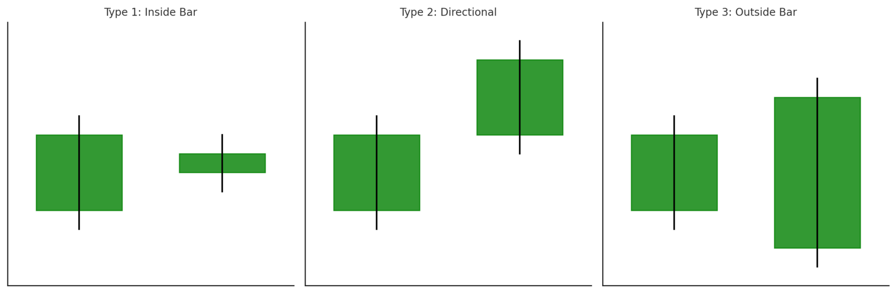
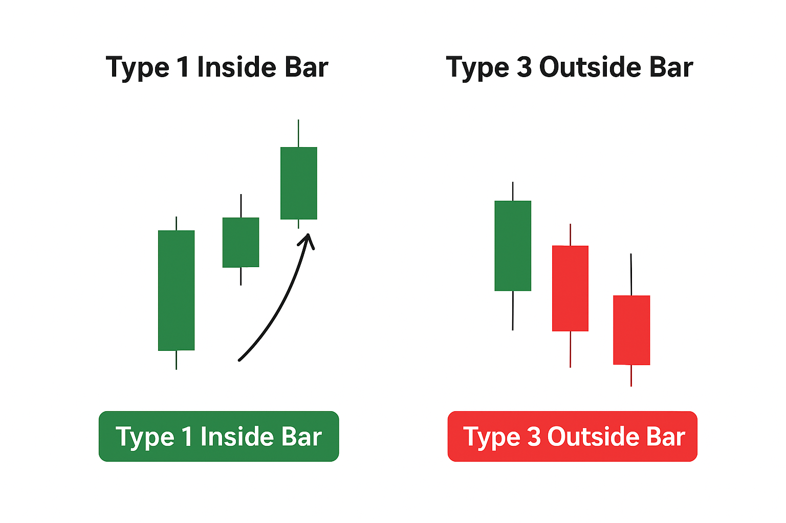

## Что такое Strat?

STRAT (сокращение от «strategy» — «стратегия») — это методика трейдинга, разработанная Робом Смитом. В своей основе она сводит график к его чистейшей форме: японские свечи. Всего лишь паттерны, которые повторяются на всех рынках и таймфреймах.

Главная идея: каждую свечу можно классифицировать по одному из трех простых паттернов. Они говорят вам о состоянии рынка. Отслеживая их, трейдеры могут предвосхищать продолжение тренда или развороты.

## Составляющие STRAT: 3 ключевых паттерна

Весь метод основывается на трех элементах:

- **Паттерн 1 (Inside Bar).** Текущая свеча находится внутри диапазона предыдущей. Это указывает на консолидацию, паузу перед следующим движением.
- **Паттерн 2 (Directional).** Свеча пробивается либо выше максимума, либо ниже минимума предыдущего бара. Это указывает на импульс.
- **Паттерн 3 (Outside Bar).** Свеча перекрывает и максимум, и минимум предыдущего бара. Это указывает на повышенную волатильность, которая часто застает трейдеров врасплох.

Думайте об этих паттернах как о словах в предложении. По отдельности они говорят о чем-то простом. В последовательности они формируют рыночную историю: где цена была и куда она может двинуться дальше.

## Почему Strat выделяется среди других стратегий

Трейдеры часто называют Strat "правилом трех свечей". На первый взгляд это звучит слишком просто, но именно в этом и есть его сила. Вместо того чтобы жонглировать десятью различными индикаторами, вы фокусируетесь на ключевых ценовых паттернах.

В криптовалютах ежедневно формируется более 300 000 свечей только по топ-20 монетам. Это огромный поток информации, который легко перерастает в информационную перегрузку.

Интересный факт: исследование показывает, что трейдеры, придерживающиеся структурированной системы анализа (включая The Strat), совершают примерно на 27% меньше импульсивных сделок по сравнению с теми, кто торгует только с помощью интуиции. Это не гарантирует прибыль, но сокращает воздействие главного врага в трейдинге — хаоса.

Большинство трейдеров совершают дорогостоящую ошибку, фокусируясь только на стратегии, без учета безопасности счета и защиты от рисков. Подробнее о безопасности трейдинга читайте в нашей статье.

## Непрерывность таймфреймов: Как увидеть общую картину

Вот где большинство новичков сдаются: они фокусируются на одном графике и игнорируют общий контекст. Strat настаивает на том, чтобы вы увеличили масштаб и проверили несколько таймфреймов. Почему? Потому что рынок фрактален: то, что происходит на 5-минутном графике, — всего лишь крошечное эхо того, что разворачивается на дневном или недельном.

Если дневные, недельные и месячные свечи указывают в одном направлении, это называется непрерывностью таймфреймов. Вместо того чтобы гадать, вы складываете шансы в свою пользу, потому что торгуете в потоке более крупных игроков: фондов, институтов и китов.

Думайте об этом как о плавании: конечно, вы можете грести против течения, но разве не проще (и быстрее) позволить приливу отнести вас туда, куда вы хотите?

## Почему трейдеры используют STRAT?

Давайте по-честному. Большинство стратегий обещают прибыль, но чаще оставляют у вас больше вопросов, чем ответов. Почему STRAT работает:

- Снижает информационную нагрузку. Три типа паттерна и все.
- Он применим везде: акции, криптовалюта, форекс и т.д.
- Он масштабируем и работает на любом таймфрейме.

Но главная причина, по которой трейдеры его используют, — это уверенность. Именно эта уверенность удерживает вас от панической продажи во время фейкового падения.

Большинство проп-фирм ограничивают вас: отсутствие волатильных активов и бесконечные ограничения. Ломайте правила вместе с Hash Hedge. Мы уже выплатили более $11 млн более чем 4500 трейдерам по всему миру.

## Пример как использовать STRAT

Представьте, что на дневном графике Биткоина появился Паттерн 1 (пауза). На следующий день цена пробивается выше предыдущего максимума: Паттерн 2. В то же время недельный график также зеленый и движется вверх. Конечно, это не гарантия результата, а гораздо более сильный сигнал, чем слепые покупки из-за того, что "BTC выглядит бычьим".

С другой стороны, если вы видите внешний бар (Тип 3) после сильной волатильности, это может сигнализировать об истощении рынка. Особенно если меньшие таймфреймы мигают красным. Strat помогает вам читать этот поворот в реальном времени.

## Почему STRAT работает и как лучше всего его применять

Причина, по которой STRAT приобрел культовое значение, в том, что он работает на любом таймфрейме. Некоторые трейдеры применяют его к 5-минутным скальпам, другие — к месячным. Но простота правил не означает, что исполнение дается легко. Вам нужно терпение, дисциплина и крепкие нервы, чтобы дождаться подтверждений.

Цифры подтверждают это: около 70% неопытных трейдеров отказываются от STRAT в первые три месяца, потому что психология ожидания и управления рисками изматывает их.

Подобные стратегии помогают вам пробиться сквозь шум рыночных новостей, но исполнение имеет большее значение.

Такие платформы, как Hash Hedge, меняют сферу проп-трейдинга и предоставляют партнёрам доступ к 160+ криптопарам, финансирование до $100 000 и отсутствие скрытых комиссий.

Вы фокусируетесь на сделке, мы предоставляем капитал.
