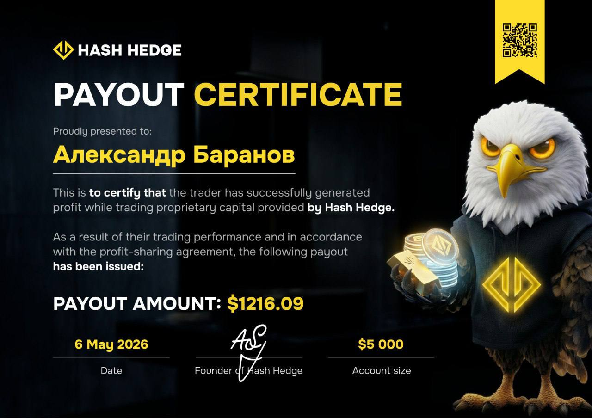
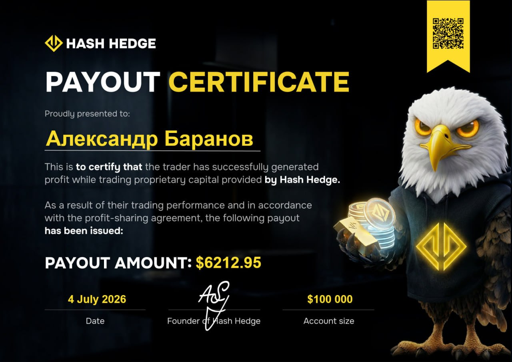

## Первый опыт с трейдингом и ликвидация

До Hash Hedge Александр торговал на разных криптобиржах, и там всё закончилось быстро. Александр завёл $100, вошёл в лонг почти на самом пике рынка, когда BTC дошёл до $13 700. Его настигла ликвидация.

> «Я умудрился открыть позицию (лонг) на самом пике. Меня сразу вынесло. После этого я сказал, что трейдинг не моё, и до свидания».

## Торговля с плечом x20

Возвращение в трейдинг произошло благодаря одному из блогеров. Он посмотрел видео с разбором рынка и решил попробовать ещё раз. Александр завёл $100 и открыл позиции с небольшими суммами $10. Далее произошёл эпизод, определивший его дальнейшее отношение к рынку. Во время резкого обвала он перепутал клавиши и случайно открыл сделку с максимальным доступным плечом — x20.

> «В моменте мне нарисовало плюс $800 при депозите в $100. Тут пошла самоуверенность: да я же крутой трейдер. Буквально через неделю рынок мне объяснил, что это не так».

Всё, что заработал, быстро слил.

## Правило «$100 в месяц»

После этого падения Александр придумал себе жёсткое ограничение: выделять на трейдинг не больше $100 в месяц и ставить задачу не заработать, а просто продержаться в рынке, не слив депозит.

> «Я сразу решил, что этот счёт точно солью. Задача была принимать участие в рынке, чтобы меня не выбило. Просто, чтобы не потерять депозит».

Слив продолжался около 7 месяцев. Потом в какой-то момент баланс перестал уменьшаться и начал расти. На этом же счету Александр сделал 10 иксов на депозите $100. Затем слил всё в ноль перед самым обвалом в период COVID-19, торгуя нефтью. Причём раньше вообще не торговал ей. Одна эмоциональная реакция на убыток потащила за собой вторую, и депозит обнулился.

## Первые шаги в проп-трейдинге

Далее Александр впервые услышал о проп-трейдинге. Чтобы разобраться, как работают челленджи и [Funded-аккаунты](https://www.hashhedge.com/blog/how-to-pass-crypto-prop-firm-challenge/ru), он обратился к ChatGPT. Изучив принцип работы проп-фирм, условия и лимиты, он решил попробовать. Александр проанализировал условия нескольких компаний на рынке и остановился на [Hash Hedge](https://hashhedge.live). Так начался его путь в проп-трейдинге.

## Первый челлендж – $5K

Александр начал с минимального челленджа Hash Hedge на $5 000, который он приобрёл за $49. Он успешно прошёл обе стадии и получил Funded-аккаунт. К торговле он подошёл с уже сформировавшейся стратегией. Ещё в сентябре Александр решил, что рост подходит к завершению, поэтому основную ставку сделал на шорт. В портфеле оказалось около 40 позиций, преимущественно по альткоинам. Дополнительно результат поддерживал лонг по UNI, который долгое время оставался в значительной прибыли. Во время торговли плавающая прибыль несколько раз достигала крупных значений, но Александр не спешил зафиксировать результат и продолжал следовать своему сценарию.

> «Я нашёл в себе силы сказать стоп, закрыть всё, забрать деньги и здесь перевернуться в шорт».

Первые выплаты были небольшими — 24,08 USDT, затем 411,20 USDT, а следующая составила уже 1 216,09 USDT.

## Второй челлендж – $100K

После одной из неудачных сделок челлендж $5K был слит на стадии Funded-аккаунт. Александр решил перейти на более крупный капитал и приобрёл челлендж на $100 000. Он вновь успешно прошёл обе стадии, получил Funded-аккаунт и уже в первый торговый период вывел 8 011,48 USDT.

Пока готовилось интервью с Александром, он получил ещё одну выплату на $6 212,95. Как написал сам Александр: «За вовремя закрытый шорт получена награда». Суммарные выплаты с двух челленджей составили уже более $15 000.

<svg width="602" height="567" viewBox="0 0 602 567" fill="none" xmlns="http://www.w3.org/2000/svg"><path d="M507.435 265.841L300.586 469.72L301.222 566.465L601.846 265.841L336.005 0V370.19L400.602 310.562V161.492L507.435 265.841Z" fill="#FCD535"></path><path d="M94.4666 265.841L300.473 469.72L301.109 566.465L0.0557861 265.841L265.897 0V370.19L201.3 310.562V161.492L94.4666 265.841Z" fill="#FCD535"></path></svg>

Храните до 90% прибыли на Funded-аккаунте до $150 000

<a class="banner-button" href="https://hashhedge.live/ru">Начать челлендж</a>

## 2 убыточных закрытия, которые спасли счёт

За всё время торговли на Hash Hedge Александр закрывался в минус принципиально только 2 раза. Оба раза, как выяснилось позже, это оказалось правильным решением.

Первый случай — сделка по DOT, которая на графике сформировала классическую фигуру «алмаз». Именно в этот момент его спрашивали, не хочет ли он зафиксировать $25 000 прибыли.

> «Глядя на этот алмаз, я подумал: ну вы что, с ума сошли, ни за что на свете я не заберу $25 000. Я ждал, что мы пойдём ещё выше, но не дали, и по итогу я закрылся в минус».

Фигура «алмаз» не сработала, потому что, как объясняет Александр, была перекрыта более старшей фигурой на графике, но решение закрыться в минус в моменте оказалось верным.

Второй случай — лонг по TON, который потащило больно и сильно вниз.

> «Согласно моей торговой стратегии я понимал, что не выдержу, и закрылся в минус. Если бы я упёрся и продолжал сидеть, этот аккаунт смыло бы полностью, и всей этой истории просто не было бы».

После этого он снова успешно зашёл в лонг, пересидел просадку в плюсе и в итоге закрылся с прибылью около $3 000 с небольшим. Правда, признаётся, что было обидно не дождаться ещё 3 дней ради лучшей цены.

## Стратегия набора позиций: 20 альткоинов

Отслеживать весь рынок физически невозможно, поэтому Александр работает с ограниченным списком примерно из 20 альткоинов, который пересматривает раз в год-полтора: перед каждым новым торговым циклом.

> «Некоторые выбирают торговать только BTC, либо BTC и ETH. Я торгую 20 альтов и пересматриваю список регулярно. Сейчас в списке есть монеты, которые я считаю более интересными. По ним я готовлюсь к альтсезону, ставлю на них сверхглубокие лимитные заявки. Дойдёт цена — отлично, будет альтсезон. Не дойдёт — пропускаю и иду дальше».

## Думай как маркетмейкер

Самая философская часть разговора про то, как вообще думать о рынке. Александр предлагает мысленный эксперимент: представить себя крупнейшим держателем биткоина и USDT, у которого нет возможности покупать и продавать по рынку — только выставлять лимитные заявки и двигать цену в любом направлении.

> «Как только вы проделаете этот мысленный эксперимент, сразу многое становится понятно. Сидишь и думаешь: куда мне двинуть рынок, чтобы люди мне либо продали, либо у меня купили».

По его словам, крупный игрок к тому же видит, сколько заявок стоит на покупку и продажу на каждом уровне, и может просчитать, кого реально «выбить» [стоп-лоссом](https://www.hashhedge.com/blog/stop-loss-prop-trader/ru), а кого нет. Ту же мысль подтверждает и эксперимент, о котором Александр читал: кто-то смоделировал воображаемый рынок торговли мороженым со средними игроками и крупными «китами». Далее обнаружилось, что привычные графические фигуры и уровни поддержки/сопротивления формируются сами по себе, без чьего-либо злого умысла. Просто такова природа рынков.

> «У меня есть поговорка, которая уже миллион раз подтвердила себя: спекулянты первичны, новости вторичны».

## Советы новичкам

Тем, кто только начинает, он советует не пытаться сразу заработать. Сначала «ликбез»: разобраться, что такое

- свечи
- биржи
- монеты
- лонг и шорт

Не только термины, но и суть. После этого пробовать делать прогнозы по рынку на небольшую сумму, $50-100 в месяц, и ставить задачу не заработать, а продержаться в торгах, не слив депозит.

> «Надо делать прогнозы, записывать их, а потом через время возвращаться и оценивать. Сначала точность 50 на 50, но со временем, по мере накопления опыта, она сдвигается».

Отдельно Александр отмечает, что принципиально не позволяет себе думать о том, что было бы, поступи он в прошлом иначе. Это профессионально деформирует трейдера и мешает жить и торговать в настоящем.

## Ключевые выводы

1. **Дисциплина важнее уверенности в прогнозе.** Александр был уверен в своей разметке графика и всё равно закрывался в минус, когда того требовала стратегия. Оба раза, когда он так делал, решение оказывалось верным.

2. **Лимиты на проп-счете — это плюс, а не минус.** Это позволяет контролировать риски и всё время быть начеку.

3. **Задача первых месяцев — это выжить, а не заработать.** $100 в месяц и цель не слить депозит — именно так родилась дисциплина, которая помогает ему регулярно получать выплаты.

4. **Не оглядывайся назад.** Александр принципиально не размышляет о том, что было бы, поступи он иначе. В трейдинге имеет значение только следующее решение.

## Читайте также

- [Сделал Х20 в проп-трейдинге: $99 → $2 000](https://www.hashhedge.com/blog/trader-story-made-20x/ru)
- [От продажи щебня и ремонта старых Жигулей до управления FUNDED-счетом](https://www.hashhedge.com/blog/trader-story-funded-account/ru)
