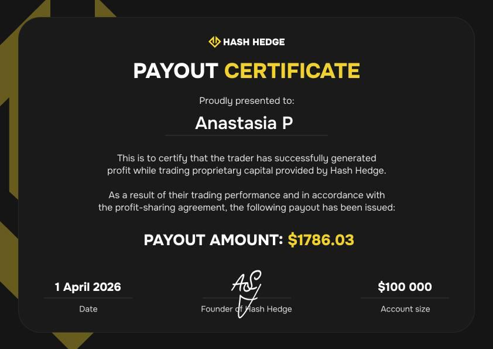

## Female Trader: Stereotypes and Differences from Men

For a long time, Anastasia did not tell anyone around her that she was trading. She was afraid of judgment and envy: trading results are easily read as "money from thin air." The secret came out when a few of her friends accidentally saw her on social media.

> "I realized that many women see this as an opportunity for financial freedom and self-fulfillment, but they are afraid — partly because of stereotypes, partly because it is genuinely scary: working with money, investing it in something you do not yet understand."

Anastasia has faced those stereotypes herself. Some assumed she was just living off her husband and "playing around" with trading. In her words, the image of a "real trader" is often a man who goes all-in, trades with massive leverage, and lives in constant stress. She sees no point in arguing in the comments.

> "Nobody pays me to prove anything to you. My strategy pays me. Why prove anything?"

With the male traders she actually discusses trades with, she has never encountered condescension — just a normal exchange of hypotheses. But when it comes to differences in approach between men and women, she has noticed something.

> "Women tend to trade more cautiously: they enter with smaller amounts and take less risk, but they also make less. Men are more willing to take bigger risks. If the prediction is right, the profit is higher, but the emotional swings are stronger too. Personally, I prefer stability, even if the profit is slightly lower."

## Charity and Life on Her Own Terms

Anastasia handles part of her profit in an unusual way: she donates 10% of every payout to dog shelters in Vietnam.

> "I read somewhere that successful people give away 10%, and I wanted to try it too. I earn money in comfortable conditions, sitting in front of a screen. So I want to contribute."

The rest she distributes across different directions: daily expenses, travel, and of course, small treats (good cosmetics, a pickleball racket).

> "It still feels like a regular salary. You just control it yourself."

## First Liquidation and the Move to Prop Trading

Anastasia started trading at 25, initially trading futures on crypto exchanges with her own money. The first results were small but memorable:

> "In my first month, I withdrew $87. I remember that figure because it was the first money. After that, it was a rollercoaster: +$200 at one point, then everything gone."

On October 10, 2025, she woke up, opened her phone... the balance was gone.

> "I thought my phone was glitching. I sat down at my computer. Literally 30 minutes earlier, my entire deposit had been liquidated. I sat there, feeling sad. It was an unpleasant feeling. That was my first liquidation. After that, I switched to isolated margin to reduce risk."

The deposit was small, and after hearing the stories of other traders about far more painful liquidations, Anastasia recovered quickly. But she did not want to go back to trading her own money: starting a new account from scratch felt like too slow a process.

Before Hash Hedge, Anastasia was able to make money trading, but a small capital remained a limitation: even with good trades, profits grew slowly, and the desire to speed up results could push toward excessive risk. What helped was a trading course she took after the liquidation — there she learned about prop firms as an alternative to crypto exchanges.

> "Essentially, I only risk the cost of the challenge. I do not lose $100,000 in a liquidation. That understanding helped me a great deal psychologically — I am trading with money that is not mine."

In her observation, many women who want to try trading are put off by unpredictable altcoins and 100x leverage. That is why the more tightly structured environment of a prop account suits this type of person much better than unrestricted exchange trading. That's how Anastasia came to Hash Hedge.

## Passing Challenges at Hash Hedge

Anastasia began her journey at Hash Hedge with a two-stage $5K challenge, but her first attempt ended at stage one. Her second challenge also did not go through — it too ended at stage one.

The third account was different. Anastasia took on the $100K challenge on February 16, 2026, and by March 1 she had completed both stages and received a Funded account. It took her just 13 days.

After reaching the Funded stage, Anastasia continued trading and received a $1,786.04 payout:

> "When you enter prop trading, you read online: scam, nobody will pay out. I thought: so what, even if they deceive me, I won't lose a huge amount. But when you actually receive a payout, it's a completely different feeling."

Anastasia also has a fun ritual: she likes to open positions with the numbers 86 or 68 in the size. In Vietnam, these numbers are associated with wealth.

> "I believe that if I enter with that setup, success is guaranteed."

With the money came a psychological adjustment.

> "If you started with a $100 deposit and suddenly you are given $100,000 to manage. It is very hard to adjust psychologically. With $100, you enter a position at $10, but here you need to go in at several thousand. That takes time to adapt to."

## A Lesson in Stubbornness: How Anastasia Lost One of Her Prop Accounts

Anastasia lost one of her prop accounts because she held on to a single scenario for too long, even after the market had already disproved it.

> "I got fixated on the idea that the price had to bounce according to the channel. Even when it did not bounce, I decided: this is definitely a false breakout, it will come back. I set a limit order, but the price started climbing, then dropped, then started recovering again. There were no signals left, the price had left the channel, I needed to stop — but that idea about the bounce had taken hold of me."

She re-entered long several times, trying to catch the reversal.

> "Bitcoin started falling. I thought: well, so be it. It was a very good lesson in my own stubbornness."

The only rule Anastasia added after that experience: never immediately re-enter a trade after a stop loss is triggered, even if the price then turns in the right direction.

> "If you hit a stop loss, that is it. If the price has left the channel, calm down. Close the computer, go for a walk, go to the gym, play with the dogs. The market will be here tomorrow, and so will your deposit."

<svg width="602" height="567" viewBox="0 0 602 567" fill="none" xmlns="http://www.w3.org/2000/svg"><path d="M507.435 265.841L300.586 469.72L301.222 566.465L601.846 265.841L336.005 0V370.19L400.602 310.562V161.492L507.435 265.841Z" fill="#FCD535"></path><path d="M94.4666 265.841L300.473 469.72L301.109 566.465L0.0557861 265.841L265.897 0V370.19L201.3 310.562V161.492L94.4666 265.841Z" fill="#FCD535"></path></svg>

Keep up to 90% of your profits on a funded account up to $150,000

<a class="banner-button" href="https://app.hashhedge.com/en/register/">Start a Challenge</a>

## Live Trade: A BTC Channel

Anastasia trades bitcoin, ether, oil, gold, and silver, but at the time of the interview there were no interesting setups in metals or oil, so they opened the chart on one of her active prop challenges — BTC.

> "We are in the middle of the channel. I never enter from the middle — it is the zone of uncertainty. The price could bounce and go up; in that case, I would short from $67,000–67,600. Or it could break the boundary and drop to $64,000. But right now, this would be more like gambling, because we are in the zone of uncertainty."

They decided to open a trade anyway for demonstration purposes: a short from the upper boundary of the channel. The risk-to-reward ratio turned out to be clearly unattractive.

> "We will lose $15, make $13. In reality I would not touch a trade like this, but just for interest, let's go in."

> "Now I am going to close this screen and not even think about it."

## The "Bouncing Ball" Strategy

Anastasia describes her method through a simple image. Imagine a ball bouncing inside a channel.

> "You draw a line connecting the highest points and a line connecting the lowest points within a certain range. As long as the price moves inside that channel, you understand: near the bottom you look for longs, near the top you look for shorts. The strategy needs to be simple, to get rid of overthinking and a pile of indicators. Those look nice, of course, but they only create confusion."

She builds the channel on the 4-hour chart (4H) and then moves down to the 15-minute chart (15m) to refine her entry. She trades bounces rather than breakouts and mostly uses limit orders — meaning she often does not have to sit in front of the chart at the moment of entry.

> "Because I live in Vietnam, when I go to sleep, the American session opens. While I sleep, something very interesting usually happens there. By the time I wake up, it is already the Asian session. On one hand, Asian traders may buy back what happened in the American session; on the other hand, I miss the most exciting moves."

## Take Profit, Stop Loss, and a 1:3 Ratio

Anastasia's exit logic mirrors her entry logic: the stop loss goes just outside the channel, while the take profit is placed near the opposite boundary.

> "What I like about the channel hypothesis is that you place your stop loss beyond the channel. That is all — there is nothing else to overthink. If the price breaks the channel, the hypothesis is wrong. We calmly close the trade and look for the next setup."

That is precisely why Anastasia prefers timeframes in the 1–4 hour range: the distance from one boundary to the other provides a good risk-to-reward ratio, up to 1:4–1:5. On one-minute charts, in her words, risk management "becomes uninteresting."

> "A comfortable ratio for me is 1:3. If I really want the trade, maybe 1:2.5. If I absolutely have to enter, I can go as low as 1:2. Anything below that is not interesting."

Anastasia is prepared to wait about a week for the right entry. Because she uses limit orders, she does not need to sit in front of the chart for that. Sometimes her patience does run out: if the price starts reversing before reaching the channel boundary and misses her limit order, she may enter manually with a wider stop. The alternative is another week of waiting for the next setup.

She also has a playful "theory":

> "If the chart shows a little rim, the price is more likely to go down; if there is a little dip, it is more likely to go up." Pure pattern recognition, not a signal.

## Advice for Beginners

We asked Anastasia what she would advise to beginners.

> "Choose one asset you understand and start with that for a while. Do not scatter your attention across all assets. Find the one where you consistently have a high win rate, and enjoy it. Then keep an eye on other assets."

And here is her advice for someone just starting to try prop trading:

> "The most important thing here is simply to start. It sounds obvious, but it is true. As long as you are watching someone else trade, you are still afraid — it is not your money, not your losses, not your profit. Start with a small amount — $1, $2, $3. What matters is feeling the actual process of trading, and then you will find your own strategy, assets, and so on."

## Key Takeaways

1. **A simple strategy does not mean a weak one.**

   Channel, bounce from the boundary, stop just beyond the break — that is the whole mechanics. Anastasia deliberately moved away from multiple indicators in favor of rules that leave no room for second-guessing in the moment.

2. **The psychology of capital size takes time.**

   Moving from a $100 deposit to managing $100,000 is not a technical shift but a psychological one. Anastasia consciously increased her position sizes gradually, not all at once.

3. **Blowups happen more from stubbornness than from breaking the plan.**

   Anastasia lost the prop account not because she broke her strategy but because she refused to accept that the price had already left the channel and there was no longer any signal to enter.

4. **External capital is not just money — it is also psychological protection.**

   Knowing that blowing a prop account means losing the challenge fee, not the full deposit, helped Anastasia approach risk more calmly and confidently. In her words, this works not just for her.
