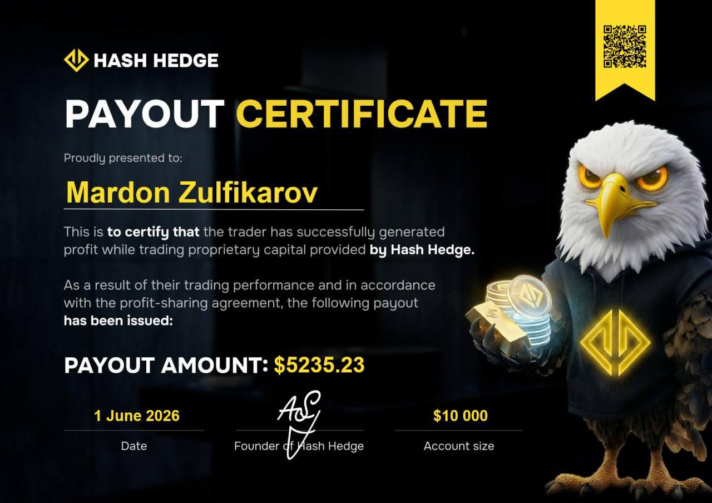

## Переезд и $10 000 картелям

Решение уехать в Америку в семье приняли за три дня. Как только связались с нужными людьми, которые организуют переезд через границу, сразу внесли первый платёж в размере $10 000 за Мардона. Начался обратный отсчёт.

> «На следующий день мне уже говорят, что я улетаю в Турцию. Я быстро бегу, прощаюсь с друзьями и уезжаю. Сам толком не понял, что случилось».

## Стамбул, буферная зона и депортация матери

В Стамбуле Мардон оказался один. Переночевал в отеле. Думал, на следующий день прилетит мама, но её не пустили в Турцию: раньше у неё уже была депортация из страны. Стамбульский аэропорт устроен так, что там есть техническая буферная зона: можно оказаться «между» границами, формально не выезжая в Турцию. Мама купила новый билет и прилетела именно в эту зону. Там они и встретились, переночевали 1 день в самом аэропорту. Дальше был перелёт через Гватемалу или Никарагуа (сам Мардон точно не помнит географию этого этапа) и короткая передышка у бассейна с видом на джунгли.

> «Я тогда подумал, если весь путь будет таким, я согласен. Но не тут-то было».

## Плот из шин, грузовик под тентом и забор на границе

Дальше был путь через Мексику: автобусами по 6–12 часов почти без остановок на отдых, с ночёвками в чужих домах на пару часов между перегонами. Деньги было велено прятать: по дороге останавливали и полиция, и картели, проверяя, есть ли что забрать. Если находили, держали человека, пока родственники не заплатят выкуп. Деньги Мардон с мамой спрятали в бутылочке из-под детской присыпки.

Одну из рек, по факту большое озеро, пересекали на плоту из грузовых шин с досками, 5–6 человек за раз. «Только не падайте», — предупреждали те, кто нас провожал, не объяснив почему. Оказалось, в воде были змеи и крокодилы. Отдельная лодка перевозила через воду машины. А ближе к границе группу примерно из 40 человек погрузили в грузовик и накрыли чёрным тентом, как груз. Один раз их остановила полиция с мигалками; водитель, судя по всему, договорился на месте, и через пару минут все поехали дальше.

> «Нам сказали, что вместе с нами перевозят и не очень хорошие вещи», — вспоминает Мардон.

Самым страшным моментом стал финальный рывок к границе: около километра бегом ночью, мимо стройки, под лучами прожекторов и лазерных прицелов пограничников. Мардон нёс 2 огромных рюкзака, чтобы не нагружать маму.

> «Если не успеешь пересечь границу, тебя задерживают и отправляют обратно в свою страну. Надо было успеть».

Саму границу проходили через участок с колючей проволокой, на которую набросили одеяло. Одна из девочек в группе, лет восьми, упала на проволоку при переходе; мужчина, который бросился её спасать, тоже поранился, но обоих забрали на лечение, никто серьёзно не пострадал. Стрельбы, вопреки ожиданиям Мардона, не было. Границу успешно пересекли.

## Первые месяцы в США: официант, скутер и Квинс

После пересечения границы Мардона задержали и разместили в отеле для мигрантов. Можно было остаться на 2 дня, он выпросил 5. Маму задержали отдельно и надолго. Не имея знакомых в стране кроме одной семьи из Узбекистана, Мардон напросился пожить у них. Их сын нашёл ему первую работу — официантом на еврейских свадьбах в Нью-Йорке.

Дальше он работал курьером на скутере, доставляя еду. Скутер был чужой и постоянно ломался. Однажды на Манхэттене порвалась цепь, и Мардон 3 часа пешком тащил его под дождём, пока случайный прохожий не помог докатить до дома.

Мама в центре содержания через других задержанных нашла поручителя с грин-картой. Он помог освободиться за пару дней, пока остальные требовали за такую же помощь $2 500. Узбекское комьюнити тоже поддержало: маме Мардона бесплатно предлагали еду и жильё.

## Лос-Анджелес: капсульный хостел и работа на складе

По совету знакомого семья перебралась в Лос-Анджелес, там было больше работы. Прилетели с $500 в кармане. Обычный временный приют для бездомных не устроил по описанию условий, а мини-хостел с капсулами (по сути, это койко-места в стене) стоил $650 в месяц с человека. Хозяева, выходцы из Казахстана, пошли навстречу: мама убирала хостел в счёт проживания. Мардон обещал доплатить, как только заработает.

Первую работу нашли через фейсбук- и телеграм-группы для мигрантов: расфасовка товаров на складе. Там же ему предлагали подзаработать на страховом мошенничестве, специально попасть в ДТП за $3000 от организаторов. Он отказался, узнав, что это поднимет его собственную страховку. С этой работы пришлось уйти: по закону нужно было быть старше 21 года, а Мардону тогда было 19. Взамен пошёл разносить рекламные листовки по домам в Санта-Монике. Специальное приложение отслеживало движение и штрафовало на $100 за остановку. По 40–50 километров пешком в день за $680 в неделю.

> «Первые недели было ужасно тяжело. Потом тело привыкло, я даже начал ходить в спортзал».

<svg width="602" height="567" viewBox="0 0 602 567" fill="none" xmlns="http://www.w3.org/2000/svg"><path d="M507.435 265.841L300.586 469.72L301.222 566.465L601.846 265.841L336.005 0V370.19L400.602 310.562V161.492L507.435 265.841Z" fill="#FCD535"></path><path d="M94.4666 265.841L300.473 469.72L301.109 566.465L0.0557861 265.841L265.897 0V370.19L201.3 310.562V161.492L94.4666 265.841Z" fill="#FCD535"></path></svg>

Пройди челлендж и получи до $150 000 в управление

<a class="banner-button" href="https://app.hashhedge.com/ru/register/">Начать челлендж</a>

## От бинарных опционов до наставника по трейдингу

С трейдингом Мардон впервые столкнулся ещё в Узбекистане, когда ему было 13 лет. На одной из платформ по бинарным опционам он занёс накопленные ~$50, чтобы задонатить в игры. Деньги слил быстро и забыл про это на годы. Уже в США, вспомнив про эту тему, он вернулся к той же платформе, начал учиться по роликам на YouTube, торговал 5-секундными свечами. Разогнал депозит со $100 до $700 и тут же попал в состояние, которое сам называет «лудоманией»: «Пытался отыграться после первых потерь. Ставки росли, в итоге слил весь депозит».

Переломным моментом стал другой YouTube-канал, автор которого предупреждал: минутки и пятисекундки — это не торговля, а рулетка. Работать нужно на таймфреймах от 15 минут до нескольких часов. Мардон перешёл на этот подход в трейдинге, и результат стал стабильнее.

Про [проп-трейдинг](https://www.hashhedge.com/blog/what-is-a-funded-account-crypto-prop-trading/ru) он узнал из видео узбекского трейдера, который слил на бирже $700 000 и с тех пор публично советует: «Если не можешь управлять капиталом на проп-счёте, не сможешь и своим». Эта мысль засела в голове.

## Как Мардон поверил в Hash Hedge

Изначально Мардон ничего не слышал про [Hash Hedge](https://www.hashhedge.com/). Чтобы проверить платформу, он зашёл в тематическое Telegram-сообщество для узбекских трейдеров, нашёл там ветку с подтверждёнными выплатами и написал лично почти всем, кто там отметился.

> «Все, кому я писал, подтвердили, что выплаты на Hash Hedge стабильно приходят, и показали свои сертификаты с выплатами».

**Первые два челленджа**

Первый челлендж на $10 000 Мардон слил практически сразу. Зашёл в сделку с огромным кредитным плечом без конкретной стратегии. Второй челлендж на $10 000 он проходил уже осознаннее. Биткоин тогда стоил около $59 000 и был на грани разворота. Мардон прошёл все стадии челленджа, получил Funded-аккаунт и первое время на нём вообще не торговал.

## 3 Funded-счета на $100 000 & Причины слива

**Получил новые челленджи**

Затем в Hash Hedge запустили акцию с бесплатным челленджем + Мардон купил один челлендж на $100 000. На всех челленджах он получил Funded-счёт.

> «Я понимал, что это уже мои деньги, и слил подряд все счета, поддавшись азарту».

Один из этих счетов Мардон потерял в момент, когда BTC резко обвалился с $70 000 до $60 000 на фоне ситуации между США и Ираном. Он не успел закрыть сделки по всем счетам сразу, [дневной лимит убытка](https://www.hashhedge.com/blog/stop-loss-prop-trader/ru) на аккаунте был превышен, и позиции закрылись автоматически. После этой потери интерес пропал: «В голове были мысли: да зачем мне этот трейдинг, ничего не получается».

**Сколько всего было счетов**

Всего у Мардона было 11 челленджей: семь на $100 000 и четыре на $10 000. До Funded-статуса дошли 6:

- три счёта на $100 000
- три счёта на $10 000

Четыре на $100 000 и один на $10 000 не прошли дальше первой стадии.

**Что помогло не слить окончательно и окупить потери**

Деньги, потраченные на неудачные челленджи, Мардон называет «инвестицией в себя». «В итоге я отбил всю сумму примерно за 2 месяца стабильной прибыли». Переломить ситуацию помог переход от эмоциональной торговли к работе «по статистике» — по заранее заданной системе (зоны ликвидности, уровни поддержки и сопротивления, минимум три подтверждения перед входом), а не по интуиции. Отдельно Мардон отмечает саму платформу: именно фиксированные лимиты на убыток не дали потерям выйти из-под контроля.

> «Если бы не было лимитов на убыток, я слил бы больше. Именно лимиты Hash Hedge меня и спасали».

## Сколько зарабатывает сейчас

**$10K – $15K в месяц на трейдинге**

Сегодня Мардон зарабатывает $10 000 – $15 000 в месяц (в «плохой» месяц — около $8 000). Он принципиально предпочитает торговать на Funded-счетах с разделением прибыли, а не рисковать личными средствами. Торгует Мардон преимущественно альткоинами, но старается следить за всеми активами, доступными на Hash Hedge. На анализ и сделки уходит от 3 до 8 часов в день.

Пример одной из выплат на платформе Hash Hedge по счёту $10K:

**Как Мардон борется с лудоманией**

Победить тягу к азарту до конца не получилось, но Мардон нашёл способ не пускать её в торговлю: как только тянет рискнуть без причины, он садится за покер или шахматы вместо открытия новой сделки.

> «Шахматы заставляют мозг придерживаться стратегии. Покер тоже помогает — по факту это тот же риск-менеджмент, только не на бирже».

> «Я лучше не зайду в сделку, даже если рынок летит вверх и все кричат про монету в новостях. Если у меня нет оснований, я не зайду».

Свой главный совет начинающим он формулирует так: «Купите проп-челлендж в Hash Hedge, там нет скрытых ограничений, которые есть у других. Торгуйте по статистике, а не наугад, ведите дневник трейдера. И не рассчитывайте заработать за неделю, на дистанции это не так работает».

## Ключевые выводы

- **Дисциплина, которую не купить.** Три Funded-счета на $100 000 Мардон потерял не из-за нехватки навыков, а из-за психологической ловушки: «Это уже мои деньги». Переход от челленджа к реальному счёту оказался для него сложнее самого испытания.
- **Лимиты платформы как внешний тормоз.** Там, где не хватает внутренней дисциплины, спасает жёсткий софт. Установленный платформой дневной лимит убытка физически останавливает торговлю до того, как потери станут катастрофическими.
- **Доверие через факты, а не рекламу.** Прежде чем поверить в Hash Hedge, Мардон лично написал десяткам реальных трейдеров с подтверждёнными выплатами. Только после этого он решился на первый челлендж.
- **Слитые счета — это часть пути.** Семь проваленных Funded-счетов полностью окупились за 2 месяца стабильной торговли. Это произошло сразу, как только Мардон заменил эмоции системной работой по статистике.

Hash Hedge — проп-трейдинговая компания, которая даёт трейдерам капитал в управление после прохождения челленджа. Подробнее об условиях и правилах читайте на официальном сайте [hashhedge.com](https://www.hashhedge.com/).
