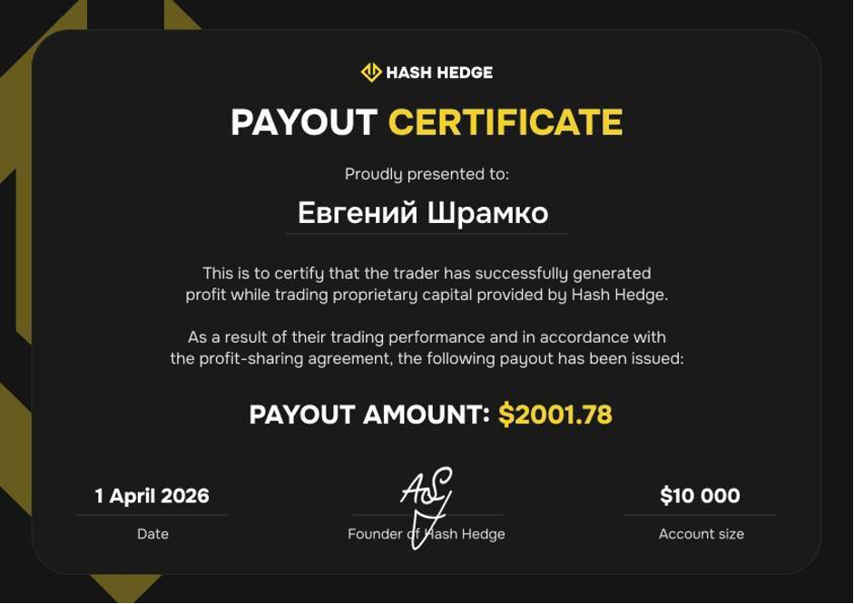

## Компьютерный клуб и 16 точек Wildberries

История Евгения началась в небольшом посёлке в Крыму.

В 14 лет он остался за старшего в большом доме с мамой и сестрой. Денег не хватало. Однажды он привёз домой две приставки Sony PlayStation и стал пускать местных ребят играть за деньги.

На вырученные средства семья взяла в кредит первые компьютеры. Вскоре домашняя подработка выросла в полноценный компьютерный клуб на 8 игровых мест с турнирами по Counter-Strike и Quake.

В 14 лет Евгений зарабатывал в день сумму, равную месячной зарплате школьного учителя.

Далее был переезд в Альметьевск, открытие мастерской по ремонту гаджетов, перепродажа автомобилей и запуск автосервиса с кузовным цехом.

В 2021 году он зашёл на рынок ПВЗ Wildberries и масштабировал сеть до 16 точек, наняв 32 сотрудника. Позже он продал сеть ПВЗ на пике стоимости.

## Ошибка на миллион

Самым серьёзным промахом в бизнесе Евгений считает потерю контроля над финансами в периоды высокой прибыли.

> «Когда на счёт каждый месяц стабильно приходит по 1 500 000 рублей, теряется бдительность. Начинаешь тратить деньги на личные нужды и масштабные проекты, не задумываясь о рисках кассового разрыва».

На волне высокого дохода от ПВЗ предприниматель активно занялся обустройством дома: положил брусчатку, установил дорогую систему снеготаяния, поставил забор.

Именно в этот момент пришла налоговая проверка. Бизнесу срочно потребовалась крупная сумма, которой в резерве просто не оказалось.

За 25 лет предпринимательской деятельности Евгений ни разу не привлекал партнёров и привык самостоятельно принимать ключевые решения. Вместо партнёров он нанимал управляющих и топ-менеджеров, однако отдельного специалиста, который контролировал бы финансовые потоки и формировал резервы, рядом не было.

> «Если бы рядом был финансист или бухгалтер, который говорил бы, что можно тратить, а что лучше оставить в резерве, проблему можно было бы легко закрыть».

## Путь к трейдингу: от бинарных опционов до волнового анализа

Евгений давно искал источники дохода, которые не связаны напрямую с управлением персоналом. Он тестировал арбитраж трафика, товарный бизнес и рекламу.

Однажды попробовал бинарные опционы. Заработал первые деньги и слил весь депозит. Бессистемная торговля — это путь в никуда.

Позже, через участие в известном криптопроекте с NFT-кроссовками, Евгений познакомился с предпринимателем, который ранее прошёл профессиональное обучение по волновому анализу.

Он поделился знаниями с Евгением. Так начался путь в трейдинге.

> «Раньше я относился к трейдингу как к угадайке. Но с опытом понял, что это не так».

## Первая сделка с плечом 100х

Свою первую сделку Евгений помнит в деталях. Он отправил на криптобиржу $10, открыл позицию с огромным кредитным плечом 100х и лёг спать, вообще не разбираясь в механике рынка.

> «Просыпаюсь, а на балансе $150. Вот она, золотая жила».

Радость была недолгой: весь полученный профит был слит. Но именно этот случай доказал, что на финансовых рынках есть огромная ликвидность.

> «Когда на балансе видишь циферки, это одно. Но когда меняешь на фиат, то совсем другое чувство. Жена не верила, что такое возможно».

В середине 2025 года, на фоне мощного ралли BTC к отметке $124 000, Евгений поймал волну. За 2 недели депозит вырос с $300 до $6 000, а через месяц на балансе было уже $17 000.

Всю сумму он вывел на нужды бизнеса.

> «Хорошо, что вывел. Иначе там всё и осталось бы. 10 октября 2025 крипторынок обвалился из-за новостей о новых тарифах Трампа».

## Минус $6 000 за один стоп

До знакомства с проп-трейдингом Евгений торговал исключительно на собственные деньги. Работал с валютными парами, золотом и рынком Forex, используя капитал, который выводил из бизнеса.

Результаты были нестабильными: иногда удавалось заработать, иногда сделки заканчивались убытком. Самый болезненный урок стоил ему $6 000.

Во время одной из сделок Евгений решил передвинуть стоп-лосс в надежде, что рынок развернётся. Вместо этого цена продолжила движение против позиции, и убыток вырос до $6 000.

> «Я потом эти деньги отбил, но вывод сделал навсегда. Если начинаешь двигать стопы и нарушать собственные правила, трейдинг превращается в азартную игру. Без жёсткого риск-менеджмента на рынке делать нечего».

Именно этот опыт позже заставил его совершенно иначе взглянуть на проп-трейдинг, где соблюдение правил [риск-менеджмента](https://www.hashhedge.com/blog/patience-in-trading-risk-management-discipline/ru) — не рекомендация, а обязательное условие работы.

## Переход в проп-трейдинг

Свободные средства направлялись на обустройство дома и воспитание двойняшек, но прекращать торговлю Евгений не планировал.

Решением проблемы стал формат [проп-трейдинга](https://www.hashhedge.com/blog/how-to-start-crypto-prop-trading/ru), который позволяет получить крупный капитал в управление, не рискуя своими деньгами.

> «В этот момент я узнал про Hash Hedge. Для меня это стало глотком свежего воздуха, ведь можно купить челлендж и не рисковать личными деньгами».

Главным аргументом в пользу [платформы](https://www.hashhedge.com/blog/best-crypto-prop-firms-2026/ru) стали отзывы практикующих трейдеров.

> «Все сомнения исчезли, я был уверен на 200%, что платформа выплатит мой профит».

Евгений изучил правила Hash Hedge и начал уделять проп-трейдингу больше времени.

## Три слитых челленджа на пути к Funded-аккаунту

Первые три челленджа Евгений слил один за другим, но каждый провал закрывал конкретный пробел в риск-менеджменте.

> «Если бы я торговал на эти деньги самостоятельно, то, скорее всего, потерял бы гораздо больше. Челлендж даёт дополнительную страховку. Да, на прохождение уходит время, но оно потрачено не зря. Уже после 2–3 попыток начинаешь лучше понимать риски, рассчитывать допустимое количество стопов и не повторять прежние ошибки».

Первые 3 челленджа стали для него лучшей практикой по управлению рисками:

1. **Попытка 1 ($5 000) → провал: изучение механики.** Первый челлендж Евгений брал для теста, чтобы разобраться в механике платформы: как работают ордера, стопы, правило [дневной просадки](https://www.hashhedge.com/blog/stop-loss-prop-trader/ru). Стратегию сознательно не докручивал, поэтому и слил счёт быстро — это был тест-драйв.

2. **Попытка 2 ($5 000) → провал: старые привычки.** Ко второму челленджу $5К он подошёл уже осознаннее, но старые привычки торговли на свои деньги никуда не делись. Главная проблема была не в размере позиции, а в неумении фиксировать прибыль: «У меня золотая середина между тейком и стопом. Я не закрываю, жду большего и в итоге улетаю в БУ, когда до тейка оставалось совсем чуть-чуть».

3. **Попытка 3 ($10 000) → провал: завышение объёма позиции.** Перейдя на счёт побольше, Евгений повторил классическую ошибку: перенёс на него те же абсолютные объёмы позиций, что использовал на $5 000, — удвоив риск на сделку. Просадка съела счёт быстрее, чем предыдущие два.

## Четвёртый челлендж: выплата $2 000

На четвёртой попытке Евгений пересмотрел подход к риску. Он снова выбрал счёт на $10 000, но торговал так, будто в его распоряжении было только $5 000:

- Уменьшил размер позиций.
- Строже выставлял стопы.
- Не торопился с прохождением этапов.

Более осторожная стратегия потребовала больше времени, но принесла результат: Евгений успешно прошёл все стадии и получил первую выплату в размере $2 000.

> «В проп-трейдинге у тебя нет другого выбора. Когда переходишь на вторую стадию челленджа, начинаешь гораздо жёстче контролировать риски. Ты уже понимаешь, сколько времени и усилий вложил в этот результат».

Новостью о выплате Евгений сразу поделился с участниками своей группы:

> «Когда пришла выплата, я отправил в группу сертификат. Ребята начали спрашивать: "Как это вообще работает?" — и с этого всё началось».

Полученная сумма полностью компенсировала расходы на предыдущие попытки и принесла Евгению первую чистую прибыль от проп-трейдинга.

## Советы новичкам

Сейчас Евгений успешно торгует на [Funded-счетах](https://www.hashhedge.com/blog/what-is-a-funded-account-crypto-prop-trading/ru) номиналом от $10 000 до $25 000.

Новичкам он советует начинать с небольших депозитов.

> «Когда на челлендже $5 000 или $10 000 получаешь первые $200–300, приходит осознание, что всё работает. Психологически это важнее всего».

Год назад, торгуя на свои деньги, Евгений потерял около $6 000 из-за классической ошибки — постоянно двигал стоп в надежде на разворот вместо того, чтобы зафиксировать убыток.

> «В проп-трейдинге такая ситуация невозможна. Тут есть фиксированные лимиты».

Главные плюсы модели проп-трейдинга он формулирует так:

- Ты не рискуешь собственными деньгами. Максимум, что можно потерять, — это стоимость челленджа.
- Жёсткие правила дисциплинируют так, как не получится дисциплинировать себя самостоятельно.

## Ключевые выводы

1. **Бизнес и трейдинг требуют разной энергии.** 25 лет постоянной работы с людьми вымотали Евгения сильнее, чем любые рыночные риски. Трейдинг он выбрал не потому, что там легче, а потому, что там не нужно зависеть от чужой ответственности.

2. **Контроль над деньгами важнее, чем их количество.** Стабильный доход без резервов и финансового планирования создаёт риски не меньшие, чем рискованная сделка.

3. **Слитый челлендж — это не провал, а плата за практику.** Три слитых челленджа не выбили Евгения из колеи, потому что каждый провал улучшал его риск-менеджмент. На четвёртой попытке он торговал иначе и дошёл до выплаты, которая окупила все предыдущие попытки.

4. **Проп-трейдинг контролирует риск-менеджмент.** Жёсткие правила риск-менеджмента, которые невозможно обойти, воспитывают дисциплину — она затем переносится и на торговлю собственным капиталом.
