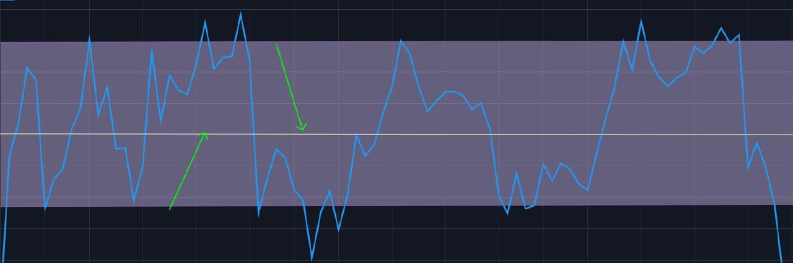

## Так что же такое торговый канал?

В основе всё просто: торговый канал — это диапазон, в котором цена движется между двумя линиями: верхней линией сопротивления и нижней линией поддержки.

Когда рынок уважает эти границы, трейдеры покупают у нижней границы и продают у верхней границы. На бумаге звучит легко. На практике же, всё осложняют ложные пробои, новости и маркетмейкеры.

Если интересно, как к рынкам подходят профессиональные инвесторы, загляни в наш гайд: Как начать инвестировать в хедж-фонды?

## Две классические разновидности

Вариаций каналов хватает, но для начала достаточно двух:

- **Восходящий канал.** Цена двигается к всё более высоким максимумам и минимумам. Трейдеры ищут возможности возле нижней линии тренда.
- **Нисходящий канал.** Противоположная история. Низкие максимумы, низкие минимумы, явный даунтренд. Здесь чаще шортят у верхней границы и фиксируют прибыль ближе к нижней.

Конечно, есть и боковые каналы, где рынок просто стоит в диапазоне без ярко выраженного тренда. Но это отдельная тема, мы к ней ещё вернёмся.

## Почему каналы так важны?

Фишка в том, что у рынка есть "память". Трейдеры помнят уровни, а алгоритмы их подхватывают, что приводит к усилению эффекта толпы. Поэтому каналы часто держатся дольше, чем кажется.

Да, это не идеальный инструмент, но он задаёт рамки. А когда есть рамки, эмоции меньше влияют на торговлю.

## Как найти канал без лишней головной боли

Для этого не нужен диплом по матанализу. Открой график, возьми инструмент "трендовая линия" и соедини хотя бы два максимума и два минимума, которые идут параллельно. Voilà, у тебя уже есть канал.

Пара советов, чтобы не видеть каналы повсюду:

- Используй значимые свинг-точки, а не каждую мелкую свечку.
- Чем больше цена касается линий, не пробивая их, тем сильнее канал.
- Не переусложняй график. Если выглядит криво, значит, это не канал.

## Как входить, выходить и какой риск

Отлично, перейдём к сути. Вот как именно торговать каналы:

- **Входы.** В ап-тренде ищем покупки у нижней границы, в даун-тренде — шорты у верхней. Хорошо, если объём подтверждает движение.
- **Выходы.** Чаще всего цель: противоположная сторона канала. Купил низко, продай высоко. Банально, но работает.
- **Стоп-лоссы.** Не пропускай этот шаг. Если цена пробила границу и пошла дальше, режь убыток. Ставь стопы чуть за пределами канала.

| Тип Канала | Как выглядит | Типичное направление рынка |
| --- | --- | --- |
| Трендовый | Параллельные линии (вверх, вниз или горизонтально) | Зависит от направления (бычий, медвежий, нейтральный) |
| Флэтовый | Боковое движение, без наклона | Нейтральное |
| Восходящий | Высокие максимумы и минимумы (положительный наклон) | Бычий |
| Нисходящий | Низкие максимумы и минимумы (отрицательный наклон) | Медвежий |

Забавный факт: многие опытные трейдеры на самом деле любят ложные пробои. Почему? Потому что они часто ловят нетерпеливых, а цена затем возвращается обратно в канал, вознаграждая тех, кто не вошёл в сделку.

## Боковые каналы: что это и для кого

Иногда рынок просто "отдыхает". Нет ни новых максимумов, ни минимумов — только узкий боковой диапазон. Новички не любят такие периоды, потому что "ничего не происходит". На деле же именно здесь копится энергия для следующего крупного движения.

Если научиться их распознавать, ты избежишь лишних сделок и возможно поймаешь пробой, когда он наконец произойдёт. Думай об этом как о затишье перед бурей.

## Частые ошибки, которых стоит избегать

Давай честно: все сначала ошибаются. Но есть несколько ловушек, которых реально можно избежать:

- **Поиск каналов.** Не стоит рисовать линии там, где их нет.
- **Игнорирование глобального тренда.** Торговать маленький нисходящий канал посреди большого буллрана? Не стоит, это опасно.
- **Отсутствие риск-менеджмента.** Если ты рискуешь половиной депозита ради одной сделки по каналу, это уже не трейдинг, а казино.

Торгуй без риска для твоего капитала. Торгуй с Hash Hedge.

## Полезные инструменты

Сервисы вроде TradingView или MetaTrader делают построение и корректировку каналов удобнее. Некоторые даже позволяют ставить алерты, чтобы не сидеть у монитора сутками. Стоит рассмотреть любой инструмент, который спасает от длительного мониторинга графиков.

Не пропусти нашу статью Следующий Крипто Булран: Когда произойдёт и чего ждать? — она поможет понять, как рыночные циклы могут усиливать сигналы, которые ты видишь на графике.

## Насколько надёжны каналы?

Не так сильно, как кажется. В трейдинге нет гарантии. Каналы ломаются, случаются ложные пробои, новости разрушают сетапы. Но есть одно но: каналы дают структуру. А структура — это уже половина успеха.

Если комбинировать их с другими инструментами, например с RSI для поиска импульса или индикаторами объёма для подтверждения силы движения — они становятся гораздо мощнее.

## Вывод

Торговые каналы — один из самых простых и эффективных инструментов для новичков, чтобы улучшить понимание точек входов и выходов. Когда видишь, как цена уважает эти невидимые границы, начинаешь замечать закономерности повсюду.

В следующий раз, когда откроешь график, спроси себя: движется ли цена между двумя границами? Если да — возможно, перед тобой карта твоей следующей сделки.

Хочешь торговать умнее, не рискуя капиталом? Присоединяйся к команде Hash Hedge и учись стратегиям, которые реально работают.
