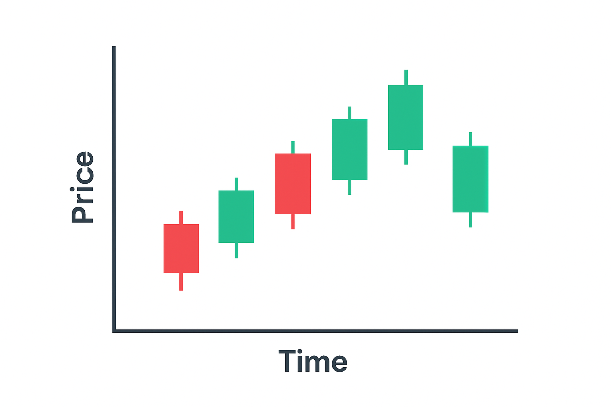

## Почему графики вообще важны

Представьте, что вы пытаетесь водить машину, не глядя на дорогу. Вот так выглядит трейдинг без графиков. Конечно, некоторые полагаются на новости или интуицию, но движение цены говорит правду.

Графики — это просто запись того, что уже сделали покупатели и продавцы. Они не предсказывают будущее, как хрустальный шар, но дают контекст. Быстрый взгляд может показать: идёт ли актив вверх? Колеблется ли рынок? Растёт ли объём? Этот контекст бесценен. Поэтому мы используем графики и свечи.

## Основы: что на самом деле показывает график

Каждый график состоит из трёх элементов:

- **Цена: сколько стоит актив в данный момент.** Цена отражает текущее противостояние покупателей и продавцов. Растёт цена — покупатели активнее, падает — контроль переходит к продавцам.
- **Время: когда была зафиксирована цена.** Каждая точка данных помечена временем. Именно оно формирует горизонтальную ось графика. Таймфреймы меняют историю, которую вы видите.
- **Объём: сколько людей участвовало в сделке.** Высокий объём означает участие многих игроков и весомость движения. Низкий — это, возможно, несколько трейдеров слегка двигают цену.

## Какими бывают Свечи и что они значат

Свеча — это маленькая история. Свечной график показывает, как меняется цена актива за определённый промежуток времени. Каждая свеча представляет собой отдельный временной отрезок: минута, час или день. Таким образом мы можем увидеть, какой цена была в момент открытия и закрытия, а также её максимальные значения в определённом промежутке времени.

Из чего состоит свеча:

- Тело свечи показывает цену открытия и закрытия.
- Тени (верхняя и нижняя) показывают экстремумы — максимальные и минимальные цены за период.
- Цвет указывает направление: зелёный (или белый) — рост, красный (или чёрный) — падение.

Существует тысячи свечных паттернов, поэтому их так сложно изучить и вовремя распознать. Но вот список самых популярных:

- **Дожи.** Открытие и закрытие почти совпадают — сигнал неопределённости.
- **Молот.** Маленькое тело с длинной нижней тенью — покупатели отбивают попытку продавцов снизить цену.
- **Поглощение.** Одна свеча полностью "поглощает" предыдущую — возможный разворот настроения.

Думайте о каждой свече как об отклике рынка. По сути это линия настроений, где все пытаются угадать следующий шаг.

## Как замечать тренды

Тренды — это сердце трейдинга. Восходящий тренд означает более высокие максимумы и минимумы. Нисходящий — наоборот. Боковое движение? Рынок делает паузу.

Визуализировать тренд можно вот так:

- Восходящий тренд — выглядит как лестница вверх.
- Нисходящий тренд — выглядит как спуск с холма.
- Боковое движение — ровная дорога до горизонта.

Также можно проводить трендовые линии. Соедините два и более максимума при нисходящем тренде или два и более минимума при восходящем — и вы увидите "путь" рынка. Ценовые каналы делают шаг дальше, показывая верхнюю и нижнюю границу диапазона.

Важно: торговать по тренду обычно проще, чем против него.

## Уровни Поддержка и сопротивление

Каждый трейдер рано или поздно сталкивается с этими невидимыми барьерами.

- Поддержка — уровень, где покупатели стабильно входят в рынок.
- Сопротивление — уровень, где продавцы сдерживают рост.

Рынки часто колеблются между этими зонами. Почему? Потому что психология человека повторяется. Когда трейдеры видят, что цена многократно удерживается или отталкивается от уровня, они реагируют одинаково. Эта повторяемость делает поддержку и сопротивление одними из самых надёжных понятий при чтении графиков.

Хотите быть готовы к разворотам рынка? Читайте наш гайд: Когда наступит следующий крипто Булран и учитесь замечать тренды заранее.

## Таймфреймы: как анализировать и зачем

Вот где всё усложняется: один и тот же график может выглядеть бычьим на дневном таймфрейме и медвежьим на пятиминутном.

Краткосрочные трейдеры (скальперы) фокусируются на минутных графиках, ловя быстрые движения. Свинг-трейдеры могут использовать дневные или недельные графики. Долгосрочные инвесторы смотрят на месячные таймфреймы.

| Таймфрейм | Кто использует | Что ищут | Описание |
| --- | --- | --- | --- |
| 1-5 мин | Скальперы | Быстрые движения, волатильность | Высокочастотные сделки, быстрые решения, реакция на малейшие колебания цены |
| 1Ч-4Ч | Дейтрейдеры | Внутридневные возможности | Открывают и закрывают позиции в течение дня, умеренный анализ, следят за новостями и паттернами |
| 1Д-1Н | Свинг-трейдеры | Среднесрочные тренды | Держат позиции дни/недели, ориентированы на тренд, балансируют между риском и прибылью |
| 1M+ | Инвесторы | Общая картина, долгосрочная перспектива | Фокус на фундаментальные показатели, терпеливы, меньше подвержены краткосрочной волатильности |

Представьте это как Google Maps: при приближении вы видите улицы и повороты. При отдалении вы видите целые страны. Обе перспективы важны — но последнее слово обычно остается за общей картиной.

## Объём и индикаторы: дополнительные слои понимания

Цена отражает, сколько рынок готов заплатить, объём показывает силу, стоящую за этим движением. Когда цена растёт при увеличивающемся объёме, это сигнализирует о сильном участии и уверенности. Напротив, рост цены при падающем объёме указывает на слабую поддержку и движение, которое может не удержаться. Объём помогает отделять настоящие тренды от краткосрочных всплесков.

Кроме того, трейдеры используют индикаторы как "фильтры" для информации. Вот несколько проверенных инструментов, удобных для новичков:

- **Скользящие средние (MA).** Сглаживают колебания, показывают общий тренд, помогают определять уровни поддержки и сопротивления.
- **Индекс относительной силы (RSI).** Показывает перекупленность или перепроданность, сигнализирует о возможных разворотах.
- **MACD (Moving Average Convergence Divergence).** Объединяет информацию о тренде и импульсе, помогает с таймингом входов и выходов.

| Индикатор | Основное применение |
| --- | --- |
| Moving Averages (MA) | Определение направления тренда, выявление зон поддержки/сопротивления |
| Relative Strength Index (RSI) | Определение перекупленности/перепроданности, прогноз разворотов |
| MACD | Отслеживание импульса и изменения тренда, помощь с таймингом сделок |

Совет: не перегружайте график индикаторами — слишком много инструментов парализует вас и не даст совершить правильное решение.

Большинство трейдеров ограничены правилами других платформ. С Hash Hedge вы сами выбираете активы, определяете стратегию, а мы предоставляем вам реальный капитал до $100,000.

## Применяем всё на практике

Допустим, вы открыли график. Разберём как использовать всю информацию выше:

1. Выберите таймфрейм и внимательно посмотрите на график.
2. Определите тренд: более высокие максимумы → рынок растёт.
3. Отметьте поддержку и сопротивление: например $105K и $110K.
4. Читайте свечи, смотрите популярные паттерны и применяйте их для понимания ситуации.
5. Проверьте объём: обычно объём растёт на отскоке.
6. Планируйте сделку: вход например около $106K, стоп ниже $105K, чтобы соблюсти риск менеджмент.

## Итого

Чтение графиков — это сложный аналитический процесс. Сначала каждая свеча кажется частью хаоса, на графике сплошной бардак. Но со временем появляется ритм: ты перестаёшь гадать и начинаешь видеть закономерности и понимать психологию рынка.

Обучение всегда связано с ошибками, а ошибки почти всегда стоят денег. Поэтому Hash Hedge меняет правила игры: мы даём трейдерам до $100,000 и 160+ криптопар, чтобы ты мог прокачивать навыки, торговать серьёзными объёмами и расти, не рискуя собственными сбережениями.

Ты сосредотачиваешься на сделках — мы даём капитал.
