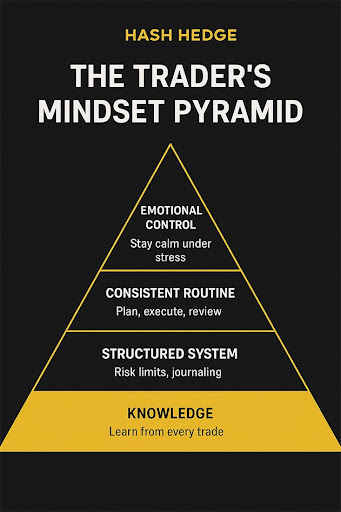

## Все думают, что окажутся в тех самых 10%

Каждый трейдер начинает с одной и той же мечты — финансовая свобода, гибкий график, и уверенность, что именно он сможет "обыграть рынок". Но цифры беспощадны: более 90% новичков сливают депозит в первые месяцы. Причина не в том, что они не умеют читать графики. Они просто не умеют думать как трейдеры.

Трейдинг — это в первую очередь умение управлять эмоциями под давлением. А большинство не выдерживает. Давайте разберёмся, как стать частью тех 10%, кто выживает, и научиться рисковать правильно.

## Жёсткая правда о психологии трейдинга

Ты можешь иметь идеальную стратегию, сотни часов бэктестов — и всё равно потерять всё за неделю. Почему? Потому что эмоции убивают дисциплину быстрее, чем любая неудачная сделка.

Овертрейдинг. Реванш-трейдинг. FOMO — всё это враги №1. Это симптомы непрокачанного мышления.

Ловил себя на мысли: «Сейчас ещё одну сделку, чтобы вернуть потерянное»? Это говорит твоё эго. А эго не заботится о риск-менеджменте. Горькая правда в том, что большинство трейдеров проигрывают не рынку — а самим себе.

## Почему стратегия важнее эго

Дай одинаковую систему двум трейдерам — один заработает, другой сольёт. Разница в одном: стратегия. Побеждают те, кто следует плану, у кого есть чек-лист. Проигрывают те, кто "чувствуют рынок". А рынок к чувствам, как известно, безразличен. Хорошая стратегия даёт прибыль, а структура — стабильность. Чёткие правила, лимиты риска и стратегия становятся щитом от эмоций.

Когда умеешь переживать ошибки, ты растёшь. А если хочешь торговать умнее — используй профессиональный терминал Hash Hedge: 160+ торговых пар, от BTC до Pepe. 5Х плечо и главное: никакого риска для собственных активов.

## Как выработать мышление трейдера (по шагам)

На 20% всё зависит от системы. На 80% — от головы. Вот четыре привычки, без которых не получится стабильно расти:

- **Уважай просадку рынка, умей принимать падения.** Если тебе сложно видеть собственный минус — тебе будет очень сложно принять минусовую сделку. А это значит только проигрыш рынку. Профи выживают потому, что знают, когда не нужно торговать.
- **Перестань торговать, слушая только своё эго.** Все приходят на рынок, чтобы заработать. Но хуже всего — думать, что ты умнее всех. Пытаясь кому-то доказать что-то, ты подставляешь свою стратегию. Главная ценность в стабильности, а не в мимолётном результате.
- **Терпение приносит деньги.** Рынок награждает тех, кто ждёт. Гонишься за каждой свечой — платишь налог на нетерпение тем, кто умеет ждать.
- **Рискуй так, чтобы спать спокойно.** Если не можешь уснуть из-за открытой позиции — размер твоей ставки слишком велик. В трейдинге главная цель — не адреналин, а долговечность и прибыль.

## Эмоциональная выносливость

Главный урок, который трейдер усваивает с болью: ты теряешь не из-за плохих сетапов — ты теряешь, потому что не умеешь проигрывать. По данным eToro и IG, 82% розничных трейдеров бросают торговлю в течение года — не из-за провала стратегии, а из-за психологии. Они удваиваются после убытков, закрывают прибыль слишком рано и держат убыточные позиции слишком долго — все признаки саморазрушения.

Трейдинг — это ментальный марафон. Лучшие трейдеры мира, от Пола Тюдора Джонса до розничных игроков, объединены одним: они пережили достаточно, чтобы научиться.

Когда перестаёшь мыслить днями и начинаешь мыслить кварталами, меняется фокус — ты перестаёшь гнаться за сетапами и начинаешь управлять результатами. Успех не в том, чтобы угадать следующий импульс, а в том, чтобы оставаться рациональным, когда все паникуют.

Стабильность появляется, когда ты не привязываешь самооценку к исходу сделки. Хорошая неделя не делает тебя гением. Плохая — не делает неудачником. Эмоциональная выносливость — это умение принимать убытки как опыт. Да, дорогой, но бесценный, если ты остаёшься в рынке. Это и есть мышление выживших.

## Среда имеет значение

Многие забывают: дисциплину нельзя построить в хаосе. Трейдинг из спальни без плана, без отчётности и без обратной связи — прямая дорога к выгоранию.

Наши данные показывают: трейдеры, работающие со стратегией, демонстрируют на 40% более стабильные результаты. Потому что у них есть рамки, контроль и поддержка. И главное — они не торгуют в одиночку. Трейдинг и закрытые сообщества объединяют людей, прошедших те же этапы — бессонные ночи, сливы, восстановления.

Ты учишься быстрее, потому что становишься частью системы и получаешь поддержку.

## Итоги

Каждая сделка чему-то учит: ждать, проигрывать, сохранять спокойствие, когда рынок сходит с ума. Ты не проиграл, если просто потерял часть средств. Ты проиграл, если перестал учиться.

Если готов торговать как профи — сфокусируйся на трёх вещах: дисциплина, структура и терпение.

Hash Hedge помогает трейдерам вырасти, давая им инструменты, капитал и систему, в которой можно расти — без риска для своих средств. Учись вместе с Hash Hedge.
