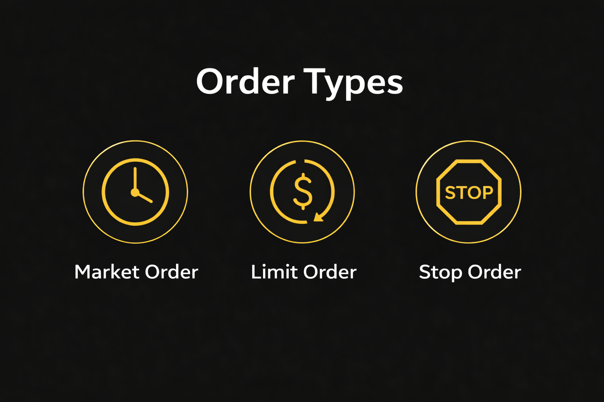

## Основные типы ордеров

На любой криптобирже трейдер сталкивается с несколькими базовыми инструментами исполнения сделок. К ним относятся рыночный ордер, лимитный ордер и стоп ордер. Эти инструменты используются для открытия и закрытия позиций, а также для управления риском.

Рыночный ордер используется тогда, когда трейдеру важно войти в рынок немедленно. Такой ордер исполняется по текущей рыночной цене за счет доступной ликвидности в стакане.

Умение работать с рыночным ордером важно при высокой волатильности. В условиях активного движения цены исполнение ордеров на криптобирже может происходить по нескольким ценовым уровням, что иногда приводит к отклонению фактической цены сделки.

Лимитный ордер работает иначе. Он позволяет трейдеру заранее указать цену, по которой он готов купить или продать актив. Сделка будет исполнена только в том случае, если рынок достигнет указанного уровня.

## Стоп-ордера и управление риском

Следующая категория — стоп ордер. Этот инструмент используется для автоматического открытия или закрытия позиции при достижении определённой цены.

Наиболее распространённым вариантом является стоп-лосс ордер, который ограничивает потенциальные убытки. Когда цена достигает заданного уровня, система автоматически закрывает позицию.

Другой важный инструмент — тейк-профит ордер. Он используется для фиксации прибыли, когда цена достигает заранее определённого уровня.

Такие ордера для управления риском позволяют автоматизировать управление выходом из позиции и помогают трейдерам соблюдать правила риск-менеджмент в криптотрейдинге. Использование защитных ордеров считается одним из базовых принципов управления рисками в трейдинге.

## Исполнение ордеров и управление позицией

Качество сделки во многом зависит от того, как происходит исполнение ордеров в трейдинге. На криптобиржах сделки исполняются через сопоставление заявок в стакане.

Когда трейдер использует рыночный ордер, система немедленно сопоставляет его с доступными заявками противоположной стороны. В случае лимитных заявок ордер попадает в книгу заявок и ожидает исполнения.

Понимание того, как работает стоп ордер, также важно для контроля сделки. После достижения определённого уровня такой ордер превращается в рыночный или лимитный, в зависимости от типа настройки.

Разные типы ордеров помогают трейдеру организовать управление входом в позицию и управление выходом из позиции без постоянного ручного контроля.

## Продвинутые ордера

Помимо базовых инструментов, многие биржи предлагают продвинутые ордера в трейдинге, которые позволяют более гибко управлять сделками.

К таким инструментам относятся условные ордера, которые активируются только при выполнении определённых условий рынка. Они часто используются для автоматизации торговых стратегий.

Также распространены ордера для фиксации прибыли и комбинированные заявки, позволяющие одновременно задать уровни выхода из позиции.

Такие автоматические ордера в трейдинге позволяют трейдерам заранее прописывать сценарии управления сделкой. Это важно при работе с торговыми ордерами криптовалют, где рынок может двигаться быстро и требовать мгновенной реакции.

## Ордеры и торговая стратегия

Типы ордеров напрямую связаны с тем, как трейдер управляет позицией и планирует структуру сделки. Например, размер позиции в трейдинге должен учитывать не только ожидаемое движение цены, но и возможное проскальзывание, глубину рынка и ликвидность актива. Неправильно выбранный тип ордера может привести к тому, что фактическая цена входа будет отличаться от запланированной, особенно на волатильных участках рынка.

Поэтому при построении стратегии трейдеры заранее определяют, какие торговые ордера криптовалют будут использоваться для входа, сопровождения и закрытия позиции. К примеру, лимитные ордера позволяют точнее контролировать цену входа, а защитные стоп-ордера помогают автоматически ограничивать потенциальный убыток.

В рамках внутридневных торговых стратегий трейдеры часто используют комбинацию нескольких типов ордеров. Рыночные ордера применяются для быстрого входа в момент сильного движения цены, тогда как лимитные заявки позволяют заранее выставить уровни для открытия позиции.

Кроме того, грамотное использование ордеров является частью управления рисками в трейдинге. Трейдер заранее определяет уровни, на которых позиция будет закрыта при неблагоприятном движении рынка, и устанавливает соответствующие защитные ордера.

Автоматические защитные ордера также позволяют структурировать управление входом в позицию и управление выходом из позиции. Это необходимо в условиях высокой волатильности крипторынка, где цена может быстро проходить значительные расстояния. Когда ключевые уровни заданы заранее, трейдер может сосредоточиться на анализе рынка, а не на ручном управлении каждой сделкой.

| Тип ордера | Как работает | Когда используется | Основное преимущество |
| --- | --- | --- | --- |
| Рыночный ордер | Ордер исполняется немедленно по лучшей доступной цене на рынке. Использует текущую ликвидность в стакане. | Когда нужно быстро открыть или закрыть позицию. Часто применяется при сильном движении цены. | Быстрое исполнение ордеров на криптобирже |
| Лимитный ордер | Трейдер заранее указывает цену покупки или продажи. Ордер исполняется только при достижении этой цены. | Когда важно точно контролировать цену входа или выхода из позиции. | Точный контроль цены сделки |
| Стоп ордер | Активируется при достижении определённого ценового уровня и превращается в рыночный или лимитный ордер. | Используется для автоматического открытия или закрытия позиции при пробое уровня. | Автоматизация управления входом в позицию |
| Стоп-лосс ордер | Защитный ордер, который закрывает позицию при достижении заданного уровня убытка. | Основной инструмент риск-менеджмента в криптотрейдинге. | Ограничение потенциальных убытков |
| Тейк-профит ордер | Ордер, автоматически фиксирующий прибыль при достижении заданной цены. | Используется для автоматического управления выходом из позиции. | Фиксация прибыли без ручного контроля |

Торгуй как профи на капитале до $100 000.

## Ордеры и профессиональный трейдинг

По мере роста опыта трейдеры начинают уделять больше внимания структуре исполнения сделок и контролю риска. В этом процессе типы ордеров становятся частью системного подхода к торговле.

Многие трейдеры со временем переходят к работе с более крупным капиталом через проп-трейдинг криптовалют. В такой модели трейдер может торговать не только на собственные средства, но и на капитал компании.

Современные крипто проп-компании предоставляют трейдерам возможность пройти отбор, получить финансируемый торговый аккаунт и масштабировать стратегии без увеличения личного риска.

Для многих участников рынка торговля криптовалютой на капитал компании становится следующим этапом развития после самостоятельной торговли.

## Итоги

Типы ордеров в трейдинге — это основа управления сделками. Понимание того, как работают рыночный ордер, лимитный ордер и стоп ордер, позволяет трейдерам точнее контролировать вход и выход из позиции.

Использование защитных ордеров помогает соблюдать риск-менеджмент в криптотрейдинге и снижать влияние эмоций на торговые решения.

В долгосрочной перспективе результат определяется не только стратегией, но и дисциплиной исполнения сделок.

Если твоя цель — трейдинг на капитал до $100 000, одним из вариантов может стать проп-трейдинг для криптотрейдеров.

Если ты хочешь проверить свою стратегию на практике и получить доступ к капиталу, можно пройти трейдинг-челлендж Hash Hedge и начать торговать на средства компании.
