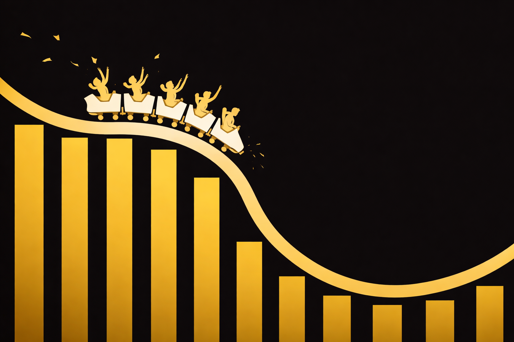
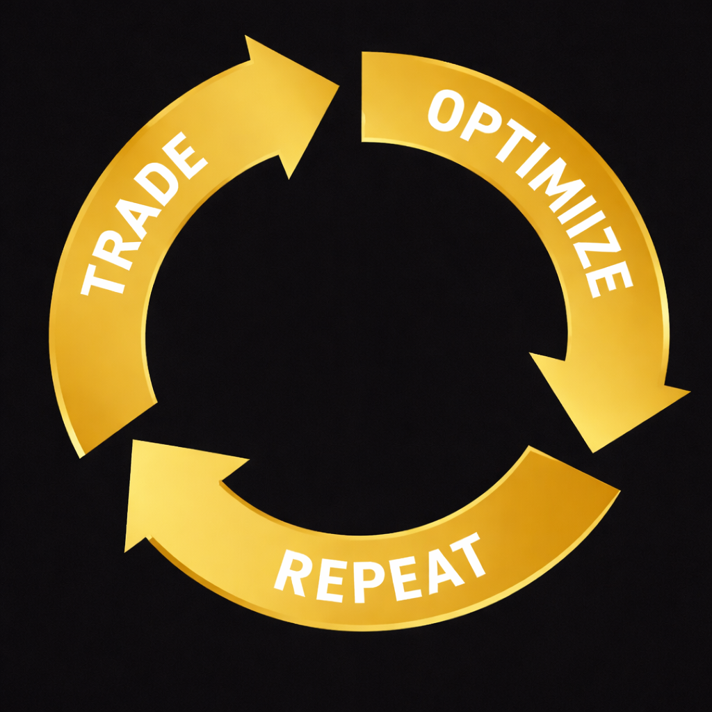

## Почему волатильность — это и возможности и риски

Когда рынок становится волатильным, у многих трейдеров возникает ощущение редкого шанса. Цена двигается быстро, диапазоны расширяются, потенциальная прибыль выглядит заметно больше, чем в спокойные периоды. В такие моменты появляется мысль, что можно хорошо и быстро заработать.

Однако высокая волатильность работает в обе стороны. Она увеличивает не только потенциальный профит, но и стоимость любой ошибки. Там, где в обычных условиях трейдер мог бы спокойно выйти с небольшим минусом или пересидеть шум, в резком рынке это уже не работает.

Во время сильных движений:

- Стоп-лоссы срабатывают быстрее, иногда без шанса на манёвр.
- Проскальзывание становится заметнее и системнее.
- Цена может пройти уровень и тут же вернуться, ломая привычную логику входов.
- Эмоции начинают влиять на решения сильнее, чем в спокойной фазе.

Особенно это чувствуется в крипто проп-трейдинге, где рынок работает 24/7 и импульсы могут возникать в любое время. Трейдеру приходится принимать решения быстрее, а времени на проверку сценариев становится меньше.

Если в такие моменты нет чёткой структуры торговли, волатильность начинает работать против трейдера. Сделки становятся более реактивными, риск — менее контролируемым, а решения — импульсивными. В результате даже сильная стратегия может начать давать нестабильный результат.

В рамках финансируемых торговых аккаунтов это ощущается особенно остро. Правила по дневному убытку и максимальной просадке не меняются из-за новостей или рыночных событий, и то, что в спокойном рынке было допустимым отклонением, в условиях высокой волатильности может быстро привести к нарушению лимитов.

Поэтому профессиональный подход к волатильности начинается не с поиска лучших входов, а с понимания её рисков и того, как она меняет условия торговли.

## Волатильность и проп-модель: почему правила здесь критичны

В условиях высокой волатильности особенно хорошо видно различие между торговлей на собственные средства и работой в проп-модели. Когда трейдер торгует своим депозитом, он может позволить себе больше свободы: увеличить риск, пересидеть просадку или просто остановиться без формальных последствий.

В проп-трейдинге ситуация другая. Трейдер работает на капитал компании, а значит, обязан строго соблюдать заранее заданные ограничения. Эти правила не становятся мягче из-за новостей, импульсов или ситуации на рынке.

Во время сильных движений проп-компании очень внимательно смотрят на поведение трейдера. В фокусе оказываются не отдельные сделки, а общая картина:

- Как быстро растут убытки.
- Соблюдаются ли дневные лимиты.
- Меняется ли размер позиции под давлением рынка.
- Способен ли трейдер остановиться после серии неудачных входов.

Высокая волатильность часто провоцирует желание действовать быстрее и агрессивнее, но в проп-модели это почти всегда работает против трейдера. Попытки успеть за рынком приводят к росту риска, ухудшению исполнения и, в итоге, к нарушению правил.

Профессиональный подход здесь заключается в обратном. Вместо ускорения трейдер замедляется: снижает объём, торгует реже, жёстче фильтрует сетапы. Это может выглядеть нелогично на фоне активного рынка, но именно так сохраняется контроль над счётом. В рамках финансируемых торговых аккаунтов волатильность становится не столько источником возможностей, сколько стресс-тестом дисциплины.

## Типичные ошибки при торговле новостей и импульсами

Большинство проблем во время волатильных фаз возникают не из-за рынка, а из-за поведения трейдера. Самые частые ошибки выглядят так:

Трейдер:

- Увеличивает риск из-за большого движения.
- Заходит без чёткого плана.
- Пытается отыграться после резкого стопа.
- Торгует каждое движение, не фильтруя сетапы.

В результате волатильность превращается из инструмента в источник хаоса.

## Как профессионалы работают с волатильностью

Опытные трейдеры не пытаются подстроиться под каждое резкое движение рынка. Наоборот, в периоды повышенной волатильности они сознательно сужают фокус и действуют более избирательно. Их цель — не поймать максимум движения, а сохранить контроль над процессом.

Работа с волатильностью у профессионалов начинается задолго до самого события. Сценарии на новости и сильные рыночные импульсы продумываются заранее: где торговля допустима, где риск нужно снизить, а где лучше вообще не участвовать. Это снимает необходимость принимать решения на эмоциях в моменте, когда рынок уже разогнан.

Ещё один важный момент — отношение к риску. В условиях резких движений опытные трейдеры почти всегда уменьшают объём позиции. Даже если сетап выглядит привлекательно, они понимают, что цена ошибки в такие моменты выше обычного. Снижение риска позволяет пережить нестабильные фазы без серьёзных последствий для счёта.

Также меняется подход к частоте сделок. Вместо того чтобы торговать каждое движение, профессионалы выбирают только те ситуации, которые действительно вписываются в их стратегию. Требования к качеству сетапов становятся жёстче, а лишняя активность воспринимается скорее как угроза, чем как возможность.

Отдельного внимания заслуживает готовность не торговать вообще. Для многих это выглядит странно, особенно когда рынок активно двигается, но настоящий профи понимает, что пропущенная сделка — это защита капитала.

В итоге профессиональный подход к волатильности это не попытка выжать максимум из каждого события. Это умение пережить нестабильный период без потерь, сохранить дисциплину и выйти из него в рабочем состоянии. Такой подход позволяет стабильно торговать, особенно в рамках проп-модели, где контроль над счётом важнее единичных удачных входов.

## Волатильность – твой фильтр

Одна из самых распространённых ошибок — воспринимать волатильность как обязательную точку входа. Кажется, что если рынок резко движется, значит, там обязательно есть возможность. На практике всё наоборот: в такие моменты условия часто становятся неподходящими для нормальной торговли.

Когда движение слишком быстрое, исполнение начинает ухудшаться, а риск становится сложно ограничить привычными инструментами. Сделки перестают укладываться в торговый план, и вместо осознанных решений появляются реакции на происходящее на графике.

В таких условиях лучшее решение нередко заключается в том, чтобы просто пропустить сделку. Для трейдера, работающего на капитал компании, это не проявление осторожности или страха, ведь умение не торговать в неподходящий момент часто важнее, чем желание участвовать в каждом движении рынка.

Начни торговать вместе с Hash Hedge.

## Итог: волатильность требует системы

Волатильность сама по себе не делает торговлю прибыльной. Она лишь усиливает всё, что уже есть в системе трейдера, как сильные стороны, так и слабые.

В проп-модели умение работать с резкими движениями рынка означает:

- Управление риском.
- Обдуманное принятие решений.
- Готовность действовать медленнее, когда рынок ускоряется.

Если твоя цель — стабильно торговать на капитал компании, волатильность должна быть частью стратегии, а не поводом для импульсивных решений. А если ты хочешь проверить, насколько твой подход готов к реальным условиям рынка, всегда можно начать торговлю с Hash Hedge и посмотреть, как система работает в моменты повышенного давления.
