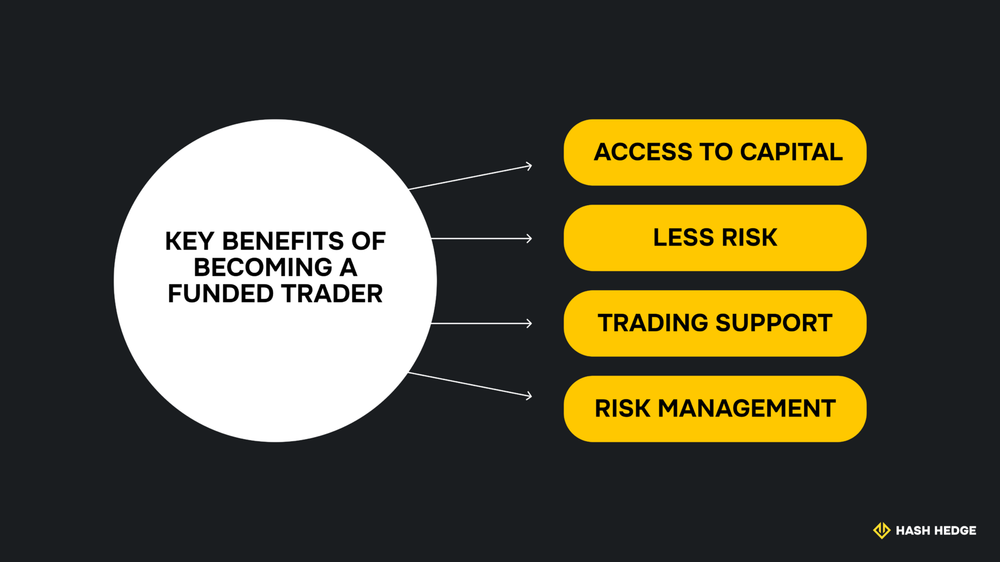

## What is a funded trading account?

A funded trading account is an account that prop firms give to traders, funded with real capital for trading stocks, bonds, commodities, metals and other financial instruments.

Funded accounts are given to traders who pass a thorough evaluation of their trading skills. They have precise risk management terms and profit targets. Traders who hit these targets are rewarded with the majority of their profits, while the prop firm retains the rest.

## Funded trader evaluation process

The evaluation process for funded traders usually comprises two phases: initial evaluation and verification.

### Phase 1: Initial evaluation

In the first stage, you'll trade in a demo challenge to prove your trading skills. This challenge can last up to 30 days, during which you're required to meet precise profit targets while adhering to the trading rules.

The aim is to get consistent profits over the initial evaluation period, rather than achieving infrequent one-off profits. Think of it as a first date, with your trading skills doing the charming and sweet-talking.

### Verification

After the initial evaluation, prop firms still want to verify that your performance wasn't a lucky event. You'll be given another trading challenge, but within a shorter period and with relaxed rules than the initial evaluation stage. It's the chance to prove that you're an adept trader, not just a random lucky one.

<svg width="602" height="567" viewBox="0 0 602 567" fill="none" xmlns="http://www.w3.org/2000/svg"><path d="M507.435 265.841L300.586 469.72L301.222 566.465L601.846 265.841L336.005 0V370.19L400.602 310.562V161.492L507.435 265.841Z" fill="#FCD535"></path><path d="M94.4666 265.841L300.473 469.72L301.109 566.465L0.0557861 265.841L265.897 0V370.19L201.3 310.562V161.492L94.4666 265.841Z" fill="#FCD535"></path></svg>

Start trading with Hash Hedge today

<a class="banner-button" href="https://app.hashhedge.com/en/register/">Start Challenge</a>

## Key benefits of becoming a funded trader

### Access to capital

The main benefit of funded trading is unlocking access to capital that isn't available in your personal capacity. Trading with external capital lets you scale up your trading strategies. You can amplify your trading profits by latching onto a prop trading platform that provides substantial capital.

### Less risk

Even when you have sufficient trading capital, funded trading lets you spread the risk instead of bearing it alone. Prop firms contribute capital to split the risks between you and them, and potentially make profits. This way, you won't bear any trading losses entirely.

### Trading support

Prop firms unlock access to sophisticated trading tools that boost your trading effectiveness. You'll have access to technical analysis tools that help you identify trends better. You can also work with the prop firm's experts to help refine your trading strategies.

### Risk management

Funded trading platforms offer risk management features that help you trade responsibly and boost your chances of success. These features include daily loss thresholds, stop-loss limits, price alerts, and maximum position limits.

## Risks and limitations

### Psychological pressure

External capital puts traders under much pressure to meet profit targets. Hence, traders need to be emotionally mature to handle this pressure and avoid responding hastily to market swings. When markets act unpredictably, emotional reactions can affect decision-making and lead to even more losses.

### Strict rules

Funded trading platforms have strict rules on assets and risk management, which is expected for a firm that gives you its capital to trade. These rules can limit your ability to pursue all your desired trading strategies, but it's a tradeoff that comes with taking external capital.

### Account termination

Traders who don't perform consistently usually have their accounts terminated by prop firms. The same applies to those who violate risk management rules. Account termination can be a disappointing experience for a professional trader.

### Evaluation fees

Traders pay fees to begin the evaluation process and access capital. These fees can be forfeited if you don't pass the trading test.

## How to choose the right prop firm

### Reputation

Your prop firm should have a positive reputation and track record amongst funded traders. Read reviews to see what other traders say about them. If reviews are overwhelmingly negative, it's a signal to look at alternative trading platforms.

### Payout structure

Confirm the prop firm's payout structure and ensure you're comfortable with it. For example, Hash Hedge gives traders 80% of profits and keeps the remaining 20%. This payout split is one of the best offered by a prop firm.

### Supported assets

Consider which assets your prop trading platform supports. Prop trading platforms can support cryptocurrencies, forex, commodities, stocks, bonds, etc. Ensure your chosen platform supports the assets you're most familiar with. For example, Hash Hedge supports over 200 cryptocurrency assets, ranging from mainstream coins like BTC to meme coins like DOGE.

### Rules

Verify a prop firm's rules and ensure you're okay with them before proceeding. Failure to adhere to the firm's rules can cause long-term problems, so you should be aware of these rules before taking their capital.

### Community support

Consider the support resources made available by the prop firm. Ideally, the firm should have a dedicated customer support team you can contact with inquiries. Verify which resources and technologies they offer traders to boost their effectiveness.

## Pro tips to pass the evaluation

### Understand the rules

Passing the evaluation starts with understanding the prop firm's rules and expectations. Verify their risk management rules, profit targets, and other standards that traders are expected to adhere to. Prop trading platforms state these rules clearly before you begin the evaluation process.

### Consistency over one-off profits

Focus on making consistent profits instead of one-off wins. As a trader, not all your strategies will reap profits, but the idea is to achieve more wins than losses overall.

It's better to deliver consistently than lose mostly and make one-off profits to offset these losses. Prop firms want traders to perform well in the long term, not just have short bursts of success.

### Thorough planning

You should have a clear trading strategy and avoid trading based on random intuition. You should be able to stick to your plan even when the markets behave negatively.

Overtrading tends to cause more losses in the long term, so avoid tweaking your trades each time the market becomes unfavourable. The market is naturally volatile– you should have the discipline and patience to ride through tough times, but also know when to abandon a strategy that isn't yielding results.
