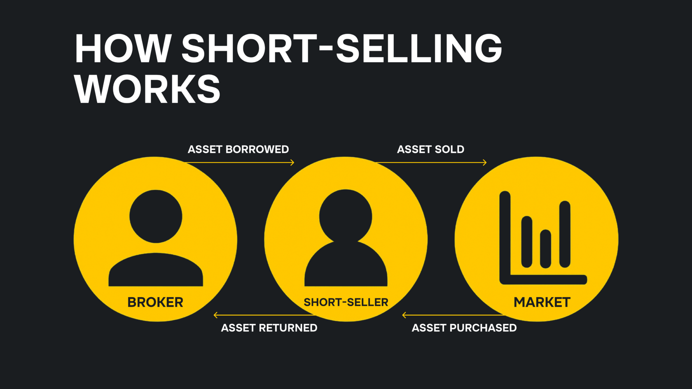
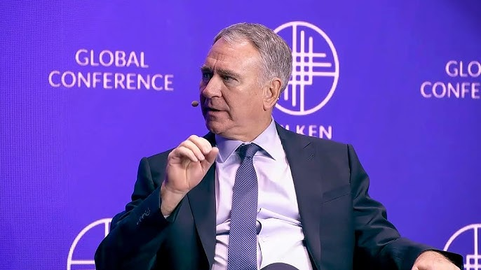

## Определение хедж-фонда

Проще говоря, хедж-фонд — это инвестиционный фонд, который объединяет деньги частных лиц и организаций и инвестирует их в активы для получения положительной доходности. Прибыль затем распределяется между инвесторами и управляющими фондом в соответствии с согласованными условиями.

В хедж-фондах есть две основные стороны: коммандитисты (ограниченные партнёры) — частные лица и учреждения, предоставляющие капитал, и генеральный партнёр — управляющая компания, которая инвестирует средства от имени коммандитистов.

## Ключевые особенности хедж-фондов

- **Гибкие инвестиционные стратегии.** Хедж-фонды инвестируют в широкий спектр активов, включая акции, ценные бумаги с фиксированным доходом, сырьевые товары, валюты, деривативы и другие финансовые инструменты.
- **Использование заёмных средств (леверидж).** Хедж-фонды часто привлекают заёмные средства для торговли и увеличения потенциальной доходности капитала клиентов.
- **Меньшее регулирование.** Хедж-фонды менее регулируются, чем паевые инвестиционные фонды, поскольку они ориентированы на опытных инвесторов. Это обеспечивает им большую гибкость при выполнении сделок и возможности для получения существенной прибыли, но также повышает риски для коммандитистов.
- **Структура комиссий.** Хедж-фонды взимают управленческий сбор на основе объёма активов под управлением, а также комиссию за результат — процент от полученной прибыли. Стандартные комиссии составляют 2% за управление и 20% за результат, однако эти ставки могут варьироваться в зависимости от конкретного фонда.
- **Ограниченная ликвидность.** Инвесторы часто соглашаются на «период блокировки» средств на определённый срок (например, шесть месяцев или год). Досрочное изъятие средств обычно влечёт штрафные санкции, включая значительный выкупной сбор. Это позволяет хедж-фондам реализовывать долгосрочные инвестиционные стратегии.

## Типы хедж-фондов

Существует четыре основных типа хедж-фондов: фонды акций, глобальные макрофонды, фонды относительной стоимости и активистские фонды.

### Фонды акций (Equity)

Фонды акций инвестируют напрямую в акции, как на внутренних, так и на зарубежных рынках акций. Они также совершают short-продажи акций (открывают короткие позиции) для хеджирования от спадов на рынке акций.

Short-продажа (продажа без покрытия) предполагает заимствование акций и их немедленную продажу с целью выкупить их позже по более низкой цене и получить прибыль за счет разницы. Например, фонд может занять 10 акций Компании А, которые в настоящее время торгуются по $9, а затем продать их за $90 ($9 x 10 акций).

Если цена акций Компании А падает до $5, фонд выкупит 10 акций по $5 каждая, что обойдется в $50. Он вернет 10 акций кредитору и удержит оставшуюся сумму, которая составляет $90 минус $50, что приведет к прибыли в $40.

Short-продажа является противоположностью традиционной «длинной» позиции (long), при которой фонд покупает акцию и рассчитывает продать её позже по более высокой цене.

### Глобальный макро

Глобальные макрофонды — это активно управляемые фонды, главная цель которых — получать прибыль от рыночных колебаний, вызванных экономическими или политическими событиями.

Например, недавнее введение пошлин правительством США вызвало значительные колебания цен в глобальной финансовой системе, особенно на рынках развивающихся стран. Одни активы резко подешевели, а другие подорожали. Глобальные макрофонды стремятся извлечь выгоду из таких рыночных движений.

### Относительная стоимость

Фонды относительной стоимости фокусируются на выявлении и использовании неэффективностей рынка. Они извлекают прибыль из временной разницы в ценах на связанные ценные бумаги.

Например, Компания А может объявить о согласии купить Компанию Б по цене $30 за акцию. После этой новости цена акций Компании Б подскакивает с $20 до $29, но не до полных $30, потому что всегда есть риск, пусть и небольшой, что сделка не состоится.

Фонд может купить акции Компании Б по $29, делая ставку на то, что сделка будет завершена. Если это произойдет, фонд заработает $1 прибыли на каждой купленной акции. Эта сумма может показаться незначительной, но если фонд купил миллионы акций, он может получить прибыль в миллионы долларов за короткий период.

### Акционистские фонды (Activist)

Акционистские хедж-фонды инвестируют в компании и предпринимают действия, направленные на повышение стоимости их акций.

Например, фонд может инвестировать в компанию и рекомендовать совету директоров избавиться от убыточных подразделений, сконцентрировавшись вместо этого на прибыльных.

Акционистские хедж-фонды нанимают опытных профессионалов для выявления недооцененных компаний, в которые можно инвестировать, чтобы затем активно влиять на их управление.

## Структура хедж-фонда

Хедж-фонд является зарегистрированным юридическим лицом, состоящим из двух основных сторон: партнеров с ограниченной ответственностью (LP), которые предоставляют средства, и генерального партнера (GP), который принимает инвестиционные решения. LP обычно являются аккредитованными частными и институциональными инвесторами.

LP и GP подписывают формальное соглашение с точными условиями, включая обязательства по капиталу, комиссии за управление, условия распределения прибыли, срок блокировки и инвестиционную стратегию хедж-фонда. Это соглашение является юридически обязательным, и несоблюдение его условий может привести к судебному иску.

## Как работает хедж-фонд?

Ниже представлен пошаговый процесс работы хедж-фонда:

1. Квалифицированные инвесторы вступают в фонд и предоставляют значительный капитал.
2. Управляющий инвестирует деньги, привлекая талантливых трейдеров и профессиональных управляющих фондами для разработки прибыльных стратегий.
3. Комиссии взимаются на основе стоимости активов фонда и полученной прибыли.
4. Инвесторы регулярно получают отчеты о стратегии фонда, доходах и убытках.
5. Инвесторы могут забрать свои деньги в оговоренное время или хранить их в фонде так долго, как пожелают.

Иногда хедж-фонды намеренно возвращают капитал инвесторам, чтобы ограничить объем активов под управлением, например, если их торговые стратегии не подходят для больших сумм. Управляющие хедж-фондами также могут закрыть фирму и вернуть ее капитал инвесторам.

## Стратегии хедж-фондов

Распространенные стратегии хедж-фондов включают:

- **Акции: длинные/короткие позиции.** Эта стратегия предполагает покупку недооцененных акций с целью их продажи по более высокой цене и короткие продажи переоцененных акций для получения прибыли при падении их цены.
- **Событийно-ориентированная.** Эта стратегия предполагает принятие обоснованных торговых решений на основе конкретных событий, таких как слияния, банкротства и реструктуризации.
- **Относительная стоимость.** Эта тактика предполагает использование разницы в ценах между связанными активами.
- **Количественный анализ.** Количественные хедж-фонды используют математические модели для выявления и использования краткосрочных неэффективностей рынка. Они нанимают собственных трейдеров для разработки и создания компьютерных торговых моделей. Эта стратегия является высокоавтоматизированной и высокочастотной, где важна каждая миллисекунда.
- **Мультистратегия.** Хедж-фонды часто используют несколько стратегий, нанимая опытных трейдеров для каждой из них. Мультистратегические хедж-фонды диверсифицируют свои риски по различным стратегиям, тем самым снижая свою подверженность рыночным спадам. Эта диверсификация является конкурентным преимуществом перед другими компаниями.

Интересуетесь стратегиями в стиле хедж-фондов, но предпочитаете торговать на своих условиях? Hash Hedge поддерживает независимых криптотрейдеров с гибкими правилами, честной оценкой и более чем 200 активами для работы.

## Примеры хедж-фондов

### Citadel LLC

Основанный в 1990 году легендарным инвестором Кеном Гриффином, Citadel является одним из самых успешных хедж-фондов в мире. Базирующийся в Майами, Флорида, хедж-фонд управляет активами на сумму свыше 60 миллиардов долларов и с 1990 года демонстрирует среднегодовую доходность в размере 19%, что является одним из лучших показателей в индустрии ценных бумаг.

### Renaissance Technologies

Часто называемый RenTech, этот хедж-фонд имеет лучшие показатели в индустрии количественных хедж-фондов. Он известен своим небольшим штатом сотрудников, секретностью и выдающейся инвестиционной доходностью. Флагманский фонд компании Medallion Fund с 1988 по 2021 год демонстрировал среднегодовую доходность в размере 66%. Компания управляет активами на сумму свыше 100 миллиардов долларов для своих партнеров с ограниченной ответственностью.

## Известные управляющие хедж-фондами

### Джулиан Робертсон

Покойный Джулиан Робертсон (1932-2022) основал Tiger Management, один из первых глобальных хедж-фондов, в 1980-х годах. Tiger Management стал чрезвычайно успешным хедж-фондом, принося ежегодную доходность в размере 31,7% с 1980 года до пика активов под управлением в 1998 году. На пике своего развития фонд управлял активами на сумму 22 миллиарда долларов.

Робертсон закрыл Tiger Management в 2000 году и переключился на наставничество и начальное финансирование новых, опытных трейдеров, известных как «Тигрята» (Tiger Cubs). Эти «тигрята» впоследствии создали одни из лучших по производительности хедж-фондов современности, такие как Tiger Global Management и Viking Global Investors.

### Кен Гриффин

Кен Гриффин — самый известный управляющий хедж-фондами в Америке. Его мультистратегический фонд Citadel LLC управляет активами на сумму свыше 60 миллиардов долларов и славится своей выдающейся доходностью. Только в 2024 году Citadel получил доходность в 15%, а в 2022 году его прибыль после выплаты комиссий составила 16 миллиардов долларов, что стало крупнейшим известным годовым доходом хедж-фонда.

Наряду с Citadel LLC, Гриффин также управляет компанией по маркет-мейкингу Citadel Securities. В 2024 году ее торговая выручка достигла рекордных 9,7 миллиардов долларов, укрепив репутацию Citadel как одного из самых успешных фондов в истории.

## Вознаграждение в хедж-фондах

Хедж-фонды обычно следуют системе вознаграждения «2 и 20», которая включает ежегодную комиссию за управление в размере 2% и комиссию за результат в размере 20%.

- Комиссия за управление рассчитывается на основе чистой стоимости активов под управлением. Например, фонд, управляющий 5 миллионами долларов, будет ежегодно получать 2% (100 000 долларов) в виде комиссий за управление.
- Комиссия за результат рассчитывается на основе прибыли, полученной от капитала инвесторов. Например, если вышеуказанный портфель в 5 миллионов долларов вырастет до 5,5 миллионов долларов, фонд получит 20% от прибыли в 500 000 долларов, что составит 100 000 долларов дополнительно к комиссии за управление.

Система «2 и 20» является усредненной, но вознаграждение может значительно варьироваться в зависимости от фонда. Например, RenTech как-то раз раскрыла информацию о том, что взимает комиссию за управление в размере 5% и до 44% в виде комиссии за результат для своего флагманского, многомиллиардного Medallion Fund. Многие хедж-фонды взимают комиссии значительно выше или ниже стандартной системы «2 и 20», в зависимости от их результатов. Иногда разные инвесторы платят разные комиссии. Все зависит от контракта.

## Различия между хедж-фондами и взаимными фондами

Хедж-фонды — это частные инвестиционные партнерства, которые используют спекулятивные инвестиционные методы с более высокими рисками, в то время как взаимные фонды используют стандартизированные инвестиционные стратегии с более низкими рисками.

Хедж-фонды обычно открыты для аккредитованных и состоятельных инвесторов, тогда как взаимные фонды, как правило, доступны для широкой публики. Следовательно, взаимные фонды подчиняются более строгим требованиям регулирования в отношении комиссий, раскрытия информации, инвестиционной стратегии и терпимости к риску.

В таблице ниже приведены дополнительные различия между хедж-фондами и взаимными фондами.

| Хедж-фонды | Взаимные фонды |
| --- | --- |
| Более высокие риски и потенциальная доходность | Более низкие риски и потенциальная доходность |
| Требуются высокие минимальные инвестиции, в некоторых случаях превышающие 1 миллион долларов | Требуются низкие минимальные инвестиции, всего в несколько сотен долларов |
| Меньшая прозрачность, ограниченные требования к раскрытию информации для публики | Большая прозрачность, регулярные публичные раскрытия информации |
| Инвесторы обычно платят комиссию за управление в диапазоне от 2% до 5% | Инвесторы обычно платят низкие комиссии за управление, в диапазоне от 0,25% до 1% |
| Для инвесторов действуют периоды блокировки и ограничения на погашение средств | В отличие от хедж-фондов, инвесторы могут выводить свои активы в любое время |

## Риски и потенциальная выгода инвестирования в хедж-фонды

Хедж-фонды предлагают инвесторам потенциально более высокую доходность, но также связаны с повышенными рисками. Их спекулятивные инвестиционные стратегии могут принести существенную прибыль или оказаться неудачными, приведя к значительным убыткам.

Профессиональные инвесторы часто сочетают инвестиции в хедж-фонды с другими вложениями, включая взаимные и индексные фонды. Такая диверсификация снижает риски, связанные с инвестициями в хедж-фонды.

Решение о том, стоит ли инвестировать в хедж-фонд, зависит от личных инвестиционных целей, и всегда рекомендуется провести тщательное исследование, прежде чем делать это.
