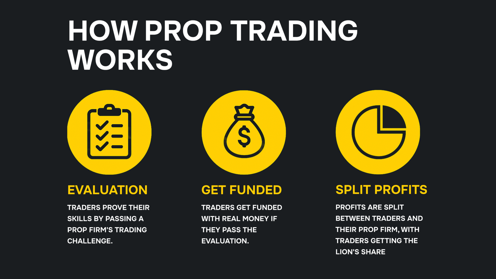

## Что такое проприетарная торговля?

Проприетарная (или проп) торговля — это когда трейдер торгует криптовалютами, деривативами и другими финансовыми инструментами с использованием капитала, предоставленного проп-фирмой. Любая прибыль, полученная от торговых стратегий, делится между трейдером и его проп-фирмой.

С 2020 года проп-трейдинг стал всё более популярным способом для талантливых трейдеров получить доступ к капиталу и зарабатывать прибыль. Он помогает трейдерам применять обоснованные торговые решения и приносить значительную прибыль себе и своей проп-фирме.

## Как работает проп-трейдинг?

Проп-трейдинг происходит, когда торговый отдел финансового учреждения решает выделить капитал для самостоятельных спекулятивных финансовых операций. Некоторые компании специализируются исключительно на проп-трейдинге, а не являются подразделениями традиционных финансовых фирм.

Капитал предоставляется опытным трейдерам, которые используют его для спекулятивных торговых стратегий. Проп-трейдеры извлекают выгоду из неэффективности рынка и ценовых колебаний с целью получения прибыли. Они разрабатывают продвинутые стратегии для заработка на движениях цен различных классов активов, однако такая торговля также связана с высокими рисками.

## Как работают проп-фирмы?

Ниже представлен пошаговый разбор того, как функционируют проп-фирмы:

- **Оценка.** На этапе оценки трейдеры должны пройти демо-челлендж, который проверяет их навыки и способность управлять рисками.
- **Финансирование.** Если трейдер проходит испытание, ему предоставляется реальный капитал для торговли. Проп-фирмы обычно устанавливают строгие правила управления рисками, такие как лимиты максимальной просадки, чтобы предотвратить чрезмерные риски. Прибыль, которую трейдеры получают, делится с проп-фирмой в соответствии с заранее оговорённым соглашением. Обычно трейдер получает от 50% до 80% прибыли, а остальная часть уходит проп-фирме.

## Преимущества и недостатки проп-трейдинга

### Преимущества

- **Доступ к капиталу.** Проп-фирмы предоставляют трейдерам доступ к капиталу, который они не смогли бы получить самостоятельно. Работа с проп-фирмой требует минимальных или вовсе отсутствующих первоначальных затрат.
- **Высокий потенциал прибыли.** Опытные трейдеры могут получать значительную прибыль, не подвергая риску собственные средства.
- **Продвинутые инструменты.** Проп-трейдеры получают доступ к продвинутым инструментам технического анализа, таким как потоки данных в реальном времени и модели машинного обучения, которые сложно было бы получить самостоятельно.
- **Вознаграждение на основе результатов.** Модель распределения прибыли выравнивает интересы между проп-фирмой и трейдерами, управляющими её капиталом.

### Недостатки

- **Ненадёжные проп-фирмы.** Некоторые фальшивые проп-фирмы зарабатывают в основном на комиссиях за участие в оценке, а не на распределении прибыли. Чтобы избежать этой проблемы, необходимо тщательно изучать фирму перед выбором.
- **Стресс.** Ориентированная на результат природа проп-трейдинга может вызывать сильный стресс, особенно у начинающих трейдеров с низкими навыками управления рисками.
- **Плата за участие в оценке.** Проп-трейдеры оплачивают участие в испытании, чтобы получить доступ к капиталу проп-фирмы. Проп-фирмы не раздают деньги бесплатно, поэтому взимают эти комиссии как часть своей бизнес-модели.

## Типы проп-фирм

Проп-фирмы в основном делятся на институциональные, розничные и гибридные. Основное различие между ними — в способах распределения капитала.

Институциональные проп-фирмы торгуют собственным капиталом, часто работая внутри инвестиционных банков, брокерских компаний, хедж-фондов и других финансовых учреждений. Они напрямую нанимают проп-трейдеров, которые используют сложные алгоритмы и методы для извлечения выгоды из рыночных движений.

Розничные проп-фирмы полагаются на независимых трейдеров, а не на штатных сотрудников. Трейдеры обычно оплачивают участие или проходят оценку, чтобы получить доступ к капиталу. Прибыль делится между трейдерами и проп-фирмой.

Гибридные фирмы сочетают институциональную и розничную модели. Они нанимают внутренних трейдеров для управления собственным капиталом и одновременно выделяют средства независимым трейдерам, деля с ними прибыль.

## Риски, связанные с проп-фирмами

- **Рыночные риски.** Даже при наличии действенных торговых стратегий трейдеры могут терять деньги из-за неблагоприятных рыночных условий. Внезапные потрясения, такие как конфликты или изменения в экономической политике, могут резко изменить ситуацию на рынке.
- **Риски, связанные с кредитным плечом.** Трейдеры с высокой склонностью к риску часто используют заёмные средства для увеличения объёма инвестиций. При этом даже незначительное снижение рынка может привести к крупным убыткам или полной ликвидации позиции.
- **Риски ликвидности.** Низкая ликвидность отдельных активов может помешать трейдерам выйти из позиции по желаемой цене.
- **Риски концентрации.** Опираться на одну стратегию или класс активов может сделать трейдера уязвимым к краткосрочным рыночным колебаниям.

## Как регулируются проп-фирмы

Розничные проп-фирмы в настоящее время слабо регулируются, так как торгуют собственным капиталом, а не средствами клиентов. Некоторые нормы всё же применимы, например соблюдение общих торговых правил, но строгому контролю такие фирмы не подлежат.

## Пример проп-фирмы

### Hash Hedge

Hash Hedge — крипто-проп-фирма, предоставляющая трейдерам доступ к более чем 200 криптоактивам и кредитному плечу до 5x. Новые активы регулярно добавляются, в отличие от многих фирм, которые работают только с основными монетами вроде BTC и ETH.

Hash Hedge не взимает скрытых комиссий, не ограничивает торговлю по новостям и в выходные. Платформа доступна круглосуточно, предоставляя профессиональным трейдерам конкурентное преимущество по сравнению с другими фирмами, ограничивающими торговое время.
