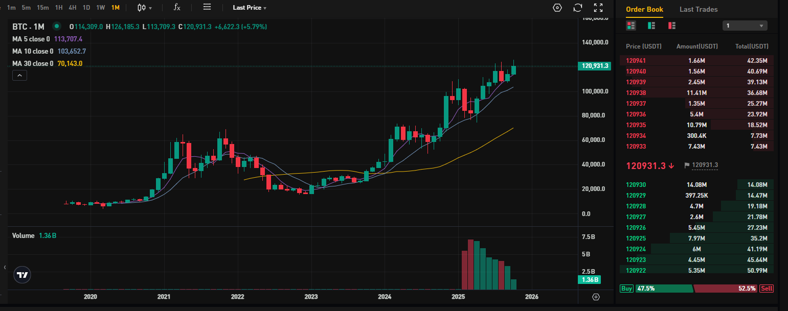

## Что такое Биткоин?

Биткоин — это сердце крипторынка. Каждое движение, каждая свеча, каждый новый токен в сообщество так или иначе связаны с ним. Если вы торгуете альтами, вы точно знаете как сильно Биткоин влияет на цену активов. Потому что когда двигается Биткоин, весь рынок следует за ним.

Давайте посмотрим на него глазами трейдера: что такое Биткоин, как он работает и почему продолжает притягивать ликвидность?

## Краткая история Биткоина

В 2008 году, когда рушились банки и доверие к традиционным финансам ослабевало, человек (или группа людей) под псевдонимом Сатоши Накамото опубликовал статью «Bitcoin: A Peer-to-Peer Electronic Cash System». Идея была революционной — деньги без необходимости в посредниках.

Первый Биткоин был добыт в январе 2009 года, награда составила 50 BTC. Тогда никто не обратил внимания: всего лишь код, работающий на нескольких компьютерах. Но именно этот код решил древнюю проблему: как дать цифровому активу ценность.

После первого крупного роста в 2017 году, когда цена приблизилась к $20 000, интерес к криптовалютам взлетел. Однако настоящий прорыв произошёл в 2020–2021 годах: во время пандемии и масштабных стимулирующих мер инвесторы стали рассматривать Биткоин как «цифровое золото» и защиту от инфляции.

Ключевым драйвером роста стало институциональное принятие. MicroStrategy, Tesla и крупные фонды с Уолл-стрит начали держать BTC. Появление спотовых ETF и рост доверия со стороны традиционных финансов приблизили Биткоин к мейнстриму.

Свою роль сыграли и технологии — сеть Lightning Network ускорила транзакции. Майнеры всё чаще переходят на возобновляемую энергию, а инфраструктура активно развивается. Добавьте сюда регуляторные законы в США и Европе, а ещё признание Биткоина законным средством платежа в странах вроде Сальвадора. Получится фундамент нового цикла роста, который мы наблюдаем сегодня.

Подумайте: вы можете бесконечно копировать файл, фото или песню, но Биткоин стал первым цифровым объектом, который нельзя скопировать. Он существует только как запись в публичной базе данных — блокчейне. Именно это делает его ценным: благодаря математике и консенсусу.

## Как Биткоин работает

Биткоин функционирует на глобальной сети компьютеров, которые хранят порядок транзакций. Каждые 10 минут майнеры объединяют транзакции в блок, решают криптографическую задачу и добавляют блок в цепочку.

Почему это называется добычей (mining)? Потому что процесс требует энергии и вознаграждает майнеров новыми монетами. Этот механизм называется Proof-of-Work.

Всего будет добыто не более 21 миллиона BTC — никто не может «допечатать» их больше. Каждые четыре года награда снижается вдвое — это называется халвинг. Он ограничивает предложение и создаёт долгосрочное давление на рост цены.

## Биткоин как торговый актив

Для трейдера Биткоин — инструмент. Им можно торговать как любым другим активом: на споте, фьючерсах или опционах.

- Spot — купи дёшево, продай дорого. Или держи, если веришь в долгосрочную ценность.
- Futures позволяют открывать лонги и шорты с плечом — риск выше, но и потенциал больше.
- Options — для тех, кто любит стратегию: хеджирование, спекуляцию.

Трейдеры-новички часто забывают: Биткоин может упасть на 10% за час — и забрать с собой всю позицию. Поэтому так важны надёжные данные и безопасный терминал для торговли.

Hash Hedge помогает с этим. Мы предлагаем трейдерам доступ к реальной ликвидности, профессиональным инструментам и более чем 160 криптопарам для тестирования стратегий. Без риска потерять свой капитал.

## От чего зависит цена Биткоина

Биткоин — это зеркало коллективных эмоций. Страх и жадность движут им не меньше, чем новости и данные.

При анализе BTC важно смотреть не только на RSI или пересечение EMA. Обратите внимание на объёмы, открытый интерес — они часто сигнализируют о ближайших изменениях цены.

Трейдеры также следят за корреляциями — как Биткоин движется относительно NASDAQ, золота или индекса доллара США.

Не стоит недооценивать и макрофакторы: халвинг-циклы, одобрения ETF, решения ФРС и потоки ликвидности формируют рыночный контекст.

## Биткоин и альткоины: в чём разница

Альткоины предлагают инновации — быстрые сети, DeFi-инструменты, стейкинг-награды. Но Биткоин остаётся якорем рынка. Когда он растёт, альткоины следуют за ним, а когда падает — альты падают ещё сильнее.

Называть его «монетой для бумеров» — ошибка. Биткоин — это эталон, точка отсчёта, куда институционалы паркуют ликвидность. Каждый серьёзный трейдер знает: Биткоин задаёт темп, а альткоины следуют за ним.

## Безопасность, хранение и регулирование

С Биткоином ещё важно то, как вы его храните. Существуют мобильные и веб-кошельки для быстрого доступа и холодные кошельки (например, Ledger или Trezor) для максимальной защиты.

Главное правило весьма простое: если у вас нет приватных ключей — это не ваши Биткоины. Поэтому опытные трейдеры делят активы между «горячими» кошельками для торговли и «холодными» — для долгосрочного хранения.

Регулирование также развивается стремительно. В США SEC продолжает уточнять, что считать ценными бумагами, а в Европе MiCA создаёт единые правила и лицензии для криптопроектов. Эти меры снижают неопределённость и открывают рынок для институционалов. Появление спотовых ETF стало поворотным моментом: теперь Биткоин — часть традиционных инвестиционных портфелей.

Для профессионального трейдера безопасность и комплаенс — стандарт. Понимание систем хранения, кастодиальных решений и регулирования стало таким же важным, как риск-менеджмент или технический анализ.

## Будущее Биткоина

Что дальше? Весь мир начинает принимать Биткоин в качестве реального актива. Страны держат Биткоин в резервах, банки предлагают кастоди-сервисы, а Lightning-платежи становятся всё более массовыми.

Скоро очередной халвинг, и история подсказывает, что за ним следуют дефицит предложения, спекуляции и новые максимумы. Но одновременно с этим разработчики экспериментируют с Runes, Ordinals и токенизацией активов прямо на сети Биткоина. Он уже не просто цифровое золото.

И в этом его суть: Биткоин меняется, оставаясь неизменным. Его правила стабильны, но мир вокруг него — нет. Паттерны, данные, эмоции — это треугольник, внутри которого живёт каждый трейдер. И если понимание Биткоина даёт перспективу, то реальные данные дают контроль.

Hash Hedge помогает в этом: анализируйте более 160 криптопар в реальном времени, отслеживайте потоки ликвидности до того, как отреагирует рынок, и тестируйте стратегии безопасно — без риска для вашего капитала.

## Итоги

Биткоин начинался как идея — несколько строк открытого кода, выложенные на форуме. Со временем он стал чем-то гораздо большим: глобальным экспериментом доверия, ценности и времени.

То, что началось как нишевое движение криптографов, превратилось в триллионный класс активов, который бросает вызов самой сути финансовой системы.

Для трейдера Биткоин — это актив, который реагирует на макроэкономику, инновации и человеческую психологию.
