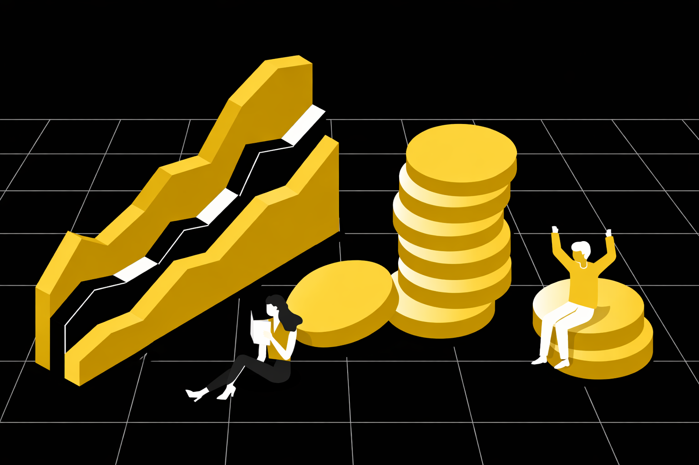

## Что такое funding rate

Funding rate представляет собой механизм перераспределения средств между трейдерами, торгующими perpetual futures. Его задача заключается в том, чтобы удерживать цену фьючерсного контракта максимально близко к спотовой цене актива.

Если на рынке преобладают покупатели и фьючерс торгуется выше спота, включается положительный funding rate. В этом случае трейдеры в длинных позициях платят тем, кто находится в шортах. Когда ситуация обратная и рынок перегружен продажами, funding rate становится отрицательным, и уже шорты платят лонгам.

Важно понимать, что биржа не является стороной этих расчётов. Средства не уходят площадке, а перераспределяются между участниками рынка, выступая своего рода регулятором дисбаланса.

## Как работает funding rate в криптовалютах

Механика funding rate в крипте основана на простой логике спроса и предложения. Когда большинство трейдеров выбирают одно направление, цена фьючерса начинает отклоняться от спота. Funding rate служит инструментом давления на перегруженную сторону рынка.

Чем сильнее перекос, тем выше значение funding rate. Это постепенно делает удержание позиции менее выгодным и стимулирует часть участников либо закрывать сделки, либо открывать противоположные позиции. В результате рынок получает шанс вернуться к равновесию.

Поэтому вопрос как работает funding rate нельзя рассматривать отдельно от структуры рынка и распределения позиций. Это не случайный параметр, а отражение текущего баланса сил.

## Кто платит funding rate и когда

Выплаты funding rate происходят через фиксированные интервалы времени, чаще всего каждые восемь часов. Однако точное расписание зависит от конкретной биржи и инструмента.

Платёж происходит только в том случае, если трейдер удерживает позицию в момент расчёта. Размер выплаты напрямую связан с объёмом позиции и текущим значением funding rate. Поэтому даже при краткосрочной торговле удержание позиции через расчётный период может повлиять на итоговую доходность.

В контексте long и short funding rate важно понимать, что это плата за нахождение на стороне рынка, где наблюдается избыточный спрос.

## Funding rate как индикатор настроения рынка

Со временем funding rate как индикатор стал использоваться для оценки рыночных настроений. Его значения часто показывают, где сосредоточена толпа и какая сторона рынка доминирует в данный момент.

Экстремально высокий положительный funding rate обычно говорит о перегруженности лонгов и повышенном оптимизме. Отрицательные значения, наоборот, указывают на доминирование шортов и преобладание негативных ожиданий.

Поэтому funding rate и настроение рынка тесно связаны. Он не даёт точных точек входа, но помогает оценить риск, связанный с торговлей против толпы или в условиях перегрева.

## Как funding rate влияет на торговлю

Влияние funding rate на трейдинг сильно заметно при удержании позиций. Даже при верно выбранном направлении высокая стоимость удержания может постепенно уменьшать результат, снижая эффективность сделки.

Кроме того, funding rate влияет на поведение участников. Когда удерживать позицию становится дорого, часть трейдеров начинает закрываться, что может усиливать волатильность и приводить к резким движениям цены. В таких условиях возрастает вероятность выносов и импульсивных решений.

По этой причине торговля бессрочными фьючерсами без учёта funding rate часто приводит к неожиданным убыткам.

## Типичные ошибки при работе с funding rate

Часто проблемы возникают не из-за самого механизма funding rate, а из-за того, как трейдеры его интерпретируют и используют:

- **Полное игнорирование funding rate.** Трейдер концентрируется на направлении, уровнях и паттернах, не учитывая издержки удержания позиции. В результате даже верное движение может давать слабый или отрицательный результат.
- **Использование funding rate как самостоятельного сигнала.** Попытка входить в рынок только на основании высокого или низкого funding rate без учёта структуры и контекста часто приводит к преждевременным входам и торговле против рынка.
- **Отсутствие плана удержания позиции.** Трейдер не учитывает, сколько времени планирует держать сделку и как funding rate повлияет на результат при длительном удержании.
- **Недооценка влияния funding rate в перегретых фазах рынка.** В условиях сильного перекоса удержание позиции становится дорогим, что усиливает волатильность и повышает риск резких движений.

## Как использовать funding rate в торговле

Грамотный подход заключается в том, чтобы рассматривать funding rate в криптотрейдинге как часть общей картины. Он помогает понять, кто сейчас платит за удержание позиции, где рынок перегружен и какие риски присутствуют.

Funding rate хорошо работает в связке с анализом структуры, ликвидности и фаз рынка. Он не заменяет стратегию, но помогает избежать торговли в условиях чрезмерного перекоса.

## Funding rate и проп-трейдинг в крипте

В проп трейдинге в крипте значение funding rate сложно переоценить. Жёсткие правила по риску и просадке не позволяют игнорировать дополнительные издержки или пересиживать неблагоприятные условия.

Трейдеры, работающие через проп фирму для криптотрейдеров, торгуют на капитал компании, где важна стабильность и контроль. Здесь funding rate учитывается как часть общей модели риска, а не как второстепенный параметр.

Торгуй на капитал компании до $100 000.

## Итог

Funding rate — это отражение текущего баланса рынка и настроений его участников. Он влияет на стоимость удержания позиции, поведение трейдеров и общую динамику цены.

Понимание того, что такое funding rate, позволяет снизить количество ошибок, связанных с перегревом рынка и торговлей против толпы. Особенно это важно в условиях высокой волатильности и при использовании плеча.

Для трейдеров, которые хотят работать системно и учитывать все элементы рыночной структуры, формат проп трейдинга с Hash Hedge даёт возможность торговать бессрочными фьючерсами осознанно, используя финансируемый аккаунт с капиталом до $100 000 и не увеличивая личный риск.
