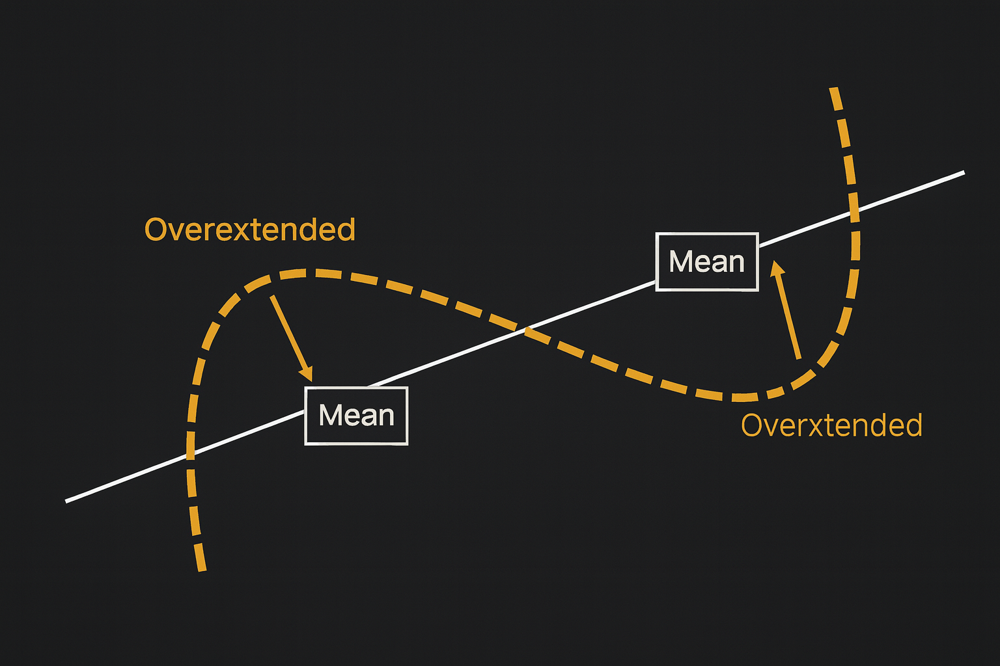

## Mean reversion простым языком

Итак, mean reversion это не формула, а скорее поведенческая идея: у цены есть свой комфортный диапазон. Или если по-научному — статистическое среднее, вокруг которого актив склонен колебаться.

Что может выступать этим «средним»?

- Скользящие средние (MA20, MA50 и т. д.).
- Зона справедливой цены, которую часто видят на флетовых участках.
- Уровни, где актив исторически проводил больше всего времени.
- Равновесие после резких прорывов.

То есть mean reversion — это не строго математическое правило, а практическая идея, которую трейдеры подстраивают под свой стиль.

## Когда возврат к среднему работает?

Если собрать честный список, получится довольно коротко: mean reversion лучше всего работает там, где рынок не спешит куда-то бежать.

Хорошие условия:

- Плавный боковик (классика стратегии возврата к среднему).
- Стабильная ликвидность.
- Умеренная волатильность.
- Отсутствие резких фундаментальных факторов.
- Моменты, когда цена многократно «отскакивает» от одной и той же зоны.

На графике это выглядит так: сначала цена уходит вверх, а потом плавно возвращается к основному диапазону. Трейдеры любят такие моменты, потому что поведение инструмента кажется предсказуемым, что, конечно, является полуправдой.

## Когда mean reversion ломается?

Ни одна стратегия для трейдинга не живёт в вакууме, и mean reversion не исключение. Есть ситуации, в которых ждать возврата к среднему почти гарантированно плохая идея.

Проблемные сценарии:

- Актив вошёл в сильный тренд и не планирует возвращаться.
- Рынок перенасыщен новостями.
- Появляется массивная ликвидация или паника.
- Появление крупных игроков меняет баланс сил.
- Фундаментальная реальность изменилась — и прежнее «среднее» просто перестало существовать.

Это те моменты, когда трейдер, покупающий «слишком низко», уверен, что цена точно вырастет, а рынок спокойно пробивает очередной уровень вниз. И mean reversion превращается в mean destruction.

## Как трейдеры используют mean reversion на практике

- **Скользящие средние как ориентир.** Самый распространённый инструмент. Если цена значительно отклоняется от MA20 или MA50, многие воспринимают это как потенциальную точку для возврата. Не сигнал в чистом виде, но хороший повод присмотреться.
- **Работа от уровней.** Если актив регулярно возвращается в один и тот же диапазон, этот диапазон становится «магнитом». Цена отклонилась слишком далеко? Трейдеры ждут возврата к уровню, который рынок уже «уважает».
- **Индикаторы перекупленности и перепроданности.** RSI, Stoch, CCI — всё это по сути специальные рыночные термометры, показывающие, что инструмент перегрет. Логика простая: перекупленность → возможен откат, перепроданность → возможен возврат вверх.
- **Статистический арбитраж.** Когда две коррелирующие монеты вдруг расходятся слишком сильно, трейдеры ищут вход на возврат их нормального расстояния.

Хотите торговать умнее? Hash Hedge предлагает профессиональный терминал с 170+ криптопарами (от BTC до PEPE) и 5x плечом — всё, чтобы зарабатывать даже на боковике. Торгуй вместе с Hash Hedge.

## Типичные ошибки при использовании mean reversion

1. Игнорирование тренда.
2. Бездумное усреднение.
3. Непонимание контекста.

## Стоит ли использовать mean reversion?

Стоит, если помнить, что это подход, инструмент, который помогает понять, где рынок перегнул, а где движется естественно. Он усиливает анализ, помогает ловить моменты, когда цена слишком далеко ушла от «нормальной».

Где-то mean reversion действительно работает вполне себе предсказуемо. Где-то ведёт себя хитро: подмигнёт и убежит в противоположную сторону.

Но всё же у этой идеи есть одно приятное качество: она заставляет смотреть на рынок спокойнее, видеть закономерности и замечать отклонения от нормы, достаточно серьезные, чтобы их игнорировать.
