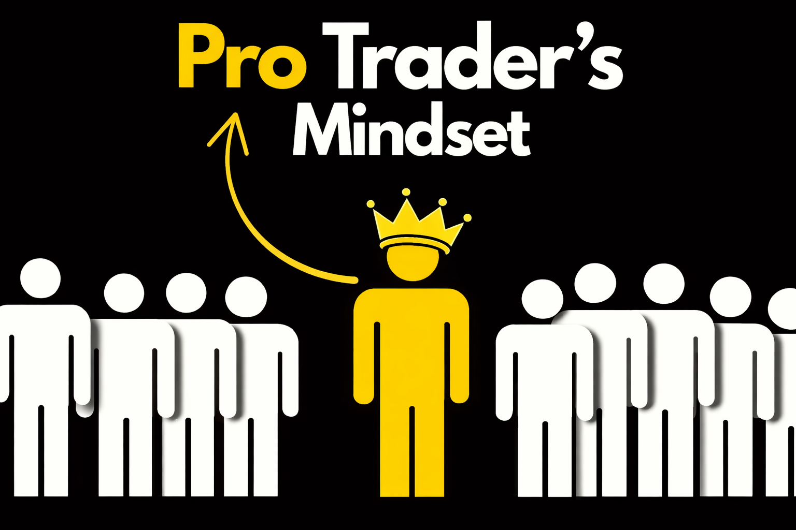

## Стабильность в трейдинге

Не стоит пытаться измерять стабильность отдельными периодами. Удачный месяц или серия прибыльных сделок часто воспринимаются как подтверждение правильного подхода, но стабильный трейдинг не определяется короткими отрезками. Он проявляется в том, как трейдер действует, когда рынок перестаёт быть удобным.

Стабильность в трейдинге связана обычно не с уровнем доходности, а с повторяемостью решений. Стабильные трейдеры принимают одинаковые решения в схожих условиях, независимо от того, была ли предыдущая сделка прибыльной или убыточной. Это снижает влияние случайности и делает результат управляемым на дистанции.

Таким образом, стабильные трейдеры не оценивают каждую сделку как отдельное событие. Для них важнее, был ли соблюдён процесс: вход выполнен по плану, риск заранее определён, правила не нарушены. Прибыль или убыток в конкретной сделке отходят на второй план.

Когда этого фокуса нет, возникает другая картина. Почему трейдеры теряют стабильность? Потому что начинают подменять процесс результатом. После удачной сделки правила ослабляются, после убыточной пересматриваются на эмоциях. В итоге каждое решение становится уникальным, а значит, статистически бессмысленным.

Так формируется мышление трейдера, ориентированное не на контроль результата, а на контроль поведения. Это не делает торговлю проще или спокойнее, но такой подход лежит в основе профессионального трейдинга, где важна не одна идея, а способность воспроизводить корректные действия снова и снова.

## Дисциплина начинается с ограничений

Торговая дисциплина в трейдинге редко держится на характере. Она строится на ограничениях, которые заранее встроены в процесс и не требуют решения в зависимости от ситуации.

Отсутствие дисциплины в трейдинге не похоже на полный хаос. Куда как чаще это небольшие отклонения: немного увеличенный риск, дополнительная сделка вне плана, перенос стопа. Каждое такое действие кажется незначительным, но из них и складываются системные потери.

Это одна из ключевых причин, почему возникают ошибки начинающих трейдеров. Новички обычно знают правила, так что проблема в том, что правила начинают конкурировать с эмоциями и ожиданиями. Когда рынок движется быстро или результат не совпадает с ожиданиями, решения принимаются уже не по плану.

Здесь становится критичным соблюдение торговых правил. Стабильные трейдеры стараются уменьшить количество ситуаций, где нужно принимать решение на месте. Размер риска, условия входа, дневные ограничения по убыткам — всё это определяется заранее и не пересматривается под влиянием текущей сделки.

Так формируется системный трейдинг. Его цель не найти идеальную стратегию, а убрать из процесса как можно больше импульсивных решений. Чем меньше пространства для интерпретаций в моменте, тем ниже влияние эмоций и тем выше вероятность сохранить стабильность в трейдинге на дистанции.

## Почему новички теряют депозит снова и снова

Одна из типичных причин — реакция на серию убытков. Вместо того чтобы снизить активность, трейдер начинает торговать чаще, увеличивает объём позиции или пытается быстрее вернуть день. После прибыльных сделок происходит обратное: риск постепенно растёт, потому что появляется ощущение контроля над рынком. В обоих случаях соблюдение торговых правил уступает эмоциям.

Без устойчивого процесса профессиональный трейдинг быстро превращается в цепочку реакций на рынок. Решения принимаются не на основе системы, а в зависимости от последнего результата, новостей или текущего движения цены. Такая модель может давать отдельные удачные периоды, но на дистанции она приводит к нестабильности и повторяющимся просадкам.

Ключевой фактор выживания в трейдинге не поиск новых стратегий, а последовательность действий. Когда риск, лимиты по убыткам и условия входа выполняются одинаково в любой ситуации, вероятность сохранить стабильность в трейдинге значительно выше.

## Важность ограничения эмоций

Эмоции, страх и жадность, а также FOMO в трейдинге влияют на восприятие рынка и оценку рисков даже у опытных трейдеров.

Разница между стабильными и нестабильными результатами заключается не в отсутствии эмоций, а в том, насколько сильно они могут повлиять на действия. Опытные трейдеры выстраивают процесс так, чтобы решения принимались по правилам, а не по настроению.

Так достигается эмоциональный контроль в трейдинге. Ограничения по риску, фиксированные условия входа, паузы после серии убытков снижают вероятность импульсивных сделок. Когда ключевые параметры определены заранее, пространство для быстрых эмоциональных решений становится минимальным.

Большинство психологических ошибок трейдера возникает из-за отсутствия такой защитной структуры. Чем больше решений приходится принимать в моменте, тем выше нагрузка и тем сильнее влияние эмоций. Стабильность появляется тогда, когда процесс берёт на себя часть этого давления.

Торгуй на капитале до $100 000.

## Почему формат проп-трейдинга усиливает стабильность

В проп трейдинге криптовалют требования к дисциплине становятся жёстче. Торговля на финансируемом аккаунте предполагает чёткие лимиты по просадке и риску. Здесь невозможно долго игнорировать ошибки, ведь они быстро приводят к остановке торговли.

Финансируемый аккаунт фактически выносит дисциплину за пределы личности трейдера. В рамках программ финансирования трейдеров и крипто трейдинговых челленджей выживают не самые активные, а самые последовательные.

При торговле криптовалютой на профессиональный капитал стабильность становится не абстрактным качеством, а практическим требованием.

## Итог

Стабильность в трейдинге — это способность повторять корректные действия в разных условиях и не разрушать процесс из-за эмоций или краткосрочных результатов.

Что отличает стабильных трейдеров? Ориентация на правила, рутину и ограничения вместо поиска лучшей сделки. В таком подходе торговая дисциплина, контроль риска и психологическая устойчивость работают как единая система.

Формат торговли с жёсткими рамками часто ускоряет этот переход. Торговля на финансируемом аккаунте не оставляет пространства для хаотичных решений и помогает быстрее выстроить профессиональный подход.

Если ты хочешь работать в такой среде и торговать с капиталом до $100 000, Hash Hedge предлагает финансируемый аккаунт с прозрачными условиями и понятными правилами. Это позволяет сосредоточиться на процессе и дисциплине — на том, что делает трейдера стабильным на дистанции.
